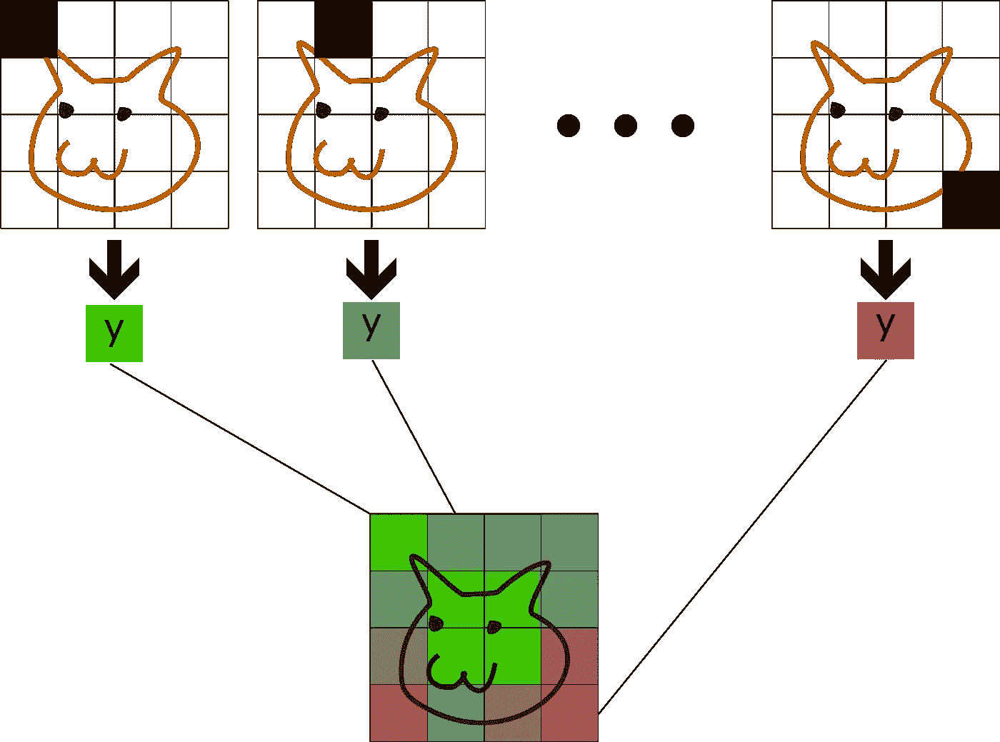

# 简而言之:用于解释 DNNs 的遮挡分析

> 原文：<https://towardsdatascience.com/inshort-occlusion-analysis-for-explaining-dnns-d0ad3af9aeb6?source=collection_archive---------35----------------------->

## 也许找出模型失败原因的最简单的方法。

有大量的[解释方法](/why-how-interpretable-ml-7288c5aa55e4)用于解释深度神经网络(DNNs)，每种方法都有其优缺点。在大多数情况下，我们感兴趣的是*局部*解释方法，即对于特定输入的网络输出的解释，因为 dnn 往往过于复杂，无法进行全局解释(独立于输入)。

一般来说，所有的局部解释方法都有一个共同的目标:忠实地*(即准确地)表示要解释的函数 *f* (例如一个 DNN)，至少在要求它们解释的输入周围是局部的。*

*当然，这样的解释也必须是人类可以理解的，才是有用的。最简单的方法是给每个输入维度分配一个重要性分数，也就是创建一个*属性*图。归因方法将模型输出的责任分配给给定输入的每个维度。*

*在这篇短文中，我将介绍一种基本的归因技术:[遮挡分析](https://link.springer.com/chapter/10.1007%2F978-3-319-10590-1_53)。基本概念非常简单:对于输入的每个输入维度 *x* ，我们评估缺少该维度的模型，并观察输出如何变化。
特别是，如果| |*f(x)—f(x _ without _ I)*| |很大，那么维数一定很重要，因为去掉它会大大改变输出。*

**

*遮挡分析通过观察去除面片时模型输出 ***y*** 的变化来计算每个面片的重要性。单个结果可以组合成一个属性图。作者图片*

# *遮挡分析的优势*

*如果你的维度是独立的，那么遮挡分析是完全可信的，因为你精确地测量了每个维度的边际效应。*

*遗憾的是，在大多数情况下，比如图像数据，情况并非如此。在这里，你会被建议删除整个补丁，而不是单个像素。这个想法是，通常单个像素的信息可以从它的邻居重建。因此，如果你有一张猫的图像，删除一个猫像素永远不会对输出产生大的影响，而删除覆盖耳朵的补丁可能会导致模型对“猫”的预测明显下降。*

*遮挡分析的另一个好处是它是一种*的事后*方法。这意味着它可以用来解释任何(已经训练好的)模型。不需要重新训练。该模型甚至可以是一个不可微的黑箱。只要您可以输入和接收输出，您就可以使用遮挡分析。*

*遮挡分析相对于基于[梯度的](/indepth-explaining-dnns-with-gradients-2bb148a30ba0)解释方法的另一个优势是，它甚至可以处理局部平坦的函数，没有梯度或梯度非常小。*

# *必要的考虑*

*但是删除一个维度实际上意味着什么呢？毕竟，我们的模型总是接受相同大小的输入。删除维度意味着将其设置为具有“0 信息”的值。这取决于数据集这个值是什么。对于图像数据，我们通常使用平均 RGB 值。对于其他数据类型，通常将维度设置为 0 就可以了。我们将在后面看到其他考虑因素。*

*正如您可能已经猜到的，遮挡分析带有一个很大的警告:我们必须评估每个这些扰动输入的模型。如果您的输入有多个维度，例如一个 256x256 像素的图像，那么您必须运行 256x256=65.536(！)次来获得完整的分析。在大多数情况下，这是非常昂贵的，尤其是当您想要对整个数据集运行分析时。*

*一种降低计算成本的方法是将多个特征一起移除(例如，图片中的 8×8 正方形)。这只对某些维度在语义上属于同一类的数据类型有意义。*

# *高级:分配转移*

*遮挡分析还有一个问题谈的不多:[分布偏移](https://en.wikipedia.org/wiki/Domain_adaptation#Domain_shift)(比较[胡克等人](https://papers.nips.cc/paper/2019/hash/fe4b8556000d0f0cae99daa5c5c5a410-Abstract.html))。如果我们仔细想想，我们在分析中观察到的输出变化除了信息被删除之外，还有另一个原因:受干扰的输入不再位于我们训练模型的数据分布中。*

*在机器学习中，我们通常假设模型将在来自与训练样本相同分布的数据上进行评估。如果不是这种情况(即，如果我们移除像素)，那么模型输出可能是任意错误的。虽然移除单个像素的效果通常可以忽略不计，但移除整个面片是远离训练数据流形的一大步，因此会对输出产生更大的影响。*

*我们不得不接受这两个原因的纠缠，但是有办法缓解这个问题。基本思想是在删除信息的同时仍然保持接近数据流形。这意味着使用更复杂的信息去除技术，仍然使图像看起来像自然图像。*

*一种方法是模糊掉要“移除”的补丁。这不是最有效的方法，但它至少应该消除细粒度的纹理信息，并且易于实现。*

*更好的方法是使用*修复算法*:只需使用另一个模型来猜测(即修复)缺失部分的内容。实际上没有添加信息，因为修补仅依赖于图像的剩余像素，但是结果看起来仍然接近正常图像，因此更接近训练数据。你可以使用一个复杂的算法，比如由于等人开发的算法，或者依靠容易访问的库，比如 openCV T5。*

*使用修复算法的警告是:1)它会使该过程在计算上更加昂贵，2)您必须让它运行，以及 3)如果您不使用标准的基准数据集，您可能必须重新训练它。*

# *结束语*

*由于其计算成本，遮挡分析当然不是一个适用于所有场合的工具，但肯定有其用途。尤其是如果您的数据很小，或者您只是想要一些易于实现且可靠的东西(只是要小心补丁大小)，遮挡分析可以大放异彩。一个密切相关且更复杂的方法是 [Shapley 值](https://arxiv.org/abs/1705.07874)。不幸的是，它们的计算成本甚至更高。如果你正在使用一个可微分的模型，也许下一个最好的简单方法是[基于梯度的解释方法](/indepth-explaining-dnns-with-gradients-2bb148a30ba0)。*

*希望你学到了有用的东西！*