# 从里到外的断续浓缩咖啡

> 原文：<https://towardsdatascience.com/inside-out-staccato-espresso-f836fddc0bd1?source=collection_archive---------15----------------------->

## 咖啡数据科学

## 向豆子的内部寻找答案

之前，我研究过咖啡渣中粉末的来源。即使是粗磨咖啡，也有相当比例的细粒，我怀疑其来源是咖啡豆较软的内部。基于这个想法，我想如果我能分离出那些微粒，我能做出不同的[分层镜头](https://rmckeon.medium.com/a-summary-of-the-staccato-lifestyle-dd1dc6d4b861)吗？从外壳的粉末中分离出这些粉末会在味道或提取方面有所不同吗？

我称之为由内向外的断奏浓缩咖啡，因为我把咖啡豆的内部放在外层。

# 准备

我从一个非常粗糙的研磨设置开始。我[之前](/fines-in-coffee-grinds-searching-for-a-source-326c3eba2bb4?source=your_stories_page-------------------------------------)发现这种方法产生的粉末(<400 微米)与普通浓缩咖啡研磨出的粉末味道不同。我推测这些粉末来自冰球内部。我通过筛选去除这些颗粒，然后在普通的浓缩咖啡中研磨粗颗粒(500 微米)。最后，我筛选那些研磨。

研磨和筛分:

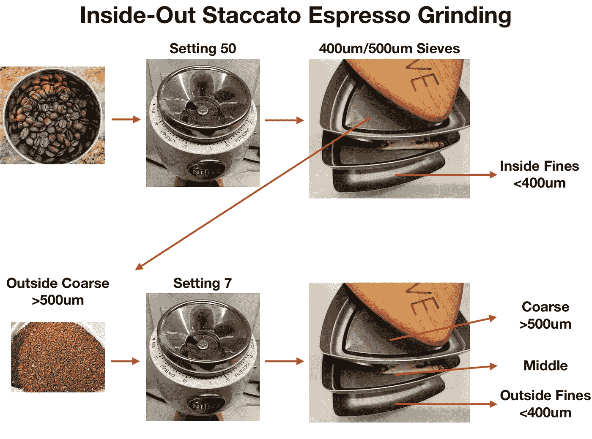

所有图片由作者提供

然后，我像做[分烤断奏击球一样准备冰球](/deconstructed-coffee-split-roasting-grinding-and-layering-for-better-espresso-fd408c1ac535):

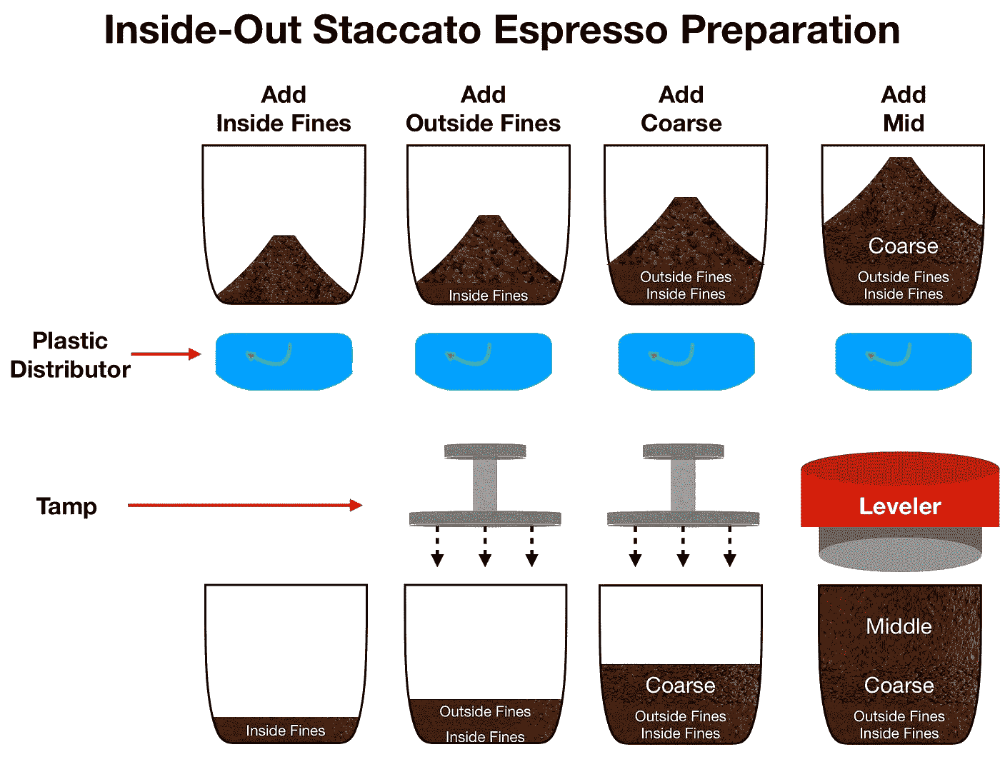

以下是去除内部粉末前后的研磨情况:

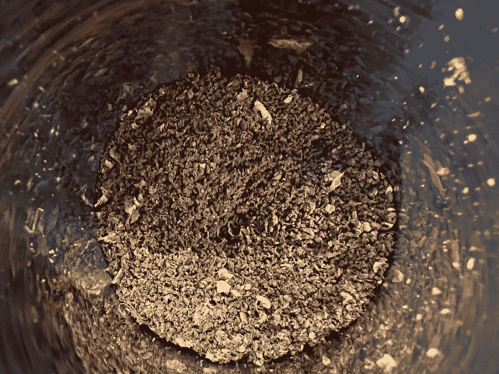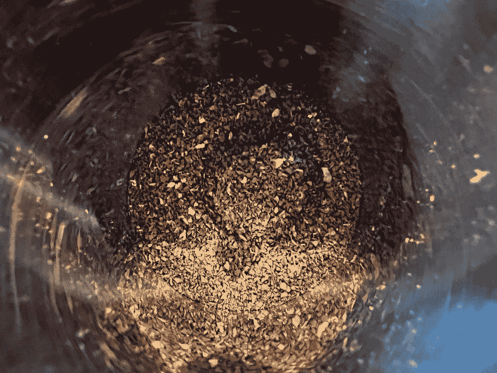

左:S50 研磨，右:S7 仅研磨来自 S50 研磨的粗粒(500um)。

筛选 S50 和 S7:

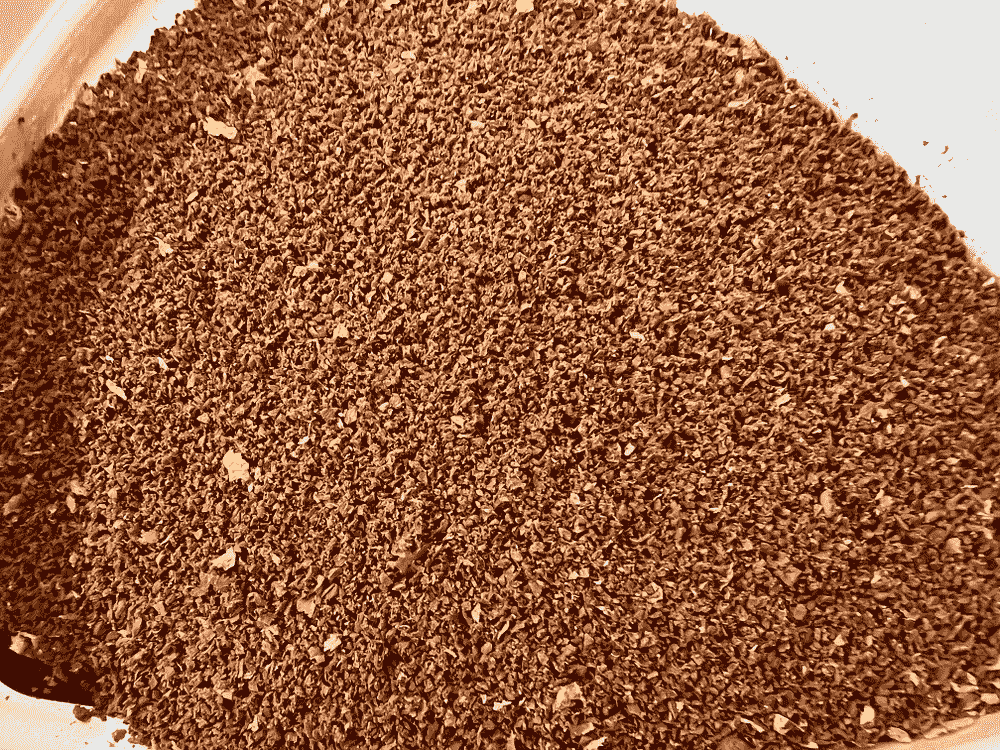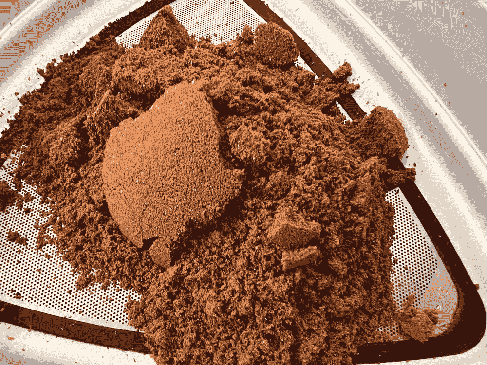

左:S50 地，右:S7 地。

圆盘准备:

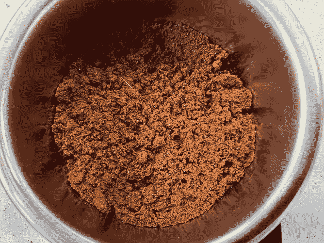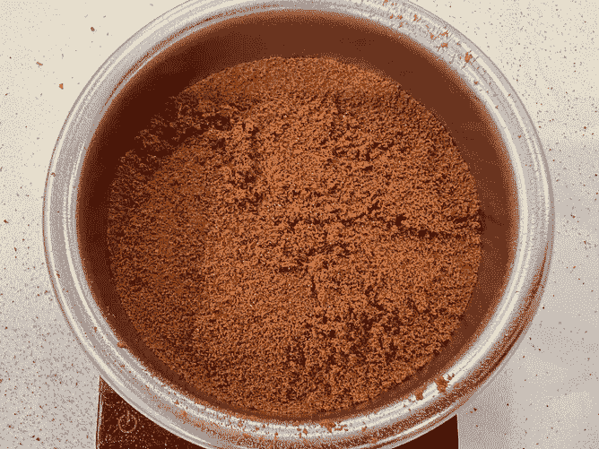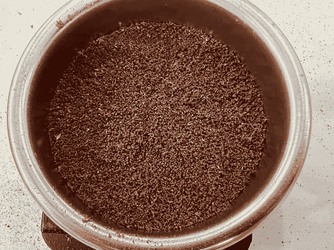

左:内部细粒，中:外部细粒，右:粗粒层(> 500um)。400 微米和 500 微米之间的中间层未显示。

这是测试镜头的重量分析。内部粉末占全部咖啡渣的 14%,占全部粉末的三分之一。

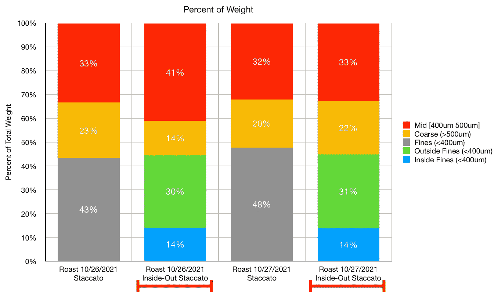

# 绩效指标

我使用两个指标来评估技术之间的差异:最终得分和咖啡萃取。

[**最终得分**](https://towardsdatascience.com/@rmckeon/coffee-data-sheet-d95fd241e7f6) 是评分卡上 7 个指标(辛辣、浓郁、糖浆、甜味、酸味、苦味和余味)的平均值。当然，这些分数是主观的，但它们符合我的口味，帮助我提高了我的拍摄水平。分数有一些变化。我的目标是保持每个指标的一致性，但有时粒度很难确定。

</coffee-solubility-in-espresso-an-initial-study-88f78a432e2c>**用折射仪测量总溶解固体量(TDS)，这个数字结合弹丸的输出重量和咖啡的输入重量用来确定提取到杯中的咖啡的百分比，称为**提取率(EY)** 。**

# **设备/技术**

**浓缩咖啡机:金特快**

**咖啡研磨机:利基零**

**咖啡:中杯家庭烘焙咖啡(第一口+ 1 分钟)**

**镜头准备:[断续浓缩咖啡](https://medium.com/overthinking-life/staccato-espresso-leveling-up-espresso-70b68144f94)**

**输液:[压力脉动](/pressure-pulsing-for-better-espresso-62f09362211d)**

**过滤篮:20g VST**

**输入/输出:22g 输入，约 24g 输出**

**其他设备:Atago TDS 测量仪，Acaia Pyxis 秤**

# **镜头对比**

**我对两次烘烤的两对镜头进行了比较。TDS 和 EY 合计略有改善。最引人注目的是味道的改善。这更多是由苦味和酸味成分而不是味觉的其他成分驱动的。**

**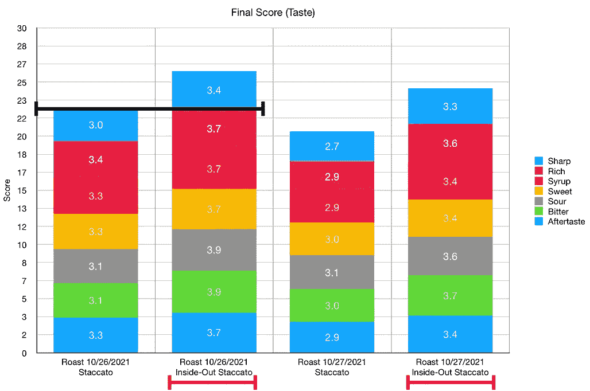****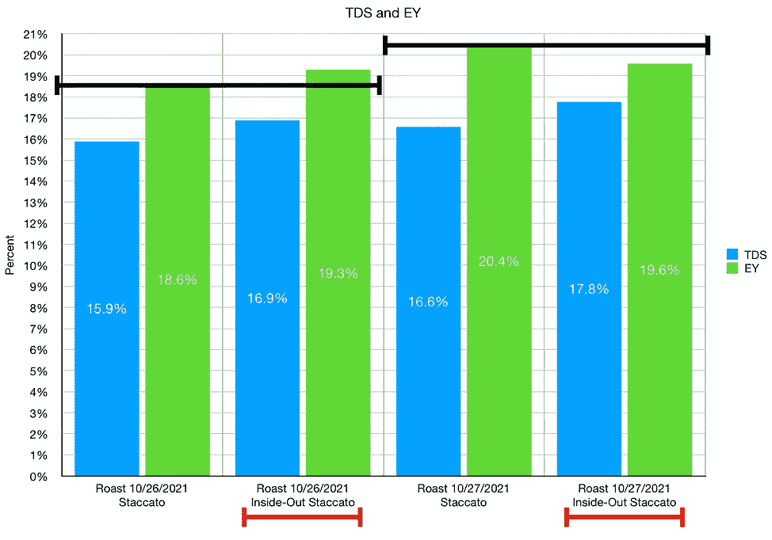**

**拍摄时间大致相同。**

**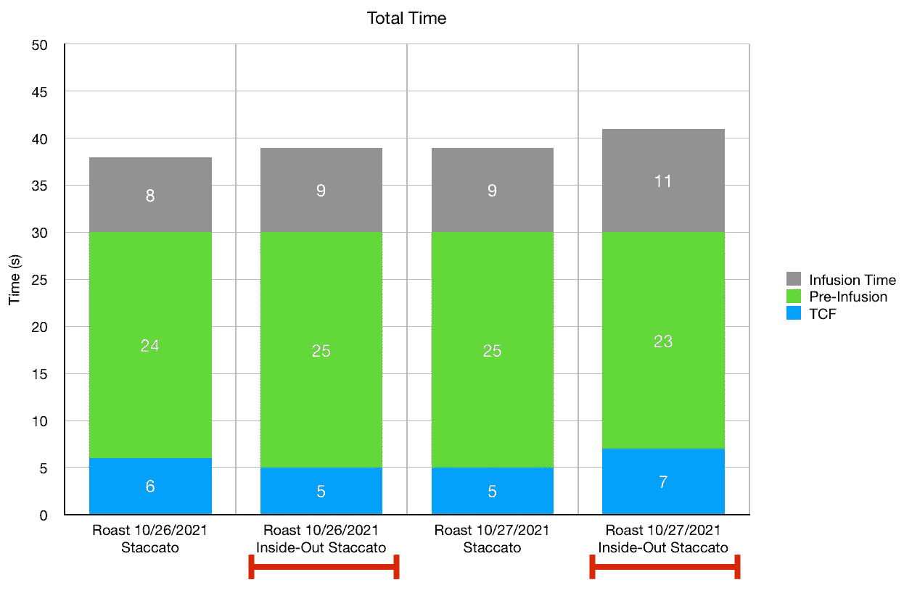**

**这个镜头是耗时的，因为双重研磨和双重筛选。一台机器可以自动完成这种双重研磨和双重筛选，因此就商业用途的规模而言，这是一个技术问题。对我来说，我喜欢学习咖啡豆的不同成分是如何影响味道和提取的。我认为我们将 bean 视为同质结构，但事实并非如此。希望更深入的了解有助于推动创新。**

**如果你愿意，可以在 [Twitter](https://mobile.twitter.com/espressofun?source=post_page---------------------------) 、 [YouTube](https://m.youtube.com/channel/UClgcmAtBMTmVVGANjtntXTw?source=post_page---------------------------) 和 [Instagram](https://www.instagram.com/espressofun/) 上关注我，我会在那里发布不同机器上的浓缩咖啡照片和浓缩咖啡相关的视频。也可以在 [LinkedIn](https://www.linkedin.com/in/robert-mckeon-aloe-01581595?source=post_page---------------------------) 上找到我。你也可以关注我的[媒体](https://towardsdatascience.com/@rmckeon/follow)和[订阅](https://rmckeon.medium.com/subscribe)。**

# **[我的进一步阅读](https://rmckeon.medium.com/story-collection-splash-page-e15025710347):**

**[我未来的书](https://www.kickstarter.com/projects/espressofun/engineering-better-espresso-data-driven-coffee)**

**[浓缩咖啡系列文章](https://rmckeon.medium.com/a-collection-of-espresso-articles-de8a3abf9917?postPublishedType=repub)**

**[工作和学校故事集](https://rmckeon.medium.com/a-collection-of-work-and-school-stories-6b7ca5a58318?source=your_stories_page-------------------------------------)**

**[个人故事和关注点](https://rmckeon.medium.com/personal-stories-and-concerns-51bd8b3e63e6?source=your_stories_page-------------------------------------)**

**[乐高故事启动页面](https://rmckeon.medium.com/lego-story-splash-page-b91ba4f56bc7?source=your_stories_page-------------------------------------)**

**[摄影启动页面](https://rmckeon.medium.com/photography-splash-page-fe93297abc06?source=your_stories_page-------------------------------------)**

**[使用图像处理测量咖啡研磨颗粒分布](https://link.medium.com/9Az9gAfWXdb)**

**[改进浓缩咖啡](https://rmckeon.medium.com/improving-espresso-splash-page-576c70e64d0d?source=your_stories_page-------------------------------------)**

**[断奏生活方式概述](https://rmckeon.medium.com/a-summary-of-the-staccato-lifestyle-dd1dc6d4b861?source=your_stories_page-------------------------------------)**

**[测量咖啡磨粒分布](https://rmckeon.medium.com/measuring-coffee-grind-distribution-d37a39ffc215?source=your_stories_page-------------------------------------)**

**[咖啡萃取](https://rmckeon.medium.com/coffee-extraction-splash-page-3e568df003ac?source=your_stories_page-------------------------------------)**

**[咖啡烘焙](https://rmckeon.medium.com/coffee-roasting-splash-page-780b0c3242ea?source=your_stories_page-------------------------------------)**

**[咖啡豆](https://rmckeon.medium.com/coffee-beans-splash-page-e52e1993274f?source=your_stories_page-------------------------------------)**

**[浓缩咖啡滤纸](https://rmckeon.medium.com/paper-filters-for-espresso-splash-page-f55fc553e98?source=your_stories_page-------------------------------------)**

**[浓缩咖啡篮及相关主题](https://rmckeon.medium.com/espresso-baskets-and-related-topics-splash-page-ff10f690a738?source=your_stories_page-------------------------------------)**

**[意式咖啡观点](https://rmckeon.medium.com/espresso-opinions-splash-page-5a89856d74da?source=your_stories_page-------------------------------------)**

**[透明 Portafilter 实验](https://rmckeon.medium.com/transparent-portafilter-experiments-splash-page-8fd3ae3a286d?source=your_stories_page-------------------------------------)**

**[杠杆机维修](https://rmckeon.medium.com/lever-machine-maintenance-splash-page-72c1e3102ff?source=your_stories_page-------------------------------------)**

**[咖啡评论和想法](https://rmckeon.medium.com/coffee-reviews-and-thoughts-splash-page-ca6840eb04f7?source=your_stories_page-------------------------------------)**

**[咖啡实验](https://rmckeon.medium.com/coffee-experiments-splash-page-671a77ba4d42?source=your_stories_page-------------------------------------)**