# 内部量化感知训练

> 原文：<https://towardsdatascience.com/inside-quantization-aware-training-4f91c8837ead?source=collection_archive---------10----------------------->

## [理解大数据](https://towardsdatascience.com/tagged/making-sense-of-big-data)

## 深入理解高效模型优化技术的指南

由[凯文·Ku](https://unsplash.com/@ikukevk?utm_source=medium&utm_medium=referral)在 [Unsplash](https://unsplash.com?utm_source=medium&utm_medium=referral) 上拍摄的照片

# 介绍

随着我们学习利用人工智能来完成各种简单和复杂的任务，深度神经网络的现实世界应用日益增加。然而，深度神经网络的问题是它们涉及太多参数，由于这些参数，它们需要强大的计算设备和大容量存储器。这使得它几乎不可能在 Android 等计算能力较低的设备和其他低功耗边缘设备上运行。量化等优化技术可以用来解决这个问题**。**借助不同的量化技术，我们可以将参数的精度从 float 降低到 int8 等较低精度，从而实现高效的计算和更少的存储量。最佳量化技术之一是量化感知训练。在本帖中，我们将详细了解它的机制。

# 什么是量化感知训练？

当我们从浮点型转换到较低精度时，我们通常会注意到精度显著下降，因为这是一个有损耗的过程。借助 quant-aware 培训，这种损失可以降至最低。所以基本上，quant-aware 训练模拟前向传递中的低精度行为，而后向传递保持不变。这导致了一些量化误差，该误差在模型的总损失中累积，因此优化器试图通过相应地调整参数来减少该误差。这使得我们的参数对量化更加鲁棒，使得我们的过程几乎无损。

# 是如何表现的？

我们首先决定一个量化方案。这意味着决定我们要包含哪些因素，以便在信息损失最小的情况下将浮点值转换为精度较低的整数值。在本文中，我们将使用[1]中使用的量化方案作为参考。为此，我们引入了两个新参数:标度和零点。顾名思义，scale 参数用于将低精度值调整回浮点值。它以完全精确的方式存储，以获得更高的准确性。另一方面，零点是表示量化值的低精度值，该量化值将表示真实值 0。零点的好处是，即使对于斜张量，我们也可以有更宽的整数值范围。因此，实值(r)可以通过以下方式从量化值(q)中导出:

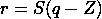

等式 1

这里 S 和 Z 分别代表刻度和零点。

在涉及计算的每个操作之后，我们在我们的模型中引入一种叫做 FakeQuant 的节点，以获得我们所要求的精度范围内的输出。FakeQuant 节点基本上是量化和反量化操作的组合。

## 量化操作

它的主要作用是将张量的浮点值转换为低精度整数值。这是基于上面讨论的量化方案完成的。标度和零点按以下方式计算:

比例的主要作用是将浮动范围内的最低和最高值映射到量化范围内的最高和最低值。在 8 位量化的情况下，量化范围将是[-128，127]。

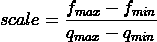

等式 2

这里 fₘₐₓ和 fₘᵢₙ代表浮点精度的最大值和最小值，qₘₐₓ和 qₘᵢₙ代表量化范围的最大值和最小值。

同样，我们可以通过在浮点极值和量化值之间建立线性关系来找到零点。

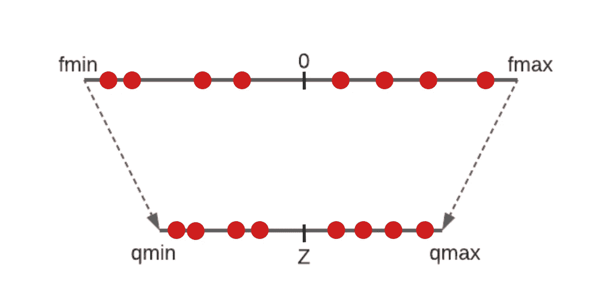

图一。从浮点域到量化域的缩放表示。来源:作者图片

考虑到我们有一条直线上两点的坐标(qₘᵢₙ,fₘᵢₙ)和(qₘₐₓ,fₘₐₓ)，我们可以以 y = mx +c 的形式得到它的方程，x 是量化值，y 是实数值。所以为了得到量化域中 0 的映射，我们只需找到 y=0 时 x 的值。解决这个问题后，我们会得到:

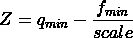

等式 3

但是如果 0 不在 fₘₐₓ和 fₘᵢₙ之间，我们的零点会超出量子化范围。为了克服这一点，我们可以将 z 设置为 qₘₐₓ或 qₘᵢₙ，这取决于它位于哪一侧。

现在我们有了量化操作的一切，我们可以使用以下等式从浮点值获得量化值:

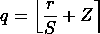

等式 4

此外，我们将使用去量化操作将其转换回浮点域，以逼近原始值，但这会导致一些小的量化损失，我们将使用这些损失来优化模型。

## 去量化操作

为了获得真实值，我们将量化值放入等式 1 中，因此变为:

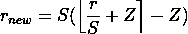

等式 5

## 创建训练图

现在我们已经定义了 FakeQuant 节点，我们需要确定将它们插入图中的正确位置。我们需要使用以下规则对权重和激活进行量化操作:

*   权重需要在与输入相乘或卷积之前进行量化。
*   我们的图表应该显示训练时的推理行为，因此 BatchNorm 层必须折叠，必须删除遗漏。关于 BatchNorm 折叠的详细信息可在[这里](https://scortex.io/batch-norm-folding-an-easy-way-to-improve-your-network-speed/)找到。
*   在将类似 Relu 的激活层应用于每一层之后，每一层的输出通常被量化，这是有益的，因为大多数优化的硬件通常具有与主操作融合的激活功能。
*   我们还需要量化像 Concat 和 Add 这样的层的输出，其中几个层的输出被合并。
*   我们不需要在训练期间量化偏差，因为我们将在推断期间使用 int32 偏差，并且稍后可以使用使用权重和激活的量化获得的参数来计算该偏差。我们将在这篇文章的后面讨论这个问题。

天平和砝码零点的测定方法与上一节所讨论的一样简单。为了确定激活的标度和零点，我们需要在浮点域中保持激活的最大值和最小值的指数移动平均值，以便在从许多图像获得的数据上平滑我们的参数。

因此，伪量化操作被插入到下图中，如下所示。

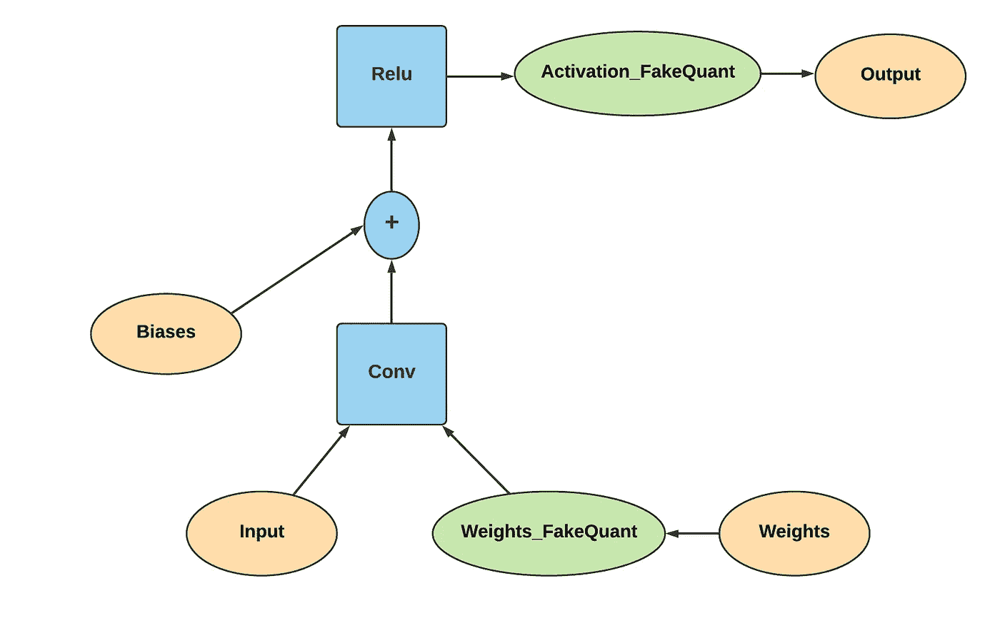

图二。量子感知训练图的可视化表示。来源:作者图片

现在我们的图表已经准备好了，我们需要为训练做准备。在训练时，我们必须仅在前向通道中模拟量化行为以引入量化误差，后向通道保持不变，并且在训练期间仅更新浮点权重。为了在 TensorFlow 中实现这一点，我们可以借助@custom_gradient 装饰器。这个装饰器帮助我们为任何操作定义自己的自定义渐变。

## 创建评估或推理图

既然我们已经完成了我们的训练，并且我们的参数现在被调整用于更好的低精度推断，我们需要从获得的训练图中获得低精度推断图，以在优化的硬件设备上运行它。

*   首先，我们需要从上述模型中提取量化的权重，并将量化操作应用于在 quant-aware 训练期间获得的权重。
*   由于我们的优化函数将只接受低精度输入，我们还需要量化我们的输入。

现在让我们来推导如何使用这些量化参数来获得量化结果。

假设我们假设卷积是点运算。

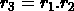

等式 6

利用等式 1，它也可以写成:

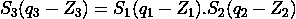

等式 7

为了获得量化值 q₃，我们将等式重新排列为:

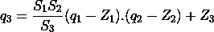

等式 8

在这个等式中，我们可以在推理开始之前离线计算 S₁S₂)/S₃，这可以用一个乘数 m 来代替

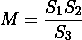

等式 9

现在，为了进一步将其简化为纯整数运算，我们尝试将 M 分解为两个整数值。m 总是介于 0 和 1 之间，所以可以分解成这种形式。

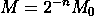

等式 10

使用这个等式，我们可以获得 M₀和 n 的整数值，它们将分别作为乘法器和逐位移位器的值。显然，如果我们可以在硬件上执行浮点乘法，就不需要这一步。

此外，我们需要相应地修改我们的偏见，因为我们的乘数也会影响它。因此，我们可以使用以下等式获得 int32 量化偏差以进行推断:

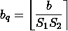

等式 11

现在我们已经有了所有的成分，我们可以创建我们的低精度推理图，看起来像这样。

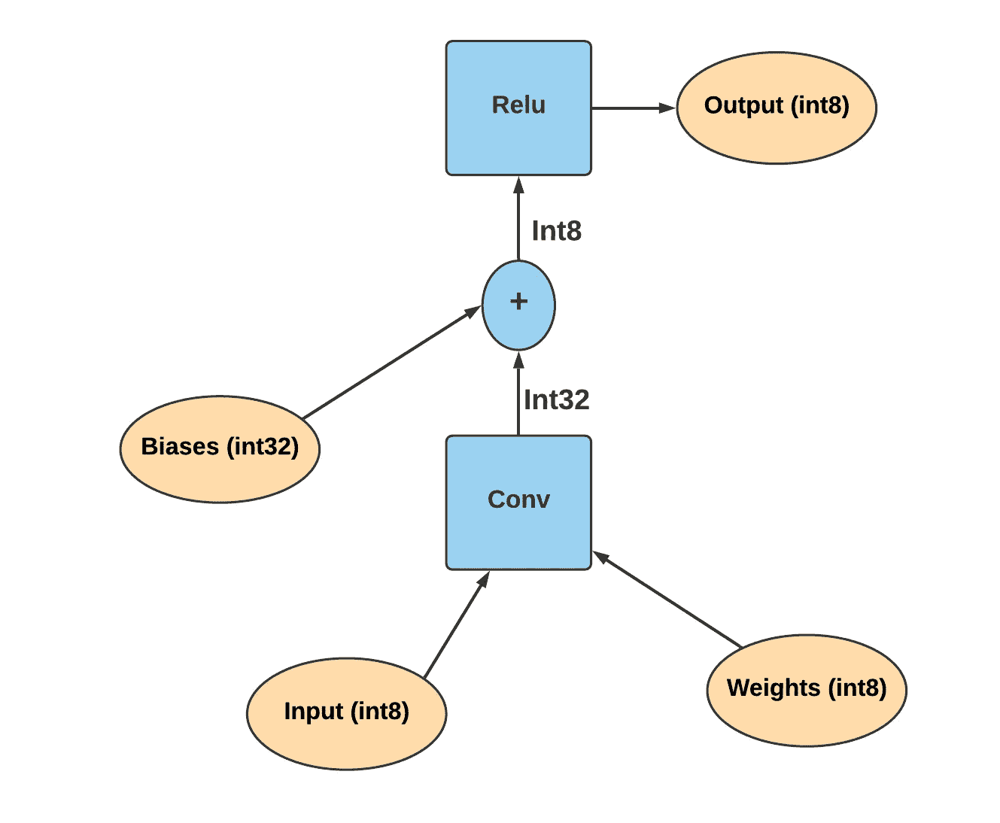

图 3。量子推理图的表示。来源:作者图片

我们想把量子化的范围作为有符号的还是无符号的，这取决于我们。在上图中，它被认为是无符号的。

# 量化感知训练值得努力吗？

我们已经知道了量化的重要性，也知道后量化有时会有很大的损失，量化感知培训是我们最好的选择。下表显示了使用一些流行和复杂的神经网络架构进行 Quant-Aware 训练的结果。我们可以观察到，在这种量化模式下，精度下降可以忽略不计。

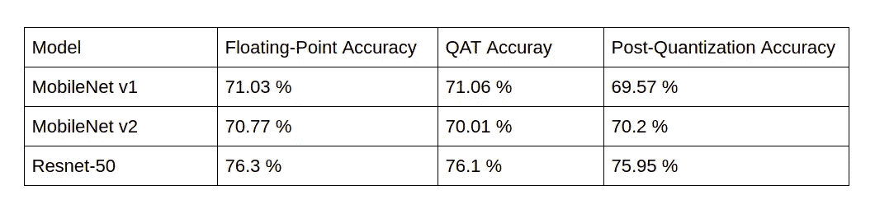

图 4。量化感知训练的性能比较。来源:作者图片，数据来自 [Tensorflow 博客](https://blog.tensorflow.org/2020/04/quantization-aware-training-with-tensorflow-model-optimization-toolkit.html)

此外，我们不需要担心自己实现如此复杂的机制，因为 Tensorflow 为此提供了一个定义良好的 API。你可以从[这里](https://www.tensorflow.org/model_optimization/guide/quantization/training)了解一下。

# 参考

[1] Benoit Jacob，Skirmantas Kligys，，Menglong Zhu，，，Hartwig Adam 和 Dmitry Kalenichenko，用于高效整数算术推理的神经网络的量化和训练[2017]

[2][https://blog . tensor flow . org/2020/04/quantization-aware-training-with-tensor flow-model-optimization-toolkit . html](https://blog.tensorflow.org/2020/04/quantization-aware-training-with-tensorflow-model-optimization-toolkit.html)

[3][https://Intel labs . github . io/distiller/algo _ quantization . html #:~:text = This % 20 means % 20 that % 20 zero % 20 is，This % 20 exact % 20 quantization % 20 of % 20 zero](https://intellabs.github.io/distiller/algo_quantization.html#:~:text=This%20means%20that%20zero%20is,this%20exact%20quantization%20of%20zero)

[4][https://scortex . io/batch-norm-folding-an-easy-way-to-improve-your-network-speed/](https://scortex.io/batch-norm-folding-an-easy-way-to-improve-your-network-speed/)