# 对变分法的见解

> 原文：<https://towardsdatascience.com/insights-on-the-calculus-of-variations-f50825f0ca84?source=collection_archive---------16----------------------->

## [思想和理论](https://towardsdatascience.com/tagged/thoughts-and-theory)

## 或者如何证明两点间最短路径是直线

照片由[史蒂夫·阿灵顿](https://unsplash.com/@sarringt?utm_source=medium&utm_medium=referral)在 [Unsplash](https://unsplash.com?utm_source=medium&utm_medium=referral) 上拍摄

变分法是一种强有力的技术，可以解决一些用其他方法无法直观解决的动态问题。它是最优控制理论的先驱，因为它允许我们解决非复杂的控制系统。此外，它也是拉格朗日力学的基础，虽然没有牛顿力学那么有名，但同样强大。

理解变分法框架将使你在最优控制理论框架中站稳脚跟，同时发现关键的数学概念。

## 理论上的直觉

与函数最优化理论相反，变分法并不试图寻找函数的最小值。相反，它使我们能够找到一组**函数**(我们称之为泛函)的~最小值。通过累加累积成本**将每个功能映射为一个值**。

我们要解决的问题是找到一条路径，一组连续的值，导致最小的总成本(任何最大化问题都可以通过在成本上加一个负号变成最小化问题)。

拿一个投资公司来说，它可以用有限的资金决定一年以上的日常投资。每天投入的钱在同一天产生收益。该公司希望在一年中赚取尽可能多的收入，为此，将每天的收入汇总为一年的收入。如果公司有一个投资模拟，它可以尝试多种投资策略，并通过时间(路径)确定什么是导致最高收入的日常投资的最优序列。该模拟允许我们比较多种投资途径，并选择一个导致最高收入的途径。

为什么变分法特别擅长解决这些问题？考虑这样一种情况，我们必须找到乘坐地铁的最快交通时间。比较地铁站的所有可能组合并找出最佳轨迹是非常容易的:在离散空间中，轨迹集是一个固定的数字。现在考虑这样一种情况，你正在驾驶，需要在方向盘完全控制的情况下将 A 点集结到 B 点。最佳轨迹不取决于少数地铁线路变化，而是取决于每一个单独的转向决策。在连续的空间中，我们试图比较无限数量的可能轨迹，它们中的每一个都与另一个有着无限的不同。
变分法提供了在这种情况下找出最短路径的方法。

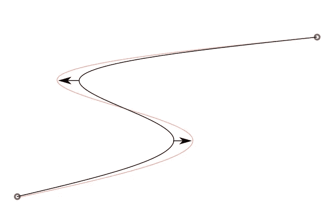

路径周围微小变化的可视化。作者图片

变分法实际上使用了与函数优化相同的技巧。函数优化会注意到，在最优点，向任何方向移动一点点只能导致更高的值，这将有助于找出最优性的一阶约束。
变分法利用了这样一个事实，即考虑到最优路径，任何与其稍有不同的路径都会导致更高的成本。从该观察，有可能导出**欧拉-拉格朗日方程**，其构成了理论的基础。

## 可解决的问题

我们需要提醒的是，变分法可以解决的问题等价于最小化下面的表达式:

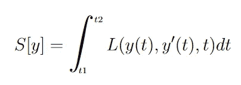

其中，y 是我们的状态变量，或者是您想要找到最优路径的函数(即每日投资)，L 是您的相关成本(即每日收入)，S 是总成本，具体取决于您选择的函数 y(年收入)。

总的来说，变分法适用于以下类型的问题:

*   这是一个优化问题，这意味着它包括最小化(分别最大化)某个值。
*   要最小化的值是通过从问题的给定开始到结束对成本函数求和而获得的。
*   这个问题有一个状态变量，我们试图为它找到一组最优值(路径)。
*   该成本函数仅取决于状态变量及其一阶导数。

我们举一个在介绍变分法理论时经常被引用的著名例子:最短路径。

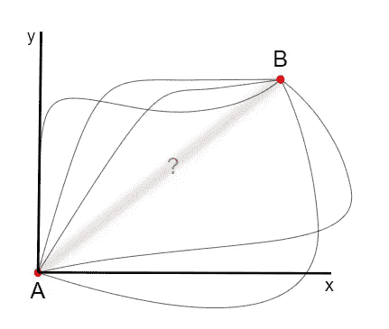

两点之间最短的路径是什么？作者图片

这个问题只是证明任意两点之间的最短路径是一条直线。对我们基于直觉的大脑来说，这是显而易见的，但数学证明仍然需要运用变分法理论。让我们检查一下这个问题是否符合:

*   我们试图最小化给定路径的长度。
*   路径的长度是线段长度的总和。
*   状态变量再次是几何路径(每个线段的坐标)。
*   一段的长度只取决于每段的方向(状态变量的导数)。

在[最优理论的序言](/optimal-control-a-preamble-6c0bc2b12ed6)中考虑的问题是最速降线，我们希望找到引导滚动珠到达给定点的最快轨迹。

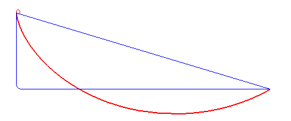

来源:维基百科:腕尺记录

让我们检查一下这些条件是否都适用:

*   我们正试图最小化滚动珠轨迹的持续时间
*   轨迹持续时间是通过合计珠子通过轨迹的连续部分所花费的时间而获得的
*   状态变量由轨迹(也称为路径)的连续段的坐标来表征。
*   珠子穿过一段轨迹所花费的时间仅取决于珠子在特定段上的速度(可以从其高度推断出)和该段的长度，该段的长度也仅取决于状态变量的导数。

为了多样化，让我们举一个经济科学的例子，它也依赖于变分法:考虑一个工厂，它能以生产率 p(r(t))制造一种产品，给定原材料收入率 r(t)。
公司面临多重挑战:

*   越早从生产中赚钱越好
*   改变生产率是有成本的，成本随着变化量的增加而增加。

我们可以用下面的等式来表示这个问题:

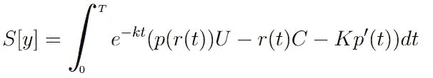

其中，经济学中常用的指数项代表所赚货币价值的衰减(潜在利益的损失)，U 代表单位价格，C 代表单位成本，K 是一个常数，它影响对过快提高或降低生产率的惩罚力度。

显而易见，我们确实有一个想要最小化(分别最大化，不带负号)的总价值，即工厂的总收入。这里的累积成本是单位时间 dt 内产生的收益。最后，我们可以自由选择和优化的状态变量是我们在每个时间 t 决定购买收入材料的比率。最后，当我们看方程时，我们意识到成本函数只取决于 t，r(t)，r'(t)(因为 p 是 r 的函数)。这个问题可以用变分法来解决，它说明了一些最优控制问题可以用本文描述的方法以一种简单的方式来解决。

安特·罗泽茨基在 [Unsplash](https://unsplash.com?utm_source=medium&utm_medium=referral) 上的照片

既然我们已经看到了多个例子，我们可以试着对变分法使我们能够处理的问题类型进行推理。
很明显，如果我们看看最速降线和工厂问题，脑海中会浮现出一个词，即“**动力学**”，或者换句话说，我们不仅对状态变量的值感兴趣，还对它如何随时间演变感兴趣。这一点很清楚，因为我们有方程中状态变量部分的导数。我们不仅关心成本的总和，而且这个成本对状态变量的变化率也很敏感。

如果你很好奇，你会抱怨另一个例子，最短路径问题，看起来没有任何动态方面。这实际上是不正确的。相反，考虑以下问题:一辆汽车以固定速度向前行驶，只能改变方向(这是给定路径的导数)。在这种情况下，优化的成本不是距离，而是到达最终目的地所需的时间。

## **动力系统**

这里要记住的是变分法可以帮助我们解决一些动力系统的优化问题。但不是每个动力系统！唉，只有一阶的。
提醒一下，一阶动力系统是可以用一阶微分方程完全描述的系统:

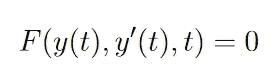

以最短路径问题(又名恒速车问题)为例。问题的状态变量，汽车的位置，可以完全由一阶微分方程确定。现在如果你想起用来介绍[最优控制理论的问题](/optimal-control-a-preamble-6c0bc2b12ed6)，它或多或少是同一个问题:

汽车从给定的起点和终点位置加速，目标是减少总行驶时间，目标是找出应用于油门踏板的最佳控制组，以尽可能快地达到目标。

两者看起来都像时间最优问题。区别来自于实际的控制。后一个例子允许控制汽车的速度和加速度，因此汽车的位置不能由一阶微分方程确定。

总的来说，我们可以说变分法允许我们求解路径，一条画出来的线，而它不能求解轨迹:一条知道我们通过它的速度的路径。

## 与拉格朗日力学的关系

从这个意义上说，我们可以把变分法当作解决最优控制问题的工具，但只适用于一阶动力系统。在实际中，大多数系统都是二阶动力系统。想想在牛顿运动定律下演化的物理系统，它的运动方程取决于系统的加速度。如果加速度不为零，你的系统很有可能是一个二阶动力系统…
除非它的能量不变。这就是拉格朗日力学的全部技巧。T2 能量恒定的系统实际上是一阶系统。为了说清楚，让我们这样写:

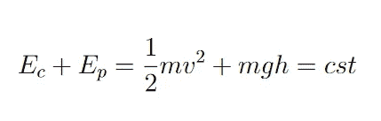

对于在高度 h 的重力场 g 中质量为 m 的给定系统

可以看出，系统可以完全描述，而不会在任何地方出现加速度。这是一个一阶动力系统。
最速降线就是这样一个系统，尽管珠子的加速度是不恒定的，因为它只在重力和对其位置的约束下演化。

这就是拉格朗日力学的全部内容。仅在保守力下利用系统(使得系统的总能量是守恒的)，这使得它们成为一阶动力系统，从而有资格使用欧拉-拉格朗日方程来求解。
我们在[最优控制的序言](/optimal-control-a-preamble-6c0bc2b12ed6)中提出了拉格朗日运动方程的一般公式。让我们在这里详述一下。拉格朗日陈述并证明了寻找描述保守系统运动特征的路径等价于寻找下列方程的静止点:

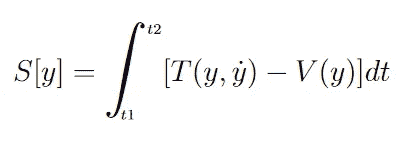

这里 T 代表我们系统的动能，V 代表我们系统的势能，而 y 是我们选择的坐标向量，只要它能在每个时间 T 完全代表空间中的系统，它可以是笛卡尔坐标，也可以是极坐标。这两个实体的区别被打上了“拉格朗日”的印记。如果我们能找到拉格朗日积分随时间的最小值，我们就知道找到了一个静止点，并以系统坐标的特定函数，路径结束。

拉格朗日，动能和势能之间的差，似乎有点武断。为什么最小化这样的成本会导致找到系统的运动方程？

-首先，因为它有效。如果我们用欧拉-拉格朗日方程来解决这个特定的问题，其中拉格朗日被定义为动能和势能差，如果我们选择笛卡尔坐标作为状态变量，我们会得到牛顿运动定律，也可以用另一种方式推导。

-第二，因为它仍然有一些意义。
如果你拿着一个给定高度的物体，这个物体有势能，但没有动能。如果你把它放下，你会发现势能转化成了动能。虽然我们知道系统的总能量是不变的，但这不足以知道从势能到动能的转换是如何进行的，因此也不足以描述运动定律。但是我们知道，大自然正试图通过尽可能多地为自己保留能量来最大限度地减少能量消耗。当你吹一个气泡时，另一种势能，与弹性变形有关。气泡持续一段时间，因为它试图保持其势能。您可以假设您正在拖放的对象也是如此。它不愿意移动，并将抵抗将它吸引到地面的力。我们发现在牛顿力学中，对运动的阻力叫做**惯性**。在这种情况下，最小化动能同时最大化势能等价于最小化(T — V)。
拉格朗日公式可以被视为试图最小化**运动的成本**。

显然，拉格朗日公式允许使用变分法框架来解决它:拉格朗日仅依赖于状态变量 r、它的导数 r’和时间。

拉格朗日力学优于牛顿力学的最大优点是可以使用任何坐标系来描述系统的位置。这对于任何涉及旋转运动的问题都是非常明显的。这是因为能量守恒不依赖于任何坐标系。
拉格朗日力学可以扩展到添加约束，只要是完整的(可积的)。基本上，完整约束是一组等式或不等式，它们限制了你试图寻找的路径。如果你考虑一个 2D 的例子作为最短路径问题，完整约束将代表你放置在限制进入某些区域的路上的障碍。牛顿力学中的这些约束总是作用在系统上的力。例如对于一个摆，我们用牛顿力学中的力和拉格朗日力学中摆的位置约束来表示连杆的张力。
最后但同样重要的是，拉格朗日力学仅限于一阶动力系统。任何包含非保守力(摩擦力)的系统都需要用牛顿力学求解。

## 推导欧拉-拉格朗日方程

为了找到保守系统的运动方程，欧拉首先提出了现在所谓的欧拉-拉格朗日方程。它们提供了问题的一阶必要条件。然而，拉格朗日通过使用新的符号ε，一个无穷小的任意数，改变了欧拉后来称为变分法的问题的解决方法，使它们发生了革命性的变化。让我们看看拉格朗日是怎么做的。

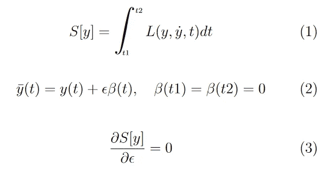

我们先从问题的定义开始:
(1)我们要找 S[y]的一个驻点。对于拉格朗日力学，状态对应的是空间坐标。
(2)是诀窍:给定我们系统 y(t)的路径，我们考虑与原始路径稍有不同的路径集。我们用一个函数β来解释我们在每一点的变化，ε是一个无穷小的值。我们正在分析路径的一个小变化，因此是变分法。对路径β的唯一要求是其起始值和结束值为零。
③是静止点的定义的直接翻译。通过我们定义新变量 y bar 的方式，由于β是任意的，我们实际上可以访问所有可能的路径。我们实际上做的是引入一个新的变量，使我们能够浏览所有的解决方案。在这个意义上，泛函 S 只随ε变化。自然地，如果我们想找到 S 的驻点，那么它对ε的一阶导数必须为零。

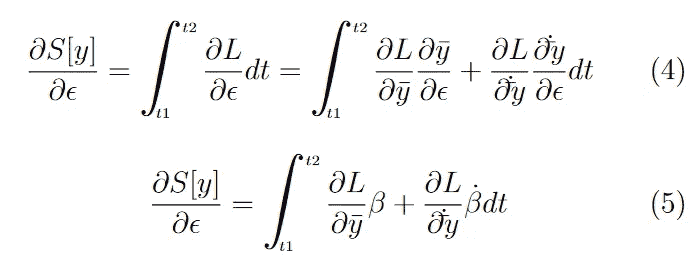

(4)我们在这里向前推导并应用偏导链规则。注意，我们在推导中考虑的是 y 条，而不是 y，因为我们考虑的是原始路径 y 的所有可能的变化。

(5)通过使用等式(2)，我们可以用ε的实际表达式来代替关于ε的偏导数中的 y 条。

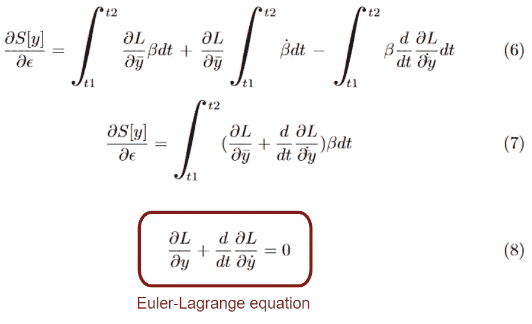

(6)我们在这里对等式(5)中的积分的第二项进行分部求导。我们的目标是去掉β的导数，因为我们没有关于它的信息。在等式(6)的第二项中，我们看到我们最终得到[beta(t2)-beta(t1)]。参考(2)，路径β的末端被选择为 0，因此第二项为零。

(7)在最后一步去掉一项后，简单地以更紧凑的形式重写方程。我们可以说，这个等式对任何路径β都成立(给定(2)中的条件)。由于我们的等式等于 0 (3)，唯一可行的方法是，在任何时候，乘以β的项为零。

(8)以微小的差异重写在最后一步中发现的结果。如你所见，状态变量 y 上不再有条形，这是因为我们对ε= 0 的项求值，因为该方程适用于任何ε。我们最终得到的只是欧拉-拉格朗日方程。

注意我们做的是单向推导。这意味着欧拉-拉格朗日方程提供了一个必要条件，但不是充分条件。

## 使用欧拉-拉格朗日方程

有了强大的工具，我们可以尝试解决我们之前定义的问题。

*   腕尺年代线
*   两点之间的最短路径
*   最佳工厂生产
*   保守系统的运动方程

解决这些问题的方法总是相同的。我们需要找到一个合适的状态变量来代表系统。
2-表达给定状态变量的拉格朗日量(代价)。
3-最后应用欧拉-拉格朗日法，通过将问题公式转化为可解公式，找到作为初始问题驻点的路径。

## 最短路径问题

首先，让我们考虑最短路径问题，并应用三个步骤:
我们考虑两点 A 和 B，我们希望以最短的路径集结。

1-因为我们在 2D 工作，让我们选择笛卡尔坐标。那么状态变量就是 y(x)，它构成了一条路径。

2-我们的总成本是路径的长度，其特征是每一段的长度总和，我们将它定义为 dS。利用毕达哥拉斯定理，我们还可以说明 dS = sqrt(dx + dy)，我们可以用 dx 进一步因式分解。注意 dx/dy 就是简单的 y’。

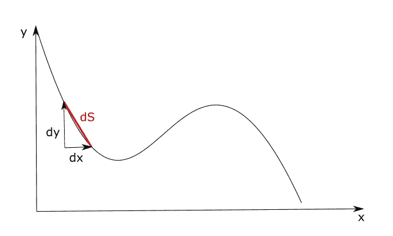

作者图片

我们的函数现在看起来是这样的:

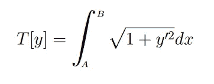

3-拉格朗日量在这里被清楚地确定，并且只取决于 y’。为了使用欧拉-拉格朗日方程，我们需要推导出关于 y 和 y '的拉格朗日量。
关于一个被导数的函数求导的概念可能看起来很奇怪，但毕竟，首先，状态变量 y 也是一个函数。你需要记住，我们从一开始考虑的是一组路径，其中状态变量本身就是一条路径。所以只要你认为路径是一个变量，那么路径的导数就是另一个变量。

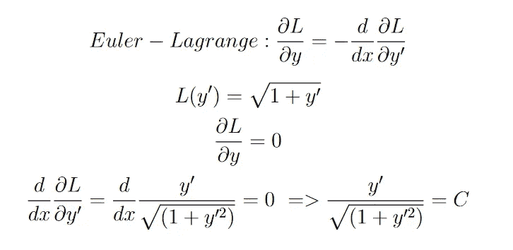

我们写出了欧拉-拉格朗日方程，它的状态变量公式与我们的问题相匹配，并且清楚地定义了拉格朗日量。接下来就是简单的把欧拉-拉格朗日方程的两项表示出来，进行推导，找出我们感兴趣的东西:最短路径 y*(x)的表达式。因为最终，这就是欧拉方程正在做的。这是路径 y 使 T[y]最小的必要条件。(或者至少是它的一个静止点)。如你所见，只要我们知道它只是一个变量，对 y '求导就不会有任何问题。通过进一步发展，我们得到 y 上的一个条件，使得它确实最小化 T[y]并产生最短路径:

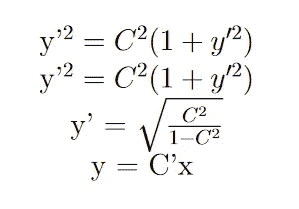

y 上使 T[y]最小并产生最短路径的一个必要条件是 y 是一条从 A 到 b 的直线。

## 最速降线问题

最短路径问题可以归类为相当容易解决的问题。让我们看看如何处理一个稍微复杂一点的问题，这也是变分法的原始问题。
提醒一下，系统是一个从任意点 A 到任意点 b 无摩擦滚动的珠子，珠子只受重力和珠子的反作用力。
目标是尽可能快地找到引导珠子到达 B 点的路径。因此，这是一个时间优化问题。

1-必然有一个包含点 A 和 b 的平面，让我们在这个平面上取笛卡尔坐标。状态变量又是 y(x)。

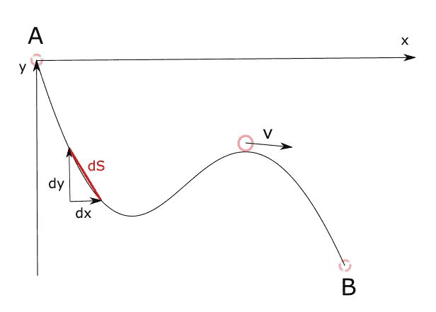

作者图片

2-考虑到我们的成本，我们希望最小化珠子到达 b 点的时间。我们可以说，它是珠子通过每段路径所需时间的总和。但是这和我们的状态变量没有很好的联系。利用时间、距离和速度之间的关系，我们可以说我们的成本是比率 **dS/v** ，其中 dS 是该段的长度，v(x，y)是该段上珠子的速度。利用毕达哥拉斯定理，我们可以用我们的状态变量来表示 dS，最后得到等价的公式:

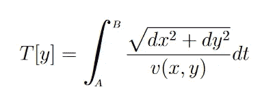

然而，我们不希望在公式中有任何额外的 dx，因为我们的状态变量是 y。我们应该在那里转换方程，以便只表示 x，y 或 y′。我们首先对分子进行因式分解，这样 dy/dx 可以表示为 y'(x)。在分母上，我们利用能量守恒定律。当质量为 m 的珠子位于高度为 h 的 A 处时，其能量是纯势能，因此系统在整个运动过程中的能量是恒定的，并且等于 mgh，并且我们可以由此推导出珠子对于任何给定坐标的速度:

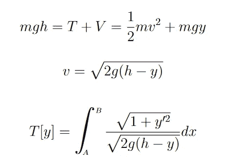

第二步现在完成了，我们有了代价的表达式，拉格朗日量，关于我们的状态变量 y 和它的导数 y’。

3-让我们应用欧拉-拉格朗日方程。

既然 g 和 h 是任意的，那我们就来关注一个简化我们推导的情况:g= -1/2，h=0。我们得到:

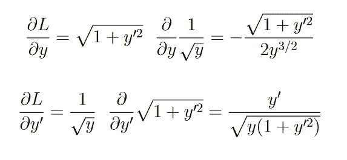

因为 y 与 y’无关，所以在第二个方程中它被认为是一个常数。然而，我们现在需要对 x 求导，这时我们必须记住 y '和 y 确实依赖于 x，通过将 y 视为 y(x)和 y '视为 y'(x)，我们可以简单地将它们视为两个独立的函数，每个都依赖于 x，然后进行求导。我们发现:

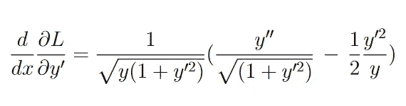

将欧拉-拉格朗日方程的另一部分放在一起，可以进行一些简化(这里跳过)。我们最终会得到:

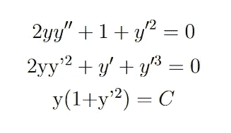

从第一行到第二行，我们乘以 y。然后我们发现它可以被整合，结果是第三行。(如果你不相信我，你可以试着再推导最后一行！).

在推导的这一点上，我们有了一个看起来容易处理的方程。我的意思是，它可以很容易地用数值求解器来求解，而用泛函表示的初始公式，在数值上是无法求解的。这就是欧拉-拉格朗日方程和变分法的内容。获得最优路径的必要条件将问题转化为可解问题。

现在，对于最速降线来说，完全解析地解决这个问题是可能的。在变分法问题中，我们经常以 y 和 y '之间的这种关系结束。能够识别路径 y(x)的常用解决方案是将 y '取为 dy/dx，在方程的每一侧分离 dy 和 dx，并在每一侧从问题的开始到结束进行积分。推导的其余部分通常包括对变量进行巧妙的修改。我们知道，对于最速降线问题，解决方案涉及一些曲线路径。因此，从笛卡尔坐标到角度变量的转换似乎是一个好的步骤。我不会在这里详述推导过程，但我知道，可以证明引导最短珠轨迹的最佳路径是摆线。

摆线的生成。来源维基百科:摆线

## 带约束的变分法

正如我们在前面一段中看到的，为了能够用拉格朗日力学来求解动力系统，我们经常需要使用约束条件并引出拉格朗日乘子的概念。
如果您不熟悉拉格朗日乘子，其基本思想是引入一个新的变量，通常称为 lambda，该变量能够使用要最小化的实体和约束条件之间的特定关系，将最小化问题转化为一个方程组。

所以如果我们考虑这个优化问题:

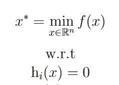

我们需要一种方法来转换这个系统，使它成为一个公式，至少在数值上是可解的，如果可能的话，在分析上是可解的。
拉格朗日观察到，在给定约束条件下达到最小值的点处，曲面 f 的梯度指向与约束条件的梯度相同的方向。这是因为这样一个事实，如果你通过观察你的曲面的轮廓线(f(x) =常数)来进化，你将最终到达一个点，在这个点上你只接触到一个点上的约束，因此轮廓线与它相切。这意味着在这个切点处两个表面的梯度是共线的(但是方向相反)。

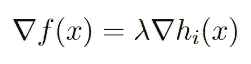

因为我们的输入 x 是 n 个分量的向量，并且我们可以有 m 个约束方程，所以上述方程将提供具有 n+m+1 个变量的 n+m 个线性方程的系统。要使系统可解，还是要考虑初始约束。找到 f 的最小值相当于求解下面的系统:

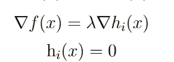

λ(一个标量)被认为是系统中的另一个变量，我们可以求解它。我们最终会找到λ的某个值，但这对我们来说无关紧要。

这就是传统函数优化的理论。这将如何转化为路径优化？答案是，差不多。拉格朗日指出，如果我们试图解决以下形式的问题:

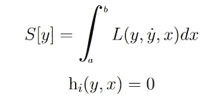

那么我们可以说，求解上述系统相当于求解:

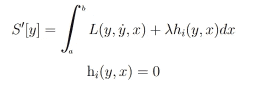

特别地，我们可以表达一个新的函数，称为增广拉格朗日 L ’,使得:

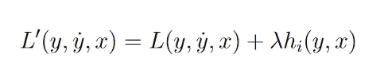

我们引入 lambda 变量的方式类似于函数优化问题。证明最小化问题与这两个公式保持等价有点困难，但直觉仍然是相同的。
现在，我们不是将欧拉-拉格朗日方程应用于拉格朗日方程，而是将其应用于扩展的拉格朗日方程，并以完全相同的方式进行。你最终会有一个额外的变量需要求解，lambda，但这是使问题实际上可解的成本(解析地或数字地)。

## 变分法的极限

正如我们前面提到的，二阶动力系统不能用欧拉-拉格朗日方程求解。非完整约束也导致不可能用这种方法解决问题。
特别是来自控制理论的系统，对于这些系统，我们不仅要寻找最优路径，还要寻找给定系统跟随最优路径的最优控制集合。因为我们控制的系统通常是真实世界的物理系统，所以控制该系统包括控制其加速度，因此使得该方程不能用欧拉-拉格朗日方程求解。
另一种理解方式是，待优化系统的控制表达式可以约束的形式包含在优化方程中:

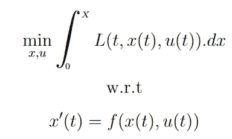

u 是应用于系统的控制，x 是系统的状态变量。

与之前的符号相比，状态变量 y 已经被 x 代替，问题是与时间相关的。然而，显而易见的是，约束包括状态变量的导数，使其成为非完整的。最后，我们可以通过直觉分析为什么这样的问题不能用变分法来解决。该理论基于对所有可能路径的抽象，并指出该路径的任何几何变化都将导致次优路径。因为所有的变化都是几何上的，所以很容易通过求导将这个条件转化为欧拉-拉格朗日方程。当我们对一个可以改变位置、速度和加速度的系统进行控制时，从一条路径到另一条路径的变化不仅仅是几何上的，我们还需要考虑时间上的可能变化或者系统通过新路径的速度变化。我们可以看到，在这种情况下推导出一个最优性条件看起来更加困难。

这个问题仍然被解析地解决了，被称为最大值原理，由列夫·庞特里亚金推广。庞特里亚金确实用一种类似于变分法的方法找到了最优性的一个条件，但是当然在数学上要重得多。然而，在现实中，为实际应用而实现的最优控制并不太依赖于最大值原理。这种趋势更倾向于逼近问题，例如通过离散化状态空间和寻找数值方法来尽可能地减少繁重的计算。但是理解变分法理论仍然有利于从整体上理解控制理论领域。

来源:

[1]《变分法和最优控制理论简明介绍》，丹尼尔·利伯松。

[2]《ECON 402:最优控制理论》，圣弗朗西斯泽维尔大学。

[3]《物理 6010，经典力学》，犹他州立大学。