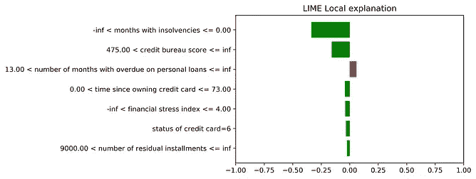
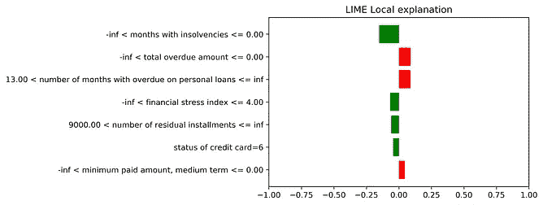
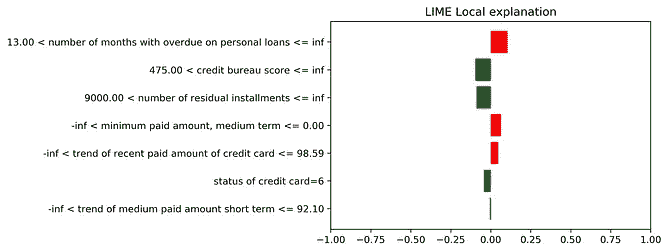
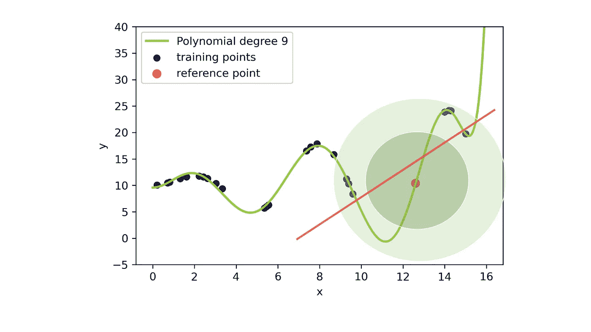
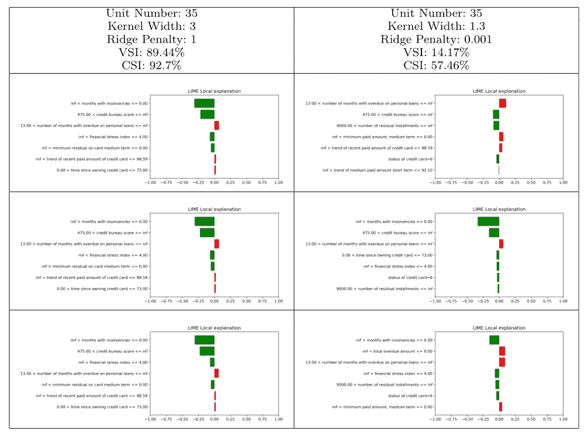

# 石灰解释的不稳定性

> 原文：<https://towardsdatascience.com/instability-of-lime-explanations-3e0efc00a7de?source=collection_archive---------42----------------------->

## 怎么处理？看看稳定性指数

稳定很重要。图片来自[这里](http://www.albiladdailyeng.com/finding-stability-unstable-world/)

在这篇文章中，我将非常具体地介绍用于解释机器学习预测的 LIME 框架。我已经在这篇[文章](https://giorgio-visani.medium.com/lime-explain-machine-learning-predictions-af8f18189bfe)中介绍了这个方法，在这篇文章中，我也给出了直觉并解释了它的优点和缺点(如果你还没有的话，可以看一下)。
在这里，我将谈论一个非常具体的石灰问题，即其解释的**不稳定性，我将提供一个发现和处理它的方法。**

# 石灰不稳定性

我们所说的不稳定是什么意思？

> **解释的不稳定性:**如果你对一个特定的个体运行 LIME，用相同的参数和设置重复该方法几次，你可能会得到完全不同的解释。

使用具有固定参数的 LIME 生成了关于同一个人的三种解释。我们可以看到不同的解释，这是由于不稳定性。来源[此处](https://arxiv.org/pdf/2001.11757.pdf)

石灰为什么会不稳定？

**因为生成步骤**。记住 LIME 在数据集的 ***X*** 变量的整个ℝᵖ空间生成 **x** 值(这里解释)。
这些点是随机生成的，所以每次调用 LIME 都会创建一个不同的数据集。由于数据集用于训练 LIME 线性模型，因此我们可能会针对不同的 LIME 调用使用不同的模型。

## 不稳定导致的信任问题

不稳定对石灰非常有害。

*为了让你相信这一点，我将告诉你一个小故事:* 考虑一家银行使用 ML 模型来决定向客户发放贷款。ML 模型被训练来预测这个人是否会偿还贷款或者她是否会违约。现在，这是一个极其重要的决定，所以银行想很好地理解它的模型是如何工作的，并决定检查为什么 ML 拒绝给一个特定的人贷款。
银行对同一个人连续三次使用石灰，解释完全不同…… *如果你是银行职员，你会相信这些解释吗？因此，你会相信你的 ML 贷款模式吗？*

正如你所看到的，不稳定的石灰解释是一种真正的痛苦，可以在整个机器学习领域产生不信任！

既然我们了解了问题及其后果，让我们来分析如何解决它。

我们可能想知道的第一件事是:

## 既然它是不稳定的原因，我们为什么不去掉世代步骤呢？

这正是研究人员在这篇论文中试图做的事情。他们的想法是仅使用训练数据集中的个体来构建 LIME 线性模型，而不在 LIME 内生成新点。
他们考虑用于训练的 ***x*** *ᵢ* 值，并通过 ML 模型预测 *ŷᵢ* ，然后根据与待解释个体的距离(使用高斯核)给每个单元一个权重。
这样，LIME 的起始数据集对于每次调用都保持不变。

然而，他们没有考虑到一个重要的缺点:
**我们可能有训练点非常少的区域，我们的线性近似在那里会非常粗糙！**

例如，考虑下图:
最大似然函数非常不规则，我们正在考虑一个参考点(红点),它位于离其他训练点相当远的区域。如果我们使用太小的内核宽度，我们最终只会考虑红点。在这种情况下，LIME 会失败，因为我们至少需要 2 个点来画一条线*(有无限条线通过一个点；*石灰无法选择正确的一种)。
如果我们放大局部区域，我们最终会考虑相当远的点，并且产生的石灰线完全不能代表 ML 模型的局部曲率！

仅使用训练点构建的 ML 函数(绿色曲线)和 LIME 解释(红线)的玩具示例。在函数中人口稀少的区域，如果不生成新点，LIME 就不能很好地工作。乔治·维萨尼拍摄的照片

也许你在想，“*这个模式很糟糕！它处于一种完全超负荷的状态，”*这肯定是真的。但是你必须考虑到我们使用 LIME 来理解 ML 模型的行为。
如果不生成新的点，LIME 可能无法在类似情况下捕捉到此类问题。

此外，任何数据集都存在一些训练数据覆盖率不高的区域(通常在变量范围的极值)。如果我们有兴趣了解这些区域的最大似然预测，我们应该像在石灰生成步骤中一样，使用允许我们检查曲线(生成更多点)的工具。

基本上，采样步骤有助于我们很好地覆盖 ML 函数。这总是有帮助的！我们生成的点越多，石灰数据集在再现*f(****x****)*函数的所有波动部分时就越精确。

因此，正确的解决方案是使用 LIME 中的随机生成步骤来生成点。如果我们在参考点周围很好地覆盖了函数*f(****)x****)*，就实现了稳定性。这样，我们将能够为每个不同的 LIME 调用检索适当的正切值。

# 稳定性指数

您在本节中找到的概念、想法和图片，以及下一节中的用例，都摘自我们于 2020 年发表的论文 [*《石灰的统计稳定性指数:获得机器学习模型的可靠解释*](https://arxiv.org/pdf/2001.11757.pdf)【1】》。

LIME 解释由一个线性模型组成，该模型使用特征选择技术(套索或逐步选择)仅选择最重要的变量。模型中考虑的每个变量都有一个相关系数。因此，不稳定石灰解释可能有不同的变量和不同的系数。

我们建议使用一对指数来检验石灰解释的稳定性:VSI(变量稳定性指数)和 CSI(系数稳定性指数)。

这些指数旨在以相同的设置对同一个人重复时间 *n* 次，并比较获得的线性解释。我们认为两个线性模型是相同的，如果它们有相同的变量，并且每个变量有非常相似的系数。

这两个指数的范围都是从 0 到 100，越高越相似。每个指标检查不同的稳定性概念，因此两者都有大的值是很重要的。当这种情况发生时，我们保证我们的石灰解释是稳定的，因为我们在参考个体的接近度中实现了对*f(****x****)*的良好覆盖。

## VSI(变量稳定性指数)

检查 *n* 个线性模型中的变量是否相同。基本上，它着眼于特征选择过程的稳定性:我们希望选择的特征或多或少是相同的，即选择过程应该是一致的。

## 系数稳定性指数

它比较不同石灰模型中与每个变量相关的系数。
该指数单独考虑每个变量*(比较与同一特征相关的系数是有意义的)*。
对于单个变量，CSI 采用 *n* 时间解释中的系数，并为每个系数建立置信区间*(我们需要区间来处理系数的微小变化，这些变化是由所有模型中存在的固有统计误差引起的)*。
比较区间，得到变量的系数一致值:当置信区间重叠系数被认为相等时；而不相交区间表示两个系数的范围完全不同，因此系数不能具有相同的值。
在所有特征中对变量的一致性值进行平均，获得通用 CSI 指数。

# 使用案例和应用

现在我将向您展示一个指数有用性的例子。
考虑一个能够区分好的和坏的付款人的梯度推进模型(银行通常想知道要求贷款的客户偿还的概率是多少，ML 模型试图了解客户是否会归还贷款)。

众所周知，梯度推进是一个黑箱模型，因此我们必须使用 LIME 来理解为什么一个特定的个人(单元 35)被归类为良好的支付者。

在下表中，您可以看到石灰参数的良好选择如何带来可靠和稳定的解释，而当选择了不良参数时，同一家伙的 ML 预测完全不稳定。
稳定性指数有助于您发现这种不稳定性(事实上，在图表的右边部分，我们有非常不同的时间解释，并且指数非常低！)

给用户的时间说明表 35。在左边，一个好的参数选择产生稳定的解释；在右边，解释不稳定。稳定性指数有助于我们发现不一致性。资料来源:[稳定指数文件](https://arxiv.org/pdf/2001.11757.pdf)

LIME 的解释很容易理解:将棒线的值和截距相加，我们就获得了有关个人违约概率的 ML 预测(Unit 35)。
条形的长度突出了每个变量的具体贡献:绿色的条形将模型推向“好支付者”预测，而红色的条形将模型推向“坏支付者”。

# 概括一下

在本文中，我们解决了 LIME 解释的不稳定性这个大问题，它破坏了对 ML 方法的信任。我从数学的角度展示了这一点，并使用了真实的案例应用程序。
我认为实践者通常不注意不稳定性问题，特别是因为没有工具来控制它。

我介绍了石灰的一对稳定性指标，可以帮助从业人员发现这种问题。我鼓励每个使用 LIME 的人提供指数值，以确保解释是可靠的。

这是机器学习模型走向可信石灰解释的第一步。

[1]维沙尼，g .，巴格利等人，2020。[石灰的统计稳定性指数:获得机器学习模型的可靠解释](https://arxiv.org/pdf/2001.11757.pdf)，arXiv 预印本

[2]m . r .扎法尔，N.M .汗，2019 年。 [DLIME:计算机辅助诊断系统的确定性局部可解释模型不可知解释方法](https://arxiv.org/pdf/1906.10263.pdf)，arXiv 预印本