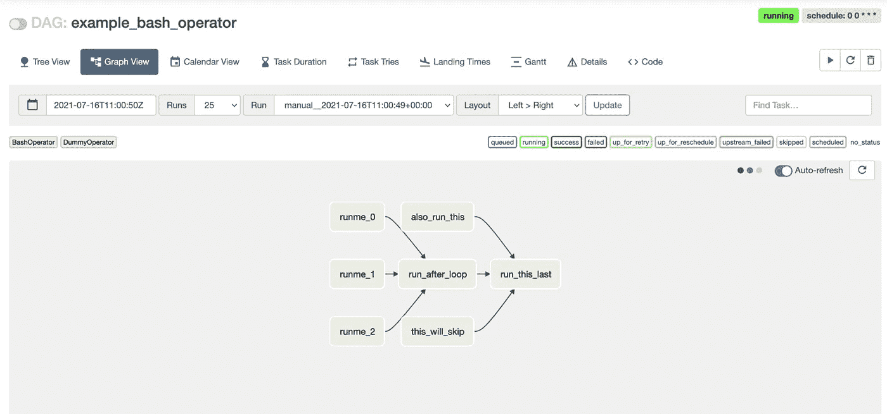
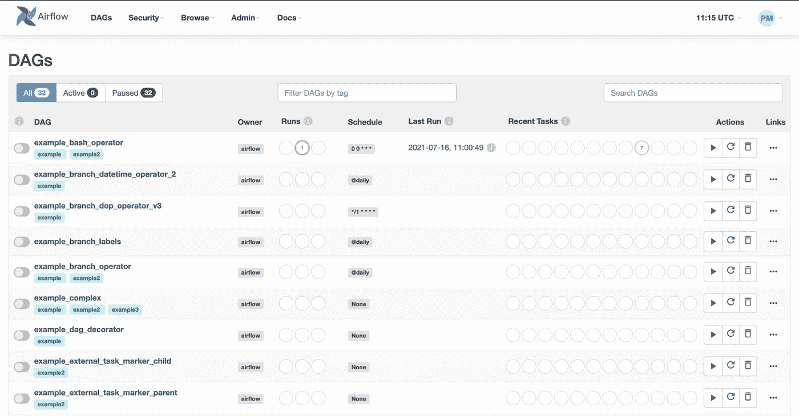

# 在 Raspberry Pi 上安装 Airflow 2(使用 Python 3.x)

> 原文：<https://towardsdatascience.com/install-airflow-2-on-a-raspberry-pi-using-python-3-x-a137117ba4c7?source=collection_archive---------24----------------------->

## 构建数据工程管道(使用 Raspberry Pi)——第一部分

气流是数据工程常用的工具。编排工作流很棒。Airflow 版只支持 Python 3+版本，所以我们需要确保使用 Python 3 来安装。我们也可以将它安装在另一个 Linux 发行版上。

这是系列文章的第一篇，在这里我们将构建一个**完整的数据工程管道**(使用 Raspberry Pi 的)。要关注这个系列，只需**订阅** [**简讯**](https://pedromadruga.com/newsletter) 。

# 安装依赖项

让我们确保我们的操作系统是最新的。

现在，我们将在树莓 Pi 上安装 Python 3.x 和 Pip。

气流依赖 **numpy** ，numpy 有自己的依赖关系。我们将通过安装必要的依赖项来解决这个问题:

我们还需要确保使用 Python3 和 Pip3 安装 Airflow，因此我们将为两者设置一个别名。为此，通过添加以下内容来编辑`~/.bashrc`:

或者，您可以直接使用`pip3`进行安装。对于本教程，我们将假设别名正在使用中。

# 安装气流

## 创建文件夹

我们需要一个占位符来安装气流。

## 安装气流组件

最后，我们可以安全地安装气流。我们从定义 airflow 和 python 版本开始，以获得正确的约束 URL。约束 URL 确保我们为正确的 python 版本安装正确的 airflow 版本。

## 初始化数据库

在运行 Airflow 之前，我们需要初始化数据库。这个设置有几个选项:1)对一个单独的数据库运行 Airflow，2)运行一个简单的 SQLite 数据库。本教程中使用了 SQLite 数据库，所以除了初始化数据库之外，没有什么要做的。

所以让我们初始化它:

# 运行气流

现在可以同时运行服务器和调度程序:

现在在浏览器上打开 **http://localhost:8080** 。如果您需要登录，您需要创建一个新用户。这里有一个例子:

一旦通过验证，现在可以看到主屏幕:

**就这样——您现在已经安装了气流系统！可选地，您可以采取额外的步骤。**

# 可选择的

## 自动启动气流

为了在系统启动时自动启动 web 服务器和调度程序，我们需要三个文件:`airflow-webserver.service`、`airflow-scheduler.service`和一个`environment`文件。让我们把它分成几个部分:

1.  到 [Airflow 的 GitHub repo](https://github.com/apache/airflow/tree/master/scripts/systemd) 下载`airflow-webserver.service`和`airflow-scheduler.service`
2.  将它们粘贴到`/etc/systemd/system`文件夹中。
3.  编辑这两个文件。首先，`airflow-webserver.service`应该是这样的:

现在继续编辑`airflow-scheduler.service`文件，看起来应该是这样的:

注意`user`和`Group`已经改变，还有`ExecStart`。您还会注意到还有一个尚未创建的`EnvironmentFile`。这就是我们接下来要做的。

4.创建环境文件。你可以叫它任何名字。我选择将其命名为`env` ，并将其放在`/home/pi/airflow`文件夹中。换句话说:

让我们编辑`env`文件并放置内容:

5.最后，让我们重新加载系统守护进程:

# 就是这样！下一步是什么？

在这个数据工程系列的下一篇博文中，我们将使用 Airflow 创建我们的第一个有向无环图(DAG)。订阅[简讯](https://pedromadruga.com)，不要错过！

# 来源

1.  [https://air flow . Apache . org/docs/Apache-air flow/stable/installation . html](https://airflow.apache.org/docs/apache-airflow/stable/installation.html)
2.  [https://medium . com/the-kickstarter/Apache-air flow-running-on-a-raspberry-pi-2e 061 F6 c 3655](https://medium.com/the-kickstarter/apache-airflow-running-on-a-raspberry-pi-2e061f6c3655)
3.  [http://www . the crusty engineer . com/home/post/setting _ up _ air flow _ on _ a _ raspberry _ pi _ 4 _ part _ 1](http://www.thecrustyengineer.com/home/post/setting_up_airflow_on_a_raspberry_pi_4_part_1)

*原载于*[*pedromadruga.com*](https://pedromadruga.com/posts/airflow-install/)*。*