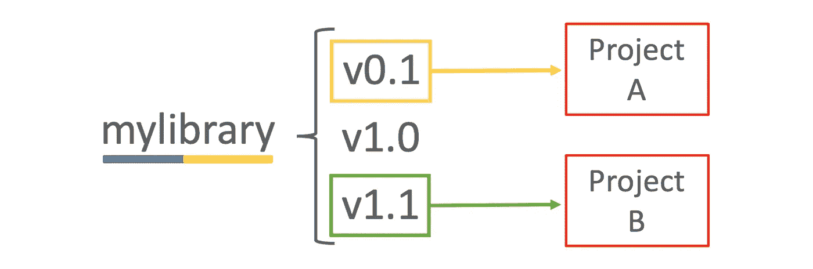
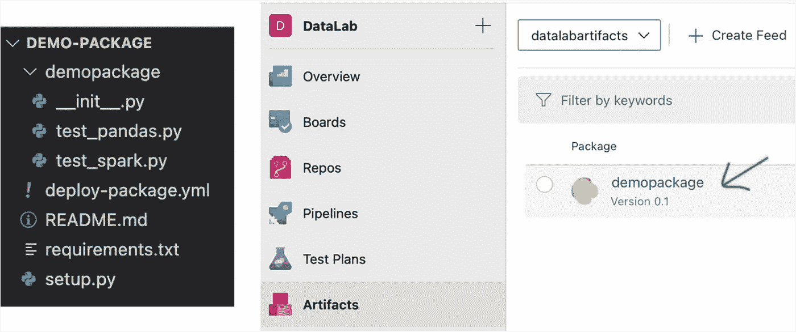
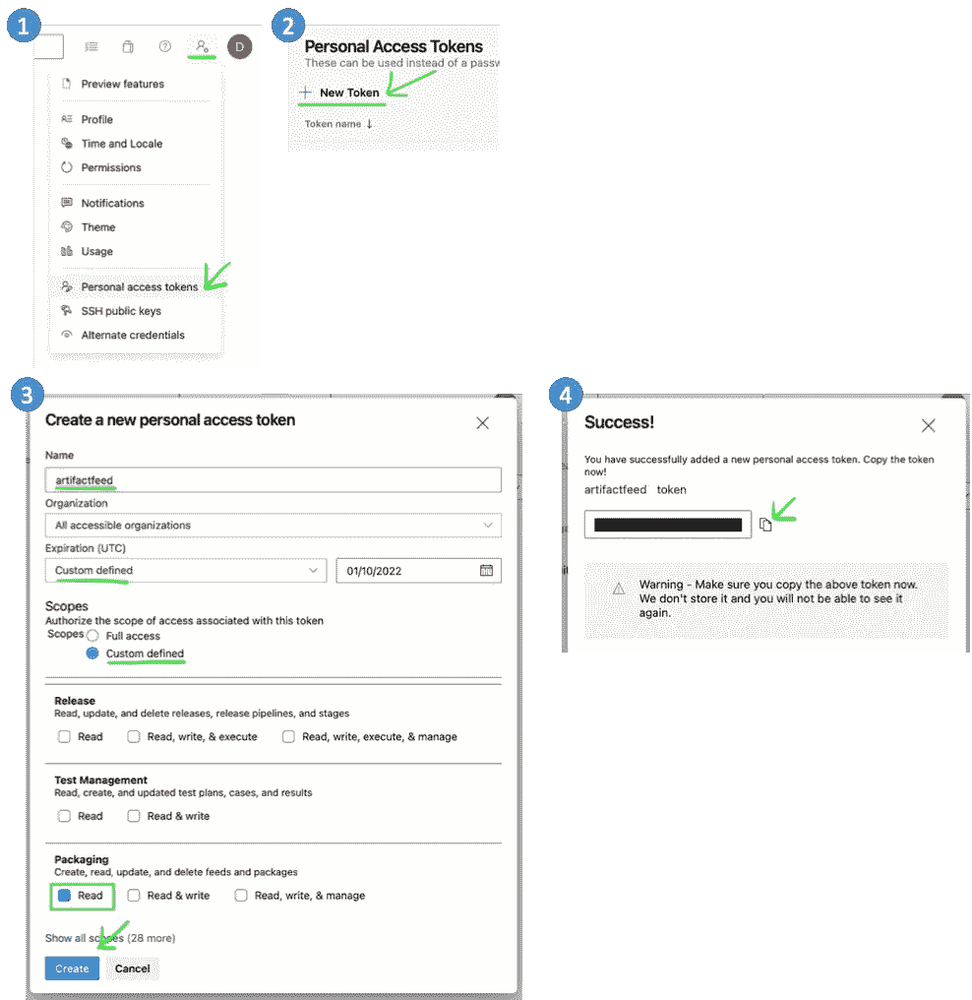
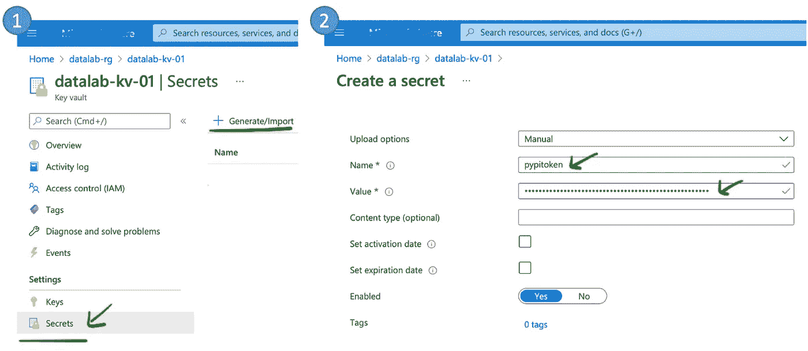
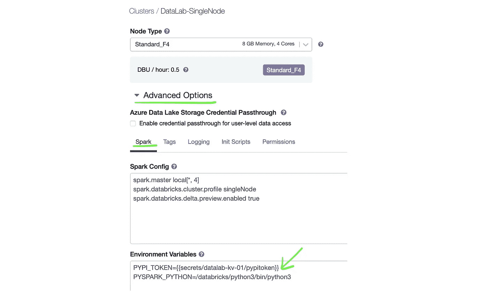
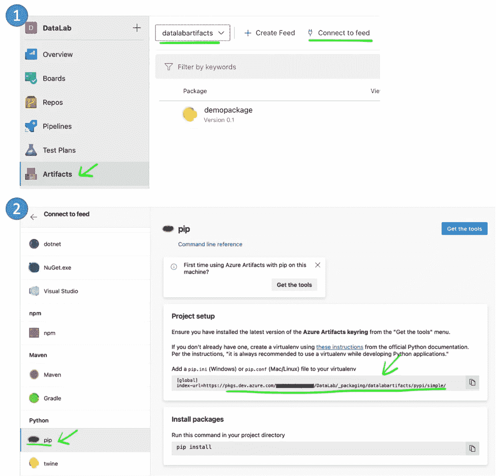
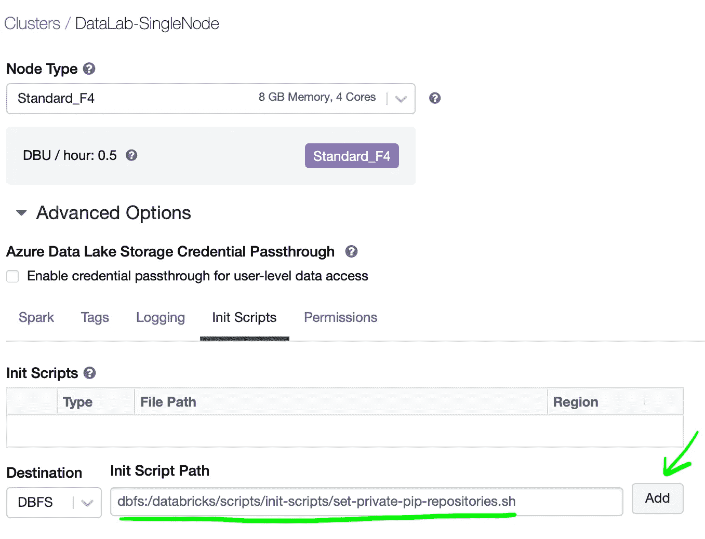
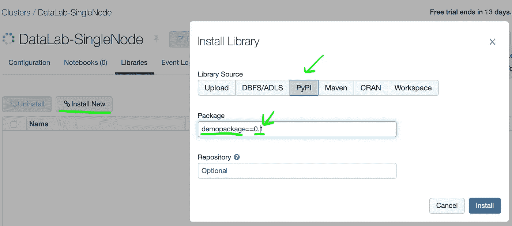
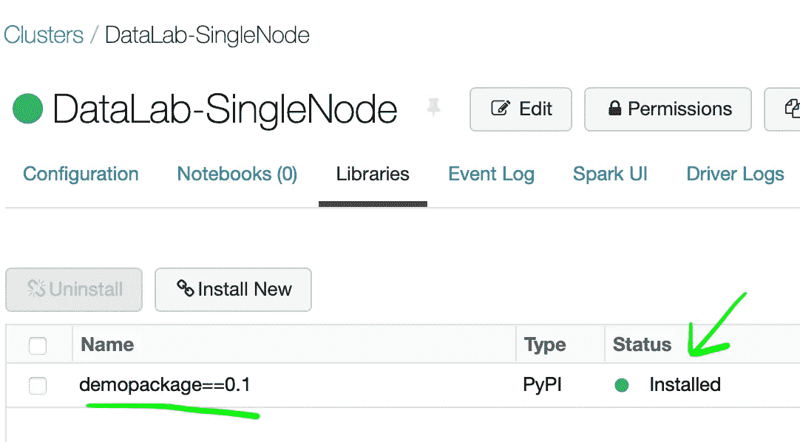
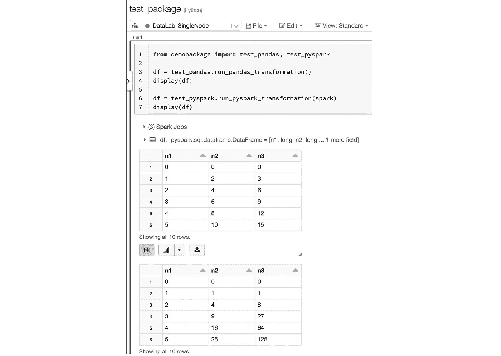

# 从数据块上的私有 PyPI 安装定制 Python 库

> 原文：<https://towardsdatascience.com/install-custom-python-libraries-from-private-pypi-on-databricks-6a7669f6e6fd?source=collection_archive---------10----------------------->

## 在这篇博文中，我将一步一步地解释如何在 Databricks 集群上集成您的私有 PyPI 存储库。因此，您将能够像平常使用公共库一样轻松地安装自己的定制 Python 库。


Anaya Katlego 在 [Unsplash](https://unsplash.com?utm_source=medium&utm_medium=referral) 上的照片

这种方法为跨数据团队共享代码和库打开了大门，同时保持了版本控制。此外，它提供了在数据块上应用混合编码方法的可能性，其中您可以组合在本地机器上编写的库(使用 CI/CD 管道正确测试和发布)和使用这些库的笔记本。

> 注意:本教程重点介绍 Azure。如果你碰巧在一家不同的云提供商工作，但你仍然对这个话题感兴趣，请继续阅读。您将很有可能能够很容易地将这个概念应用到其他环境中。

# 为什么应该使用私有的 PyPI 存储库

Databricks 提供了一种在集群上安装公共库的非常简单的方法，所以只需点击几次就可以安装它们。不幸的是，对于自制的定制库，这个过程并不容易。

在这种情况下，目前为止我看到的最流行的解决方案是将代码打包到 Python Wheel 中，并将其上传到 Blob 存储中，这样您就可以将它安装为 DBFS 库。找到的第二个解决方案是直接从 Git 存储库安装一个库，因此您必须提供 Git URL 和身份验证方法。虽然这两种解决方案都成功了，但是我们遗漏了一些非常重要的东西:版本控制。

## 为什么库版本控制很重要？

当编写自己的库时，有时您会编写为特定解决方案量身定制的代码，这样重用的可能性就不会太高。在其他情况下，您可能会创建一个包含类和实用函数的代码包，并与您的同事共享，这样他们就不必重新发明轮子了。在这两种情况下，如果您继续使用您的库，您将会引入一些更改，这些更改可能会搞乱甚至正在生产中运行的解决方案。

防止这种情况发生并让每个人都满意的唯一方法是引入库版本控制。这样，每个解决方案或环境都可以使用不同的固定版本的库，并且在引入更改时不会出现任何问题。



两个项目使用同一个库的不同版本|作者图片

## 数据块上的私有 PyPI 存储库

回到 Databricks 中的自制库，以前提出的方法都没有针对这个问题的健壮解决方案。您可以在 Blob 存储上上传和维护具有不同版本名称的 Python Wheels，或者在 Git Repo 上发布分支。即使这样做了，也很难追溯每个版本的变化，你必须自己构建和维护这个机制，甚至更难，与你的库的所有用户保持一致。换句话说，对于一个已经解决的问题，这些都是笨拙的变通方法。

**PyPI 库**已经存在多年，最流行的 Python 库都是在[公共 PyPI 回购](https://pypi.org/)上发布的。同样，您可以拥有自己的 PyPI 存储库，并从版本控制功能中获益——您可能希望该存储库是私有的，这样您的组织库就不会对所有人公开。

在 **Azure DevOps** 上，拥有自己的私有 PyPI 库超级容易。您只需要创建一个 [**工件 Feed**](https://docs.microsoft.com/en-us/azure/devops/artifacts/start-using-azure-artifacts?view=azure-devops) ，其中包含最常见编程语言的包存储库。之后，你可以在那里发布你的 **Python Wheels** 并从它的所有特性中获益。例如:跟踪每个版本发布的 Git Repo 的提交的能力。

# 辅导的

既然我已经解释了使用私有 PyPI 存储库来保存我们的定制库版本的一些好处，那么让我们看看如何将它集成到 Databricks 集群上，以便您能够安装您的定制库。

## 先决条件

总之，您需要在 Azure **工件提要**中发布的自定义 **Python 包**，以及在**数据块**工作区中注册为**秘密范围**的 **KeyVault** 。

如果你有点迷路，不知道如何到达那里，这里有一个包含所有先决条件和一些有用链接的列表:

*   Azure DevOps 项目。
*   Azure Repos 中的 Git Repo(如何创建 Git repo [此处](https://docs.microsoft.com/en-us/azure/devops/repos/git/create-new-repo?view=azure-devops#create-a-repo-using-the-web-portal))。
*   Git Repo 中的 Python 代码用一个`setup.py`生成一个 Python 轮(如何生成一个 Python 轮[此处](https://medium.com/swlh/beginners-guide-to-create-python-wheel-7d45f8350a94))。
*   工件提要(如何创建工件提要[这里](https://docs.microsoft.com/en-us/azure/devops/artifacts/concepts/feeds?view=azure-devops#create-a-feed))。
*   Git Repo 中的 Azure Pipeline YAML 文件来生成 Python Wheel 并将其发布到工件提要(这里的代码)。
*   从 YAML 文件注册运行 Azure Pipeline(怎么做[此处](https://faun.pub/azure-devops-build-release-with-yaml-templates-d55f25a4928c))。
*   Azure Databricks 工作区。
*   蓝色钥匙金库。
*   Azure Key Vault 在 Databricks Workspace 中注册为秘密范围(如何操作[此处](https://docs.microsoft.com/en-us/azure/databricks/security/secrets/secret-scopes#--create-an-azure-key-vault-backed-secret-scope))。

## 我自己的演示设置

对于这篇文章，我做了一个演示设置，如果你看到任何参考资料，看看它可能对你有好处。

我在演示中使用的 Python 包(称为“demopackage”)非常简单。它只包含几个用 PySpark 和 Pandas 生成数据帧的函数。正如你在图片中看到的，它也被发布到我的工件提要“datalabartifacts”。



我自己的工件提要上的代码文件夹结构和已发布包|作者图片

在 Azure 上，我只有一个包含数据块和密钥库的资源组。此外，密钥库已在 Databricks 中注册为同名的秘密范围。


我自己的资源组上的资源|作者图片

# 神奇的配方

这个过程的目标是允许 Databricks 中 Spark 集群的底层虚拟机集成工件提要中的私有 PyPI 存储库，并能够从其中安装 Python 库。

## 1.在 Azure DevOps 上生成个人访问令牌

因为我们的工件提要是私有的(我们希望保持它的私有)，所以我们需要为我们的虚拟机提供一种方法来验证 Arifact 提要。

不幸的是，在做了大量研究后，我发现最安全的方法是使用 Azure DevOps 个人访问令牌(PAT)。这个 PAT 是个人的，由每个 DevOps 用户发布，因此 Spark 虚拟机将使用这个令牌来模拟用户进行身份验证。这意味着在工件提要注册表中，您将看到发布者用户是下载包的用户。此外，PAT 将在一年后到期，因此请注意，您需要在到期前续订。

这里的建议是创建一个访问受限的服务帐户(DevOps 中的假用户),仅用于生成此 PAT，并在到期日前续订。

无论如何，你都可以通过点击*用户设置* → *个人访问令牌* → *新令牌*，从 Azure DevOps 生成个人访问令牌。给它一个名称，指定到期时间，以及 PAT 的权限(只需要在包装上读取)。完成后，复制生成的令牌。



按作者在 Azure DevOps | Image 上生成个人访问令牌的步骤

## 2.将令牌作为密码添加到密钥库中

生成的令牌可以用来从工件提要中检索包。如果这被泄露到你的组织之外，这将是一个大问题。这意味着黑客可以窃取工件提要中可用的软件包。

没有人希望这种情况发生，所以我们需要将令牌存储在一个安全的地方，这样我们就可以使用它，而不会将其暴露为纯文本。为此，我们需要在 Azure Key Vault 中创建新的秘密来存储它。

转到您的密钥库，单击*Secrets*→*Generate/Import*，并通过给它命名并使用在上一步中生成的 PAT 令牌作为值来创建一个密钥。

> 注意:使用的密钥库必须是在 Databricks 工作区中注册为 Secret 作用域的密钥库。



在 Azure Key Vault | Image by Author 中创建秘密的步骤

## 3.将环境变量添加到数据块集群

终于到了跳入 Databricks Workspace 的时候了！

进入*计算→选择集群→配置*，并继续编辑。在*高级选项*下，添加以下*环境变量*:

```
PYPI_TOKEN={{secrets/YourSecretScopeName/pypitoken}}
```

这样，我们就在连接到我们的密钥库的 Secret 作用域上设置了一个值。

> 注意:不要忘记用自己的名字替换秘密范围和秘密名称。



从 Secret Scope | Image by Author 设置 Databricks 群集中的环境变量

## 4.获取 PyPI 存储库 URL

让我们暂时回到 Azure DevOps，获取私有 PyPI 存储库的 URL。

为此，点击*工件→选择您的工件提要→连接到提要→ pip* ，然后复制 URL。



按作者获取 PyPI 存储库 URL |图像

## 4.使用魔法酱为数据块集群创建初始化脚本

在介绍魔酱之前，我先来说明一下窍门。

当您使用 UI 在 Databricks 群集上安装库时，Databricks 会指示所有节点单独安装库，因此它们会提取软件包并继续安装。

这意味着，如果我们想从 Databricks 集群中的私有 PyPI 存储库中安装软件包，每个节点都需要能够 1)找到私有 PyPI 存储库，2)成功地通过验证。

为了做到这一点，我们必须告诉每个集群节点 Pip 安装私有 PyPI repo 的 URL 是什么，以及如何进行身份验证，在本例中使用令牌身份验证。这样做的地方是我们必须添加一个新的`extra-index-url`的`/etc/pip.conf`文件。

实际上，我们可以通过使用 [Init 脚本](https://docs.microsoft.com/en-us/azure/databricks/clusters/init-scripts)在数据块中实现这一点。这些是在集群初始化期间在每个节点上运行的 Shell 脚本。

Init 脚本本身应该是这样的(注意，您必须用自己的 URL 替换 PyPI URL):

```
#!/bin/bash
if [[ $PYPI_TOKEN ]]; then
   use $PYPI_TOKEN 
fi
echo $PYPI_TOKEN
printf "[global]\n" > /etc/pip.conf
printf "extra-index-url =\n" >> /etc/pip.conf
printf "\thttps://$PYPI_TOKEN@pkgs.dev.azure.com/organization/DataLab/_packaging/datalabartifacts/pypi/simple/\n" >> /etc/pip.conf
```

如您所见，我们正在将之前创建的集群环境变量`PYPI_TOKEN`的引用设置到`/etc/pip.conf`文件中，这意味着根本不会显示纯文本，因为该值将在运行时解析。

> 注意:如果你试图使用`echo`命令在日志中显示它的值，你将只能看到`[REDACTED]`，因为数据块隐藏了所有来自秘密范围的值。

因为手动将脚本上传到 Databricks 可能有点棘手，所以最好通过在单元格上运行以下代码从笔记本中轻松生成脚本(不要忘记用您自己的 URL 替换 PyPI URL):

```
script = r"""
#!/bin/bash
if [[ $PYPI_TOKEN ]]; then
  use $PYPI_TOKEN
fi
echo $PYPI_TOKEN
printf "[global]\n" > /etc/pip.conf
printf "extra-index-url =\n" >> /etc/pip.conf
printf "\thttps://$[PYPI_TOKEN@pkgs.dev.azure.com](mailto:PYPI_TOKEN@pkgs.dev.azure.com)/organization/DataLab/_packaging/datalabartifacts/pypi/simple/\n" >> /etc/pip.conf
"""dbutils.fs.put("/databricks/scripts/init-scripts/set-private-pip-repositories.sh", script, True)
```

> 注意:通过这种方式，我们创建了一个[集群范围的初始化脚本](https://docs.microsoft.com/en-us/azure/databricks/clusters/init-scripts#cluster-scoped-init-script-locations)，这是比[全局初始化脚本](https://docs.microsoft.com/en-us/azure/databricks/clusters/init-scripts#global-init-scripts)更好的选择，因为缺少 Env 变量会导致其他集群的初始化失败。

## 5.将 Init 脚本添加到您的数据块集群中

现在，我们希望我们的集群在初始化过程中运行这个 Init 脚本。为此，我们转到*计算→选择集群→配置*，再次编辑同一个集群。这一次，我们将在*高级选项*下添加*初始化脚本* DBFS 路径。



按作者将初始化脚本添加到数据块群集|映像

此时，您已经可以启动集群了。它将运行 Init 脚本，因此您的工件提要的私有 PyPI 存储库将完全可访问。

## 6.在 Databricks 集群中安装 Python 库

像往常一样，进入*计算→选择您的集群→库→安装新库*。

在这里，您必须在工件提要中指定您发布的包的名称，以及您想要安装的特定版本(不幸的是，这似乎是强制性的)。



将 PyPI 库安装在 Databricks 群集|按作者排列的映像上

过一会儿你会看到安装成功了！🥳



安装的 PyPI 库|作者图片

> 注意:现在 Pip 正在不止一个 PyPI 存储库中搜索包。因此，如果在另一个存储库中有另一个同名的库，可能会发生库名冲突。如果您不使用唯一的库名，就不能保证您会安装您真正想要的库..

## 7.从 Databricks 笔记本中使用 Python 库

最后，您可以打开一个新的 Databricks 笔记本，导入您的库并享受结果！🚀



在 Databricks 笔记本上使用自定义 Python 库|作者图片

# 结论

一旦你达到这一点，我想你已经可以想象这是多么美好。这为在保持版本控制的同时跨数据团队共享代码和库打开了大门。

此外，它提供了在数据块上考虑混合编码方法的可能性，其中您可以将在本地机器上编写的库(使用 CI/CD 管道正确测试和发布)和使用这些库的笔记本结合起来。

我没有在网上的其他地方看到过这种方法，所以我决定在这里发布。我希望这对你和我的许多同事一样有帮助。祝你好运！