# 在 AWS EC2 实例上安装 Jupyter notebook 和 Rstudio 服务器

> 原文：<https://towardsdatascience.com/install-jupyter-notebook-server-on-aws-ec2-instance-91812bc83c44?source=collection_archive---------22----------------------->

## 利用云计算进行数据分析


图片由[马库斯·斯皮斯克](https://unsplash.com/@markusspiske)在 [Unsplash](https://unsplash.com) 上拍摄

# 介绍

Python 和 R 是两种最流行的数据分析编程语言。Jupyter notebook 和 Rstudio 是各自的 ide。每个打算发展数据科学技能的人在他们的本地机器上都至少有一个这样的工具。与本地机器相比，云计算将允许人们随时随地访问这些工具。即使有这些 ide 的云版本(google colab 和 Rstudio cloud)，它们也有局限性。例如，每次您启动一个新的 colab VM，您都需要安装这些包，除非您配置在 google drive 上安装这些包，这会导致一些技术开销。Rstudio cloud 的免费帐户限制为 15 小时。在本文中，我将分享在 AWS Elatic Compute Cloud(EC2)上安装 Jupyter notebook 和 Rstudio 的步骤，当用户登录时，服务器可以随时准备就绪。

# 亚马逊网络服务

首先，您需要创建并激活 AWS 帐户。步骤可以在这里找到[。使用 AWS 的最小特权原则创建管理员帐户。登录 AWS 控制台以启动 EC2 实例。AWS 提供一年免费使用 EC2 (t2.miro)。其余的都可以选择默认设置。](https://aws.amazon.com/premiumsupport/knowledge-center/create-and-activate-aws-account/)

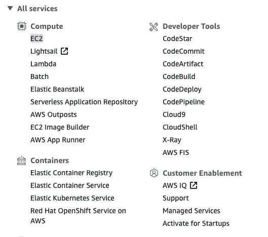

作者图片

遵循此处的步骤[使用 putty 将 windows 连接到 EC2。Mac OS 和 Linux 的连接更加直接。您也可以使用 EC2 实例在浏览器上连接。](https://docs.aws.amazon.com/AWSEC2/latest/UserGuide/putty.html)

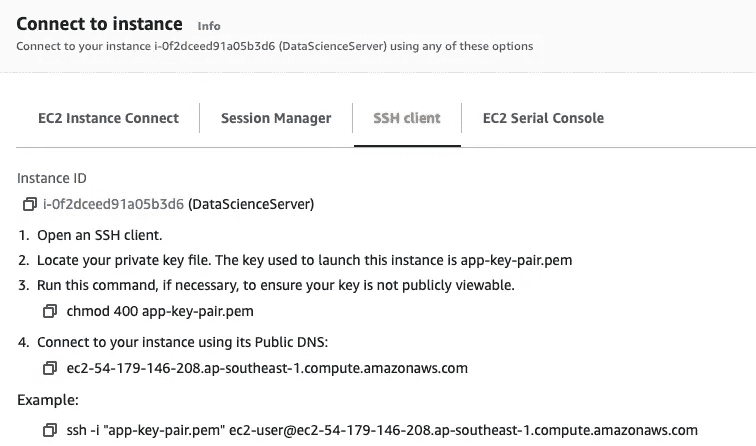

作者图片

成功连接后，您应该会看到这一点。

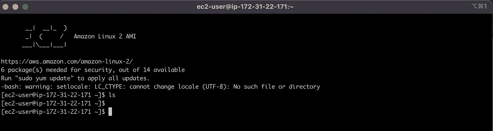

作者图片

# 安装 Anaconda

执行下面这四个命令来更新系统并下载 anaconda shell 脚本。

`sudo yum update -y
sudo yum -y groupinstall "Development tools"
sudo yum install openssl-devel bzip2-devel expat-devel gdbm-devel readline-devel sqlite-devel
wget [https://repo.anaconda.com/archive/Anaconda3-2021.05-Linux-x86_64.sh](https://repo.anaconda.com/archive/Anaconda3-2021.05-Linux-x86_64.sh)`

耐心等待执行完成，执行这个命令来安装 **anaconda。**在整个过程中，您可能需要点击“输入”或“是”来继续。

`bash Anaconda3-2021.05-Linux-x86_64.sh`

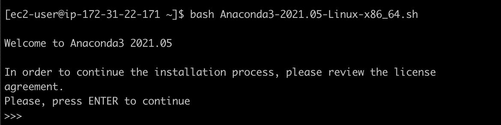

作者图片

安装完成后，您需要激活配置。`source ~/.bashrc`

在终端中键入 python 以确认成功安装后，您应该会看到 base enviroment 和 python 3 . 8 . 8 版。

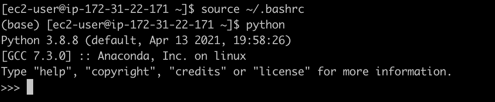

作者图片

# 远程运行 Jupyter 笔记本

既然 anaconda 已经成功地安装在 EC2 实例上，我们将远程运行 Jupyter notebook。首先，我们可以执行这些命令来生成配置文件和设置密码。

```
jupyter notebook --generate-config
```

在 ipython 环境中运行这个程序，并输入两次密码。保存生成的哈希字符串以备后用(**！！重要**)。

```
from notebook.auth import passwd
passwd()
```

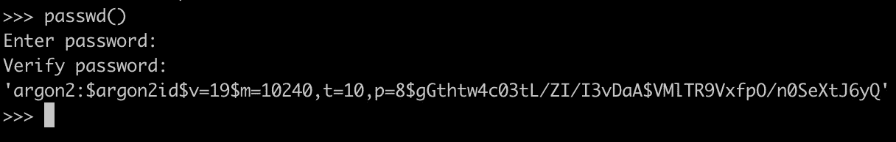

退出 python 并为 https 创建证书

`mkdir certs`

`cd certs`

`openssl req -x509 -nodes -days 365 -newkey rsa:1024 -keyout mykey.key -out mycert.pem`

配置 jupyter_notebook_config.py

`sudo vim /home/ec2-user/.jupyter/jupyter_notebook_config.py`

修改如下五个设置(使用 vim 中的/进行搜索并删除#):

```
c.NotebookApp.password=''  //(hashed-password)
c.NotebookApp.ip='0.0.0.0'
c.NotebookApp.open_browser=False
c.NotebookApp.port=8888
c.NotebookApp.certfile='' //(the directory for mycert-pem)
```

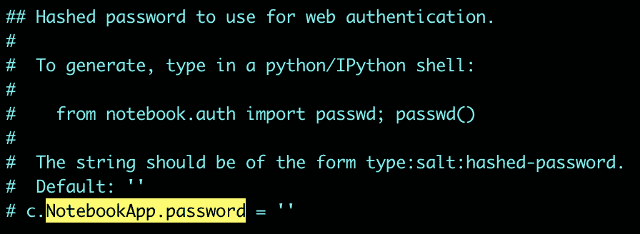

作者图片

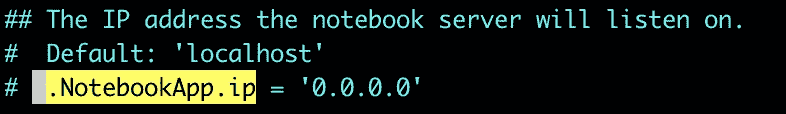

作者图片

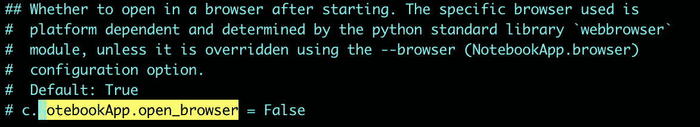

作者图片

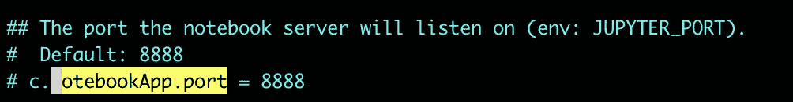

作者图片

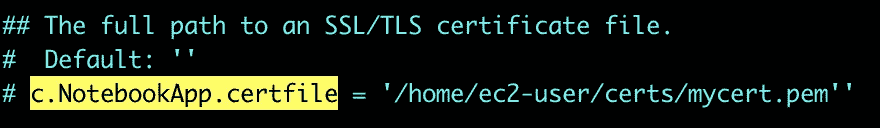

作者图片

执行下面的命令来运行服务器

`jupyter notebook`

编辑此 EC2 实例的安全组

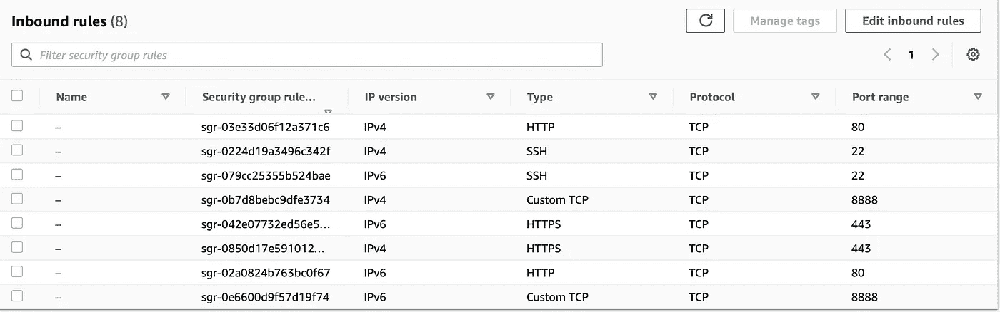

作者图片

访问服务器，方法是转到

`[https://(your](/(your) AWS public dns):8888/`

如果我们关闭终端，服务器将停止运行。我们可以关联一个弹性 IP 并执行下面的命令以避免挂断:

`nohup jupyter notebook &`

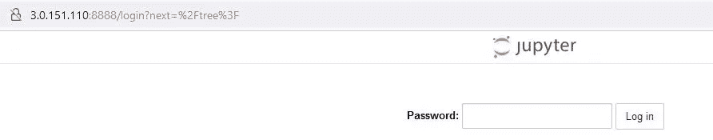

作者图片

# 安装 Rstudio 服务器

参考 [Rstudio 文档](https://docs.rstudio.com/resources/install-r/#optional-install-recommended-packages)安装 R

`sudo yum install [https://dl.fedoraproject.org/pub/epel/epel-release-latest-7.noarch.rpm](https://dl.fedoraproject.org/pub/epel/epel-release-latest-7.noarch.rpm)`

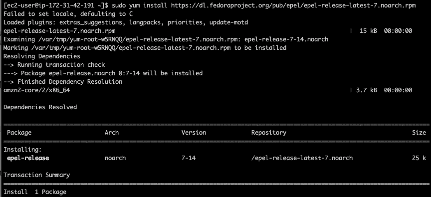

作者图片

`sudo yum install yum-utils`

`sudo yum-config-manager --enable "reel-*-optional-rpms"`

指定 R 版本

`export R_VERSION=4.0.5`

`curl -O https://cdn.rstudio.com/r/centos-7/pkgs/R-${R_VERSION}-1-1.x86_64.rpm`

`sudo yum install R-4.0.5-1-1-.x86_64_rpm`

创建符号链接

`sudo ln -s /opt/R/${R_VERSION}/bin/R /usr/local/bin/R`

`sudo ln -s /opt/R/${R_VERSION}/bin/Rscript /usr/local/bin/Rscript`

下载并安装 Rstudio Serverwget

```
wget https://download2.rstudio.org/server/centos7/x86_64/rstudio-server-rhel-2021.09.1-372-x86_64.rpm
sudo yum install rstudio-server-rhel-2021.09.1-372-x86_64.rpm
```

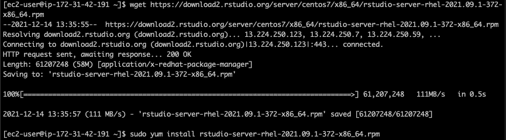

作者图片

创建帐户以登录 RStudio

`useradd [your account]`

`passed [your account]`

如前所述，编辑安全组以添加端口 8787，然后通过转到

`[https://(your](/(your) AWS public dns):8787/`

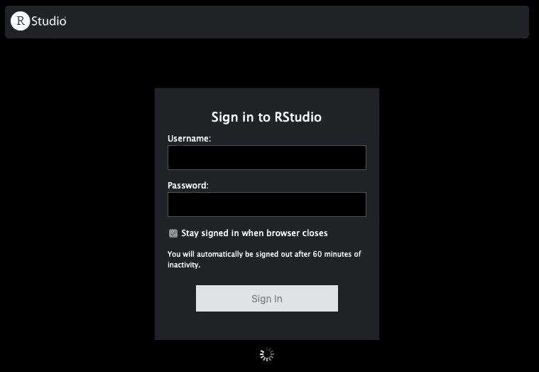

作者图片