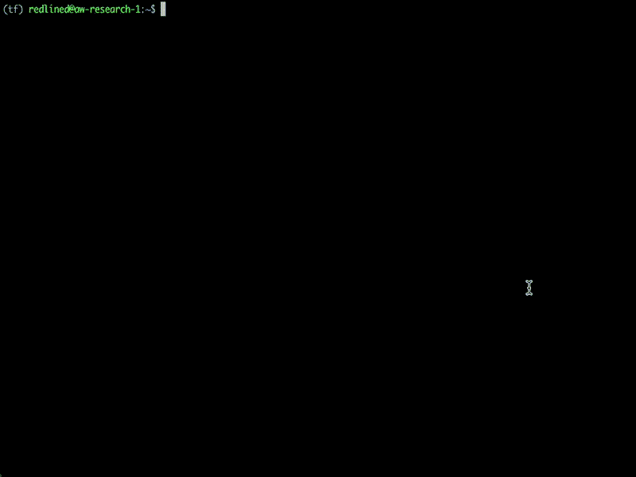

# 通过 4 个简单的步骤安装支持 CUDA、cuDNN 和 GPU 的 TensorFlow

> 原文：<https://towardsdatascience.com/install-tensorflow-with-cuda-cudnn-and-gpu-support-in-4-easy-steps-954f176daac3?source=collection_archive---------13----------------------->

## 借助 TensorFlow 2.4 和 GPU 支持，为深度学习建立前沿环境。

在这篇文章中，我们将通过几个简单的步骤来设置`TensorFlow 2.4`(最新的主/次版本)，在运行 Debian 或 Ubuntu 的云虚拟机上启用 GPU 加速。

> 希望这有助于解决[耗时且令人沮丧的过程](https://www.reddit.com/r/learnmachinelearning/comments/bsfp45/why_is_ml_software_so_horrible/)使用 [TensorFlow](https://www.tensorflow.org/) 配置您的深度学习环境！

鸣谢:手数 via iStockPhoto

**硬件**

在 AWS、GCP 和 Azure 上使用 [NVIDIA Tesla v100](https://www.nvidia.com/en-us/data-center/v100/) 、P4 和 K80 深度学习 GPU 进行了测试。任何兼容 NVIDIA CUDA 的 GPU 都应该可以工作。

**软件**

*   兼容 Debian 的操作系统(推荐 Ubuntu 18.04)
*   Python 3.8
*   [Anaconda](https://www.anaconda.com/products/individual) 包管理器

## 步骤 1 —安装 Conda 软件包管理器

## 步骤 2-创建您的 Conda 环境

在这一步，我们将设置我们的 Conda 虚拟环境，并让 Conda 处理安装 Python 3.8 的繁重工作。

## 步骤 3 —安装 NVIDIA 开发人员库

这是许多设置和安装变得棘手的地方。TensorFlow 的每个版本都被编译为使用 cuDNN 和 CUDA 开发人员库的特定版本[。](https://www.tensorflow.org/install/source#gpu)

对于任何想知道的人来说，CUDA 是 NVIDIA 的 GPU 加速代码工具集，cuDNN 被 NVIDIA 描述为*“深度神经网络的 GPU 加速原语库*。TensorFlow 2.4 还没有可用的 Conda 安装脚本，因此我们将使用 TensorFlow 团队的[指令](https://www.tensorflow.org/install/gpu#install_cuda_with_apt)自行安装库。

## 步骤 4-确认您的 GPU 设置

`TensorFlow 2.4`介绍了一种新的方法来检查确认您的 GPU[是否可用](https://www.tensorflow.org/guide/gpu)。

让我们看看它的实际效果…

确认 TensorFlow 可以看到你的 GPU

## 结论

你可以走了！这篇文章最初发表在我们的博客 [Gretel.ai](https://gretel.ai/blog/install-tensorflow-with-cuda-cdnn-and-gpu-support-in-4-easy-steps) 上——如果你有兴趣了解更多关于数据隐私和[合成数据](https://gretel.ai/blog/what-is-synthetic-data)的最新趋势，请在 [twitter](https://twitter.com/gretel_ai) 上关注我们，查看[我们的博客](https://gretel.ai/blog)，或者给我们发邮件 [hi@gretel.ai](mailto:hi@gretel.ai) ！