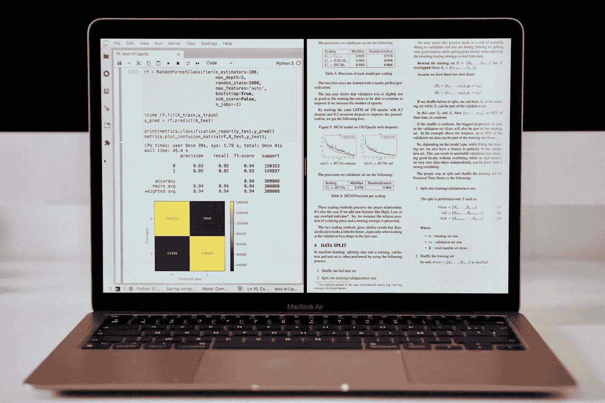

# 在苹果 M1 MAC 电脑上安装 XGBoost 和 LightGBM

> 原文：<https://towardsdatascience.com/install-xgboost-and-lightgbm-on-apple-m1-macs-cb75180a2dda?source=collection_archive---------5----------------------->

## 在苹果 M1 MAC 上安装 arm64 原生版 XGBoost 和 LightGBM



作者照片

在这篇 [**上一篇文章**](/tensorflow-2-4-on-apple-silicon-m1-installation-under-conda-environment-ba6de962b3b8) 中，我解释了如何安装 [TensorFlow](https://github.com/apple/tensorflow_macos) 、 [Scikit-Learn](https://scikit-learn.org/stable/) 以及其他几个原生为苹果 M1 (arm64)编译的包。

在这里我一步一步的解释如何安装两个最强大的[渐变增强](https://en.wikipedia.org/wiki/Gradient_boosting)包: [XGBoost](https://xgboost.readthedocs.io/en/latest/index.html) 和 [LightGBM](https://lightgbm.readthedocs.io/en/latest/) 。请注意，在撰写本文时， [CatBoost](https://catboost.ai/) 还不能安装在 M1 上。

LightGBM 可以直接从 Conda miniforge 安装，但是 XGBoost 还没有本地版本。以下步骤可以正确编译它。

## 步骤 1: Xcode 命令行工具

通过从[苹果开发者](https://developer.apple.com/)下载或键入以下命令来安装 [Xcode 命令行工具](https://developer.apple.com/download/more/?=command%20line%20tools):

```
xcode-select --install
```

## 第二步:小型锻造

从 [miniforge github](https://github.com/conda-forge/miniforge) 安装*用于 arm64(苹果硅)*的 miniforge。

Miniforge 支持安装为苹果芯片原生编译的 python 包，包括 [scikit-learn](https://scikit-learn.org/stable/) 。

## 步骤 3:安装 Brew

Brew 现在与 M1 兼容，并在本地软件包存在时安装它们。转到[家酿](https://brew.sh/index_fr)网站，将安装命令复制/粘贴到您的终端。

## 步骤 4:从 Brew 安装必要的库

必须从 Brew 安装两个库才能编译 XGBoost。

```
brew install cmake libomp
```

## 步骤 5:创建康达环境

*不要忘记打开一个新的会话或获取您的。在安装 miniforge 之后，在完成这个步骤之前。*

创建一个空的 Conda 环境，然后激活它并安装 python 3.8 和所有需要的包。

```
conda create -n boost
conda activate boost
conda install python=3.8.8
conda install numpy scipy scikit-learn
```

注意`numpy`和`scipy`是 XGBoost 的依赖项。在从 pip 安装 XGBoost 之前从 Conda (conda-forge)安装它们是非常重要的，因为它确保在环境中有这些包的 arm64 版本。

当加载并编译`scipy`的 pip 版本时，尝试从 pip 直接安装 XGBoost 失败。

## 步骤 6:安装 LightGBM

LightGBM 在 [conda-forge](https://conda-forge.org/) 下已经有了预编译的 arm64 版本。

```
conda install lightgbm
```

## 第 7 步:安装 XGBoost

由于 XGBoost 原生 arm64 版本在 [conda-forge](https://conda-forge.org/) 中尚不可用，必须从 pip 安装。在步骤 5 之后，所有依赖项都已经安装在本机版本中。

```
pip install xgboost
```

本环境下编译安装 XGBoost。

## 现在你可以测试了

以下脚本使用 LightGBM 和 XGBoost 训练和测试二进制分类器。

```
import numpy as np
from sklearn.datasets import make_classification
from sklearn.model_selection import train_test_split
from sklearn.metrics import accuracy_score
import timefrom lightgbm import LGBMClassifier
from xgboost import XGBClassifierprint('make classification ...')X,y = make_classification(n_samples=1000000,
                         n_features=50,
                         n_informative=30,
                         n_redundant=5,
                         n_repeated=0,
                         n_classes=2,
                         n_clusters_per_class=2,
                         class_sep=1,
                         flip_y=0.01,
                         weights=[0.5,0.5],
                         random_state=17)X_train, X_test, y_train, y_test = train_test_split(X,y,test_size=0.3,random_state=1000)print(f'X_train shape: {X_train.shape}')
print(f'Train LGBM classifier ...')
clf = LGBMClassifier(n_estimators=100,
                     num_leaves=64,
                     max_depth=5,
                     learning_rate=0.1,
                     random_state=1000,
                     n_jobs=-1)start = time.time()
clf.fit(X_train,y_train)
elapsed = time.time() - start
print(f'LGBM Training ran in {elapsed:.5f} seconds')y_pred = clf.predict(X_test)
print(f'Test Accuracy: {accuracy_score(y_test,y_pred):.2f}')print(f'Train XGB classifier ...')
clf = XGBClassifier(n_estimators=100,
                     max_depth=5,
                     max_leaves=64,
                     eta=0.1,
                     reg_lambda=0,
                     tree_method='hist',
                     eval_metric='logloss',
                     use_label_encoder=False,
                     random_state=1000,
                     n_jobs=-1)
start = time.time()
clf.fit(X_train,y_train)
elapsed = time.time() - start
print(f'XGB Training ran in {elapsed:.5f} seconds')y_pred = clf.predict(X_test)
print(f'Test Accuracy: {accuracy_score(y_test,y_pred):.2f}')
```

## 演出

这个非常简单的测试给出了 MacBook Air M1 与 Core i5 iMac 和 Xeon Platinum 实例相比的以下培训时间。

**MacBook Air M1 2020 8GB/512 GB**

LightGBM 训练:3.44 秒
XGBoost 训练:4.59 秒

**2017 款 iMac 27 英寸酷睿 i5 @ 3.8GHz / 40GB 内存**

LightGBM 训练:5.03 秒
XGBoost 训练:6.90 秒

**8 核英特尔至强白金处理器@ 2.5 GHz 实例**

LightGBM 训练:5.27 秒
XGBoost 训练:6.26 秒

XGBoost 和 LightGBM 在 Mac M1 上运行并具有出色的性能。

请注意，由于这些软件包的开发团队尚未发布正式的苹果芯片版本，因此没有优化，也没有使用 GPU。

感谢您的阅读。