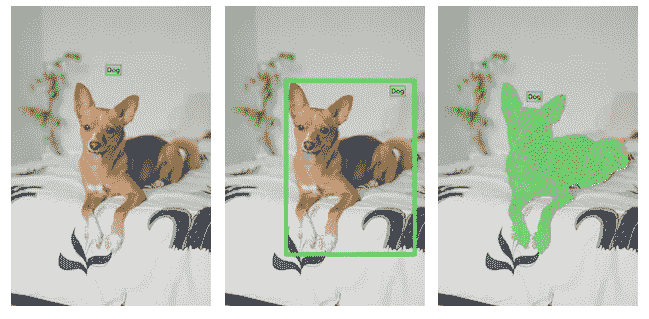
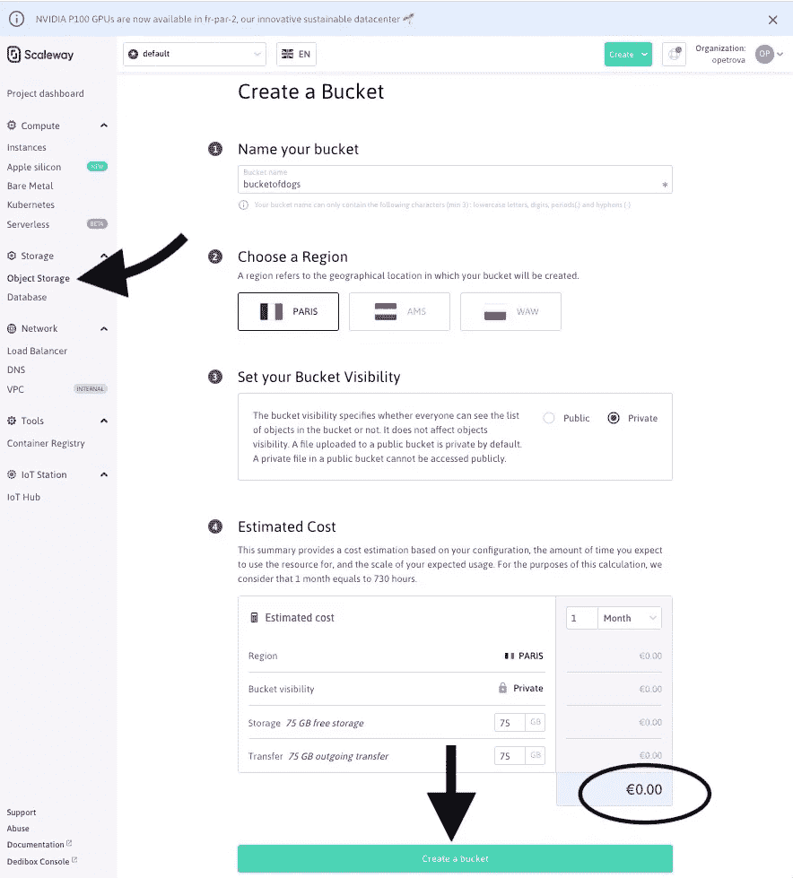
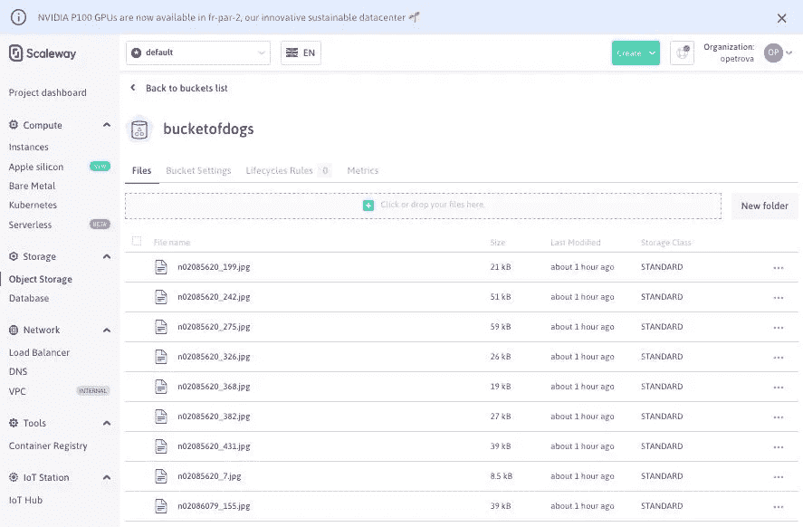
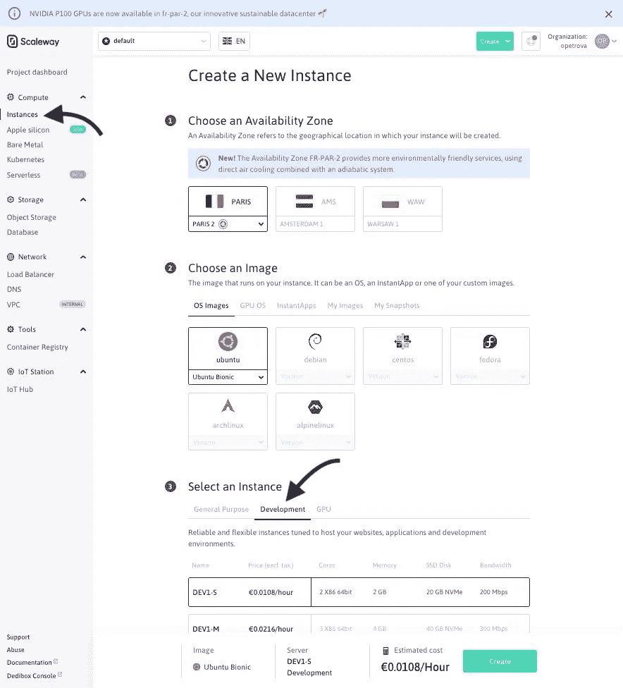
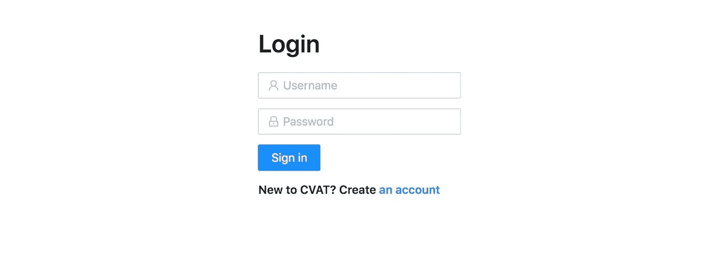
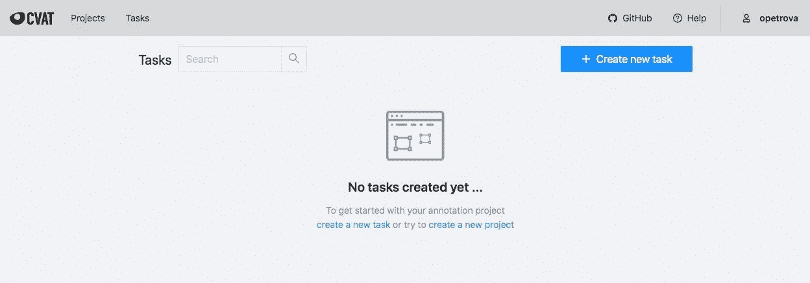
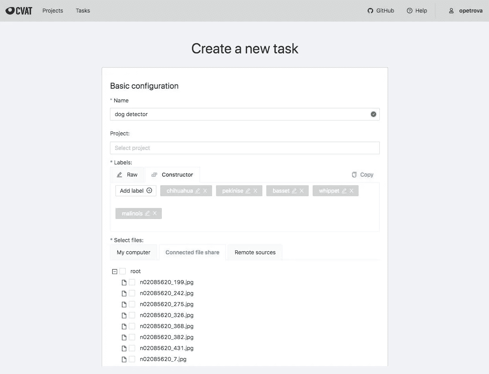
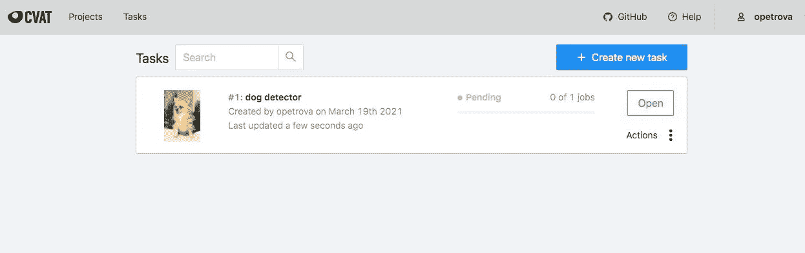
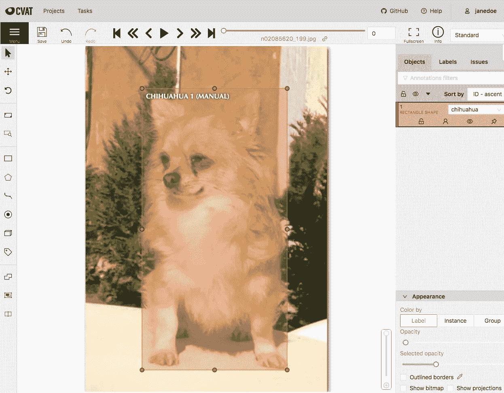
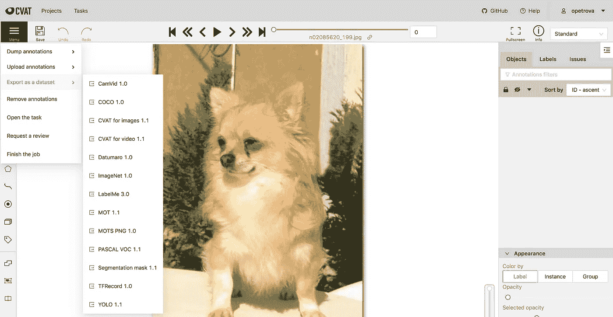

# 在云上安装 CVAT(英特尔的计算机视觉注释工具)

> 原文：<https://towardsdatascience.com/installing-cvat-intels-computer-vision-annotation-tool-on-the-cloud-c7759ae28f0e?source=collection_archive---------10----------------------->

## 计算机视觉项目的智能数据注释

*这篇文章的一个版本最初发表在* [*的 Scaleway 博客*](https://blog.scaleway.com/smart-data-annotation-for-your-computer-vision-projects-cvat-on-scaleway/) *上。*

在本文中，我们将了解如何使用开源的 [CVAT](https://github.com/openvinotoolkit/cvat) 工具，为存储在 S3 对象存储桶中的图像和视频文件建立一个数据注释平台。我们最终将得到一个运行在公共云上的 CVAT 服务器——也就是欧洲云提供商 Scaleway(然而，本教程的大部分内容也适用于您选择的其他提供商)。全面披露:这篇博文的作者目前是 Scaleway 的员工:-)他说

图片来源:[www.scaleway.com](https://blog.scaleway.com/smart-data-annotation-for-your-computer-vision-projects-cvat-on-scaleway/)

# 介绍

我们都听说过“*数据是新的石油*”这句话。数据无疑推动了许多最近的技术进步，但这种比较并不仅限于此。就像原油一样，数据在投入使用之前需要进行处理。处理阶段通常包括清理、各种转换以及手动注释，这取决于数据和用例。在计算机视觉和自然语言处理(NLP)领域，对后者的需求很高:换句话说，对人类来说最自然的数据格式，而不是最好以表格形式查看的结构化数据。手动数据注释是一个耗时且昂贵的过程。更糟糕的是，深度人工神经网络，即计算机视觉和 NLP 的当前技术水平，是需要最大数据量进行训练的算法。具有节省时间的外推功能和其他类型的自动化的高效注释工具，对机器学习项目生命周期中可以说是最关键的阶段有很大帮助:建立训练数据集。

CVAT(计算机视觉注释工具的缩写)是一个来自英特尔的开源图像和视频注释平台。它支持最常见的计算机视觉任务:图像级分类，以及对象检测和图像分割，其中图像上的感兴趣区域分别通过边界框和多边形(或像素)图像遮罩来选择。

通过不同的计算机视觉任务检测狗，从左到右:分类，物体检测，图像分割。照片由亚历山德拉·拉默林克在 [Unsplash](https://unsplash.com/s/photos/dog?utm_source=unsplash&utm_medium=referral&utm_content=creditCopyText) 上拍摄，由作者编辑

除了提供基于 Chrome 的注释界面和基本的用户管理功能，CVAT 还通过自动化部分流程减少了手动注释的数量。在这篇博文中，我们将重点讨论如何在 [Scaleway 公有云](https://www.scaleway.com/en/elements/?utm_source=medium&utm_medium=olga&utm_campaign=cvat/)上安装 CVAT。

## 云上的数据标注:为什么和如何？

在云上运行 CVAT 最直接的方式是简单地启动一个实例(由云提供商托管的虚拟机)，并遵循作为 CVAT 文档一部分的[快速安装指南](https://github.com/openvinotoolkit/cvat/blob/develop/cvat/apps/documentation/installation.md#quick-installation-guide)。安装完成后，您可以通过 SSH 隧道连接到实例来访问 CVAT，并在 Google Chrome 浏览器中转至 [localhost:8080](http://localhost:8080/) 。然后，您可以从本地服务器上传图像和视频，并继续进行注释，就像在本地安装时一样。

然而，以这种明显不清晰的方式进行，不会给你带来云计算的任何好处。首先，考虑您的数据存储。计算机视觉项目需要大量的训练数据，因此可扩展性和成本效益是必须的。[对象存储](https://www.scaleway.com/en/object-storage/?utm_source=medium&utm_medium=olga&utm_campaign=cvat)已经成为业界存储非结构化数据的首选方法。由于对要存储的文件的大小和数量几乎没有限制，大量的免费层(例如，Scaleway 每月提供 75GB 的免费对象存储)，以及确保数据安全性和可用性的高冗余性，很难想到更好的地方来存储“新石油”。

根据标注工作人员的规模，您可能还希望启用注记工具的自动缩放。目前，让我们假设您正在运行的数据注释操作是可管理的，运行 CVAT 的单个实例就足够了。尽管如此，您并不一定希望让每个注释者都可以通过 SSH 访问您的实例。这也是我们将在下一节讨论的内容。

# CVAT 在 Scaleway

## 收集资源

正如我们在上一节中所建立的，我们需要两个云资源来将我们的数据注释提升到下一个级别:一个对象存储桶和一个实例。下面是获得它们的一步一步的指南:

1.  如果你还没有，你需要创建一个账户并登录[console.scaleway.com](https://console.scaleway.com/?utm_source=medium&utm_medium=olga&utm_campaign=cvat)。
2.  为了 SSH 到您的 Scaleway 实例，您将需要[来创建一个 SSH 密钥](https://www.scaleway.com/en/docs/configure-new-ssh-key/?utm_source=medium&utm_medium=olga&utm_campaign=cvat)。为了安装供 CVAT 使用的对象存储，您还需要[来生成一个 API 密钥](https://www.scaleway.com/en/docs/generate-api-keys/?utm_source=medium&utm_medium=olga&utm_campaign=cvat)(当您这样做时，一定要记下访问密钥和秘密密钥，因为您很快就会需要它们)。
3.  现在是时候创建你的对象存储桶了！这可以通过 Scaleway 控制台中的`Storage` / `Object Storage`选项卡完成。

经许可，通过 Scaleway 获取图像

创建存储桶后，您可以添加想要标记的文件，例如通过 Scaleway 控制台提供的拖放界面。让我们在`bucketofdogs`里放一些狗的照片:

经许可，通过 Scaleway 获取图像

稍后您将需要的信息之一是`Bucket ID`。可以从上面的`Bucket Settings`选项卡中读取这个桶的 ID，但实际上它就是这个桶的名称(在我的例子中就是`bucketofdogs`)。

4.既然我们珍贵的狗狗照片被安全地存储在一个奇特的数据中心，我们将需要一个实例。如果你想利用 CVAT 的自动注释功能(这是另一篇博文的主题)，我建议你买一个高端的 GPU 实例。对于基本的手动注释用例，让我们从`dev`范围开始:

经许可，通过 Scaleway 获取图像

这是一个托管你的 CVAT 服务器的实例，每小时 1 欧分(或每月 7.30€)！

一旦您的实例被创建，您将到达它的`Overview`页面，在这里，除了其他内容，您将找到您的`Instance ID`。记下来。在同一个页面上，你会看到下面的 **SSH 命令** : `ssh root@[Public IP of your instance]`。此时，您应该使用它来 SSH 到您的实例，并继续安装 CVAT。

## 安装 CVAT

让我们从先决条件开始:

下一步是前面步骤中的`Bucket ID`和`API Key`派上用场的地方:

现在，您应该创建一个名为`docker-compose.override.yml`的文件(在当前的`cvat`文件夹中)，替换下面的实例 ID，并将以下内容粘贴到 YML 文件中:

现在剩下的就是启动 CVAT 并创建一个超级用户帐户(也就是可以访问 CVAT 站点的 Django 管理面板的用户):

# CVAT 图像注释

你可以在`<your instance ID from the instance information page>.pub.instances.scw.cloud:8080`访问你崭新的 CVAT 服务器。您可以使用您创建的超级用户帐户登录，也可以创建一个新帐户并使用它登录:

CVAT 截图

> 注意:截止到 2021 年 3 月，CVAT 的官方发行版设置为新创建的非管理员帐户可以立即访问机器上所有可用的注释任务。这些权限将在 CVAT 的未来版本中更新，但目前您可以使用 GitHub 问题 [1030](https://github.com/openvinotoolkit/cvat/issues/1030) 、 [1114](https://github.com/openvinotoolkit/cvat/issues/1114) 、 [1283](https://github.com/openvinotoolkit/cvat/issues/1283) 和 [2702](https://github.com/openvinotoolkit/cvat/issues/2702) 中提到的变通办法。同时，确保只将实例的链接给那些你不介意在你的服务器上访问 CVAT 的人。

登录后，您将能够看到您的实例上存在的注释任务列表:

CVAT 截图

当您尝试创建新任务时，您会发现您上传到对象存储桶的图像文件可从`Connected file share`选项卡访问:

CVAT 截图

现在，当您(或其他用户)登录 CVAT 时，新任务将会出现:

CVAT 截图

是时候贴标签了！

CVAT 截图

> 谁是好狗【探子】？

完成数据集的标注后，可以选择支持的格式导出注记:

CVAT 截图

# 下一步是什么？

CVAT 是一个强大的图像和视频注释工具，您刚刚了解了如何利用公共云的可扩展性和成本效益来增强其优势。在 Scaleway，我们目前正致力于帮助您更进一步地进行数据标注，通过一个管理标签平台来处理所有的细节，并提供最大程度的自动化过程。好奇想了解更多？注册获取我们的更新！

如果您对在 Scaleway 上使用 CVAT 有任何问题或反馈，我期待着在 [Scaleway Slack 社区](https://www.scaleway.com/en/docs/how-to-use-the-scaleway-slack-community/?utm_source=medium&utm_medium=olga&utm_campaign=cvat)中新创建的 **#AI** 频道听到您的意见。