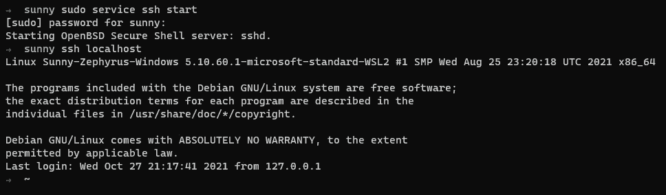
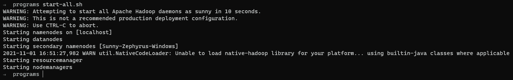
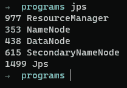
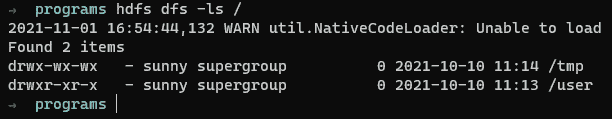

# 使用 WSL2 在 Windows 11 上安装 Hadoop

> 原文：<https://towardsdatascience.com/installing-hadoop-on-windows-11-with-wsl2-f11a585e41cf?source=collection_archive---------37----------------------->

## 如何在运行使用 WSL 1 或 2 的 Linux 发行版的 Windows 11 上安装和配置 Hadoop 及其组件。


来源: [Unsplash](https://unsplash.com/photos/oyXis2kALVg)

在之前的帖子中，我们看到了[如何使用 WSL2](https://blog.contactsunny.com/tech/installing-zsh-and-oh-my-zsh-on-windows-11-with-wsl2) 在 Windows 11 上安装 Linux 发行版，然后[如何安装 Zsh 和 on-my-zsh](https://blog.contactsunny.com/tech/installing-zsh-and-oh-my-zsh-on-windows-11-with-wsl2) 使终端更加可定制。在这篇文章中，我们将看到如何使用 WSL 在同一台 Windows 11 机器上安装完整的 Hadoop 环境。

# 安装依赖项

为了让 [Hadoop](https://blog.contactsunny.com/?s=hadoop) 工作，您需要安装两个重要的依赖项。这些不是可选的，除非你已经安装了它们。所以请确保安装了这些依赖项。

## 安装 JDK

第一个依赖项是 java 开发工具包，或 JDK。建议搭配 Java 8，或者 Hadoop 的 Java 1.8。这是我的建议，因为我在使用新版 Java 时遇到了问题。但是你绝对可以给新版本一个机会。

此外，不管你安装甲骨文 JDK 或打开 JDK，或任何其他版本的 JDK。你只需要安装它。我使用以下命令在我已经安装在 Windows 11 上的 Debian Linux 上安装了 JDK 8:

```
sudo apt install adoptopenjdk-8-hotspot
```

要使这个包在 apt 库中可用，首先需要添加 PPA。为此，请运行以下命令:

```
sudo add-apt-repository --yes [https://adoptopenjdk.jfrog.io/adoptopenjdk/deb/](https://adoptopenjdk.jfrog.io/adoptopenjdk/deb/)
```

一旦安装了 JDK，请确保使用环境变量名 JAVA_HOME 导出 JDK 的路径。导出命令如下所示:

```
export JAVA_HOME=/usr/lib/jvm/adoptopenjdk-8-hotspot-amd64/bin/java
```

如果您只是在终端中运行这个命令，那么该变量将只为当前会话导出。为了使其永久化，您必须将该命令添加到*中。zshrc* 文件。

## 安装 OpenSSH

下一个要安装的依赖项是 OpenSSH，这样 Hadoop 就可以通过 SSH 进入本地主机。这也是必要的依赖。如果没有 SSH 到 localhost，Hadoop 的大多数组件都无法工作。要安装 OpenSSH，请在终端中运行以下命令:

```
sudo apt install openssh-server openssh-client -y
```

一旦我们为 SSH 安装了服务器和客户机，我们就必须为认证生成密钥。为此，运行以下命令，并仔细阅读您将得到的说明:

```
ssh-keygen -t rsa -P '' -f ~/.ssh/id_rsa
```

生成密钥后，您必须将它们复制到授权密钥列表中，这样您就不必每次登录机器时都输入密码。这一点尤其重要，因为这是 Hadoop 所期望的。至少我还没有看到改变这种行为的选项。因此，运行下面的命令来 *cat* 我们刚刚创建的密钥文件的文件内容，然后将其复制到 *authorized_keys* 文件中:

```
cat ~/.ssh/id_rsa.pub >> ~/.ssh/authorized_keys
```

现在，确保公钥文件具有正确的权限。这是因为，如果密钥文件的公共访问比所需的多，系统会认为该密钥可以被复制或篡改，这意味着该密钥是不安全的。这将使系统拒绝该密钥，并且不允许 SSH 登录。因此，运行以下命令来设置正确的权限:

```
chmod 0600 ~/.ssh/id_rsa.pub
```

接下来，启动 SSH 服务，这样我们就可以测试服务器是否工作正常。为此，运行以下命令:

```
sudo service ssh start
```

如果一切都如预期的那样，你就安全了。最后，运行以下命令以确保 SSH 按预期运行:

```
ssh localhost
```

如果一切正常，您应该会看到类似下面的截图:



太棒了。您可以通过按 CTRL + d 组合键退出到上一个会话。这就结束了依赖项安装阶段。现在让我们继续安装 Hadoop。

# 安装 Hadoop

## 下载 Hadoop

安装 Hadoop 的第一步是实际下载它。截至本文撰写时，Hadoop 的最新版本是 3.3.1 版，你可以从[这里](https://hadoop.apache.org/releases.html)下载。你将从那里下载一个 *.tar.gz* 文件。要解压缩该文件，请使用以下命令:

```
tar xzf hadoop-3.3.1.tar.gz
```

这将创建一个名为 hadoop-3.3.1 的目录，并将所有文件和目录放在该目录中。因为我们将在本地机器上安装 Hadoop，所以我们将进行单节点部署，这也称为伪分布式模式部署。

## 设置环境变量

我们必须设置一些环境变量。最好的部分是，你只需要定制一个变量。其他的只是复制粘贴。无论如何，以下是我所说的变量:

```
export HADOOP_HOME=/mnt/d/bigdata/hadoop-3.3.1 
export HADOOP_INSTALL=$HADOOP_HOME 
export HADOOP_MAPRED_HOME=$HADOOP_HOME 
export HADOOP_COMMON_HOME=$HADOOP_HOME 
export HADOOP_HDFS_HOME=$HADOOP_HOME 
export YARN_HOME=$HADOOP_HOME 
export HADOOP_COMMON_LIB_NATIVE_DIR=$HADOOP_HOME/lib/native 
export PATH=$PATH:$HADOOP_HOME/sbin:$HADOOP_HOME/bin 
export HADOOP_OPTS"-Djava.library.path=$HADOOP_HOME/lib/nativ"
```

如您所见，您只需更改第一个环境变量 *HADOOP_HOME* 的值。将其设置为反映放置 Hadoop 目录的路径。同样，将这些*导出*语句放在*中也是一个好主意。zshrc* 文件，这样这些变量每次都会自动导出，而不是你必须这样做。一旦将它放入文件中，请确保您对其进行了源处理，以便它立即生效:

```
source ~/.zshrc
```

## 配置 Hadoop

接下来，我们必须编辑一些文件来更改各种 Hadoop 组件的配置。让我们从文件 *hadoop-env.sh* 开始。运行以下命令在编辑器中打开文件:

```
sudo vim $HADOOP_HOME/etc/hadoop/hadoop-env.sh
```

接下来，找到导出`***$JAVA_HOME***`变量的那一行并取消注释。这里，您必须提供与之前安装 Java 时相同的路径。对我来说，是这样的:

```
export JAVA_HOME=/usr/lib/jvm/adoptopenjdk-8-hotspot-amd64/bin/java
```

接下来，我们必须编辑 *core-site.xml* 文件。这里我们必须提供 Hadoop 的临时目录，以及 Hadoop 文件系统的默认名称。使用以下命令在编辑器中打开文件:

```
sudo vim $HADOOP_HOME/etc/hadoop/core-site.xml
```

您将在这里找到一个空文件，其中包含一些注释和一个空的配置块。您可以删除所有内容，并用以下内容替换:

```
<configuration>
    <property>
        <name>hadoop.tmp.dir</name>
        <value>/mnt/d/hdfs/tmp/</value>
    </property>
    <property>
        <name>fs.default.name</name>
        <value>hdfs://127.0.0.1:9000</value>
    </property>
</configuration>
```

请确保创建您在此配置的临时目录。接下来，我们必须编辑 HDFS 配置文件 *hdfs-site.xml* 。为此，使用以下命令在编辑器中打开文件:

```
sudo vim $HADOOP_HOME/etc/hadoop/hdfs-site.xml
```

在此配置文件中，我们将设置 HDFS 数据节点目录、HDFS 名称节点目录和 HDFS 复制因子。这里，您应该再次获得一个包含空配置块的文件。替换为以下内容:

```
<configuration>
  <property>
      <name>dfs.data.dir</name>
      <value>/mnt/d/hdfs/namenode</value>
  </property>
  <property>
      <name>dfs.data.dir</name>
      <value>/mnt/d/hdfs/datanode</value>
  </property>
  <property>
      <name>dfs.replication</name>
      <value>1</value>
  </property>
</configuration>
```

同样，确保您创建了数据节点和名称节点目录。接下来，我们有 MapReduce 配置文件。要在编辑器中打开它，请运行以下命令:

```
sudo vim $HADOOP_HOME/etc/hadoop/mapred-site.xml
```

您可以用以下内容替换配置块:

```
<configuration> 
  <property> 
    <name>mapreduce.framework.name</name> 
    <value>yarn</value> 
  </property> 
</configuration>
```

如您所见，这是一个指定 MapReduce 框架名称的简单配置。最后，我们有了 YARN 配置文件， *yarn-site.xml* 。使用以下命令在编辑器中打开文件:

```
sudo vim $HADOOP_HOME/etc/hadoop/yarn-site.xml
```

将以下配置添加到文件中:

```
<configuration>
  <property>
    <name>yarn.nodemanager.aux-services</name>
    <value>mapreduce_shuffle</value>
  </property>
  <property>
    <name>yarn.nodemanager.aux-services.mapreduce.shuffle.class</name>
    <value>org.apache.hadoop.mapred.ShuffleHandler</value>
  </property>
  <property>
    <name>yarn.resourcemanager.hostname</name>
    <value>127.0.0.1</value>
  </property>
  <property>
    <name>yarn.acl.enable</name>
    <value>0</value>
  </property>
  <property>
    <name>yarn.nodemanager.env-whitelist</name>   
    <value>JAVA_HOME,HADOOP_COMMON_HOME,HADOOP_HDFS_HOME,HADOOP_CONF_DIR,CLASSPATH_PERPEND_DISTCACHE,HADOOP_YARN_HOME,HADOOP_MAPRED_HOME</value>
  </property>
</configuration>
```

这种配置没有什么可改变的。最后，我们完成了 Hadoop 的配置。我们现在可以开始格式化名称节点并启动 Hadoop。

## 格式化 HDFS 名称节点

在第一次启动 Hadoop 服务之前，首先格式化 HDFS 名称节点非常重要。显然，这确保了 name 节点中没有垃圾。一旦您开始更频繁地使用 HDFS，您就会意识到您格式化名称节点的频率比您想象的要高，至少在您的开发机器上是这样。无论如何，要格式化名称节点，请使用以下命令:

```
hdfs namenode -format
```

一旦收到名称节点的关闭通知，格式化就完成了。

## 启动所有 Hadoop

最后，我们正处于这项活动的最佳阶段，开始使用 Hadoop。现在，根据您实际想要使用的组件，有许多启动 Hadoop 的方法。例如，你可以只开始纱，或 HDFS 随着它，等等。对于这项活动，我们将开始一切。为此，Hadoop 发行版提供了一个方便的脚本。因为您之前已经导出了一些环境变量，所以您甚至不需要搜索那个脚本，它已经在您的路径中了。只需运行以下命令并等待它完成:

```
start-all.sh
```

这将需要几秒钟的时间，因为脚本只是等待前 10 秒钟，如果您错误地启动了操作，它不会做任何事情来为您提供取消操作的选项。坚持一下，您应该会看到类似于以下屏幕截图的输出:



这告诉我们 Hadoop 的所有组件都已启动并运行。为了确保这一点，如果您愿意，您可以运行 *jps* 命令来获取所有正在运行的进程的列表。您至少应该看到以下服务:



仅此而已。您现在在 Windows 11 PC 上运行 Hadoop，使用的是 WSL 1 或 2 上的 Linux 发行版。为了确保这一点，您可以使用以下简单的 HDFS 命令:

```
hdfs dfs -ls /
```

该命令将列出 HDFS 根目录下的所有文件和目录。如果这是一个全新的部署，你应该找不到太多。您将得到一个类似如下所示的列表:



差不多就是这样。我们完了！

如果你喜欢你在这里看到的，或者在我的[个人博客](https://blog.contactsunny.com)和 [Dev。要写博客](https://dev.to/contactsunny)，并希望在未来看到更多这样有用的技术帖子，请考虑在 [Github](https://github.com/sponsors/contactsunny) 上关注我。

*最初发表于 2021 年 11 月 1 日 https://blog.contactsunny.com**的* [*。*](https://blog.contactsunny.com/data-science/installing-hadoop-on-windows-11-with-wsl2)