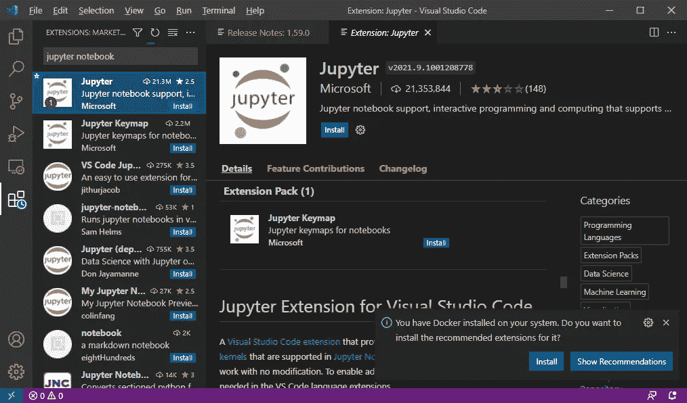
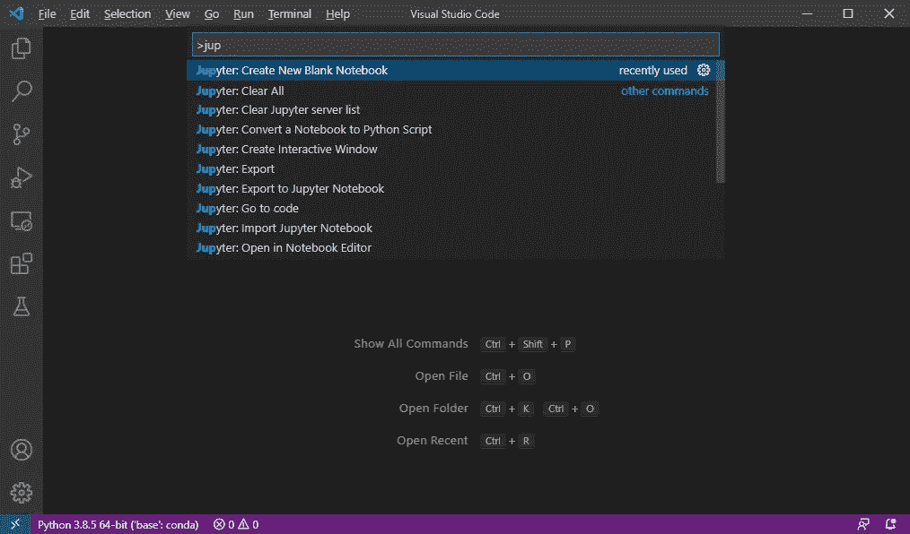
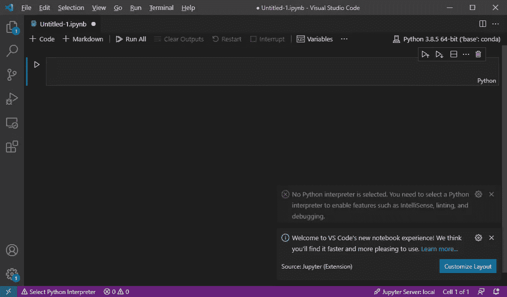
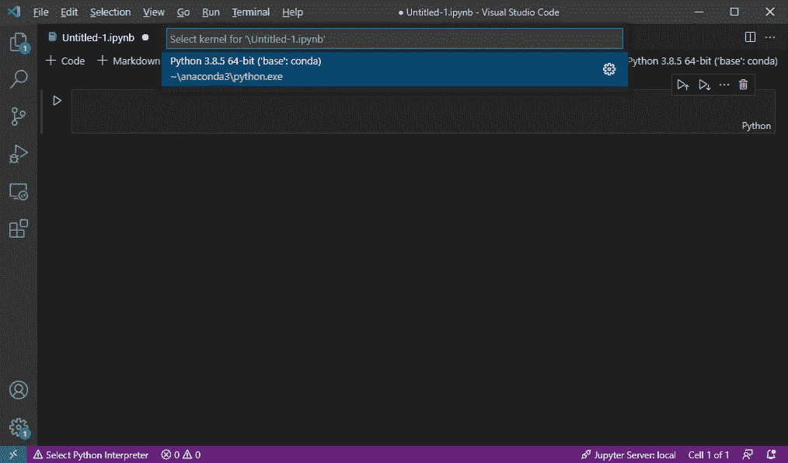
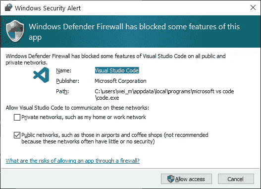
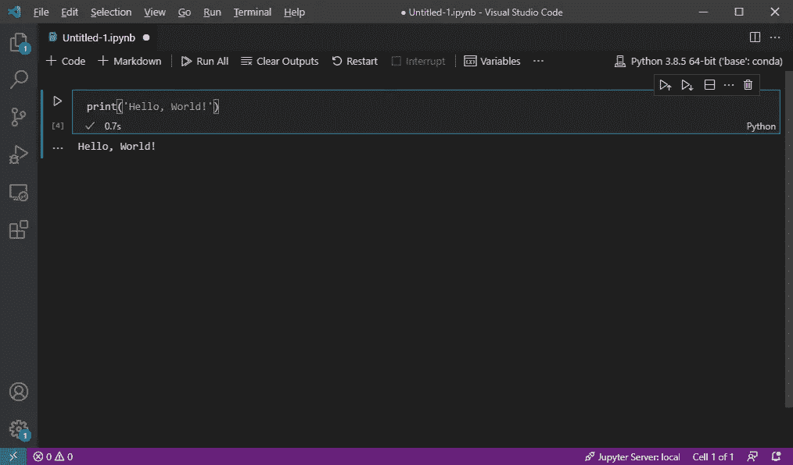
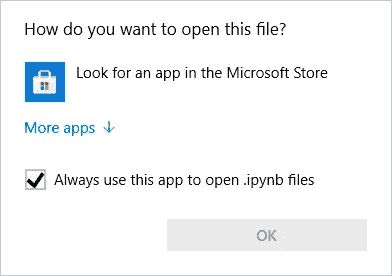
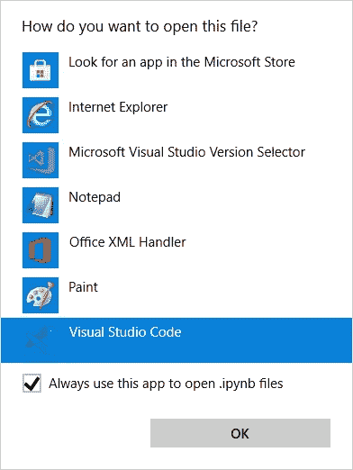

# 在 Visual Studio 代码中安装 Jupyter 笔记本支持

> 原文：<https://towardsdatascience.com/installing-jupyter-notebook-support-in-visual-studio-code-91887d644c5d?source=collection_archive---------3----------------------->

## 轻松打开。双击 ipynb 文件

在 [Unsplash](https://unsplash.com?utm_source=medium&utm_medium=referral) 上由 [René Teinze](https://unsplash.com/@tereneus?utm_source=medium&utm_medium=referral) 拍摄的照片

如果你是一名数据科学家(或者正在努力成为一名数据科学家)，你应该对 **Jupyter 笔记本**很熟悉。Jupyter Notebook 提供了一种便捷的方式，可以将 Python 代码(或其他语言)与 Markdown 文本结合到一个称为 Notebook 的画布上。Jupyter Notebook 的优势在于，它允许您轻松地选择性运行和修改部分代码，而无需运行整个程序。此外，您可以将格式化的文本(和图形)嵌入到您的文件中，从而使其他人可以轻松地直接阅读和修改您的代码。

但是，使用 Jupyter Notebook 需要启动内置的 Jupyter Notebook 服务器。并且您经常必须导航到包含您的。ipynb 文件，否则你将很难找到它们。

直到现在。现在可以在 **Visual Studio 代码** (VS 代码)中运行 Jupyter Notebook 了。在这篇短文中，我将向您展示如何在 VS 代码中安装 Jupyter Notebook 支持，以便您可以通过直接双击它并在 VS 代码中编辑它来打开一个. ipynb 文件。

# 假设

在本文中，我假设您的计算机上已经安装了 Python 和 Jupyter 包。达到这个要求最简单的方法是安装 Anaconda—[https://www.anaconda.com/products/individual-d](https://www.anaconda.com/products/individual-d)。

> 为什么已经安装了 Anaconda 还需要在 VS 代码中使用 Jupyter Notebook？这样做可以让你快速打开一个. ipynb 文件，而不需要启动 Jupyter 笔记本服务器。

# 安装 Jupyter 扩展

首先，启动你的 VS 代码，在扩展搜索框中输入“ *jupyter notebook* ”。选择第一个结果( **Jupyter** )并点击屏幕中间显示的 **Install** 按钮:

就是这样！一旦安装完成，您的 VS 代码中就已经有了 Jupyter Notebook。

# 创建新的 Jupyter 笔记本文件

要创建一个新的 Jupyter 笔记本文件，按下**Ctrl-Shift-P**(MAC OS 为 **Shift-Cmd-P** )调用**命令面板**。键入“ *Jup* ”，你会看到一个选项列表。选择 *Jupyter 笔记本:新建空白笔记本*:

将创建一个新的空白 Jupyter 笔记本:

# 选择内核

在运行您的笔记本之前，您需要通过点击窗口右上角的按钮来选择一个*内核*。对于我的机器，我将选择由 Anaconda 安装的 Python 版本:

> 一个笔记本**内核**是一个代码引擎，它执行笔记本文档中包含的代码。它使您能够在 Jupyter 笔记本上运行 Python 程序。

一旦你的内核被选中，你可能会看到一个 Windows 安全警告对话框。点击**允许访问**:

# 运行您的 Python 代码

现在，您可以通过编写一些 Python 语句来测试您的 Jupyter 笔记本。按 **Ctrl-Enter** 运行当前单元格，或按 **Shift-Enter** 运行当前单元格并移动到下一个单元格(如果当前单元格是笔记本中的最后一个单元格，将创建一个新单元格):

# 打开现有的。ipynb 文件

如前所述，安装 Jupyter Notebook 对 VS 代码的支持的好处是能够快速打开一个现有的。ipynb 文件。

当您双击现有的。ipynb 文件，将出现一个对话框。点击**更多应用**:

向下滚动列表，选择 **Visual Studio Code** 并点击 **OK** :

你的。ipynb 文件现在将在 Visual Studio 代码中打开。玩得开心！

# 结论

就我个人而言，我喜欢在我的浏览器上运行的原版 Jupyter 笔记本。但是，在很多情况下，我需要快速查看. ipynb 文件的内容。允许我查看我的。VS 代码的 ipynb 文件节省了我很多时间。试试看，让我知道你的经历！