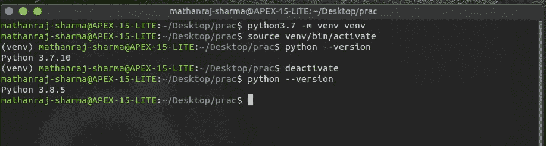

# 在 Ubuntu 20.04 上安装多个替代版本的 Python

> 原文：<https://towardsdatascience.com/installing-multiple-alternative-versions-of-python-on-ubuntu-20-04-237be5177474?source=collection_archive---------2----------------------->


PC:[freepik.com](https://www.freepik.com/free-vector/version-control-concept-illustration_7273248.htm#page=1&query=versions&position=0)

有时，您可能会使用不同版本的 python 同时处理不同的项目。通常使用 Miniconda 或 Anaconda 是最简单的解决方案，但是如果您的团队使用 python-venv 包来管理虚拟环境，那么您也需要遵循相同的约定。

在本文中，我将给出安装多个 python 版本的步骤，以及如何在不同版本之间切换并根据需要使用它们。

## 安装替代 Python 版本

在你做任何事情之前，打开你的终端，看看你的系统默认安装了哪个版本的 python。

```
python --version
```


PC:作者

如果你使用的是 Ubuntu 20.04，默认情况下你将拥有 python 版本。让我们安装 python 3.7，

```
sudo apt-get install software-properties-common# adding python repository 
sudo add-apt-repository ppa:deadsnakes/ppasudo apt update# install python 3.7
sudo apt install python3.7
```

要检查 python 3.7 是否安装正确，


PC:作者

但是如果你打印系统的 python 版本，它仍然是 python 3.8


PC:作者

那么我们怎么能说这个系统，使用了不同版本的 python 呢？

## 更新备选方案

我们可以使用 update-alternatives 命令为安装在 Ubuntu 系统中的同一软件的不同版本设置优先级。具有最高优先级的 Python 版本将被用作默认版本。

```
sudo update-alternatives --install /usr/bin/python python /usr/bin/python3.7 1sudo update-alternatives --install /usr/bin/python python /usr/bin/python3.8 2
```

在这里，我们将 3.7、3.8 版本的优先级设置为 1、2。由于版本 3.8 具有最高优先级，因此将被选为默认版本。

## 在不同版本之间切换

```
sudo update-alternatives --config python#select the number of python you want then enterpython --version
```


PC:作者

正如你现在看到的，python 版本是 3.7.10。您可以重复上述步骤，根据需要安装不同版本的 python，并根据需要设置优先级和使用它们。

要在 IDE 中使用这些 python 版本，请转到 IDE 的解释器设置，在那里您可以看到系统中可用的不同 python 版本。

## 使用不同版本的 python 创建虚拟环境

按照以下步骤，使用您想要的特定 python 版本创建一个虚拟环境

```
#if venv package for that version is not installed already
sudo apt install pythonX.x-venvpython -m venv venvsource venv/bin/activatepython --version
```



PC:作者

希望这篇文章对你有帮助！！！