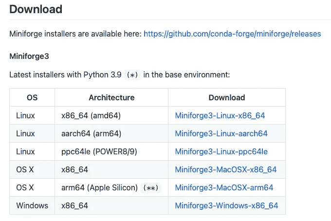
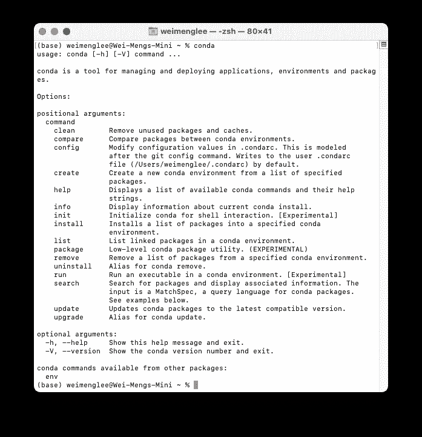
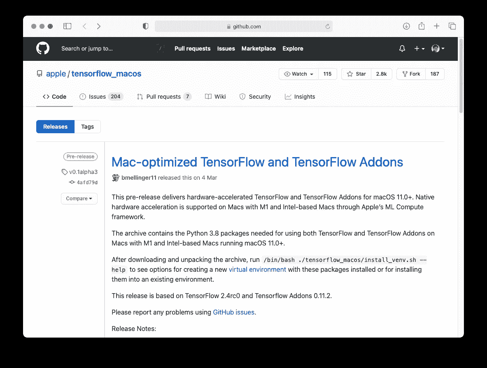
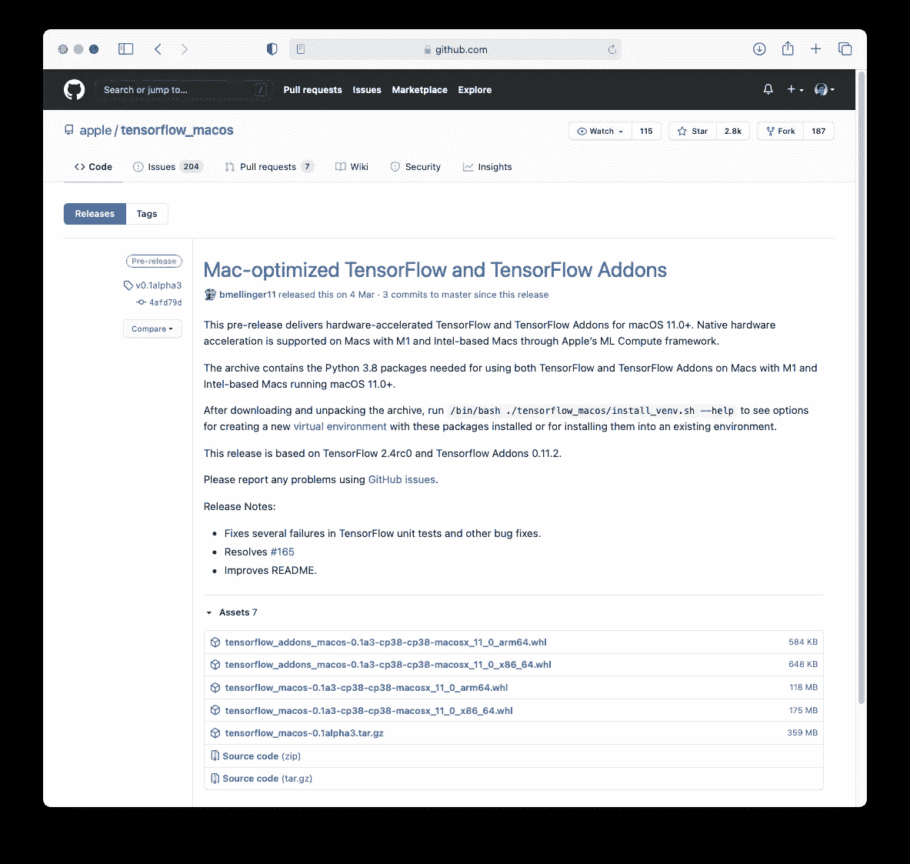
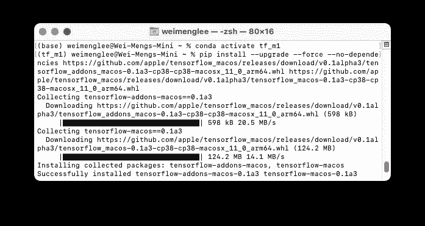
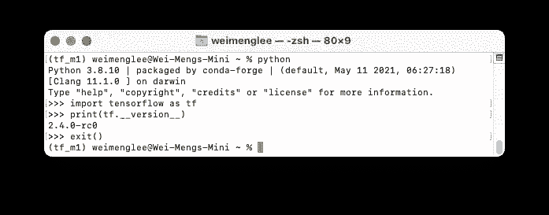
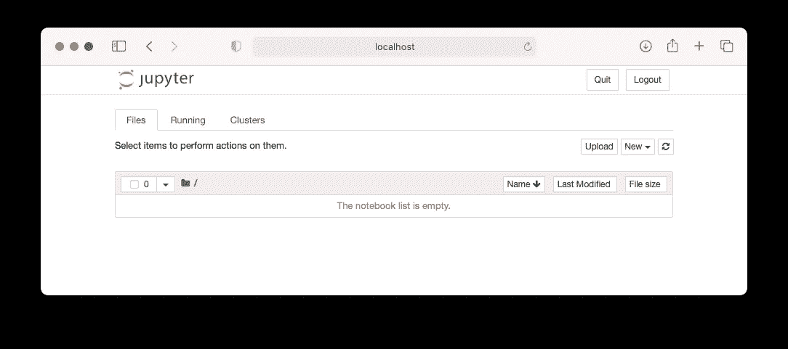

# 在 M1 Mac 上安装 TensorFlow

> 原文：<https://towardsdatascience.com/installing-tensorflow-on-the-m1-mac-410bb36b776?source=collection_archive---------1----------------------->

## 利用苹果的 ML 计算框架进行深度学习项目


在 [Unsplash](https://unsplash.com?utm_source=medium&utm_medium=referral) 上由 [Karthikeya GS](https://unsplash.com/@karthikeya_gs07?utm_source=medium&utm_medium=referral) 拍摄的照片

如果你是 Mac 用户，你可能有一台运行苹果芯片的最新机器。要在 M1 MAC 电脑上利用苹果的 ML 计算框架进行原生硬件加速，您需要安装苹果的硬件加速 TensorFlow 和用于 macOS 11.0+的 TensorFlow 插件。

本文将展示如何使用 **TensorFlow** 为开发深度学习项目准备你的 M1 Mac 电脑。此外，我将向您展示如何安装 Jupyter Notebook 以及您的深度学习项目所需的各种附加库。

> 苹果在 https://github.com/apple/tensorflow_macos/issues/153 维护了一个 Github 页面，详细说明了在 Conda 环境下安装 TensorFlow 的说明。我的文章提供了一步一步的说明。

一重要提示。在继续下面的说明之前，请确保您的 Mac 上没有安装 Anaconda。如果您已经安装了一个，只需从 Mac 上删除 Anaconda 文件夹即可卸载它。

# 1.Xcode

您需要安装的第一个工具是 Xcode，可从 Mac AppStore 获得:


# **2。命令行工具**

当你安装 Xcode 的时候，它也会安装**命令行工具**。但是如果您还没有安装它，下面的命令将会完成它:

```
$ **xcode-select --install**
```

# 3.小型锻造厂

不使用 **Anaconda** ，而是使用 **MiniForge** ，一个轻量级 Python 解释器，可以完全访问 conda 生态系统。

> C **onda** 是一个运行在 Windows、Mac OS 和 Linux 上的开源包和环境管理系统。

你可以从[https://github.com/conda-forge/miniforge](https://github.com/conda-forge/miniforge)下载**迷你锻造**。



对于 M1 Mac，点击**miniforge 3-ma cosx-arm 64**项目(上表倒数第二)。下载完成后，启动**终端**并转到包含**Miniforge 3-ma cosx-arm 64 . sh**文件的目录，然后使用 **bash** 命令，如下所示，安装 **Miniforge** :

```
$ **bash Miniforge3-MacOSX-arm64.sh**
```


系统将提示您接受许可协议。接受它们并继续安装。安装完成后，关闭终端。

# 4.创造康达环境

在新的终端窗口中，通过键入以下命令启动 **conda** :

```
$ **conda**
```

您将看到以下内容:



要在苹果的 M1 机器上安装 TensorFlow，首先从[https://raw . githubusercontent . com/mwidjaja 1/DSOnMacARM/main/environment . yml](https://raw.githubusercontent.com/mwidjaja1/DSOnMacARM/main/environment.yml)下载**环境. yml** 文件。

该文件包含创建 Python 环境的指令，该环境具有您需要的依赖项。要为 TensorFlow 创建新环境，请转到包含 **environment.yml** 文件的目录:

```
$ **cd Downloads**
```

然后，键入以下命令:

```
$ **conda env create --file=environment.yml --name tf_m1**
```

**tf_m1** 是我选择的新环境名。请随意将其更改为您自己想要的名称。现在，您可以激活新创建的环境:

```
$ **conda activate tf_m1**
```

# 5.为 macOS 安装 TensorFlow 和 TensorFlow 插件

Apple 的 TensorFlow 库列表可在:[https://github.com/apple/tensorflow_macos/releases](https://github.com/apple/tensorflow_macos/releases)获得:



在撰写本文时，目前有三个可用版本:

*   v 0.1 阿尔法 3
*   v 0.1 阿尔法 2
*   v 0.1 阿尔法 1

选择最新版本( **v0.1aplha3** )将引导您进入此页面:[https://github . com/apple/tensor flow _ MAC OS/releases/tag/v 0.1 aplha 3](https://github.com/apple/tensorflow_macos/releases/tag/v0.1alpha3):



观察并复制两个文件的链接:

*   [**tensor flow _ addons _ MAC OS-0.1 a3-cp38-cp38-ma cosx _ 11 _ 0 _ arm 64 . whl**](https://github.com/apple/tensorflow_macos/releases/download/v0.1alpha3/tensorflow_addons_macos-0.1a3-cp38-cp38-macosx_11_0_arm64.whl)—[https://github . com/apple/tensor flow _ MAC OS/releases/download/v 0.1 alpha 3/tensor flow _ addons _ MAC OS-0.1 a3-cp38-cp38-ma cosx _ 11 _ 0 _ arm 64 . whl【中](https://github.com/apple/tensorflow_macos/releases/download/v0.1alpha3/tensorflow_addons_macos-0.1a3-cp38-cp38-macosx_11_0_arm64.whl)
*   [**tensor flow _ MAC OS-0.1 a3-cp38-cp38-ma cosx _ 11 _ 0 _ arm 64 . whl**](https://github.com/apple/tensorflow_macos/releases/download/v0.1alpha3/tensorflow_macos-0.1a3-cp38-cp38-macosx_11_0_arm64.whl)——[https://github . com/apple/tensor flow _ MAC OS/releases/download/v 0.1 alpha 3/tensor flow _ MAC OS-0.1 a3-cp38-cp38-ma cosx _ 11 _ 0 _ arm 64 . whl](https://github.com/apple/tensorflow_macos/releases/download/v0.1alpha3/tensorflow_macos-0.1a3-cp38-cp38-macosx_11_0_arm64.whl)

在 **tf_m1** 环境中，您现在可以使用以下命令安装上述两个库:

```
$ **pip install --upgrade --force --no-dependencies https://github.com/apple/tensorflow_macos/releases/download/v0.1alpha3/tensorflow_addons_macos-0.1a3-cp38-cp38-macosx_11_0_arm64.whl https://github.com/apple/tensorflow_macos/releases/download/v0.1alpha3/tensorflow_macos-0.1a3-cp38-cp38-macosx_11_0_arm64.whl**
```



一旦安装了这两个库，您就可以通过启动 **Python** 然后导入 **TensorFlow** 并打印出其版本号来测试 **TensorFlow** :



如果以上操作成功，您的 TensorFlow 现在已正确安装在您的 M1 Mac 上。

# 6.安装其他基本库

除了安装 TensorFlow 库，您很可能需要安装其他库，如 **matplotlib** 、 **sklearn** 、 **OpenCV** 、 **Pandas** 等。因此，请继续安装它们，如下所示:

```
$ **conda install -c conda-forge matplotlib -y**
$ **conda install -c conda-forge scikit-learn -y**
$ **conda install -c conda-forge opencv -y**
$ **conda install -c conda-forge pandas -y**
```

**-y** 选项省去您在安装库时回答确认的麻烦。

# 7.安装 Jupyter 笔记本电脑

最后，您可能希望安装 Jupyter 笔记本:

```
$ **conda install notebook -y**
```

就是这样！测试 Jupyter 笔记本安装是否正确:

```
$ **jupyter notebook**
```

如果你能看到以下内容，你就万事俱备了！



# 一些问题

如果您尝试加载已保存的模型:

```
from tensorflow.keras.models import load_modelmodel = load_model('trained_model.h5')
```

您可能会遇到以下错误:

```
AttributeError: 'str' object has no attribute 'decode'
```

原来在内部， **load_model()** 使用的是更新版本的 **h5py** 模块。要解决这个问题，您可以使用以下命令将 **h5py** 的版本降级到版本 2.10.0:

```
$ **pip install 'h5py==2.10.0' --force-reinstall**
```

在 M1 Mac 上享受 TensorFlow 带来的美好时光！

## 如果你喜欢阅读我的文章，并且认为它对你的职业/学习有所帮助，请考虑注册成为一名灵媒会员。每月 5 美元，你可以无限制地访问 Medium 上的所有文章(包括我的)。如果你使用下面的链接注册，我会赚一小笔佣金(不需要你额外付费)。你的支持意味着我将能够投入更多的时间来写这样的文章。

[](https://weimenglee.medium.com/membership) [## 加入媒介与我的介绍链接-李伟孟

### 作为一个媒体会员，你的会员费的一部分会给你阅读的作家，你可以完全接触到每一个故事…

weimenglee.medium.com](https://weimenglee.medium.com/membership)