# 安装 Ubuntu 20.04 LTS 并在其上运行 YOLOv4 和 YOLOv5。

> 原文：<https://towardsdatascience.com/installing-ubuntu-20-04-lts-and-running-yolov4-and-yolov5-on-it-2ca0c93e244a?source=collection_archive---------11----------------------->

## [实践教程](https://towardsdatascience.com/tagged/hands-on-tutorials)

## 运行对象检测模型的初学者指南

> 我最近有了一台游戏笔记本电脑，联想 Ideapad Gaming 3，并决定用它来进行一些计算机视觉工作。我一点也不知道我将要经历的麻烦。我决定写这篇文章，以便让这个过程对其他人来说更容易、更直接。

由[约书亚·雷德科普](https://unsplash.com/@joshuaryanphoto?utm_source=unsplash&utm_medium=referral&utm_content=creditCopyText)在 [Unsplash](https://unsplash.com/s/photos/coding?utm_source=unsplash&utm_medium=referral&utm_content=creditCopyText) 上拍摄的照片

联想 Ideapad Gaming 3 锐龙 5 4600H 于 2021 年 1 月上市。我最初尝试在上面安装 Ubuntu 18.04 LTS，因为我已经在上面工作了很长时间，但由于它的旧内核，我遇到了 wifi 适配器，触摸板，功能键等几个问题。而不是更新它的内核，我认为是时候转移到新的。18.04 LTS 支持将于 2023 年结束，在技术领域，你需要不断更新自己。

我的目标是在对象检测模型 **YOLO** (你只看一次)上运行推理，并在其上训练一个定制数据集。我以前在 Ubuntu 18.04 LTS 上使用过 YOLOv4，所以我选择在新的操作系统上尝试，同时也探索新的，所谓的 YOLOv5。

# 安装 Ubuntu 20.04 LTS

推荐的最低系统要求:

1.  2 GHz 双核处理器
2.  4 GiB Ram (1 GiB 也可以工作)
3.  25 GB 硬盘空间
4.  支持 1024x768 屏幕分辨率的 VGA
5.  用于安装程序介质的 CD/DVD 驱动器或 USB 端口
6.  建议上网

我有一个 Windows 10 的双启动配置。我用 [**Rufus**](https://rufus.ie/en/) 创建了一个可引导设备。保持分区方案与您的硬盘配置相同。我的是 GPT。保持文件系统为 FAT32。你可以从它的 [*官网*](https://ubuntu.com/download/desktop) 下载 Ubuntu 20.04 LTS 的 ISO 镜像。

创建可引导设备后，重新启动系统并从该设备引导。通常打开启动选项的键是 esc+F5 或 esc+F12，但是您可以在网上搜索您的系统的组合键。启动后，继续使用 Ubuntu(第一个选项)。

您可以从 [*到*](https://www.tecmint.com/install-ubuntu-20-04-desktop/) 按照其余步骤进行安装。我强烈建议您连接互联网，并在安装过程中选择安装第三方软件的选项。

如果使用 GPT 分区方案，那么创建主分区还是逻辑分区就无关紧要了。如果是 MBR 你可以参考 [*这个网页*](https://askubuntu.com/questions/121197/ubuntu-installation-partitioning-logical-or-primary) 更好的理解。对于给分区分配磁盘空间，我建议给*根*分配 100–150 GB 的空间(尽管 50 GB 也可以)。通常两倍于当前 RAM 的内存被分配给交换区。我建议至少要有和你现在的 RAM 容量一样多的内存。其余的你可以设置到你的 *home* 目录下。只保留根目录和主目录可以使系统简单有效地使用。要了解更多选项，请参考 [*本网页*](https://askubuntu.com/questions/343268/how-to-use-manual-partitioning-during-installation) *。*

安装完成后，如果您的笔记本电脑型号是最近发布的，您可能会面临一些硬件问题。在我的情况下，我的触摸板不工作。它需要一个 HID 兼容的设备驱动程序。除了 windows 之外，联想没有提供太多的操作系统支持，所以新的驱动程序可能会包含在未来的 Ubuntu 内核版本中。您可以尝试更新您的内核来解决这些问题，或者在 web 上寻找特定的解决方案。对我来说， [*这个*](https://askubuntu.com/a/1276453) 在一定程度上解决了我的问题。

# 为 YOLO 配置系统

要用 GPU 运行 YOLO，我们需要合适的驱动程序。转到“软件和更新”并在“附加驱动程序”中安装驱动程序。

如果你遇到任何问题，你也可以从命令行安装驱动程序。在和处，按照[和*的指示进行操作。*](https://linuxize.com/post/how-to-nvidia-drivers-on-ubuntu-20-04/)

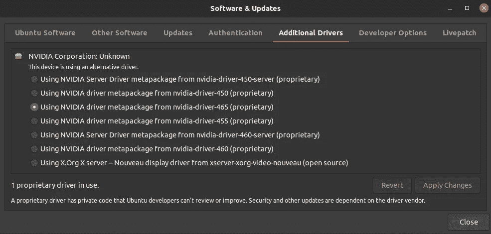

如果从这里安装，然后，如果任何驱动程序显示(专有的，测试)选择它。否则，如果通过 cmd 安装，选择显示**推荐**的一个。*图片作者。*

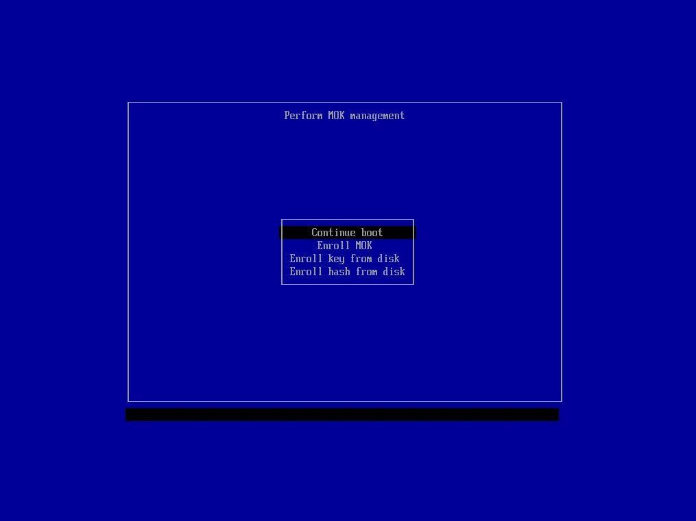

我的 MoK 菜单截图。*图片作者。*

在安装 nvidia 驱动程序的过程中，您将被要求设置安全启动的密码，这将是在更新 MoK 设置时需要的。设置密码，并在重新启动时，从 MoK 菜单中选择第二个选项(登记|MoK ),如图所示。重启后，在终端运行命令`$ nvidia-smi`来验证驱动安装。

为了以最佳方式运行 YOLO，我们需要在系统中包含以下内容:

*   图形处理单元
*   Cuda 工具包
*   cuDNN (Cuda 神经网络库)
*   OpenCV

我们已经为 GPU 安装了驱动程序。接下来我们需要安装 CUDA 工具包。我的驱动版本是 465.19.01，CUDA 版本是 11.3。因此，我很自然地安装了 cuda toolkit 的最新版本 11.3 和相应的 cuDNN，并尝试使用它们运行 YOLOv4，但令我沮丧的是，我遇到了以下错误:

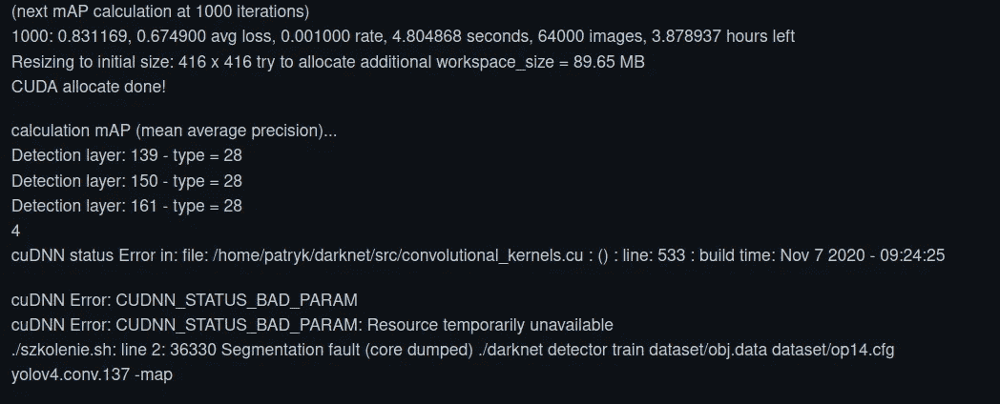

我在使用 cuda toolkit 11.3 运行 YOLOv4 时遇到的错误截图。*作者图片。*

该错误的一个解决方法是在训练时移除`-map`，修改`src/detector.c`以每 1000 或 2000 次迭代保存权重，并使用`./darknet detector map.`测试权重，但这不应该是这种情况，如果忽略，该错误的原因可能会导致未来更多的错误。所以经过一些研究，我知道 **darknet** 不支持 CUDA Toolkit 11，正如 YOLOv4 的作者之一 Alexey Bochkovskiy 所说，他本人 [*在这里*](https://github.com/AlexeyAB/darknet/issues/7153#issuecomment-809022501) 。它与 cuda 工具包 10 一起工作。1 和 cuDNN 7。6 .5.

于是我下载安装了 CUDA 10。1 update2 和 cuDNN v7.6.5 来自官方 [*nvidia 网站*](https://developer.nvidia.com/) 。我不能直接发布这些库的链接，因为 nvidia 不允许。您需要创建一个开发人员帐户，然后能够访问和下载文件来安装它们。选择要安装 cuda 的系统配置后，安装说明会在网页上给出。如果你在安装过程中遇到任何问题，像我曾经遇到的这个错误`E: Unable to correct problems, you have held broken packages`可能是由于以前的 CUDA 安装，你应该尝试使用 **aptitude** 而不是 apt-get 来安装，如这里的<https://askubuntu.com/a/451078>*所示。它不仅为您处理降级冲突包，还会提出一系列建议，询问您在众多可能的建议工作场景中，您愿意选择哪一个。一旦安装完毕，您需要将路径添加到 **PATH** 变量中。阅读安装说明末尾的 cuda 安装指南，并遵循安装后的操作。完成后，使用`$ source ~/.bashrc`重新加载 bash 文件。您可以使用`$ nvcc --version`从终端验证安装。*

*对于 cuDNN 安装，请从 nvidia 官方网站下载 cuDNN v7.6.5 for CUDA 10.1，cuDNN Library for Linux，这是一个 tar 文件，并遵循 nvidia cudnn 安装指南网页上针对 7.6.5 版给出的说明。要验证和检查其版本，打开终端并运行`$ which nvcc`。它将向您展示 CUDA 工具包的安装路径。使用*path*并运行命令`$ cat *path*/include/cudnn.h | grep CUDNN_MAJOR -A 2`。结果将描述版本。我的情况是:*

*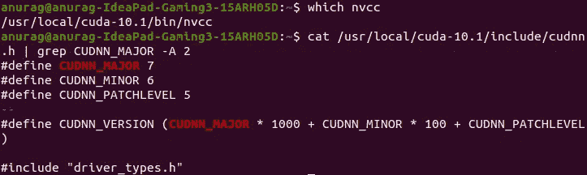*

*也就是说版本是 7.6.5。*图片作者。**

*现在你还必须检查你安装的 **gcc** (GNU 编译器集合)与你的 CUDA 工具包版本的兼容性。使用`$ gcc --version`从终端检查您的 gcc 版本。要查看它是否兼容，如果不兼容，如何安装 max 支持的版本，请遵循此处 提供的 [*步骤。*](https://stackoverflow.com/a/46380601)*

*所有这些过程完成后，设置应该如下所示:*

*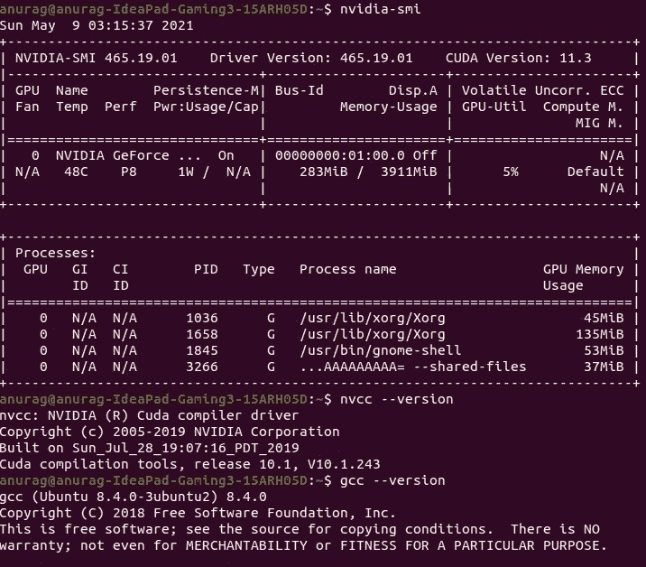*

*NVIDIA 驱动 465，CUDA 工具包 10.1，cuDNN v7.6.5，gcc 8.4。*图片作者。**

*现在，要安装 OpenCV(开源计算机视觉库)，按照 [*本文*](https://linuxize.com/post/how-to-install-opencv-on-ubuntu-20-04/) 中提供的步骤操作。从源代码构建 OpenCV，并通过打印版本来验证安装。现在我们都设置好运行 ***了，你只需要在我们的机器上看一次*** 。*

# *YOLOv4*

*YOLOv4 是一个实时的物体检测系统，它可以识别单个外壳中的各种物体。该实时识别系统可以从特定图像中识别几个对象，在对象附近框出一个边界有限的框，并在生产系统中快速训练和实现。*

*网上很少有 YOLO 算法的实现。Darknet 就是这样一个用 C 和 CUDA 编写的开源神经网络框架，它是 YOLO 的基础。暗网被用作训练 YOLO 的框架，这意味着它设置了网络的架构。Darknet 的第一作者是 YOLO 本身的作者，<https://pjreddie.com/>**。***

# ***要在您的系统上运行 YOLOv4，请按照下列步骤操作:***

*   ***为 yolov4 创建一个目录，并在其中克隆 [*github 仓库*](https://github.com/AlexeyAB/darknet.git) 。为此，在目录中打开一个终端并运行`$ git clone [https://github.com/AlexeyAB/darknet.git](https://github.com/AlexeyAB/darknet.git)`。***
*   ***通过终端访问 darknet 文件夹，并使用命令`$ gedit Makefile`编辑 Makefile。将 **GPU** 、 **CUDNN** 和 **OPENCV** 的值改为 1。向下滚动并注释默认的 **ARCH** 值，取消注释与您的 GPU 配置匹配的 ARCH 值。我的情况是这样的:***

***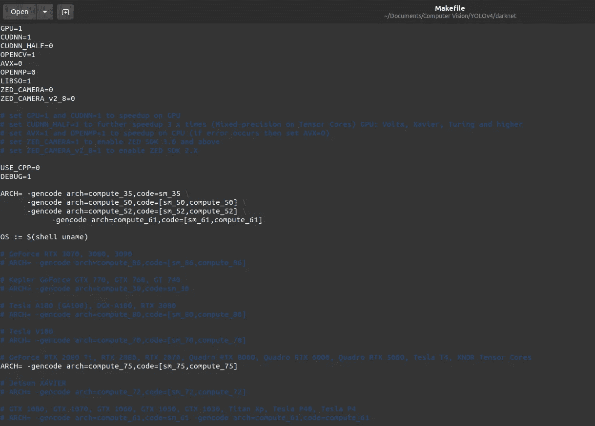***

***使用 GTX 1650 GPU 在我的本地系统上运行 YOLOv4 推理的 Makefile 配置。你可以去掉通用的 ARCH=(第一个)，只为你的显卡取消注释 ARCH=。*图片作者。****

*   ***在 Makefile 中进行所需的更改后，在终端中运行命令`$ make`。它会在你的系统中建立暗网。你可能会遇到一些关于库的问题，比如，在我的例子中，我遇到了这个错误:`Error while loading shared libraries: lcublas: cannot open shared object file: No such file or directory`。要解决此类与库相关的问题，请从新的终端运行`$ sudo nautilus`，以 root 身份打开文件资源管理器，并导航到 */usr/local* 。你会看到两个文件夹 *cuda-10.1* 和 *cuda-10.2。*导航到*cuda-10.2/targets/x86 _ 64-Linux*，将其中存在的两个文件夹' *include'* 和' *lib'* 的内容复制到*cuda-10.1/targets/x86 _ 64-Linux*中对应的同名文件夹中。`$ make`现在应该跑了。***
*   ***一旦构建了 darknet，下一步就是下载 YOLOv4 预训练的权重来运行推理。你会在 [*AlexeyAB 的 github*](https://github.com/AlexeyAB/darknet/releases/download/darknet_yolo_v3_optimal/yolov4.weights) 里找到。在你的终端的暗网目录下，运行命令`$ wget [https://github.com/AlexeyAB/darknet/releases/download/darknet_yolo_v3_optimal/yolov4.weights](https://github.com/AlexeyAB/darknet/releases/download/darknet_yolo_v3_optimal/yolov4.weights)`。它会将重量文件下载到您的暗网目录中。***
*   ***现在，您可以使用命令`$ ./darknet detector test cfg/coco.data cfg/yolov4.cfg yolov4.weights data/dog.jpg`对测试图像进行物体检测推断。您应该记得，在配置 **Makefile** 时，我们没有将‘cud nn _ HALF’的值更改为 1。你最初可以将`$ make` darknet 设置为 1，如果出现了一些问题，比如我的输出中没有边界框，你可以将它重新设置为 0，`$ make` darknet 并运行推理。***
*   ***您可以在名为“predictions.jpg”的 darknet 目录中查看不同类上的边界框的结果输出。***

***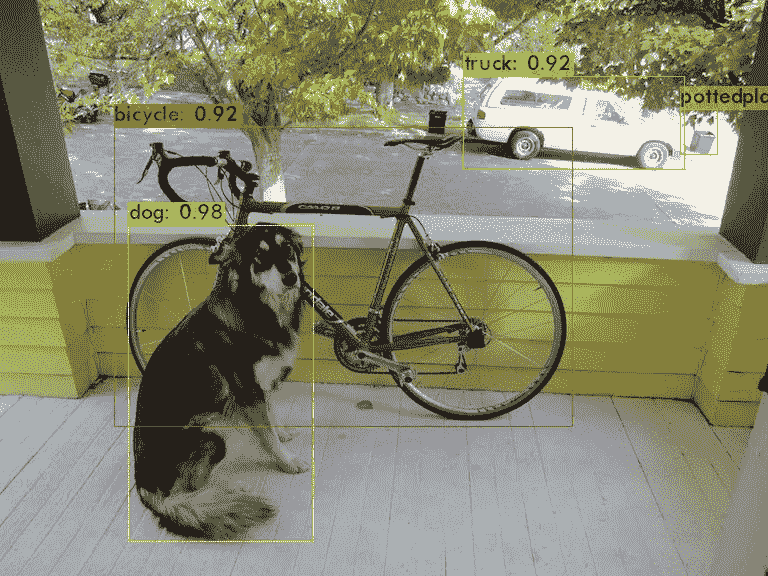***

***predictions.jpg . Original 是 YOLOv4 存储库中提供的一个示例图像。***

# ***要在您的系统中训练 YOLOv4 上的自定义数据集，请按照下列步骤操作:***

*   ***据了解，到目前为止你已经完成了所有的步骤。现在，为了训练自定义数据集，您首先需要一个数据集。计算机视觉领域中的数据集主要指带注释的图像，即具有相应文本文件的一系列图像，该文本文件包含关于检测到的对象类别和以像素为单位的边界框坐标的信息。***
*   ***YOLO 为检测到的对象遵循的注释格式为***

***`<object-class> <x_center> <y_center> <width> <height>`，其中:***

***▹ `<object-class>`是一个从 0 到(类的数量-1)的整数类 id。***

***▹ `<x_center> <y_center> <width> <height>` —是相对于图像的宽度和高度的浮点值**，可以在[0，1]之间变化。*****

***比如:`<x> = <absolute_x> / <image_width>`或者`<height> = <absolute_height> / <image_height>`***

***▹需要注意的是，`<x_center> <y_center>` -是矩形的中心(不是包围盒的左上角)。***

*   ***一个例子就是，`1 0.716797 0.395833 0.216406 0.147222`。***
*   ***您可以按照 [*中的步骤来创建一个自定义数据集。YOLOv3 和 YOLOv4 的图像和标签格式相同，因此这些步骤都是有效的。*](https://youtu.be/_4A9inxGqRM)***
*   ***一旦完成，你应该有两个文件夹的图像和相应的注释。一个包含训练数据，另一个包含验证数据。***
*   ***将训练数据集文件夹重命名为 **obj** (包含所有训练图像的文件夹)，将验证数据集文件夹重命名为 **test** 。***
*   ***接下来，我们修改我们的配置文件。您可以修改 darknet 文件夹内 cfg 文件夹中的 **yolov4-custom.cfg** 文件，或者新建一个。cfg 文件。AlexeyAB 给出的指令是 [*这里是*](https://github.com/AlexeyAB/darknet#how-to-train-to-detect-your-custom-objects) 。注意事项:***

***▹建议有**批次= 64** 和**细分= 16** 但是如果你面临问题，那么增加细分到 32。这意味着训练将在批量大小的批次中进行，即模型将一次加载用于训练的批量图像，并且这将进一步细分为子部分以进行最佳处理。***

***▹ **max_batches** 最小应为 6000。***

***▹在三个 YOLO 层中更改参数为 **classes = 1** (或者在您的情况下为类的数量)，在 YOLO 层之前的三个卷积层中更改参数为 **filters = 18** (根据您的使用情况更改)。***

***▹:如果你面临内存问题或者发现训练时间太长，你可以在三个 YOLO 层中的每一层设置 **random = 0** 。它用于缩放不同大小的图像，因此会占用内存空间。***

***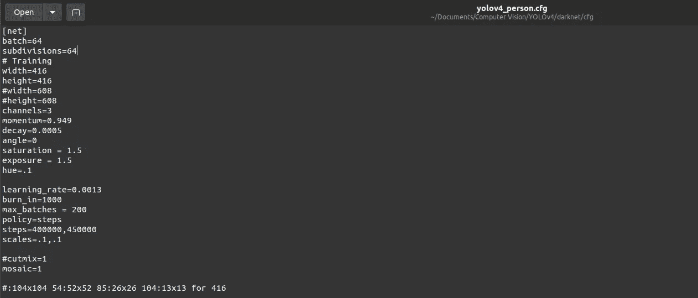***

***的配置。在我的系统上试运行的 cfg 文件(因此 max_batches = 200)。*图片作者。****

*   ***接下来，您创建一个文本文件，在新的一行中包含您的类名，将其命名为 **obj.names** ，并将其放在 **data** 文件夹中。您可以根据自己的意愿重命名这些类，但是名称的顺序必须与您为下载图像的工具包创建的 **classes.txt** 的顺序相同，因为该顺序是我们的标签将保持的。***
*   ***现在我们需要创建两个文本文件，包含所有训练图像和测试图像的位置。您可以使用 [*这个库*](https://github.com/theAIGuysCode/YOLOv4-Cloud-Tutorial/tree/master/yolov4) 中的 generate_train.py 和 generate_test.py python 代码来轻松完成这项任务。只需将它们下载到您的 darknet 文件夹中并运行它们。将 train 和 validation 文件夹命名为 obj 并测试这些代码是否工作是很重要的，因为它们是硬编码的。***
*   ***一旦上述步骤完成，您将拥有两个文本文件 **test.txt** 和 **train.txt** ，它们分别包含 test 和 obj 的每个图像的目录，在一个新行中。现在，我们创建我们的 **obj.data** 文件，该文件将包含关于类的数量、训练集、验证集、类名和保存我们的模型数据(权重文件)的备份文件夹的信息。备份文件夹很重要，因为在我们的训练期间，每 100 次迭代(作为 yolov4_last.weights)更新的权重会保存在这里，每 1000 次、最佳和最终权重也是如此。因此，即使经过几个小时的训练，如果我们的计划突然终止，所有的进展并没有失去。该文件的一个示例是:***

***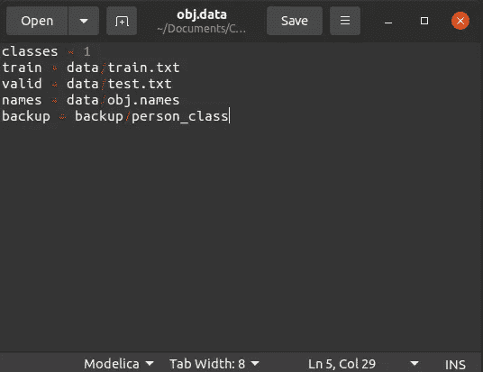***

***obj.data 文件示例。*图片作者。****

*   ***在我们开始训练我们的模型之前，最后一步是下载卷积层的预训练权重，您可以在这里找到<https://github.com/AlexeyAB/darknet/releases/download/darknet_yolo_v3_optimal/yolov4.conv.137>*。即使类别变化很大，预先训练的权重也被证明比随机权重更好。****
*   ****我们现在准备将我们的模型用于训练。其语法是:`./darknet detector train <path to obj.data> <path to custom config> <weight file> -map`。比如:`./darknet detector train data/obj.data cfg/yolov4_custom.cfg yolov4.conv.137 -map`。****
*   ****如果您没有验证集，请不要使用`-map`，因为它会使用迄今为止训练的模型的验证集来计算平均精度。****
*   ****训练完成后，使用备份文件夹中的最佳权重进行进一步的工作，因为它们对应于产生最小验证误差或最大 map 的权重，以避免数据过度拟合。****

****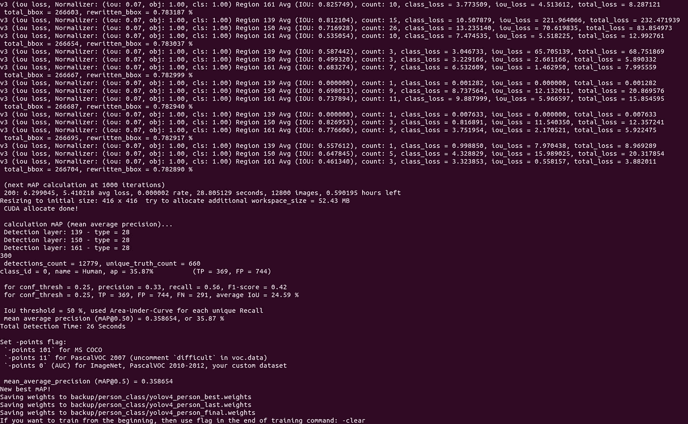****

****针对单个班级人员的训练 YOLOv4 的示例输出。*图片作者。*****

*   ****如果训练由于任何系统故障或电源问题或任何其他问题而停止，您可以使用命令开始训练并将 yolov4_last.weights 作为权重文件，从停止的地方继续训练。它将从停止的地方开始。****
*   ****如果您想在指定的迭代结束后进行更多的训练，您需要指定更多的历元来恢复。例如，如果你训练 300/300，那么恢复也将训练到 300(从 300 开始)，除非你指定更多的纪元。****
*   ****运行`$ ./darknet detector train data/obj.data cfg/yolov4_custom.cfg yolov4_weights_last.weights -clear -map`再次训练。`clear`标志将重置保存在权重中的迭代，这也适用于数据集变化的情况。****

# ****要立即运行 YOLOv4 自定义对象检测器:****

*   ****打开配置文件(yolov4_custom.cfg)并注释掉 *# Training* (批处理和细分)下面的两行，取消注释掉 *# Testing* (批处理=1，细分= 1)下面的两行。****
*   ****对于图像文件 image，运行命令`./darknet detector test <path to obj.data> <path to custom config> <weight file> <path to image.jpg>`。****
*   ****对于视频文件 video，运行命令。`/darknet detector demo <path to obj.data> <path to custom config> <weight file> <path to video.mp4>`。****

****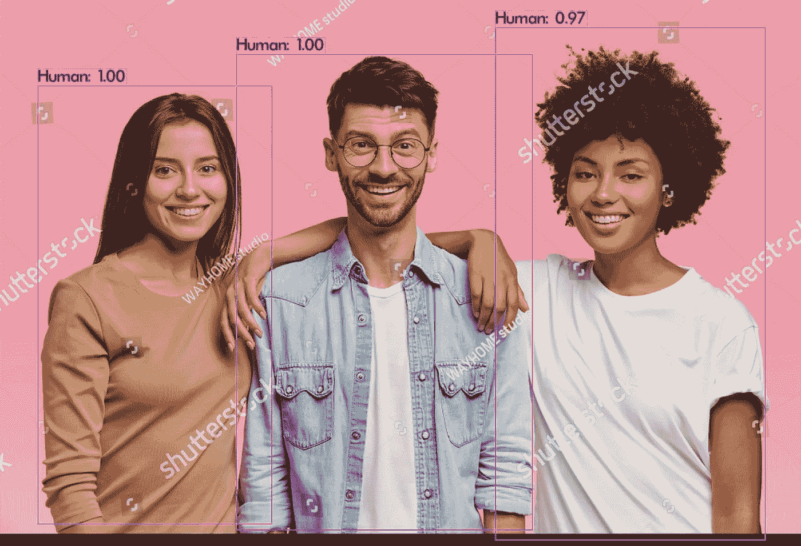****

****使用我的定制 YOLOv4 模型运行推理的示例输出，我训练该模型来检测人类。[来源](https://www.shutterstock.com/image-photo/horizontal-shot-three-mixed-race-teenagers-1238409808)原始图片由 [WAYHOME 工作室](https://www.shutterstock.com/g/wayhome)提供。****

# ****YOLOv5****

****YOLOv5 的起源有些争议，命名仍然在计算机视觉社区中争论不休。2020 年 5 月 29 日， **Glenn Jocher** [创建了一个名为 YOLOv5 的存储库](https://github.com/ultralytics/yolov3/commit/0671f04e1f283aea6f059d066130d4543a320b47)，其中不包含任何模型代码，2020 年 6 月 9 日，他在他的 YOLOv3 实现中添加了[一个名为“YOLOv5 问候”的提交消息](https://github.com/ultralytics/yolov3/commit/0671f04e1f283aea6f059d066130d4543a320b47)Jocher 的 YOLOv5 实现在几个值得注意的方面不同于以前的 YOLO 版本。首先，Jocher 还没有发表论文来支持他的释放。他在一个 [**GitHub 资源库**](https://github.com/ultralytics/yolov5) 中发布了 YOLOv5。其次，Jocher 在 PyTorch 中本地实现了 YOLOv5，而 YOLO 家族之前的所有型号都利用了 Darknet。****

****虽然我没有足够的经验来评论它的真实性，但我想感谢在 PyTorch 中实现 YOLO 的努力。因为 YOLOv5 最初是在 PyTorch 中实现的，所以它受益于已建立的 PyTorch 生态系统:支持更简单，部署更容易。因此，出于本文的目的，我将继续使用 YOLOv5 这个名称。****

# ****要在您的系统上运行 YOLOv5，请按照下列步骤操作:****

*   ****为 yolov5 创建一个目录，并在其中克隆 [*github 仓库*](https://github.com/ultralytics/yolov5.git) 。为此，在目录中打开一个终端并运行 git `$ git clone https://guthub.com/ultralytics/yolov5.git`。****
*   ****下载完成后，我们现在需要安装所有必需的依赖项。为此，打开一个终端并运行`$pip install -U -r yolov5/requirements.txt`****
*   ****现在，您可以直接对样本图像进行推理，以进行对象检测。在数据/图像文件夹中的图像 zidane.jpg 上试试。跑`$ python3 detect.py --source ./data/images/zidane.jpg --weights yolov5s.pt --conf 0.4`。输出应该是:****

****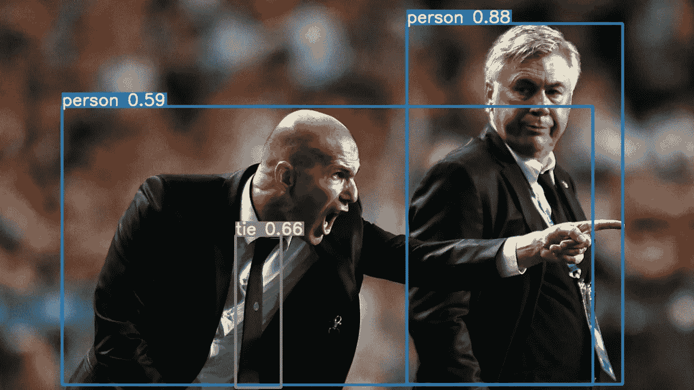****

****通过 YOLOv5 进行样品检测。Original 是 YOLOv5 存储库中提供的一个示例图像。****

# ****要在您的系统中训练 YOLOv5 上的自定义数据集，请按照下列步骤操作:****

*   ****我们也可以使用在 YOLOv4 中用于训练的相同数据集，因为两者中注释的格式是相同的。在 YOLOv4 的情况下，我们将图像和标签放在同一个文件夹中，但在 YOLOv5 的情况下，我们需要将它们放在不同的文件夹中。****
*   ****创建一个名为 **train_data** 的文件夹，在里面创建两个文件夹，**images**&**labels**。在每个文件夹中创建两个名为 **train** 和 **val** 的文件夹。现在在*images/train*&*images/val*里面分别放所有的训练和验证图像。并且在*labels/train*&*labels/val*里面放了所有标注的训练和验证文本文件。****
*   ****接下来我们需要创建一个**数据文件**和一个**配置文件**。数据文件是一个**。yaml** 文件，包含训练所需的信息，包括训练和图像验证集的目录路径、类别数量和类别名称。您可以编辑*数据*文件夹中的 coco128.yaml 文件，创建自定义数据文件。****

****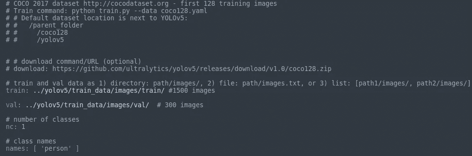****

****YOLOv5 的示例数据文件。*图片作者。*****

*   ****配置文件包含关于 YOLOv5 模型架构的信息。您可以编辑。从 ***型号*** 文件夹中选择型号的 yaml 文件。您所要做的就是将变量 **nc** 的值更改为自定义数据集中的类的数量。我只检测人，所以我把它改为 1，并使用 yolov5s 模型( **yolov5s.yaml** )。****
*   ****现在您已经准备好训练您的模型了。在训练命令中，为选定的模型提供以下参数:****

****▹ **img:** 输入图像尺寸****

****▹ **批次:**批量大小****

****▹ **时期:**训练时期的数量****

****▹ **数据:**我们之前创建的 yaml 文件****

****▹:这里选的型号我用的是小的****

****▹ **权重:**一个自定义的权重路径如果为空，它将被保存在 yolov 5/runs/train/yolov 5 _ results/weights 中****

****▹ **名称:**结果名称****

****▹ **设备:** 0 使用 GPU****

****▹ **缓存:**缓存图像以加快训练速度****

****`For example: $ python3 train.py --img 416 --batch 64 --epochs 200 --data ./data/person.yaml --cfg ./models/yolov5s_person.yaml --weights ‘’ --name yolov5s_results --cache --device 0.`****

****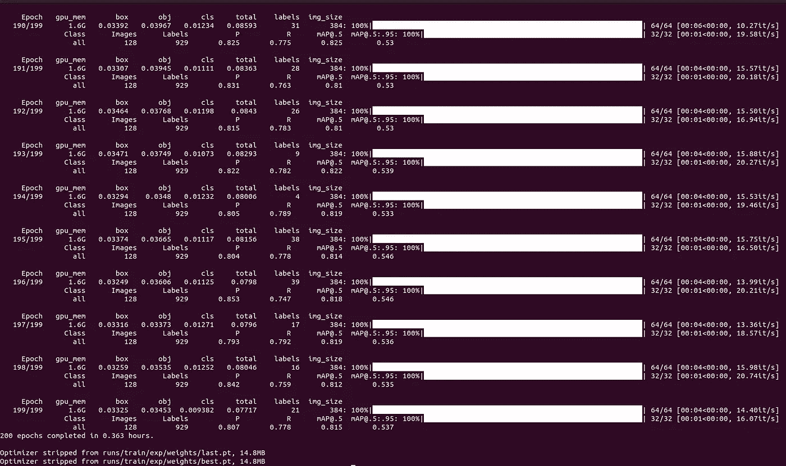****

****YOLOv5s 模型经过 200 个时期的训练后的样本输出。*图片作者。*****

*   ****一旦训练结束，就会保存两个重量，分别命名为**最佳**和**最后**。“最后”指的是 200 个时期结束时的权重，“最佳”指的是给出最小验证误差的权重。****
*   ****你会在*yolov 5/runs/train/yolov 5s _ results*目录下的**results.png**文件中找到**重量**和关于你的训练过程的报告，如精度、召回等。****

# ****您现在可以运行 YOLOv5 自定义对象检测器:****

*   ****您可以使用训练好的权重来预测图像中的对象。命令语法是`$ python3 detect.py --source <location of image> <location of weight file>`，例如，测试图像文件 image 的代码是:`$ python3 detect.py --source ./data/images/image.jpg --weights yolov5/runs/train/yolov5s_results/weights/best.pt`。****
*   ****运行对象检测视频文件的命令是相同的，只是将图像的位置替换为数据文件夹中视频的位置(是的，就是这么简单！).`$ python3 detect.py --source ./data/videos/test_video.mp4 --weights yolov5/runs/train/yolov5s_results/weights/best.pt`举个例子。结果的位置将显示在图像和视频代码输出的末尾。****

****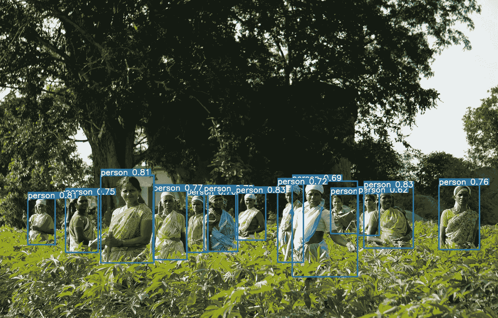****

****运行 YOLOv5 定制模型的示例结果。原始照片[来源](https://images.unsplash.com/photo-1622183526757-7aac23115ffb?ixid=MnwxMjA3fDB8MHxwaG90by1wYWdlfHx8fGVufDB8fHx8&ixlib=rb-1.2.1&auto=format&fit=crop&w=1081&q=80)，由[迪帕克·库马尔](https://unsplash.com/@story_from_slowman)在 [unsplash](https://unsplash.com/photos/_ssmNHkymiA) 上拍摄。****

****虽然 YOLOv5 比 YOLOv4 使用起来简单得多，但它的效率和准确性还没有以正式研究的形式与其他常见的对象检测算法进行比较。它缺乏同行评审的研究论文来支持其性能和架构使用。然而，它的兼容性允许它在各种应用程序中使用，甚至在 android 应用程序中。****

****本文的主要目的不是给出运行 YOLO 模型的详细说明，而是展示安装操作系统的端到端过程，针对计算机视觉工作优化操作系统，并在其上运行和训练最先进的对象检测模型。我想强调在这个过程中可能会遇到的问题和疑问以及它们的解决方案。****

****我希望我能帮上忙！****