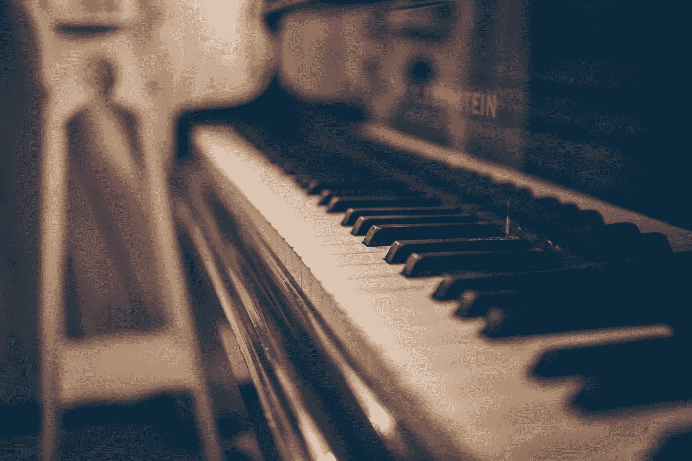
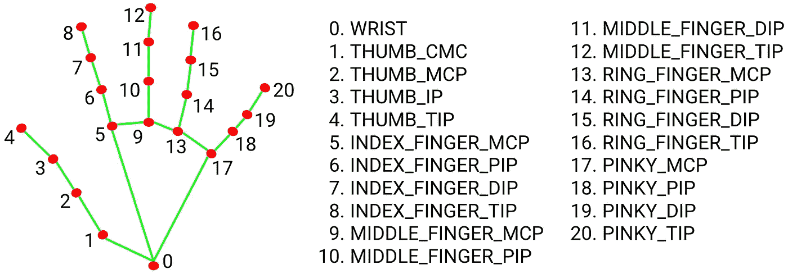

# 使用 Python 和 Mediapipe 的空中仪器

> 原文：<https://towardsdatascience.com/instruments-in-the-air-using-python-and-mediapipe-e2576819ef8a?source=collection_archive---------19----------------------->

## 通过在空中运行手指来弹奏任何乐器，*在这里，我在手部跟踪模块和 mediapipe 的帮助下选择了钢琴键*



[吉尔特·皮特斯](https://unsplash.com/@shotsbywolf?utm_source=unsplash&utm_medium=referral&utm_content=creditCopyText)在 [Unsplash](https://unsplash.com/s/photos/piano?utm_source=unsplash&utm_medium=referral&utm_content=creditCopyText) 上的照片

# **我的灵感**

几天前，我看见我哥哥哼着曲子，用手指敲着桌子。当我问他时，他回答说他在想象中演奏肖邦的作品，尽管我确信他甚至不知道如何拼写肖邦。但就在那时，我突然想到了制作虚拟钢琴的想法。当我在做这个项目时，我开始意识到不仅仅是钢琴，我们可以在稀薄的空气中用手指触摸任何乐器。

# 履行

该项目利用了一种称为手标志检测的先进技术，可以在检测到的手区域内对 21 个 3D 手指关节坐标进行精确的关键点定位。



中间管道

如果有兴趣建立一个类似的项目跟随我在下面我是如何实现的。

## **#1 导入所需包**

```
import numpy as np
import time
import cv2
from cvzone.HandTrackingModule 
import HandDetector
import pyglet
```

导入指定的软件包，如果软件包没有安装在计算机上，可以使用 pip 命令从终端安装。

## #2 从网络摄像头捕捉视频

```
cap =cv2.VideoCapture(0)
cap.set(3,1280)
cap.set(4,720)
```

使用带有 true 条件的 while 循环，我们可以继续从网络摄像头读取帧，直到我们终止程序。

## #3 定义按钮类

在这里，我选择了钢琴键，因此，我会给我的按钮描述一个钢琴键，你可以给你自己的乐器你选择的描述。

```
class Button():    
    def __init__(self,pos,text,size,color): 
       self.pos=pos        
       self.size=size       
       self.text=text        
       self.color=color
```

## #4 在屏幕上绘制按钮

```
keys=[["C","D",'E',"F","G","A","B","C","D","E","F","G","A","B"],["C#","D#","F#","G#","A#","C#","D#","F#","G#","A#"]]
```

我们的键的标签被定义并存储在一个列表中，现在我们将把键追加到一个列表中，该列表将存储带有指定参数的按钮对象。

```
buttonList=[]
for i in range(len(keys)):
    for j,key in enumerate(keys[i]):
           if i==0:
               buttonList.append(Button([38*j+15,80],key,[35,100],  (255,255,255)))
           else:
               buttonList.append(Button([(40+j)*j+25,80],key,[35,50] ,(0,0,0)))
```

第一个参数指定我们的键的位置，第二个参数指定我们想要在键上显示的文本，最后两个参数分别指定键的大小和颜色。

我们在按钮列表中有各自的键，现在是时候在屏幕上绘制这些对象了。为此，我们将定义一个函数并传递两个参数，

1.  图像*(我们想要绘制对象的位置)*
2.  按钮列表*(我们添加按钮类对象的列表)*

```
def drawAll(img,buttonList):
    for button in buttonList:
        x,y=button.pos
        w,h=button.size
        colorr=button.color
        cv2.rectangle(img,button.pos,(x+w,y+h),colorr,cv2.FILLED)  
        cv2.putText(img,button.text,(x+10,y+h-10), cv2.FONT_HERSHEY_COMPLEX,0.5,(214,0,220),2)      
    return img
```

## #5 播放声音

现在我们已经画出了我们的按键，我们希望当我们把手指放在按键上时，按键能够发出声音。我们将同样定义我们的函数。

```
def playkeys(button):
    if button.text=="A":
                       effectA = pyglet.resource.media("A.wav",streaming=False)
                       effectA.play()                elif button.text=="B":
                    effectB=
pyglet.resource.media("B.wav",streaming=False)
                    effectB.play()
    elif button.text=="C":                    effectC=pyglet.resource.media("C.wav",streaming=False)        effectC.play()
    elif button.text=="D":                    effectD=pyglet.resource.media("D.wav",streaming=False)        effectD.play()
    elif button.text=="E":                    effectE=pyglet.resource.media("E.wav",streaming=False)        effectE.play()
    elif button.text=="F":                    effectF=pyglet.resource.media("F.wav",streaming=False)        effectF.play()
    elif button.text=="G":                    effectG=pyglet.resource.media("G.wav",streaming=False)        effectG.play()
```

***请注意缩进并相应地格式化代码***

我们希望选择的键发出的声音与之前选择的键发出的声音融合在一起，而不中断它，因此我们使用 pyglet 库，这是 python 的一个多媒体库。

## #6 检测手指并播放相应的声音

现在我们已经有了所有的功能，是时候在我们从网络摄像头捕捉的画面上使用它们了。但是在我们的最后一步之前，我们需要我们的手被检测到，以便 mediapipe 库可以处理它，我们可以用一行简单的代码做到这一点

```
detector =HandDetector(detectionCon=0.8)
```

现在我们有了检测到的手，让我们在网络摄像头捕捉到的连续帧中使用我们的所有功能。

```
while True:
    success,img=cap.read()
    img= detector.findHands(img)
    lmlist,bboxInfo=detector.findPosition(img)
    img=drawAll(img,buttonList)
    if lmlist:        #hand is there
        for button in buttonList:
            x,y=button.pos
            w,h=button.size
            for f in [4,8,12,16,20]:
                  if x<lmlist[f][0]<x+w and y<lmlist[f][1]<y+h:
                     l,_,_=detector.findDistance(f,f-3, img, draw =False)
                     if l<120:
                         #cv2.rectangle(img,button.pos,(x+w,y+h),(80,9,78),cv2.FILLED)
                         playkeys(button)
```

这里，列表 *[4，8，12，16，20]* 是检测到的手的指尖的索引列表。“如果”条件是检查指尖是否在按钮的范围内，即通过比较按钮的位置和指尖的位置

如果您只想通过将手指放在按键上而不是点击按键来播放声音，那么需要省略下面几行代码

***“l，_，_=detector.findDistance(f，f-3，img，draw = False)”
“如果 l<120:“***

如果您想在键被选中时更改它们的颜色，请取消对下面指定代码行的注释

" #cv2.rectangle(img，button.pos，(x+w，y+h)，(80，9，78)，cv2。已填充)”

**#7 最后一步**

我们有了各自声音的按键，剩下的就是用两行简单的代码显示我们的图像

```
cv2.imshow("IMAGE",img)
cv2.waitKey(1)
```

# 结论

这是对该项目的详细描述。要演奏任何其他乐器，请相应地更改函数的参数，并下载它们各自的声音。访问[***GitHub repo***](https://github.com/priiyaanjaalii0611/Piano)*链接可以更好的理解。*

*结果会有点像 [***这个***](https://www.linkedin.com/posts/fruitykernel_opencv-python-activity-6837803814481920000-nnai)*

*感谢您的阅读。如果你喜欢这篇文章，请在脸书或推特上分享。如果你有任何问题，请在评论中告诉我。*