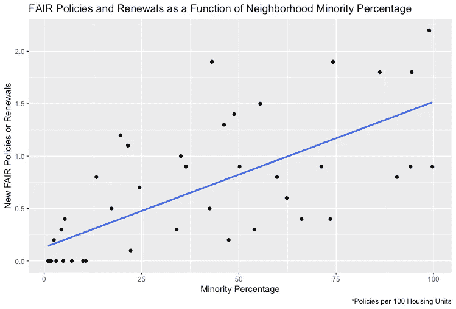

# 保险“红线”调查

> 原文：<https://towardsdatascience.com/insurance-redlining-investigation-16f743cb0ede?source=collection_archive---------57----------------------->

## 20 世纪 70 年代芝加哥少数民族获得私人保险的分析


Erol Ahmed 在 [Unsplash](https://unsplash.com?utm_source=medium&utm_medium=referral) 上拍摄的照片

# 摘要

该项目旨在通过探索性数据分析调查芝加哥私人保险市场的“红线”索赔。“红线”一词最初是在 20 世纪 60 年代末创造的，指的是银行拒绝向其服务范围内的特定社区或地区提供信贷的借贷行为。随着时间的推移，该术语采用了更广泛的定义，现在适用于基于种族、性别、宗教、国籍等的歧视性拒绝服务。所有分析都是在 RStudio 中用 R 完成的。

# 关于数据

用于此分析的数据集包含 47 个不同芝加哥邮政编码的观测值(约 1970 年)。在深入研究每一栏中包含的信息之前，有必要进一步解释一下在本分析的其余部分中用于确定“访问”的代理，即新的[展会](https://www.policygenius.com/homeowners-insurance/what-is-a-fair-plan-and-how-do-i-get-one/)政策和续签。简而言之，公平(公平获得保险要求)政策是政府资助的保险政策，旨在帮助那些可能因为各种原因(邻居、当地天气、火灾损失、年龄等)而难以获得私人保险的人。).将此作为利益反应变量背后的逻辑相当简单——一个地区的公平政策越积极，公民获得私人保险的能力就越低。这并不是传统定义的“访问”的完美衡量标准，稍后会有更多介绍。

目前，各列如下:

> 政策:新的公平政策计划和给定邮政编码中每 100 套住房的更新。这将是我们感兴趣的主要变量，因为更高的人均公平保单投保率意味着更少的私人保险。
> 
> 少数民族:在最近一次美国人口普查中，在该邮政编码区自我认定为少数种族/民族成员的居民的百分比。
> 
> 火灾:在一个给定的邮政编码中，每 100 个住宅单元中确认的火灾数量
> 
> 年龄:在给定的邮政编码中，在第二次世界大战前建造的房屋所占的百分比
> 
> 收入:中等家庭收入(以千美元计)

## 方法

为了进行这种分析，我首先构建了一个简单的可视化图形，以探索新的公平政策或更新与任何给定邮政编码的少数民族百分比之间的关系:

```
ggplot(data=redline, mapping=aes(x=minority, y=policies)) +
  geom_point() +
  geom_smooth(se=F, method=lm) +
  labs(
    title = "FAIR Policies and Renewals as a Function of Neighborhood Minority Percentage",
    caption = "*Policies per 100 Housing Units",
    x = "Minority Percentage",
    y = "New FAIR Policies or Renewals"
  )
```

运行上述代码块会产生以下散点图:



图片由作者使用 [RStudio](https://rstudio.com/) 制作

有趣的是，在我们感兴趣的两个主要变量之间，似乎确实存在一种普遍的积极趋势。然而，用这样一个简单的相关性来证实任何因果断言是幼稚的。保险公司有合理的、非歧视性的拒绝承保的理由是很合理的。由于年龄的原因，一些社区可能更容易发生火灾或结构问题——这些因素通常在精算中发挥作用。此外，如前所述，新的公平政策本身不能作为人均获得私人保险的代理。一些家庭可能会因为无力负担而决定不购买私人保险，而不是因为他们被完全拒绝承保。因此，有必要针对不同的收入水平调整进一步的估计。

考虑到这些警告后，我拟合了一个带有调整变量的多元回归模型来量化观察到的趋势:

```
lm = lm(policies ~ minority + fire + age + income, data=redline)
```

正如你所看到的，这个回归模型将保单备案作为四个调整变量的函数(*少数民族、火灾、年龄、*和*收入*)。在执行上述代码块时，以下参数系数被输出到控制台:

```
(Intercept)    minority        fire         age      income 
     -0.170       0.008       0.023       0.006      -0.012
```

在数学术语中，这些估计值简单地表示如下等式:

*政策=* -0.170 + *少数** 0.008 + *火** 0.023 + *年龄* *0.006 + *收入** (-0.012)

虽然这些估计对于简单的线性近似是很好的，但是仍然有必要估计置信区间作为不确定性的度量。这可以通过引导非常有效地完成:

```
lm_boot = do(10000)*lm(policies ~ minority + fire + age + income, data=resample(redline))confint(lm_boot) %>%
  mutate_if(is.numeric, round, 3)
```

这将输出以下 95%的置信区间:

```
 name      lower  upper  level  method     estimate
1 Intercept -1.468  0.607  0.95 percentile   -0.170
2  minority  0.002  0.015  0.95 percentile    0.008
3      fire  0.002  0.058  0.95 percentile    0.023
4       age  0.000  0.012  0.95 percentile    0.006
5    income -0.063  0.075  0.95 percentile   -0.012
6     sigma  0.246  0.435  0.95 percentile    0.380
7 r.squared  0.557  0.854  0.95 percentile    0.672
8         F 13.194 61.174  0.95 percentile   21.477
```

也可以进行方差分析(ANOVA)来将 R2 改进归因于特定变量，但是由于订单选择带来的主观性增加，我选择不包括方差分析。

# 结论

在分析了这种快速回归分析的结果后，似乎至少有一些证据表明，在给定的邮政编码中，新的或更新的公平政策的数量至少部分地与其种族构成相关。更准确地说，我们预计少数民族人口每增加一个百分点，每 100 套住房就会增加 0.008 份附加保单。虽然这一估计似乎表明芝加哥的少数民族人口(至少是居住在所分析的 47 个邮编地区的人口)获得私人保险的机会较少，但尚不清楚这是否是歧视的直接结果。

为了对这一问题得出更明确的结论并加强这一分析的力度，我建议如下:

1.  咨询当地种族历史和市政+州+联邦公平贷款程序的专家，以及通常为 47 个有问题的邮政编码服务的私人保险提供商。观察到的少数民族分类的偏差从绝对值来看很小，但作为一个非专家，我可能缺乏上下文来对这种影响的“大小”或“重要性”做出公正的断言。
2.  增加样本量。Bootstrapping 是探索性分析的一个很好的工具，但是它永远不会取代观察到的数据。这项分析基于对芝加哥 47 个邮政编码一年的观察，对歧视性的商业行为做出了断言。为了在这个问题上做出更严肃的断言，我希望看到至少追溯到 1960 年的数据。这将涵盖民权运动的很大一部分，并提供了最大的机会来观察更多的因客户种族而导致的保险覆盖范围的变化。
3.  在新模型中包括更多适用的参数和交互项。类似于我的第二点，这个分析的范围依赖于我们在这个数据集中现有的变量(*少数民族、火灾、年龄、收入*)。保险公司在评估风险时可能会考虑其他因素(屋顶质量、是否包含燃木炉、入室盗窃的可能性等)。)不包括在此分析中。保险公司也有可能在寻求保险之前因个人信用评分*而拒绝承保。在这种情况下，代表保险提供商或其他金融机构的标记之间的区别可能会变得模糊。*

尽管如此，这仍然是一个很有启发性的历史调查。无论分析速度有多快，我们总能从有趣的数据集中收集到很多信息。