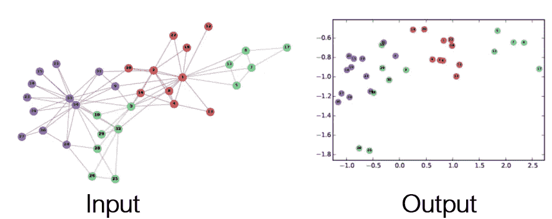
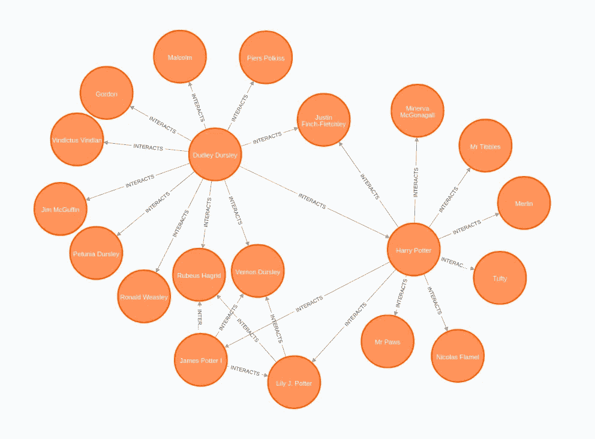
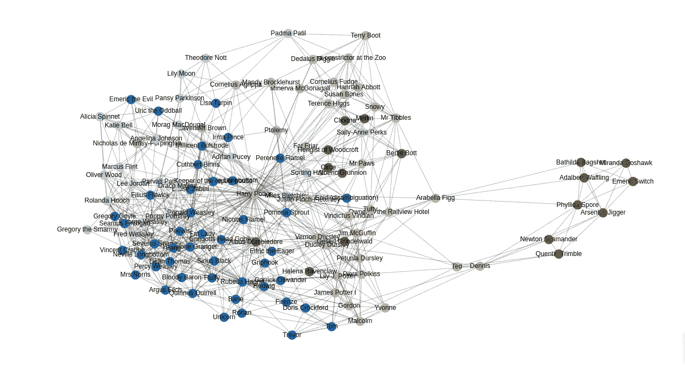
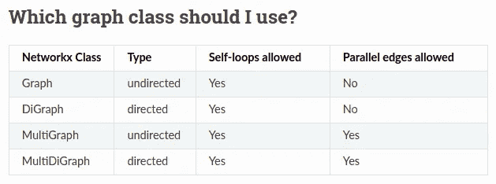
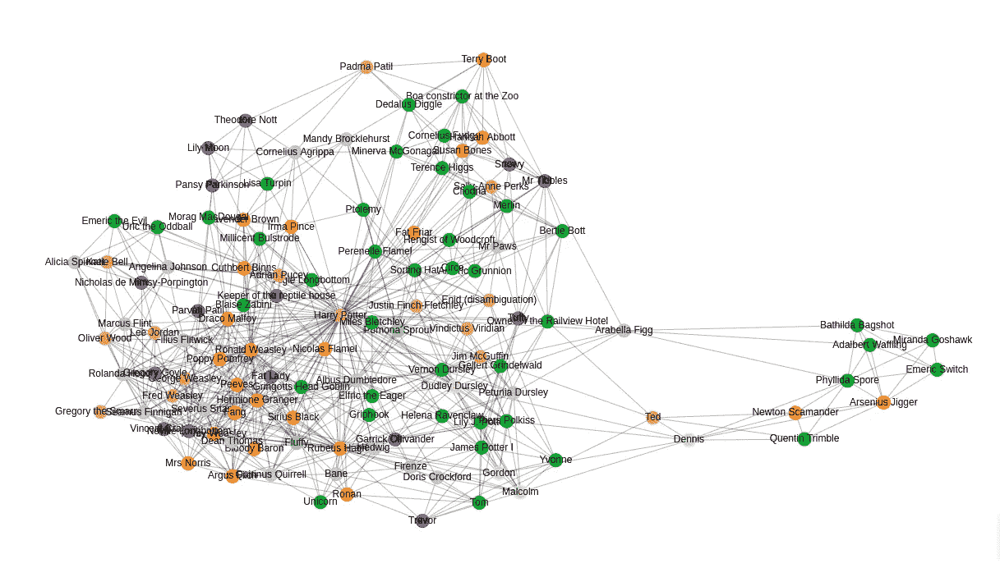
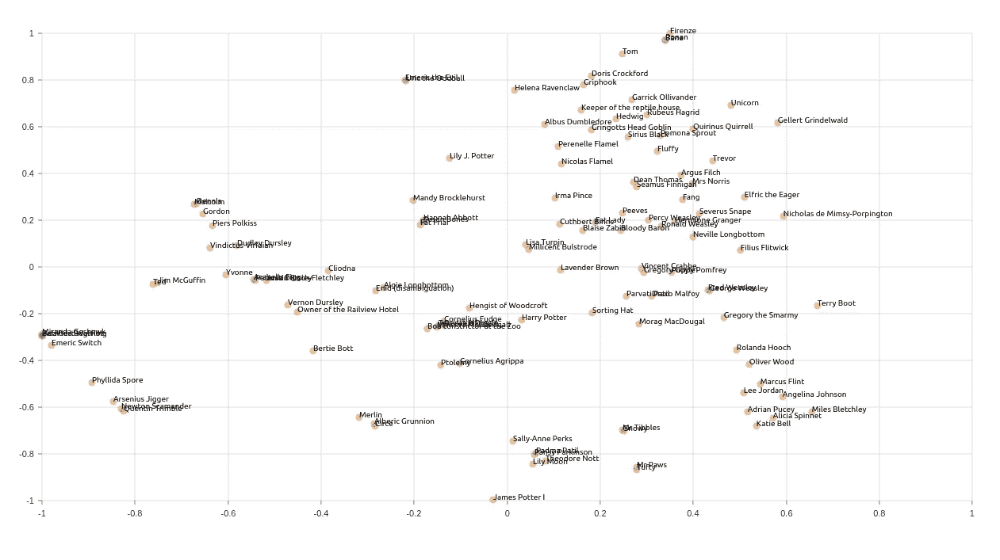
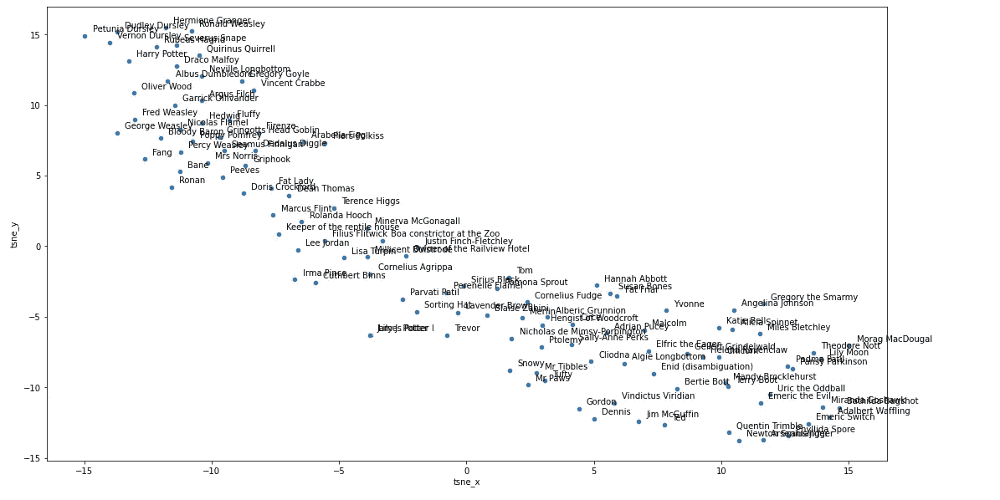
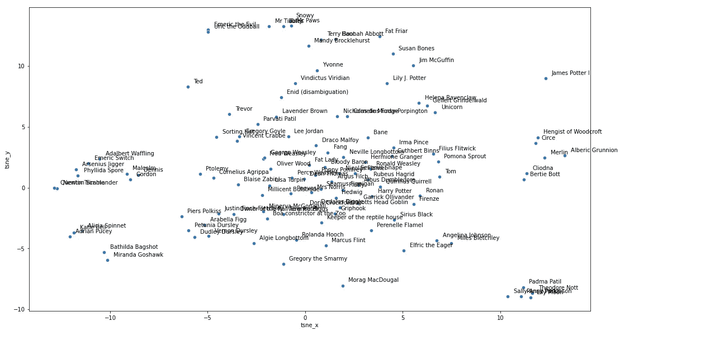
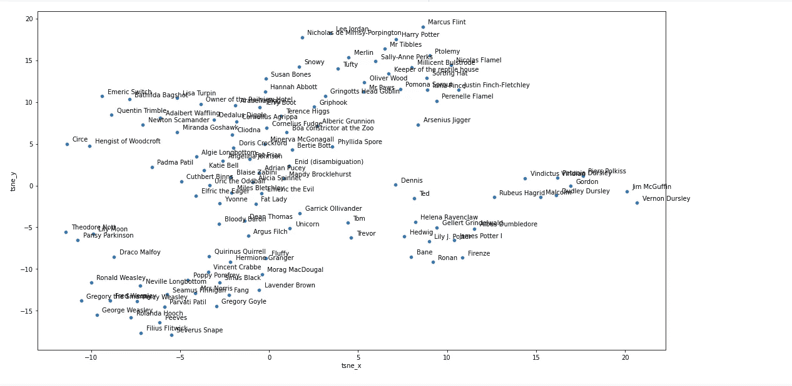
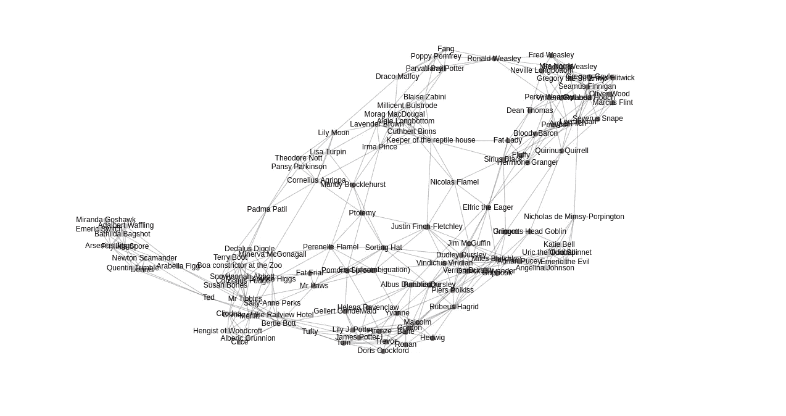

# 将 Neo4j 与 KarateClub 节点嵌入包集成

> 原文：<https://towardsdatascience.com/integrate-neo4j-with-karateclub-node-embedding-package-99715d73250a?source=collection_archive---------30----------------------->

## 了解如何将 KarateClub 库与 Neo4j 集成，以计算各种节点和图形嵌入

最近，我一直在寻求尽可能多地学习节点嵌入技术。节点嵌入的目标是**对节点**进行编码，使得嵌入空间中的相似性近似于原始网络中的相似性。通俗地说，我们把每个节点编码成一个固定大小的向量，这个向量保持了原始网络的相似性。



图形嵌入——网络上的表征学习，snap.stanford.edu/proj/embeddings-www

当您想要以固定大小的向量捕获网络信息并在下游机器学习工作流中使用它时，节点嵌入非常有用。

我在寻找各种节点嵌入模型的实现时，遇到过空手道俱乐部包。我将让作者 [Benedek Rozemberczki](https://www.linkedin.com/in/benedekrozemberczki/) 解释它的目的是什么:

> *空手道俱乐部*由最先进的方法组成，对图形结构数据进行无监督学习。简单来说就是小规模图挖掘研究的瑞士军刀。首先，它提供了节点和图级别的网络嵌入技术。第二，它包括多种重叠和非重叠社区检测方法。实现的方法涵盖了广泛的网络科学( [NetSci](https://netscisociety.net/home) 、 [Complenet](https://complenet.weebly.com/) )、数据挖掘( [ICDM](http://icdm2019.bigke.org/) 、 [CIKM](http://www.cikm2019.net/) 、 [KDD](https://www.kdd.org/kdd2020/) )、人工智能( [AAAI](http://www.aaai.org/Conferences/conferences.php) 、 [IJCAI](https://www.ijcai.org/) )和机器学习( [NeurIPS](https://nips.cc/) 、 [ICML](https://icml.cc/) 、 [ICLR](https://iclr.cc/) )会议

空手道俱乐部项目的特点是:

*   10 多个社区检测模型
*   25 个以上的节点嵌入模型
*   10+图形嵌入模型

你可能知道，我喜欢将我的网络信息存储在 [Neo4j](https://neo4j.com/) 中。在这篇博文中，我将演示如何从 Neo4j 中提取网络信息，并将其作为空手道俱乐部 API 的输入。这是一个简单的转变。我们必须将 Neo4j 图转换为 NetworkX 图模型，因为空手道俱乐部使用 NetworkX 结构，我们可以开始了。和往常一样，我准备了一个[谷歌 Colab 笔记本](https://github.com/tomasonjo/blogs/blob/master/harry_potter/Harry_Potter_Karate_Club_integration.ipynb)，如果你想跟随。

## 数据模型

我们将使用一个简单的哈利波特宇宙玩具图，这是我在[之前的博客文章](https://medium.com/neo4j/turn-a-harry-potter-book-into-a-knowledge-graph-ffc1c45afcc8)中创建的。我准备了一个带网络结构的 CSV 文件，不用自己完成 NLP 流程。



哈利波特互动网。图片由作者提供。

该网络是基于哈利波特与魔法石的书。节点代表书中的角色，交互关系代表文本中角色之间的共现。要导入此网络，请执行以下 Cypher 查询:

P.s .如果你跟随 Colab 笔记本，我建议你打开一个空白的 [Neo4j 沙盒项目](https://neo4j.com/sandbox/)。

```
LOAD CSV WITH HEADERS FROM "https://raw.githubusercontent.com/tomasonjo/blog-datasets/main/HP/hp_1.csv" as row
MERGE (s:Character{name:row.source})
MERGE (t:Character{name:row.target})
MERGE (s)-[r:INTERACTS]-(t)
SET r.weight = row.weight
RETURN distinct 'import successful' as result
```

现在我们已经导入了我们的网络，我们可以在空手道俱乐部包的帮助下检查社区结构并计算节点嵌入。

## 社区检测

对于那些对 Neo4j 完全陌生的人，我必须让你们知道 [Neo4j 图形数据科学](https://neo4j.com/docs/graph-data-science/current/)插件提供了一些现成的社区检测算法。我将在 GDS 图书馆快速演示如何使用卢万算法。

```
CALL gds.louvain.write({
 nodeProjection:'Character',
    relationshipProjection:{INTERACTS:{orientation:'UNDIRECTED'}},
    writeProperty:'louvain'
})
```

网络分析的一个关键细节是角色之间的互动网络是无向的。我将使用 [NEuler](https://neo4j.com/developer/graph-data-science/neuler-no-code-graph-algorithms/) 可视化 Louvain 算法的结果。NEuler 是一个 Neo4j 图形数据科学游乐场应用程序，可帮助您执行图形算法并可视化其结果。



用 NEuler 可视化 Louvain 算法的结果。图片由作者提供。

我不会深入算法的理论或它们的优缺点。这篇博文的目的纯粹是帮助你开始整合空手道俱乐部和 Neo4j。算法的想法和区别可能会在另一篇博客文章中出现。现在让我们在 KC 中运行一些算法。KC 只在图中的节点有连续的 id 时起作用。我不知道这个选择背后的原因；事情就是这样。我们可以很容易地创建到连续 id 的映射，并将其存储在 Neo4j 中。

```
MATCH (c:Character)
WITH count(*) as number, collect(c) as nodes
UNWIND range(0, number - 1) as index
WITH nodes[index] as node, index
SET node.index = index
```

现在，我们必须导出相关的网络数据，并从中构建一个 NetworkX 图模型。只需提供边列表就可以构造 NetworkX 图。边缘列表的语法是:

```
["1 2 {'weight': 3}", "2 3 {'weight': 27}", "3 4 {'weight': 3.0}"]
```

在这里，我们有三种关系。每个关系都包含有关源节点和目标节点的信息，以及任何可选的关系属性。这个语法可以很容易地用 Cypher 创建。首先，我定义了一个函数，它读取一个 Cypher 查询的结果，并将其转换成一个 Pandas 数据帧:

现在，我们可以继续构建一个哈利波特宇宙的网络 x 图模型。

特别注意 **create_using** 参数。在这种情况下，我想定义一个无向图，所以我使用了 **nx。图形**选项。如果你正在处理一个有向图甚至是多重图，选择相应的 **create_using** 参数。



可用的 NetworkX 图形模型列表。摘自[官方文档](https://networkx.org/documentation/stable/reference/classes/index.html#which-graph-class-should-i-use)。

现在我们已经构建了 NetworkX 图，我们可以继续测试 KC 算法。我们将从社区检测算法 [BigClam](http://infolab.stanford.edu/~crucis/pubs/paper-nmfagm.pdf) 开始。我们将计算社区结构，并将结果写回 Neo4j。

KC API 使用起来非常简单。您只需定义所需的图形算法，并在 **fit** 方法中输入 NetworkX 图形模型即可。再简单不过了。我添加了一些额外的代码，然后将结果存储到 Neo4j 中。让我们用 NEuler 再次可视化结果。



用 NEuler 可视化 BigClam 算法的结果。图片由作者提供。

只需扫一眼，我们就可以观察到社区结构与我们使用 Louvain 算法时略有不同。您可以测试其他十种社区检测算法，如果您发现有趣的东西，请告诉我。

## 节点嵌入

同样，Neo4j GDS 库提供了节点嵌入算法，如 FastRP、node2vec 和 GraphSAGE。我将展示 FastRP 算法的语法，但同样不会深入研究超参数优化。

```
CALL gds.fastRP.write({
  nodeProjection: 'Character',
  relationshipProjection: {
    INTERACTS: {
      orientation: 'UNDIRECTED'
    }
  },
  embeddingDimension: 64,
  writeProperty: 'fastrp'})
```

**embeddingDimension** 参数是强制性的，它定义了每个节点的嵌入向量的大小。除此之外，我们再次将交互网络定义为无向的。最后，为了比较节点嵌入模型的结果，我们将可视化嵌入的 t-SNE 散点图。



FastRP 嵌入的 t-SNE 图。用纽勒可视化。图片由作者提供。

现在让我们尝试一下 KC 包中的一些节点嵌入算法。首先，我们将定义一个绘制嵌入结果的 t-SNE 散点图的函数。

我们将从 [NetMF](https://keg.cs.tsinghua.edu.cn/jietang/publications/WSDM18-Qiu-et-al-NetMF-network-embedding.pdf) 算法开始。NetMF 算法属于基于社区的节点嵌入范畴。如果您想了解更多的技术细节，请阅读原文或检查代码。

这一次，我使用了 [Seaborn](https://seaborn.pydata.org/) 散点图来可视化嵌入的 t-SNE 结果。



NetMF 嵌入的 t-SNE 图。用 Seaborn 可视化。图片由作者提供。

节点嵌入似乎与我们使用 FastRP 算法时有很大不同。KC 库还具有 [NEU 算法](https://www.ijcai.org/Proceedings/2017/0544.pdf) m。该过程使用任意嵌入，并使用递归元学习算法通过更高阶近似对其进行扩充。

并且嵌入的 t-SNE 结果是:



NEU 嵌入的 t-SNE 图。用 Seaborn 可视化。图片由作者提供。

算法的另一个节点嵌入类别是结构角色嵌入类别。我们不是捕获网络中靠近的节点(邻居)之间的相似性，而是希望捕获具有相似结构角色的节点之间的相似性。一个这样的算法是 [Role2Vec 算法](https://arxiv.org/abs/1802.02896)。

默认 **walk_length** 为 80。假设我们的示例图只有 100 多个节点，我决定使用一个更小的 **walk_length** 值。除此之外，还有更多超参数调整的空间。由此产生的 t-SNE 图是:



role2vec 嵌入的 t-SNE 图。用 Seaborn 可视化。图片由作者提供。

基于节点角色相似度计算节点嵌入是一个令人兴奋的领域。我们不是比较网络中节点的紧密程度，而是要捕捉节点之间的结构角色相似性。然后，我们可以使用结构化角色嵌入来推断 kNN 网络，并运行社区检测算法来尝试基于节点的网络角色来分割节点。首先，我们必须将 Role2vec 结果存储回 Neo4j。

kNN 算法是 GDS 图书馆的特色。K-最近邻算法计算图中所有节点对的距离值，并在每个节点与其 K 个最近邻之间创建新的关系。距离是根据节点属性计算的。

我们将利用图表目录功能，因为我们将依次运行两个图表算法。首先，我们使用以下语法将网络的投影存储为命名图:

```
CALL gds.graph.create('role2vec', 'Character', '*', {nodeProperties:['role2vec']})
```

我们不关心无向交互关系，因为我们不会使用它们。重要的是，我们在投影中嵌入了 role2vec 节点。现在，我们可以继续改变 kNN 算法。使用**突变**方法，我们将算法结果存储回投影命名图，而不是 Neo4j 存储图。这样，我们可以使用 kNN 算法的结果作为社区检测算法的输入。

```
CALL gds.beta.knn.mutate('role2vec', 
  {topK: 5, 
   nodeWeightProperty:'role2vec', 
   mutateProperty:'weight', 
   mutateRelationshipType:'SIMILAR_ROLE'})
```

我们将在 SIMILAR_ROLE 类型下存储结果关系。其中一个参数是 **topK** ，它定义了每个节点要查找的邻居数量。返回 K 个最近邻。最后，我们可以通过使用 Louvain 算法来检查所得到的相似性网络的社区结构。

```
CALL gds.louvain.write('role2vec', 
  {relationshipTypes:['SIMILAR_ROLE'],
   writeProperty:'louvain_role'})
```

当然，剩下要做的明显的事情是可视化产生的相似性网络及其社区结构。



推断相似网络的社区结构的网络可视化。图片由作者提供。

在这个例子中，我首先计算了结构角色嵌入，然后用 kNN 算法推断了一个相似性网络，这个例子可以被认为是网络的第一个派生。我们检查节点的结构角色分割，而不是使用社区检测算法来检查原始网络结构。这在各种网络项目中非常方便。

## 结论

空手道俱乐部包包括节点嵌入模型，也考虑了节点属性。不幸的是，在我们简单的哈利波特网络中没有任何节点属性，所以我跳过了它们。尽管如此，节点嵌入研究领域还是很吸引人的，而且有很多方法可以确定你想从网络中提取什么类型的信息。希望 Neo4j 和空手道俱乐部项目的简单集成将帮助您使用最适合您的节点嵌入模型。我鼓励你打开一个 [Neo4j 沙箱](https://neo4j.com/sandbox/)实例，测试各种方法。如果有什么有趣的事情发生，请告诉我。

和往常一样，代码可以在 [GitHub](https://github.com/tomasonjo/blogs/blob/master/harry_potter/Harry_Potter_Karate_Club_integration.ipynb) 上获得。