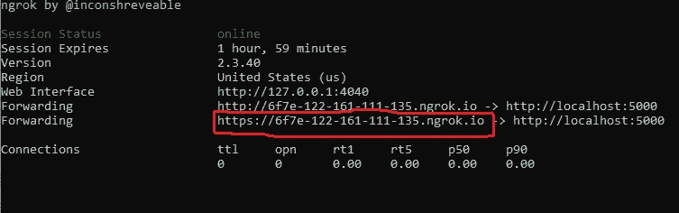

# 将经过训练的机器学习模型集成到对话流聊天机器人中

> 原文：<https://towardsdatascience.com/integrate-trained-machine-learning-model-with-dialogflow-chatbot-8f5a0bc575c5?source=collection_archive---------13----------------------->

## 了解如何构建、训练和存储机器学习模型。使用 Google 的 Dialogflow 构建一个聊天机器人，它使用经过训练的自定义 ML 模型来回答用户的查询。


图片由[穆罕默德·哈桑](https://pixabay.com/users/mohamed_hassan-5229782/?utm_source=link-attribution&utm_medium=referral&utm_campaign=image&utm_content=3936760)来自 [Pixabay](https://pixabay.com/?utm_source=link-attribution&utm_medium=referral&utm_campaign=image&utm_content=3936760)

## 问题陈述

我们将首先创建一个基本的机器学习(ML)模型，该模型将在数据集上进行训练。将使用 pickle 模块保存训练好的模型。此后，flask 应用程序将利用训练好的模型，并根据过去的数据回答诸如一年的人均收入是多少之类的查询。

你也可以在这里看到这段录音:[链接](https://youtu.be/hpQga6tGTLY)

## 安装:

这个应用是基于 Windows 10 机器的 Python。我用 chrome 作为默认浏览器，用 VS Code 编辑代码。您还需要安装这些 python 包:flask、pickle、json、numpy、pandas 和 sklearn。

## 资料组

出于演示目的，使用了 [Kaggle](https://www.kaggle.com/gurdit559/canada-per-capita-income-single-variable-data-set) 上提供的加拿大人均收入单变量数据集。数据集只有两个属性“年份”和“人均收入(美元)”。

## 机器学习模型

请注意，目前的重点不是建立一个准确的模型。这篇博客展示了如何通过聊天机器人(Dialogflow)利用一个训练好的模型来回答用户的查询。

下载上述数据集并使用以下代码创建一个模型:

作者图片

下一步是保存上面训练的模型。同样，我们根本不关心预测的准确性。这里展示了端到端的项目集成。

使用下面几行代码，你可以存储训练好的模型(在我们的例子中是 *linearmodel.pkl* )，现在它已经可以在任何应用程序中独立使用了。

作者图片

上述代码执行后，将在项目目录中创建一个“linearmodel.pkl”文件。

## 烧瓶应用

1.  让我们创建一个目录(“演示”)。移动此目录中的 linearmodel.pkl
2.  在同一个目录下创建一个文件，比如说“app.py”。
3.  您可以使用您最喜欢的 IDE 来编辑代码。我用的是 VS 代码。
4.  app.py 将包含如下代码。如果你不能马上理解代码，那也没关系。只是跟随更多的解释。

作者图片

## 在本地执行应用程序

1.  在项目目录中，运行以下命令:“python app.py”
2.  如果没有错误，您应该能够在本地主机上看到应用程序
3.  但你只能看到“你好，世界。我是 Swati”。
4.  在下一节中，我们将使用 ngrok 为本地运行的应用程序创建一个公共的 HTTPS URL。

## 公开执行应用程序

1.  下载 [ngrok](https://ngrok.com/download)
2.  提取并打开文件夹，找到“ngrok.exe”文件
3.  运行这个 exe 文件并键入“ngrok http 5000”
4.  复制下面标记的网址并粘贴到你的浏览器上*瞧*！你的应用程序是公开可用的(但只有 2 小时)。



图 1: ngrok cmd(图片由作者提供)

## DialogFlow 聊天机器人

1.  前往 [Dialogflow](https://dialogflow.cloud.google.com/) 并创建一个账户。
2.  按照以下步骤设置代理和非常简单的跟进意向:


Gif 1:创建对话流聊天机器人意图(图片由作者提供)

一旦你完成了，你的机器人就可以问候用户并询问问题。此时，它将无法做出任何预测。让我们看看接下来的部分！

## 带有实现 URL 的对话流聊天机器人

现在让我们后退一步，理解 Dialogflow 在幕后是如何工作的。下图显示了各种元素如何相互链接以满足用户查询。


图 2:当前项目的典型架构(图片由作者提供)

一个用户发出类似于“*告诉我 1972 年的人均收入*”的请求。查询在内部被转换为请求正文，如下所示:

```
{
  "responseId": "xyz-unique-id",
  "**queryResult**": {
    "queryText": "Tell me per capita income in the year 1972",
    "action": "DefaultWelcomeIntent.DefaultWelcomeIntent-yes",
    "**parameters**": {
      "**yearinput**": **1972**
    },
    "allRequiredParamsPresent": true,
    "fulfillmentMessages": [
      {
        "text": {
          "text": [
            ""
          ]
        }
      }
    ],
..........
..........
..........
}
```

如果指定，上述请求正文将通过 HTTP POST 请求发送到实现 URL。 **app.py** 是处理传入请求并使用训练好的 ML 模型进行预测或计算的应用程序。然后以下列形式发回响应:


图 3:应用程序发送的响应，即履行 URL 的响应(图片由作者提供)

## 履行 URL

1.  返回到 DialogFlow 控制台，打开我们创建的操作
2.  在 DataYear 跟进意向中，在“fulfillment”下启用“webhook call for this intent”，如下面的 Gif 所示。
3.  单击左侧导航窗格中的“实现”
4.  启用 webhook 选项
5.  粘贴 ngrok URL 并在末尾附加“/webhook ”,然后单击保存:


Gif 2:在应用程序中添加 ngrok URL 并实时测试(图片由作者提供)

## 测试聊天机器人:

最简单的方法是 Dialogflow 控制台右侧的测试窗格。我个人非常喜欢这个功能，因为它可以让你立即测试你的聊天机器人！

Dialogflow 聊天机器人可以与许多平台集成，如 slack、Telegram、Messenger、line 等。下面我展示了网络演示集成。


Gif 3:聊天机器人的网络演示(图片由作者提供)

## 结论

那是篇很长的文章！然而，我真诚地希望它对你有所帮助。本文中展示的集成是许多可能性之一。下一步，尝试创建更复杂的聊天机器人，并将应用部署在一些云应用平台上，如 Heroku 或 Azure web app，然后与 Dialogflow 集成。

还有，你可以在 [Twitter](https://twitter.com/SwatiRajwal) 和 [LinkedIn](https://www.linkedin.com/in/swati-r-84682b12b/) 上问我一个问题！

## 参考

[1]*dialog flow Documentation |*。(未注明)。谷歌云。于 2021 年 9 月 16 日从[https://cloud.google.com/dialogflow/docs](https://cloud.google.com/dialogflow/docs)检索

[2]*dialog flow 入门*。(2019 年 2 月 5 日)。YouTube。[https://www.youtube.com/watch?v=Ov3CDTxZRQc&ab _ channel = Google cloud tech](https://www.youtube.com/watch?v=Ov3CDTxZRQc&ab_channel=GoogleCloudTech)