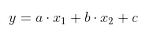
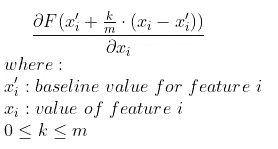
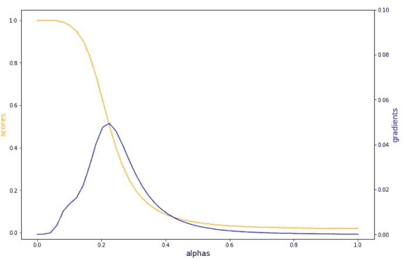

# 从头开始集成渐变

> 原文：<https://towardsdatascience.com/integrated-gradients-from-scratch-b46311e4ab4?source=collection_archive---------13----------------------->

## 一个直观的算法来解释任何深度学习模型

当阅读一篇论文时，我认为深入相关代码以更好地理解它总是好的。虽然代码通常很长，有很多优化和实用函数，很容易丢失。在这篇文章中，我将尝试用几行代码复制论文中的算法。

## 介绍

可解释的人工智能是当今的热门话题。如果一家公司想要采用人工智能解决方案，并使用它来做出直接影响客户的决定，它还需要有能力向客户和监管机构解释这些决定。有各种各样的方法来解释一个模型，特别是他们可以分为模型不可知和模型特定的方法。例如，当我们用一个简单且可解释的模型在局部近似一个复杂的模型时，LIME 是模型不可知的，因为它不需要知道模型的内部结构，但是您可以简单地将 *predict* 函数传递给它并得到解释。相反，像集成梯度这样的方法是特定于模型的，它们需要知道内部模型，以便计算组成模型的层的梯度。

这是使用集成梯度解释深度神经网络模型系列的第一篇文章。在第二步中，我将覆盖 [*层的电导*](https://medium.com/@alexml0123/layer-conductance-from-scratch-df53005e08b8) ，再次使用 Pytorch *亲笔签名的*来计算渐变。

## 了解集成渐变

为了理解积分梯度，让我们首先从如何解释一个简单的线性模型开始:

作者图片

*x1* 对 *y* 的作用是梯度乘以 *x1* 的值，所以 *a * x1* 。

在处理深度学习模型时，像线性模型一样简单地看梯度可能会有问题。如果在这里代表深度学习模型的 *f(x)* 在 *x* 、 *df(x)/dx = 0* 附近是平坦的，因此 *x * df/dx = 0* 使你相信特征 *x* 是不相关的。发生这种情况是因为我们将模型训练到饱和，因此预测分数在输入附近接近平坦。因此，将 *x* 改变少量 *dx* ，因为表面 *df(x)/dx* 在那附近是平坦的，它将总是给我们零——我们不看相关的梯度。因此，为了捕捉相关梯度，我们需要了解梯度如何沿着从基线(通常为零，但取决于应用)到特征值的线性路径变化。

[https://arxiv.org/pdf/1703.01365.pdf](https://arxiv.org/pdf/1703.01365.pdf)公式(1)

## 履行

现在来看一个具体的例子。我们将定义一个简单的模型，并使用 titanic 数据集:

让我们使用*亲笔签名的*来计算梯度，并绘制不同 *k* 下*年龄*的梯度变化。

作者图片

*注意:梯度为绝对值*

*α= 1(式(1)中 k=m)时的得分*对应于实际输入时的预测，而*α= 0(式(1)中 k = 0)*是基线时的预测。查看 *alpha = 1、*附近的梯度，我们可以观察到模型的饱和度，因为那里的梯度都接近于零，这就是为什么如果我们简单地查看 *df/dx* 它将为零，并且不会给我们一个有意义的特征属性。

现在，如果我们取这些梯度的平均值，我们得到*年龄的特征属性:*

注意:如果我们设置*方法=‘riemann _ 梯形’*，这相当于 *captum* 积分梯度法。(参见注释行 21)

## 结论

正如开始提到的，在这篇文章中，我想展示一个快速简单的集成渐变实现。如果您将它用于您的工作，您不需要从头重写它——使用伟大的 *captum* 库为您完成所有工作。尽管在这篇文章中，我展示了表格数据的实现，但集成梯度可以用于任何深度学习模型，包括 NLP 和计算机视觉。

## 参考

[1]https://arxiv.org/pdf/1703.01365.pd[福](https://arxiv.org/pdf/1703.01365.pdf)

[https://captum.ai/tutorials/Titanic_Basic_Interpret](https://captum.ai/tutorials/Titanic_Basic_Interpret)