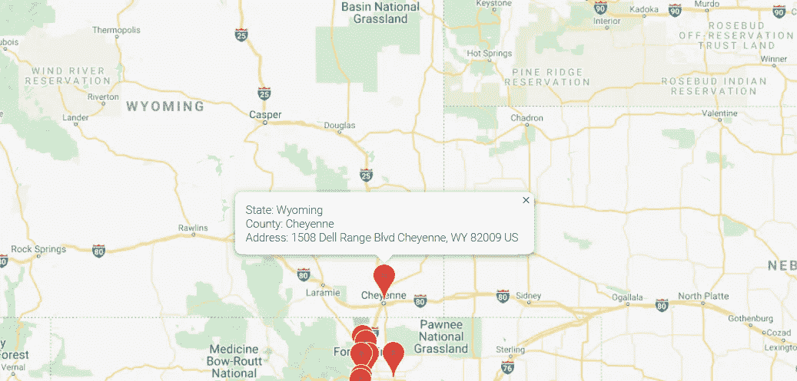

# 使用 Python 和 JavaScript 集成 Google Maps API

> 原文：<https://towardsdatascience.com/integrating-google-maps-api-using-python-and-javascript-149fdba27b99?source=collection_archive---------4----------------------->

## 关于如何使用 Python 和 JS 将 Google Maps API 整合到网页中的编码指南。


照片由 [**NASA**](https://unsplash.com/@nasa?utm_source=unsplash&utm_medium=referral&utm_content=creditCopyText) 拍于 [**Unsplash**](https://unsplash.com/s/photos/map?utm_source=unsplash&utm_medium=referral&utm_content=creditCopyText)

想象一下:你正在为你自己或你的观众写一段精彩的代码(程序员说永远不会写的东西)，关于最好的旅游目的地或要去的咖啡馆，或者某个地区的公用事业商店，或者某天你想去的地方，等等。将注意力引向一个地点并提供方便访问的最佳方式是使用一张标明该地点的地图，并提供任何必要的信息和链接。

> 迷失方向的感觉真好。

在这个故事中，我将用代码解释如何做到这一点。

# 要求

1.  [**Python**](https://www.python.org/downloads/) 及其 web 微框架， [**烧瓶**](https://pypi.org/project/Flask/) 。
2.  一个 [**api 键**](https://developers.google.com/maps/documentation/embed/get-api-key) 用于与谷歌 api 一起工作。
3.  像 HTML，CSS， [**JQuery**](https://www.w3schools.com/jquery/jquery_get_started.asp) 和 JavaScript 这样的网络技术。

已插入获取上述内容的链接。

作为参考，文件目录结构:

```
.
├── chipotle_stores.csv
├── app.py
├── processdata.py
├── html
│   ├── index.html
│   ├── index.css
│   └── index.js
```

# 要显示的目标文件

为了在地图上指出一些位置，你需要一些数据。更具体地说:位置、它们的坐标以及关于它们的一些信息。后者是可选的，但前者是绝对必须的。

在这种情况下，我们将使用一个包含美国所有 Chipotle 位置的 [**Kaggle 数据集**](https://www.kaggle.com/jeffreybraun/chipotle-locations/download) 。


照片由 [**多丽丝·摩根**](https://unsplash.com/@d_morgan?utm_source=unsplash&utm_medium=referral&utm_content=creditCopyText) 拍于 [**Unsplash**](https://unsplash.com/s/photos/chipotle?utm_source=unsplash&utm_medium=referral&utm_content=creditCopyText)

将这个 csv 文件下载并保存在基目录中后，数据被处理成可以在不同域中使用的格式:JSON。将执行上述任务的文件命名为 **processdata.py** 。

在这种情况下，预处理只包括:

1.  使用 [**和**](https://pypi.org/project/pandas/) 加载和读取 CSV 文件
2.  使用 pandas 的 [**to_dict()**](https://pandas.pydata.org/pandas-docs/stable/reference/api/pandas.DataFrame.to_dict.html) 函数将 csv 转换成一个 JSON 友好格式的列表。

## **processdata.py**

```
# Importing the pandas package.
import pandas as pddef processdata(): # Loading and reading the CSV file.
    df = pd.read_csv('chipotle_stores.csv', delimiter = ',') # Converting the CSV data to a list.
    df = df.to_dict(orient = 'records') return df
```

添加了一个返回语句，因为 Flask 应用程序将调用该程序，以获得 CSV 数据作为**列表**数据类型。

# 创建烧瓶应用程序

Flask 是一个用 Python 编写的 web 微框架，可用于创建 API 并在本地和外部托管应用程序，即使后者不是一个安全的选项。在我们的例子中，即将 Google Maps API 集成到应用程序中，Flask 正是我们所需要的，因为它为实验和探索提供了一个非常强大和安全的基础。

让 flask 应用程序的代码在 **app.py** 中。可以通过五个简单的步骤部署应用程序:

1.  导入所需的烧瓶包。

```
from flask_cors import CORS
from flask import Flask, jsonify
```

2.导入实用函数，在这种情况下，它是将 CSV 转换为更合适格式的程序。

```
from processdata import processdata
```

3.为 Flask 应用程序创建一个变量和一个 URL 路由。这里， **jsonify** 用于将 list 数据类型转换为 **JSON** ，因为 JavaScript 无法读取 list 类型的数据。

```
app = Flask(__name__)
CORS(app)# In this case, the URL route is 'displaylocations'.
@app.route('/displaylocations')
def displaylocations(): # Obtain the CSV data.
    l = processdata() # Forward the data to the source that called this API.
    return jsonify(l)
```

4.根据您的选择，输入主机名和端口号。

```
if __name__ == '__main__':
    app.run(host = <host_name>, debug = True, port = <port_no>)
```

## **app.py**

```
from flask_cors import CORS
from flask import Flask, jsonifyfrom processdata import processdataapp = Flask(__name__)
CORS(app)@app.route('/displaylocations')
def displaylocations():
    l = processdata()
    return jsonify(l)if __name__ == '__main__':
    app.run(host = <host_name>, debug = True, port = <port_no>)
```

5.最后，下面的命令需要在您系统的 shell 中执行。

```
python app.py
```

输入最后一个命令后，可以在 http://<host_name>:<port_number>/display locations 查看原始 JSON 格式的数据。</port_number></host_name>

# 创建服务器端应用程序

服务器端应用程序由 HTML、JS 和 CSS 文件组成。我们的服务器应用程序包括:

## **index.html**

```
<div id="map"></div><script type="text/javascript" src="index.js"></script>
<script src="https://maps.googleapis.com/maps/api/js?key=key"></script><script>
    var url = `http://<host_name>:<port_no>/displaylocations`;
    $.ajax({
        type: `GET`,
        url: url,
        success: function(response) {
            initMap(response);
        }
    });
</script>
```

1.  创建一个 HTML **div** 元素来放置 Google Maps 地图。
2.  导入 **index.js** 文件是为了处理我们从 flask 应用程序获得的数据。
3.  Google Maps JS 文件也被导入。**注**:要使用谷歌的服务，需要一个密钥，可以在 [**这里**](https://developers.google.com/maps/documentation/embed/get-api-key) 获得。
4.  此外，还需要导入 JQuery 文件，以便直接从 HTML/JS 文件中调用 Flask API。 [**参考**](https://www.w3schools.com/jquery/jquery_get_started.asp) 。
5.  现在，从我们部署的 Flask 应用程序中调用了**显示位置** API。如果调用成功，位置数据将存储在变量: **response** (或者您选择的任何名称)。

## 索引. js

```
function initMap(data) {

    var center = {lat: data[0][`latitude`], data[0][`longitude`]};
    var map = new google.maps.Map(document.getElementById('map'), {
        zoom: 4,
        center: center
    });

    var infowindow =  new google.maps.InfoWindow({});
    var marker;

    data.forEach(e => {
        marker = new google.maps.Marker({
        position: new google.maps.LatLng(e[`latitude`], e[`longitude`]),
        map: map,
        title: e[`address`],
    }); google.maps.event.addListener(marker, 'click', (function (marker) {
            return function () {
                infowindow.setContent(`State: ${e[`state`]<br>County: ${e[`location`]}<br>Address: ${e[`address`]}`);
                infowindow.open(map, marker);
            }
        })(marker));
    });
}
```

1.  函数 **initMap** 将位置数据初始化为 HTML 文件中的**响应**，作为输入，并使用第一个元素初始化“center”变量，基本上是地图将居中的点。
2.  **map** 变量创建一个新的 Google map，并将其放在 id 为“map”的 div 元素中。设置了**缩放**和**居中**等属性。其余的属性都列在 [**这里**](https://developers.google.com/maps/documentation/javascript/reference) 。
3.  还创建了一个 [**信息窗口**](https://developers.google.com/maps/documentation/javascript/infowindows) 。infowindow 基本上是一个弹出窗口，或者是一个在 DOM 事件发生时打开的窗口，比如单击、鼠标悬停等等。
4.  所有基本结构初始化后，我们循环遍历位置列表中的所有元素，为每个位置创建 [**标记**](https://developers.google.com/maps/documentation/javascript/markers) 。还添加了侦听器，在本例中，当单击一个标记时会显示 infowindow。关于如何添加其他类型监听器的信息可以在 [**这里**](https://developers.google.com/maps/documentation/javascript/events) 看到。

## index.css

```
#map {
    height: 600px;
    width: 100%;
    background-color: grey;
}
```

在 index.css 文件中，我们将地图的宽度设置为 100%,高度设置为 600 像素，背景为灰色。

现在剩下的就是部署这个服务器应用程序，这可以通过使用 http.server python 包来完成。

```
python -m http.server --cgi <port_no>
```

这个命令与 flask 应用程序的部署一样，是从系统的 shell 中执行的。应该从 index.html 文件所在的文件夹中执行**，在这种情况下是 **html** 文件夹。**

因此，在部署了服务器和 Flask 应用程序之后，当服务器应用程序 http:// <server_host>: <port>在浏览器中打开时，我们会看到所有的 Chipotle 位置都绘制在地图上。</port></server_host>


地图上标出了所有墨西哥小吃店的位置。

单击标记时，将打开信息窗口，其中包含有关该特定位置的所有详细信息。



有趣的事实:这是怀俄明州唯一的墨西哥卷饼！！

鉴于可用性，更多的信息，如方向，打开/关闭状态，评论也可以包括在内。

资源:

*   [**谷歌地图 Javascript API 参考**](https://developers.google.com/maps/documentation/javascript/reference/3/)
*   [**Chipotle 位置数据集**](https://www.kaggle.com/jeffreybraun/chipotle-locations/download)
*   [**JQuery 入门**](https://www.w3schools.com/jquery/jquery_get_started.asp)

祝您在数据科学之旅中好运，感谢您的阅读:)