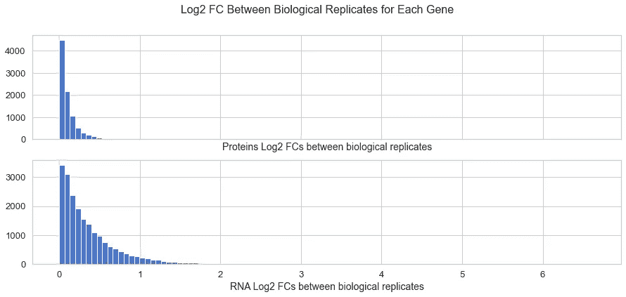

# 使用 UMAP 和聚类整合组学

> 原文：<https://towardsdatascience.com/integrating-omics-using-umap-and-clustering-d2a5ef39693f?source=collection_archive---------6----------------------->

## [实践教程](https://towardsdatascience.com/tagged/hands-on-tutorials)

## 使用 Python 通过降维和聚类对蛋白质组和转录组数据的联合无监督探索


蛋白质组和转录组数据集的联合 2D 嵌入和随后的聚类。作者图片

如今，生命科学是由数据驱动的。你可能听说过基因组学、转录组学、蛋白质组学，即使你不是生物学家或医学研究者。 [*组学*](https://en.wikipedia.org/wiki/Omics) 是试图整体理解细胞、组织或有机体子系统的科学方法，它们在此过程中产生大量信息。这些技术在产生数据方面做得越好，就越需要新的计算方法来处理数据。

我对整合蛋白质组学数据和其他组学的信息，主要是转录组学的信息很感兴趣。简而言之，蛋白质组学旨在确定生命系统中蛋白质的水平、功能和相互作用，而转录组学则捕捉基因表达产物 RNA 分子的快照。基因表达和蛋白质的功能错综复杂地联系在一起，因此一起探索它们结合了细胞拼图的两个关键部分。组学整合的计算方法正在积极开发中:参见，例如，多组学因子分析(MOFA 和 [MOFA+](https://bioconductor.org/packages/release/bioc/html/MOFA2.html) 包)[1]或[混合组学](http://mixomics.org/) [2]。这些包涵盖了各种数据类型的监督和非监督集成的一系列用例。


实现组学技术的自动化设备。[国立癌症研究所](https://unsplash.com/@nci?utm_source=medium&utm_medium=referral)在 [Unsplash](https://unsplash.com?utm_source=medium&utm_medium=referral) 上拍摄的照片

最近，我将注意力转向了被称为[一致流形逼近和投影](https://umap-learn.readthedocs.io/en/latest/)，或 UMAP【3】，【4】的降维技术。是的，我参加聚会迟到了，但迟到总比不到好！我真正感兴趣是在我读了 [TDS 博客的一篇文章](/umap-for-data-integration-50b5cfa4cdcd)之后，文章作者是[尼古拉·奥斯科尔科夫](https://medium.com/u/8570b484f56c?source=post_page-----d2a5ef39693f--------------------------------)，他利用 UMAP 构建了一个单细胞 RNA-seq 和蛋白质组数据的组合嵌入。对我来说很明显，UMAP 提供了一种在混合数据集中寻找内部结构的工具，我想知道这是否可以成为一种有效的方法，根据蛋白质和 RNA 水平上的丰度分布联合聚类基因，这项任务因基于质谱的蛋白质组学和转录组学中获取数据的方式不同而变得复杂。

# 加载和格式化数据

在本帖中，我们将重复使用 Hultqvist 和合著者的[论文中的数据，包括发表在同行评审期刊《自然生态&进化【5】上的 yours truly。手稿在付费墙后面，但数据集是公开的，这要感谢鼓励透明和共享研究数据的出版政策。基于质谱的蛋白质组数据](https://www.nature.com/articles/s41559-018-0568-5)[可以在蛋白质组鉴定数据库(PRIDE)中找到](https://www.ebi.ac.uk/pride/archive/projects/PXD005236)；如果没有该领域的经验，将质谱文件转换成蛋白质水平的数据可能会很复杂，因此我重新处理了它们以获得一个全面的蛋白质表，该表被放入本文的 [GitHub 存储库中。RNA-seq 转录组数据](https://github.com/dev-ev/prot-rna-umap-clustering)[可通过基因表达综合](https://www.ncbi.nlm.nih.gov/geo/query/acc.cgi?acc=GSE92601) (GEO)公开获得，我已经从页面下载了 RPKM(每千碱基每百万次阅读的阅读数)表。你们当中对这项研究的生物学方面感兴趣的人可以参考 GEO 项目的网页来获得样本的描述。

实验由属于 5 种不同条件的*大肠杆菌*细胞组成，我将它们称为 WT(野生型，一种默认的细胞培养物)、ORF、ORF+IPTG、SVI 和 SVI+IPTG(经过基因改造和化学处理的细胞)。每种条件下有两种平行生长的细胞培养物，我们称之为生物复制物。一式两份培养样品的目的是评估培养引起的变化，而不是由条件之间的差异引起的变化。

完整的 Jupyter 笔记本可以在 [Github 资源库](https://github.com/dev-ev/prot-rna-umap-clustering)中找到，这里我将只展示最相关的代码片段。我们需要 umap-learn、scikit-learn 和通用数据分析库:

加载蛋白质组和 RNA 序列数据:

```
(1955, 48)
(4205, 37)
```

这些表包含一堆列，其中大部分对于这个分析是不必要的。我们将为每个蛋白质添加基因名称(将蛋白质与 RNA-seq 中的基因联系起来)，选择丰度列并对它们进行对数转换:

蛋白质组表中的每一行相对丰度都表示为一个比率，该蛋白质的 WT1 丰度作为分母。这对于这种特定的蛋白质组技术来说是相当典型的(所谓的[同量异位标记](https://en.wikipedia.org/wiki/Isobaric_labeling)，[链接到供应商的网站](https://www.thermofisher.com/se/en/home/life-science/protein-biology/protein-mass-spectrometry-analysis/protein-quantitation-mass-spectrometry/tandem-mass-tag-systems.html)获取信息)，它强调丰度数据的相对性质，同时保留关于丰度变化的可变幅度的信息。使用同量异位标记的实验的一般想法是从每个样品中获取**等量的总蛋白质质量**。因此，我们预计样本之间蛋白质丰度的中值比率约为 1.0，因为一些蛋白质上升，一些蛋白质下降，而总蛋白质量保持不变。与中值的偏差可能是由样品制备的缺陷引起的，我们可以通过重新归一化数据进行补偿，使每个样品的中值在对数空间中等于零:


蛋白质组分布现在非常对称，以零为中心！

RNA-seq 表中的 RPKM 值分布非常不同:


以与蛋白质组数据相同的方式格式化 RNA-seq 数据可能是一个好主意:使用 WT1 强度作为每个基因的分母，并对所得比率进行对数转换:


重新归一化为相等的中间值:


# 选择方差最大的基因

由于生物数据的大量特征和噪声性质，仅选择**最具信息性的特征**用于进一步分析是有意义的。你可以在[尼古拉·奥斯科尔科夫](https://medium.com/u/8570b484f56c?source=post_page-----d2a5ef39693f--------------------------------)的[另一篇文章](/select-features-for-omics-integration-511390b7e7fd)中找到对功能选择的深刻见解。

我们的数据集有 5 个生物条件，每个条件 2 个重复。为什么我们不在这里利用复制进行特性选择呢？简而言之，我们想要在生物条件下具有“强烈变化”的信息特征，并且我们希望过滤掉保持相对不变的特征。我们可以用一种独立的方式定义“强变化”:如果条件之间的变化**超过了条件**内重复**之间的大部分变化值，那么它就是“强变化”。我们可以计算每个蛋白质/基因重复之间的 log2 差异:**



RNA-seq 数据集中的差异明显更大。现在让我们看看这些条件的平均值之间的差异:

蛋白质表中的平均分组:

RNA 表中的平均组数:


现在我们可以看到，对于 RNA-seq 数据集，重复之间和条件之间的差异更大。这可能是因为 RNA 数据比蛋白质组数据更嘈杂，和/或因为与本研究中使用的质谱法相比，RNA-seq 测量的动态范围更高。

准备就绪后，让我们按基因名称连接这些表，并选择其中**或者**平均蛋白质值之间的最大变化高于蛋白质重复差异的第 90 百分位**或者**平均 RNA 值之间的差异高于 RNA 重复差异的第 90 百分位的行:

```
Proteins 90th percentile: 0.2658608755331754
RNA 90th percentile: 0.8764194924938945
Before: (1778, 32)
After: (951, 32)
```

# UMAP 嵌入

UMAP 的数据已经准备好了！我们将从每行中选择蛋白质和 RNA 的平均值，因为我们希望强调生物条件之间的差异，而忽略条件内的变化。我们也可以排除 WT 样本，因为根据我们数据转换的本质，所有的值都非常接近于零(分母中的 WT1)。让我们计算并可视化蛋白质和 RNA 上的独立嵌入，以及联合嵌入:


太好了，我们可以看到集群正在形成！聚类的形状和分布将因设置而异，包括重要的 n_neighbors 参数。我和 n_neighbors 在 10 到 100 的范围内玩，定在 30，接近特征数的平方根(951)。

# 使聚集

Scikit-Learn 为我们提供了一系列可以应用于嵌入结果的聚类选项。由于我们在图上看到了密集的集群，因此尝试基于密度的集群或 **DBSCAN** 是很自然的。eps 参数很重要，应该根据数据进行调整。我们也可以应用其他常用的算法，例如，**均值漂移**和**凝聚**聚类。这些情况下的关键参数分别是带宽和集群数量。让我们看一下通过这三种方法完成的集群概述:

```
Found clusters 52
Found clusters 43
Found clusters 45
```


从鸟瞰图来看，算法以不同的方式突出了散点图上的点的密度簇和“星座”。但是他们捕捉到了行为相似的基因群吗？为了判断这一点，我们可以用热图来表示每个星团中的相对丰度。让我们以 DBSCAN 结果为例:


看起来这些星团确实有一致的内部结构！如有必要，调整聚类参数有助于进一步调整结果组的大小和组成。在组学整合的背景下，探索显示蛋白质谱(P-样本)和 RNA 谱(R-样本)之间差异的聚类是令人兴奋的。以集群 36 和 37 为例:


我们可以看到一些有趣的相对丰度的轮廓，其中蛋白质和转录物明显不同步！此外，簇中的基因可能彼此相关。探索性的数据分析为进一步的科学研究提供了有趣的候选者！

# 结论

对来自同一实验的蛋白质组和转录组数据的联合 UMAP 嵌入和随后的聚类是突出相似行为基因组的直接方法。在这篇文章中，我们研究了数据过滤、使用 umap-learn 包的 UMAP 降维以及使用 scikit-learn [中实现的三种算法的聚类。](https://github.com/dev-ev/prot-rna-umap-clustering)

# 参考

[1] Argelaguet *等* [MOFA+:多模态单细胞数据综合整合的统计框架](https://doi.org/10.1186/s13059-020-02015-1) (2020)，Genome Biol 21，111

[2] F. Rohart *等* [混合组学:一个用于“组学特征选择和多重数据整合”的 R 包](https://doi.org/10.1371/journal.pcbi.1005752) (2017)，PLOS 计算生物学 13(11): e1005752

[3]麦金尼斯，希利 [UMAP:统一流形逼近和降维投影](https://arxiv.org/abs/1802.03426v3) (2018)，ArXiv 电子版 1802.03426，2018]

[4] E. Becht *等* [使用 UMAP](https://www.nature.com/articles/nbt.4314) (2019)，Nat Biotechnol 37，38–44 可视化单细胞数据的降维

[5]j . jerlstrm Hultqvist*等* [一种噬菌体酶诱导细菌代谢扰动，赋予一种新的混杂功能](https://doi.org/10.1038/s41559-018-0568-5) (2018)，Nat Ecol Evol 2，1321–1330