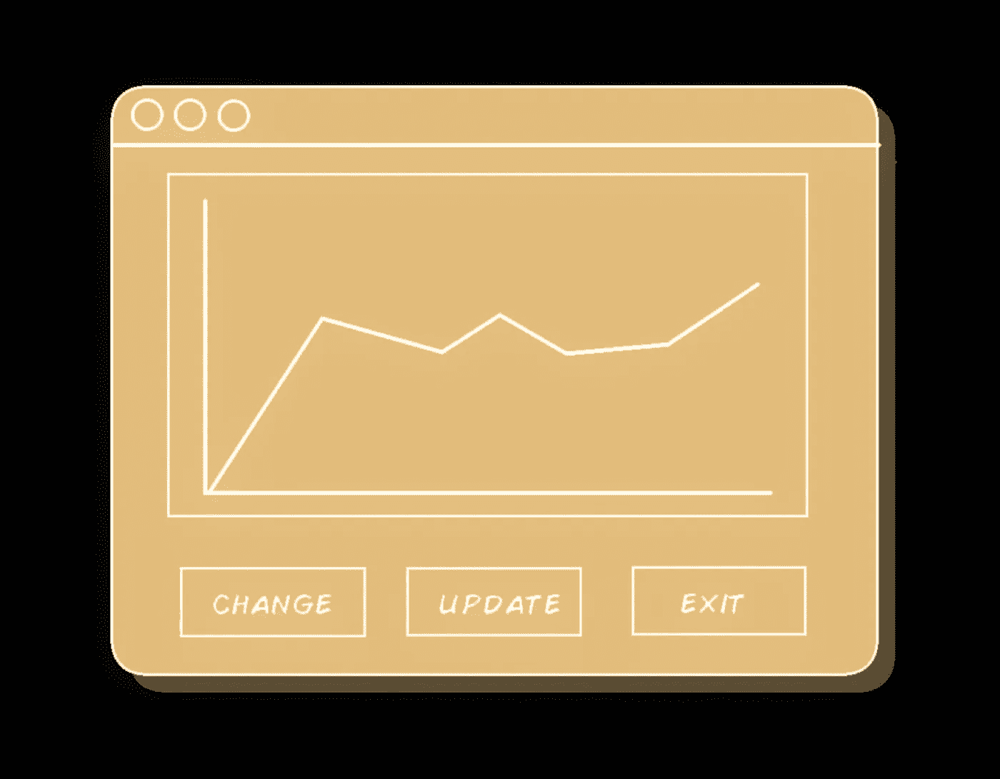
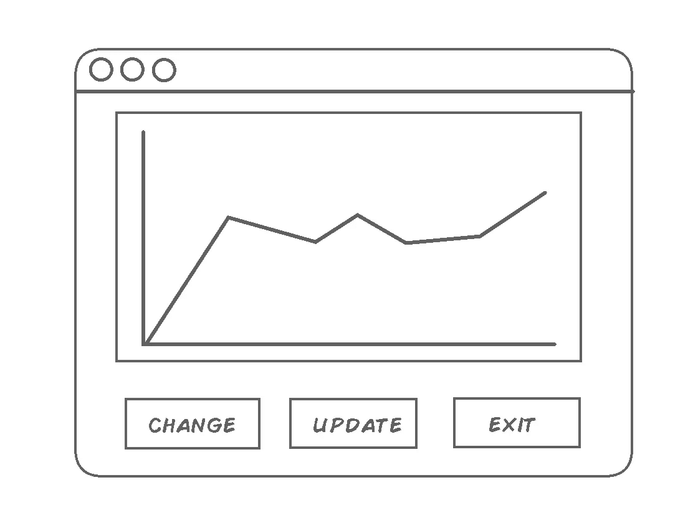
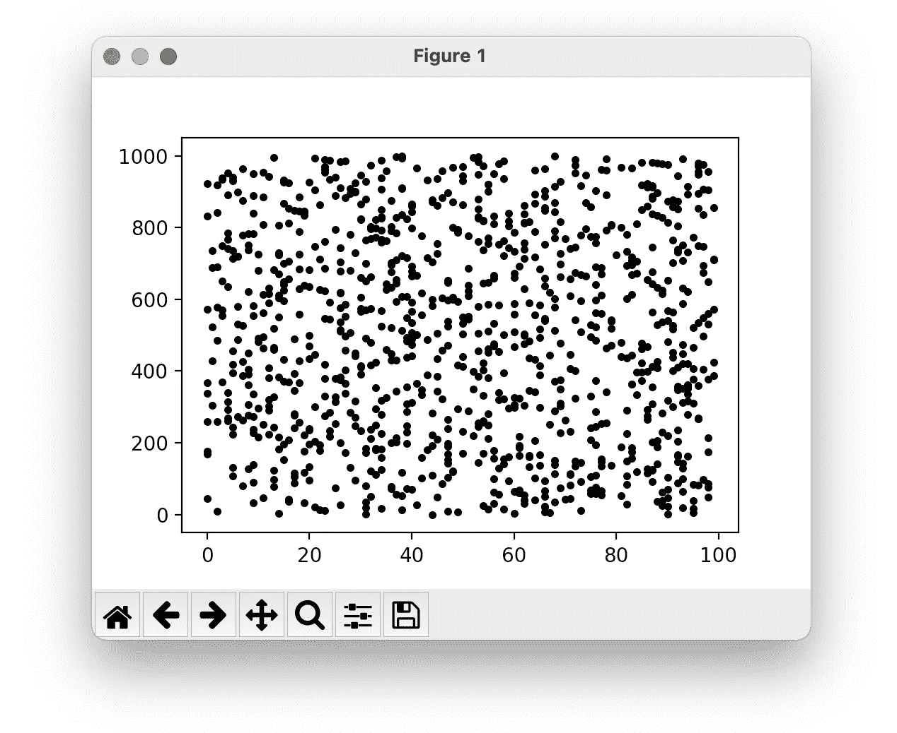
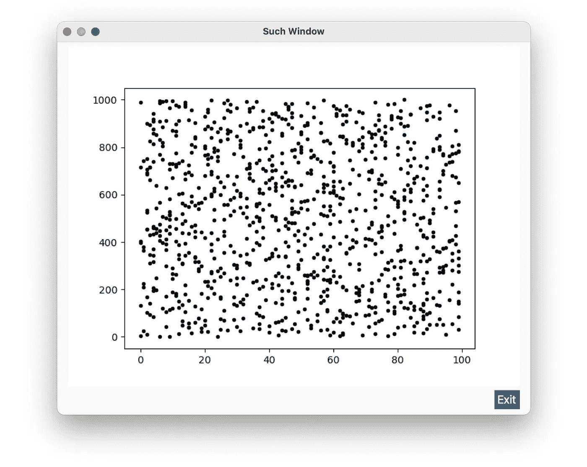
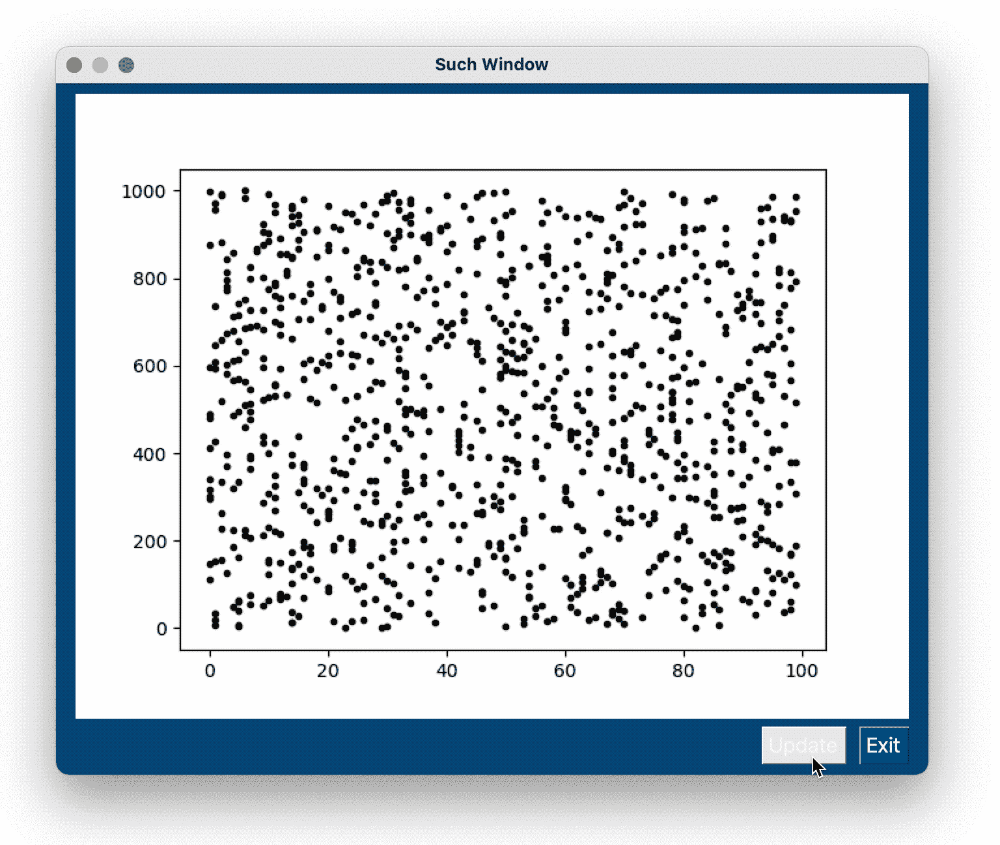
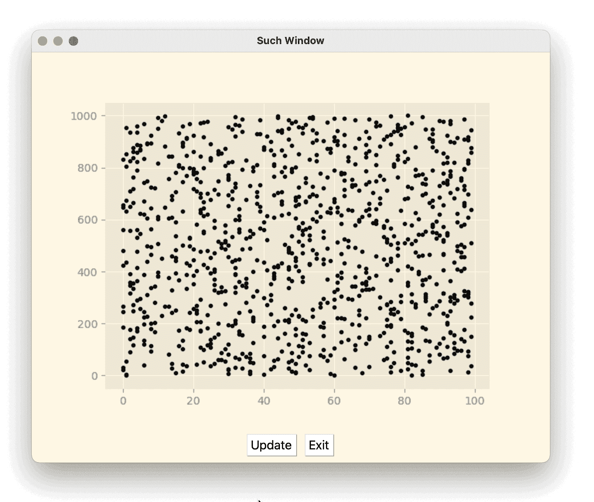
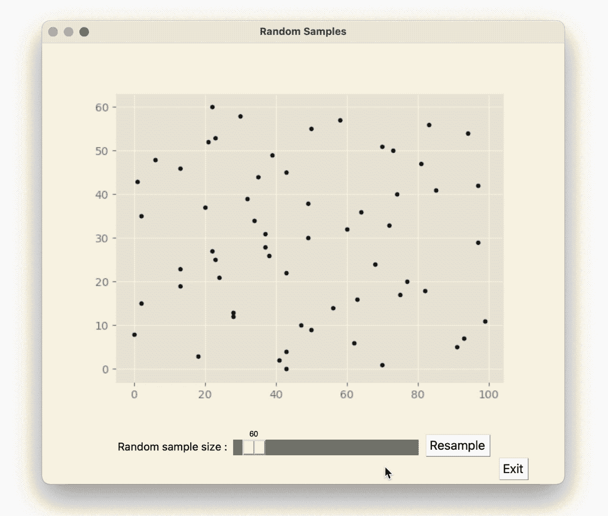

# 集成 PyPlot 和 PySimpleGUI

> 原文：<https://towardsdatascience.com/integrating-pyplot-and-pysimplegui-b68be606b960?source=collection_archive---------4----------------------->



所有图片由作者提供

## 一个实用的数据即解决方案。

## 这是给谁的？

如果你是一名数据科学家或者有一些 python 中的数据可视化需求，你可能正在使用[](https://matplotlib.org/stable/api/_as_gen/matplotlib.pyplot.html)**PyPlot，如果你需要与你的绘图交互或者制作一个独立的程序，你将需要将 py plot 与 GUI 库集成。我之所以使用 [**PySimpleGUI**](https://pysimplegui.readthedocs.io/en/latest/) 是因为当我想快速地将东西放在一起并演示一个工作程序时，我会使用它。**

```
⚠️ **Caveat Emptor:** There are other patterns and ways to code the same functionality, this is what makes sense to me, if you want to learn more check these related posts: [**Organizing your python code**](https://k3no.medium.com/organizing-your-python-code-ca5445843368) and [**Alternatives to using globals Python**](https://betterprogramming.pub/alternatives-to-using-globals-in-python-a3b2a7d5411b). There are also other GUI Libraries you might want to check via the following introductory posts, in addition to [**PySimpleGUI**](https://levelup.gitconnected.com/uis-in-python-with-pysimplegui-e5cd8ea275e8) I currently like [**KIVY**](https://k3no.medium.com/kivy-menagerie-af6a53e74695) and [**PyQT/PySide**](https://medium.com/swlh/python-gui-with-pyqt-pyside2-5cca38d739fa)**.**
```

## **投机**

**我们想要的是一个交互式的绘图，我的意思是你在 UI 中有一些影响绘图的控件，它可以从不同的数据系列或其他数据中选择，出于演示的目的，我们的规范将只有几个基本的调用来进行交互，但希望你能适应你的项目…**

****

**imho 规范是建议性的，而不是决定性的，我的意思是，最终结果可能不会像上面那样，但会做所代表的一切，甚至可能看起来更好。**

## **婴儿学步**

**在将 Pyplot(或任何其他库)与 GUI 集成之前，我发现拥有一个可工作的最小化脚本是一个好主意，这样您可以稍后将它插入 GUI:**

****

```
👋👋 Hi there 👋👋 all my content is free for Medium subscribers, if you are already a subscriber I wanted to say thank you ! 🎉 If not and you are considering subscribing, you can use my membership referral link, you will be supporting this and other high quality content, Thank you !**⭐️⭐** [**Subscribe to Medium !**](https://k3no.medium.com/membership) **⭐️⭐️**
```

## **最小 PySimpleGUI Pyplot 集成**

**下一步是抓住这个最小的例子，并把它添加到 PySimpleGUI 中，UI 集成的关键是，有时你必须有一个各种各样的桥梁，帮助器方法，或者下降到两个库可以相互对话的水平，在这个例子中是 tkinter canvas。**

****

```
Note that we lost the toolbars from PyPlot, mostly to keep things simple and use the GUI to interact with the plot, if you still need the toolbar check this demo program:[https://github.com/PySimpleGUI/PySimpleGUI/blob/master/DemoPrograms/Demo_Matplotlib_Embedded_Toolbar.py](https://github.com/PySimpleGUI/PySimpleGUI/blob/master/DemoPrograms/Demo_Matplotlib_Embedded_Toolbar.py)
```

## **更新图表**

**要更新图表，我们需要重新绘制它，这意味着我们需要删除它，修改它，然后在画布上再次绘制它…**

```
⚠️ **A few new things in this script:** We have new methods to deal with the plot update ( I am calling it chart in the methods to differentiate the methods, the plot and the figures ), there are also new "global" variables for the figure and plot so we can reference them after creating them, a new button and event catcher for the UI part and a new method to update the chart/plot/figure where we actually do the updating, one last upgrade is the makeSynthData method (always be refactoring). 
```

****

**还改变了主题，以突出闪烁的更新。**

**好消息是，它的工作，我们现在有一个可更新的情节，它似乎工作得很好，唯一的问题是，更新似乎有点不和谐，这是由于画布重绘，并证明是一个不那么微不足道的问题…**

```
💁 Like many things in life, getting rid of bugs in programs seems to follow the [Pareto Principle](https://en.wikipedia.org/wiki/Pareto_distribution), that is 20% of the final improvements can take 80% of your time and add considerable complexity ( *I guess* t*he flip side might be that 20% of your time will give you 80% of the program* ). In this case getting a smooth update would perhaps entail integrating PyPlot at a lower level, introducing threads and on and on, read here if you want to go this route : [How to update a plot in matplotlib?](https://stackoverflow.com/questions/4098131/how-to-update-a-plot-in-matplotlib)
```

## **折衷解决方案。**

**解决这种困境的一个简单的方法是简单地使用你所拥有的东西，找到简单的替代方法，这里我只是简单地将 Pyplot 风格与 PysimpleGUI 主题相匹配，这样会有更好的体验:**

**应该给你:**

****

```
⚠️ Matching themes across libraries can be time consuming, getting the exact colors for an element might require you to dig through the documentation, my quick alternative is to simply use a color picker, so here I first changed the theme to **Solarize_Light**, and then got the colors for PySimpleGUI with a color picker (I like [colorslurp](https://colorslurp.com) ). 
```

## **发展**

**经过这个小小的迂回之后，剩下要做的就是添加更多的按钮和调用来修改你的情节，例如，让我们用一个滑块来改变`**dataSize**` 变量…**

**应该给你:**

****

**看在我当初的 spec 上，叶不可一世，**绝望**！但是说真的，它做了规范中说的所有事情。**

```
**Some Final Changes:** I've added a [**slider**](https://pysimplegui.readthedocs.io/en/latest/call%20reference/#slider-element) element to take care of the sample size ( also renamed everything so it makes some Data Science sense ) this slider simply changes the now global dataSize variable and calls the **updateChart** method we've been using, I left the update button but renamed it to resample. The rest of the changes are visual ones( check the **layout** definition) note that most of the alignment is done via padding.
```

**总而言之，我可以演示这一点，我希望它能作为你制作自己的快速数据即仪表板实验的起点。**

**感谢阅读！**