# 将 Scikit-learn 机器学习模型集成到微软。NET 生态系统使用开放神经网络交换(ONNX)格式

> 原文：<https://towardsdatascience.com/integrating-scikit-learn-machine-learning-models-into-the-microsoft-net-7eaec29e8669?source=collection_archive---------28----------------------->

## [行业笔记](https://towardsdatascience.com/tagged/notes-from-industry)

## 使用 ONNX 格式将经过培训的 Scikit-learn 销售线索评分预测模型部署到。网络生态系统

照片由米格尔·Á拍摄。佩克斯公司的帕德里安

作为设计和开发 lead scoring 系统原型的团队的一员，我面临着将机器学习模型集成到围绕[微软构建的目标环境中的挑战。网络生态系统](https://dotnet.microsoft.com/)。从技术上来说，我使用 [Scikit-learn](https://scikit-learn.org/) 机器学习内置算法实现了领先得分预测模型，用于回归，更准确地说是[逻辑回归](https://scikit-learn.org/stable/modules/generated/sklearn.linear_model.LogisticRegression.html)。考虑到初始数据分析、数据预处理、探索性数据分析(EDA)以及模型构建本身的数据准备阶段，我使用了由 [Anaconda](https://www.anaconda.com/) 发行版支持的 [Jupyter Notebook](https://jupyter.org/) 环境进行 [Python](https://www.python.org/) 科学计算。之前，我在 [Flask 中研究和接触过 Python，它是用这种编程语言编写的一个微型 web 框架](https://flask.palletsprojects.com/en/2.0.x/)。然而，我的目标是将 Python 编写的机器学习模型集成或部署到。NET 生态系统，使用 [C#编程语言](https://docs.microsoft.com/en-us/dotnet/csharp/)和 [Visual Studio IDE](https://visualstudio.microsoft.com/) 。

**注意:本文中给出的源代码仅用于演示目的——简化到强调核心概念、库和转换解决方案的程度。*

# 什么是销售线索评分？

销售线索评分代表一种共享的销售和营销方法，用于对销售线索进行排名，以描述他们对公司的销售准备程度的潜力。这是一种为公司的销售线索数据库分配不同值的技术，通过转换为“热门线索”和官方客户来指导营销和销售团队。从战略角度来看，销售线索评分被认为是调整公司战略、提高销售团队绩效和效率的重要过程。

# 为什么这个故事里有 ML？

通常，数字营销、销售线索挖掘和销售团队会生成大量销售线索数据，这些数据通常以预定的结构化格式存储在单个或多个平台上。由于数据是即将到来的数字时代的新石油，公司如何处理和分析数据至关重要。然而，假设人类的专业知识足以检索有价值的数据洞察，那么将需要许多团队和人员。但是，即使这是完全正确的，它也只是一种可持续的模式，只适用于拥有丰富经验和资深数字营销、销售和商业分析背景的大型企业。

另一方面，机器学习方法在提到“大数据”这个热门术语后自然会立即出现。总的来说，机器学习算法不会取代人力资源，而是作为一种补充工具，改善和提高线索转化的过程和速度。利用数据背后的数学和统计学，机器学习可以打开视野，并“捕捉”人类肉眼目前无法“看到”的其他深入见解和结论。在有监督的机器学习领域，采用线索评分作为用例是值得一提的。我们可以使用生成数据的完整历史(作为监督学习方法的先决条件的标记数据集)。

# 图片中的 ONNX

在开发了用于销售线索评分的机器学习回归器之后，我开始研究将其集成到。NET 世界，用 C#编程语言访问它。不管目标环境是什么，这都是一个广泛讨论的话题，目标环境可以是 Keras、TensorFlow 或 Java 中的模型部署。总的来说，我不认为这是一个问题，而更像是一个解决系统互操作性、集成简单性和维护的挑战。归根结底，这是部署策略的复杂性。因此，我们的挑战是缩小在 Python 和 Scikit-learn 中进行数据分析和科学研究的技术“差距”,同时有机会将模型直接用作目标系统基础架构的一部分，该模型用 C#编写，并受。NET 核心框架。

[开放神经网络交换(ONNX)](https://onnx.ai/) 是代表机器学习模型的开放文件格式标准。按照设计，它完全作为一个框架无关的标准来实现，这意味着它是作为一个提供独特格式互操作性的解决方案来构建的。我使用 ONNX 标准来转换和存储机器学习模型。此外，我还使用了 [ONNX 运行时](https://onnxruntime.ai/)，这是一个跨平台的高性能引擎，提供了一组不同的 API，在我们的例子中，用于工作和集成到不同的目标环境。NET 核心框架与 C#。

# 数据集概述

为了构建线索评分原型的初始版本，我决定使用在 [Kaggle](https://www.kaggle.com/) 上公开的[线索评分数据集](https://www.kaggle.com/amritachatterjee09/lead-scoring-dataset)案例研究。数据集由名为 X Education 的公司的营销/销售团队检索的历史数据组成。总的来说，该公司是一个在线学习平台的模型，许多专业人士/学生可以在这里找到兴趣并参与一门或多门课程。数据是使用不同的来源生成的，如网页、登录页面、表单等。由于联系对特定学习领域感兴趣的候选人的过程，还另外开发了填充有数据的字段。

**初始数据集涵盖 9.240 条独特的记录**、**组织在 37 个不同的列**中，包括用于独特前景识别的字段。数据分析、EDA 过程以及数据预处理和准备超出了本文的范围，因此我将直接介绍在不同工作环境之间部署机器学习模型的实用方法。

# 构建 ONNX 模型

我将简要介绍机器学习模型构建的核心方面，作为创建 ONNX 模型的先决条件。为此，我使用来自[sk learn . model _ selection](https://scikit-learn.org/stable/modules/generated/sklearn.model_selection.train_test_split.html)的标准拆分过程，将经过处理和优化的结果数据集划分为训练和测试子集。在这种情况下，我认为 **30%的数据是测试数据**。

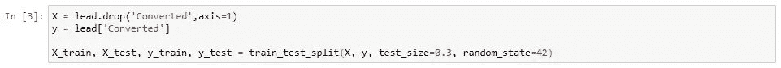

作者图片

是时候做模型了。我使用 [sklearn.linear_model](https://scikit-learn.org/stable/modules/classes.html#module-sklearn.linear_model) 库创建并装配了一个逻辑回归机器学习模型(使用**‘liblinear’算法**对其进行配置，以解决优化问题)。

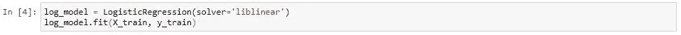

作者图片

使用 [Scikit-learn 的管道机制](https://scikit-learn.org/stable/modules/generated/sklearn.pipeline.Pipeline.html)，我创建了一个简单的管道表单，包含数据缩放(从 [sklearn.preprocessing](https://scikit-learn.org/stable/modules/preprocessing.html) 导入的标准缩放算法)和模型。

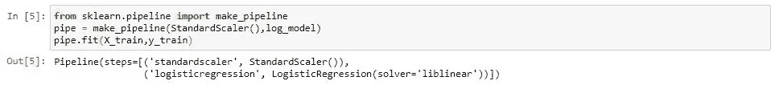

作者图片

此外，从另一个设计角度来看，如果只缩放数字属性(以调整零的公共平均值)，这是有效的。

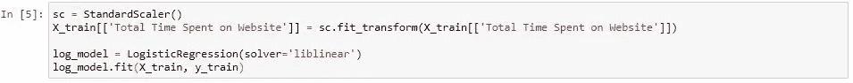

作者图片

最后，我从[sk learn . model _ selection](https://scikit-learn.org/stable/modules/classes.html#module-sklearn.model_selection)中引用了[cro _ val _ predict](https://scikit-learn.org/stable/modules/generated/sklearn.model_selection.cross_val_predict.html)功能，并生成了明确配置**‘predict _ proba’**估算器方法的交叉验证估算。这种评估方法确保**获取成功的目标销售线索转化的概率** —事实上，解决了向每个潜在客户分配销售线索得分的挑战。

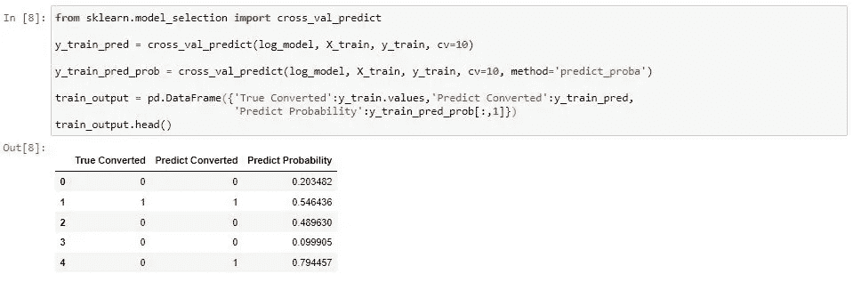

作者图片

**注意:模型验证、评估和性能调优的过程超出了本文的范围——它是机器学习设计的一部分。*

一旦机器学习模型准备就绪，就该创建 ONNX 模型了。下面提到了应该导入的标准 ONNX 包。作为旁注，我想强调的是，只有当 [skl2onnx](https://pypi.org/project/skl2onnx/) 安装在开发环境上时，导入 ONNX 包才有效(这个模块可以使用**“pip install skl 2 ONNX”命令**安装)。

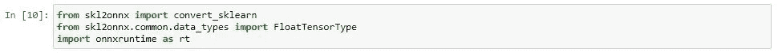

作者图片

ONNX 模型的创建实际上意味着将 Scikit 学习模型转换成遵循 ONNX 格式的文件的过程。这是通过使用 [convert_sklearn()](http://onnx.ai/sklearn-onnx/) 方法完成的，该方法采用之前创建的模型及其维度，在本例中是来自已处理数据集中的要素数量。在这个场景中，**特征工程**以及**特征降维**的过程产生了总共 **19 个输入特征**。

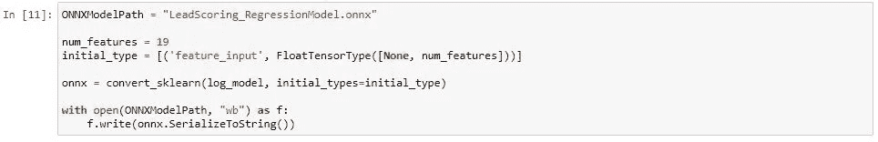

作者图片

最后一步是 ONNX 模型导出，在先前指定的系统位置/路径上序列化(声明文件扩展名为**‘ONNX’**)。

这里一个重要的信息是 ONNX 库目前支持的机器学习算法的 s [et。可以使用以下命令生成版本以及所有集成算法的列表(图像预览显示了受支持算法的完整列表的一部分)。](https://onnx.ai/sklearn-onnx/supported.html)

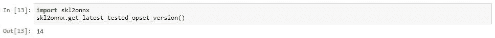

作者图片

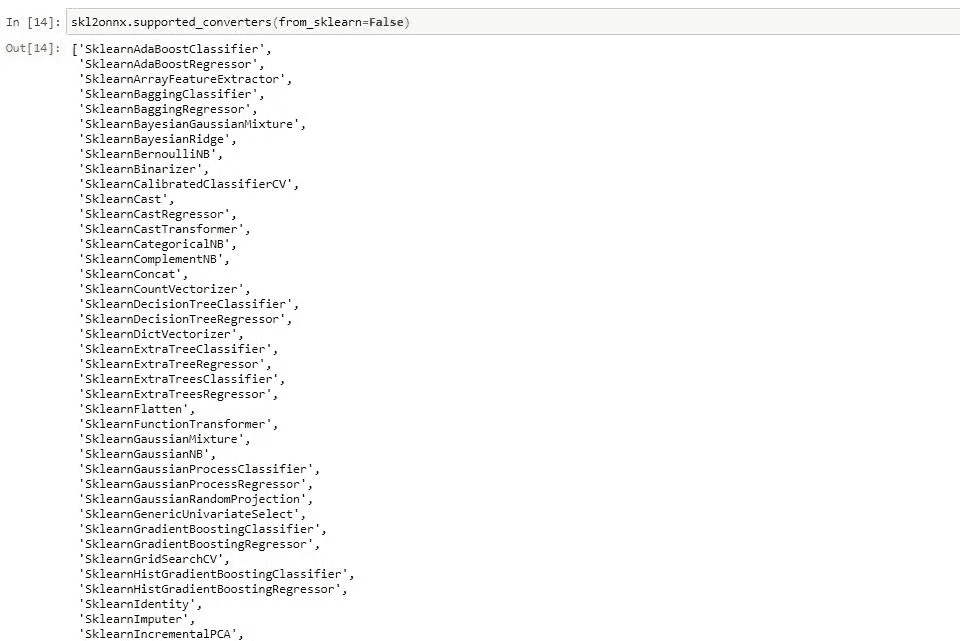

作者图片

因此，我总是建议在验证的上下文中检查列表，确认您正在使用受支持版本的算法来建立模型。这种检查应该在机器学习阶段进行，更准确地说是在算法选择阶段。值得一提的是，不属于 ONNX 包的任何其他算法也可以得到支持，但是适当的定制配置和调整超出了本文的范围。此外，还有一些众所周知的与软件包相关的限制，可以在官方文档页面中解决。

# 。网络核心集成

如前所述，将 **sklearn 模型**转换为 **ONNX 模型**是解决方案的第一部分，也是将 ONNX 模型导入的后续步骤的先决条件。网络生态系统。这可以使用微软的[来完成。ML.OnnxRuntime Nuget 包](https://www.nuget.org/packages/Microsoft.ML.OnnxRuntime/)。我决定使用 [Microsoft Azure Function](https://docs.microsoft.com/en-us/azure/azure-functions/) 模板来演示 ONNX 到。NET 以及下一节中描述的集成验证和测试。我已经创建了 **Azure 函数**,作为一个新项目，包含在一个面向。NET Core 3.1 框架版本。

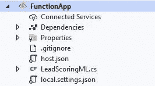

作者图片

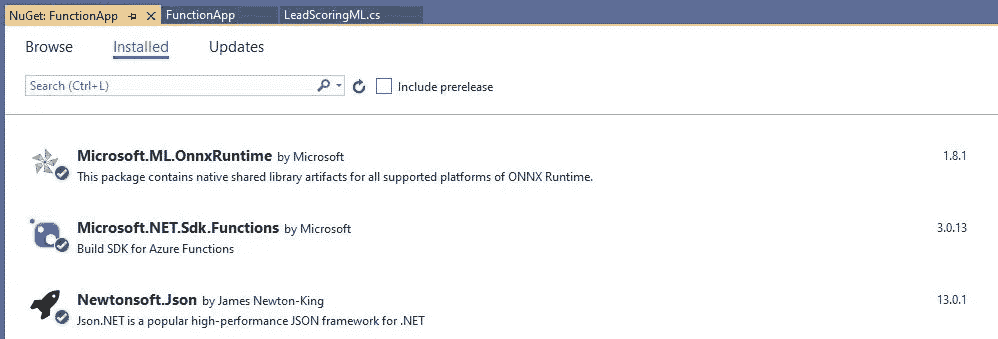

作者图片

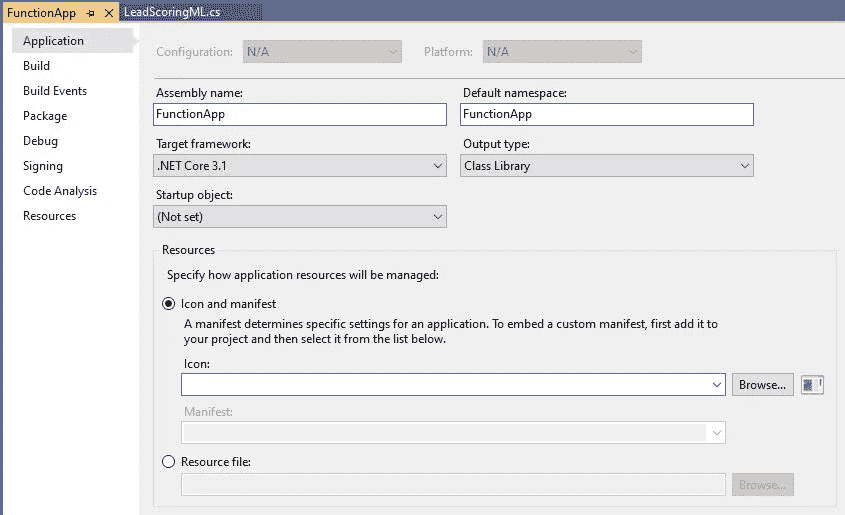

作者图片

最初，我从 **Http 请求**中提取请求体，并**将其反序列化为动态数据对象**，这是一种在运行时检索类型的技术。然后，我使用了简单的方法来声明和初始化请求体中的每个变量。这里值得一提的是，变量的数量(请求体参数的数量)应该与 ONNX 模型创建时定义的输入特征的数量相同。

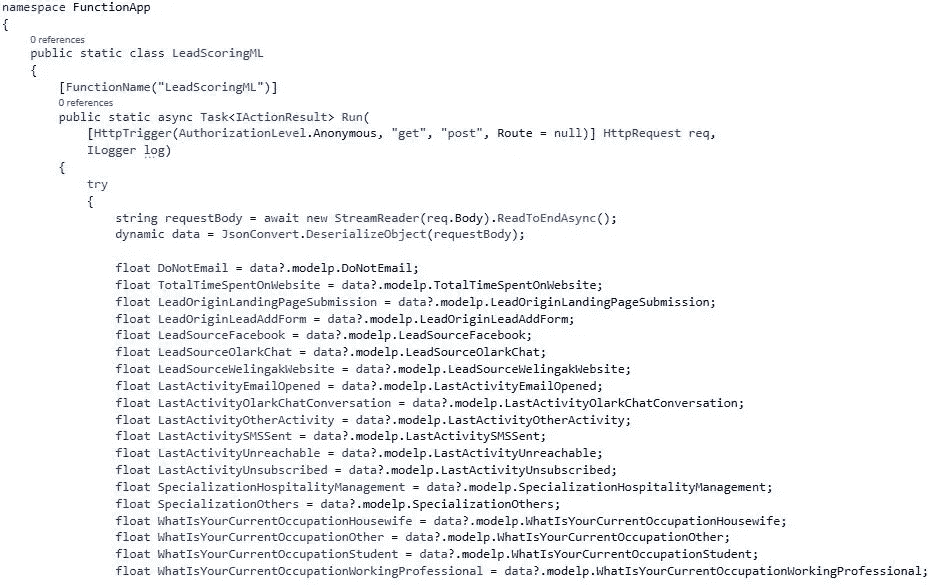

作者图片

之后，我定义了先前保存的 ONNX 模型的本地系统路径，并创建了创建输入特征列表和创建**推理会话**所需的**输入张量**。初始化会话后，就该运行它并以原始格式提取模型输出了。**推理会话也可用于对 Jupyter 笔记本解决方案**中已创建的 ONNX 模型进行预测。

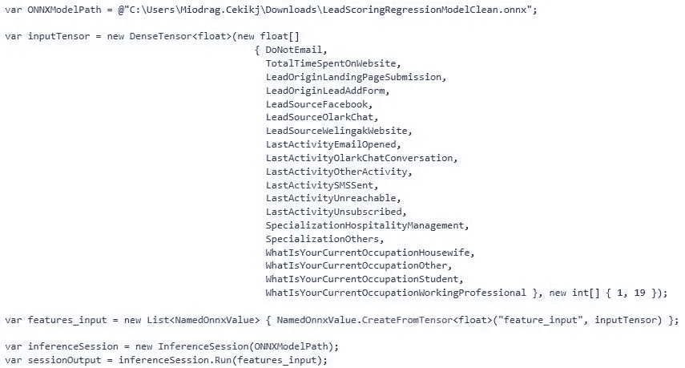

作者图片

在会话执行之后，我已经将检索到的原始格式值解析为集合 **DisposableNamedOnnxValue 对象**，然后使用该集合将结果数组提取为 **Dictionary < long、float>的形式。然后，字典结构用于提取转化销售线索的**概率值**(销售线索评分结果)。**

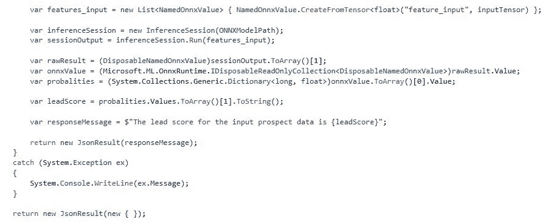

作者图片

# 集成验证

考虑到最初用 Python 和 Scikit-learn 设计和编写的线索评分模型现已成功集成，我将使用 [Postman API 平台](https://www.postman.com/)测试和验证完整的场景。因为我使用 Microsoft Azure 函数模板包装了集成，所以我可以在我的开发机器上通过 HTTP 调用本地访问它，遵循之前配置的路径( **url、端口和函数名绑定**)。

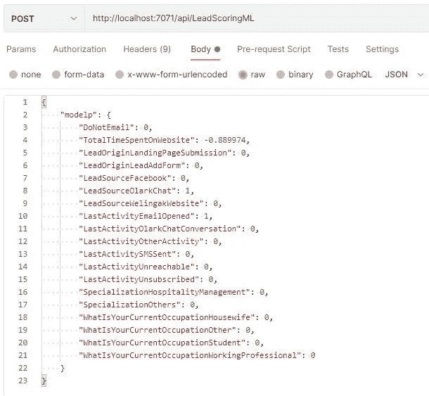

作者图片

利用 Visual Studio 集成调试器的优势，我深入研究了模型响应，研究了对象的结构和类型。

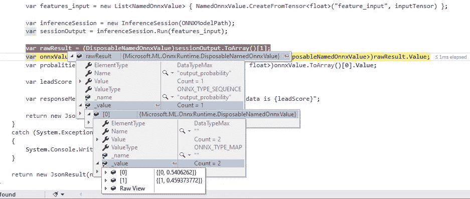

作者图片

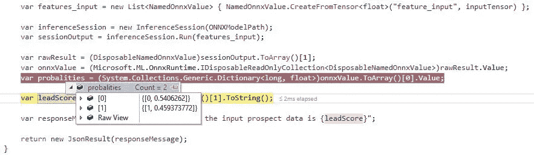

作者图片

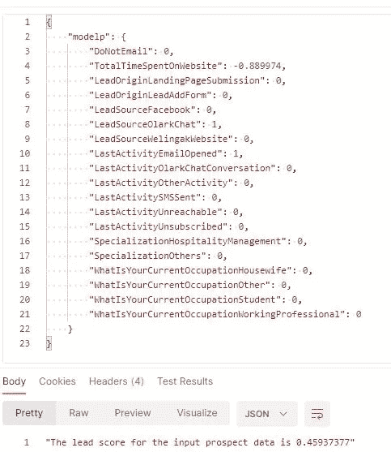

作者图片

# 最后的话

在本文中，我展示了我们目前正在开发的线索评分原型的部分实际实现。基本上，**它描述了解决从 Python 和 Scikit 转换和部署 ML 模型挑战的技术方法——了解不同的目标技术环境，在本例中是。网络生态系统**。利用 ONNX 格式的优势，我演示了最简单的形式**构建 ONNX 模型，并使用格式灵活性将其作为目标环境源代码的结构部分**。除了这种方法正在弥合不同数据科学和应用程序开发平台之间的技术差异之外，它还提供了将已经设计好的模型与 ML.NET 的[优势相集成的机会。网)。此外，ONNX NuGet 包和实现方法也可用于将 Scikit-learn 模型集成到](https://dotnet.microsoft.com/apps/machinelearning-ai/ml-dotnet) [Web API 解决方案](https://docs.microsoft.com/en-us/aspnet/core/tutorials/first-web-api?view=aspnetcore-3.1&tabs=visual-studio)中。

# 更多应用

除了构建销售线索评分系统，我们还成功创建了一个销售线索决策原型，该原型遵循类似的模式，除了机器学习算法选择之外。到目前为止，我已经使用[随机森林分类器](https://scikit-learn.org/stable/modules/generated/sklearn.ensemble.RandomForestClassifier.html)开发了一个线索决策集成模块。它也是 ONNX 包支持的算法列表的一部分。因此，从业务角度来看，我们提供了根据历史和当前数据做出销售线索决策的机会。

此外，在进行探索性数据分析并涵盖设计和构建 ML 模型的过程时，**我们正在提供和生成有益于未来应收集和跟踪的数据的优选类型和格式的数据见解和知识**。**这种全面的数据分析之后是模型的解释过程，通常提供特征和相关性重要性的其他有价值的方面**。

— — — — — — — — — — — —

感谢您阅读内容，我坚信这些内容清晰、详细且有帮助。

我目前的重点和专业知识与企业 web 开发和架构中的最新和前沿技术优势有关，特别是微软。网络生态系统。此外，我喜欢从事数据科学、生物信息学和数字营销/销售线索挖掘中的机器学习应用。所以，如果你能花时间评论、支持和分享这篇文章，我将非常感激。

*最初发表于*[*【https://www.linkedin.com】*](https://www.linkedin.com/pulse/integrating-scikit-learn-machine-learning-models-microsoft-cekikj)*。*