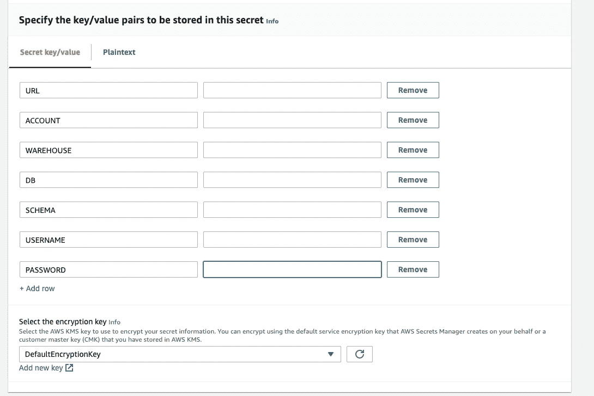
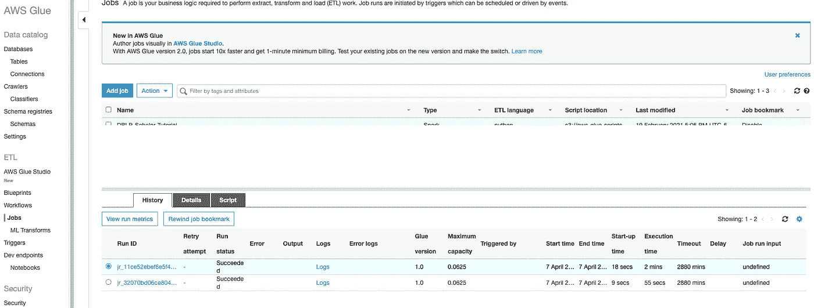

# 用胶水粘合雪花

> 原文：<https://towardsdatascience.com/integrating-snowflake-with-glue-c00a1e25335c?source=collection_archive---------12----------------------->

## 将两个系统结合在一起可能很棘手，但是您获得的数据洞察力是值得的。


米凯拉·帕兰特在 [Unsplash](https://unsplash.com/s/photos/fencing?utm_source=unsplash&utm_medium=referral&utm_content=creditCopyText) 上的照片

雪花是一个优秀的现代数据库，它将传统 SQL 的强大功能与现代数据湖架构相结合。AWS Glue 是内置于 AWS 无服务器生态系统中的本地 ETL 环境。它们共同构成了构建现代数据湖的强大组合。

本文将详细介绍如何创建一个胶合工作来将 [120 年的奥运奖牌数据](https://www.kaggle.com/heesoo37/120-years-of-olympic-history-athletes-and-results)加载到雪花数据库中，以确定哪个国家拥有最好的击剑手。

# 将您的雪花凭据集成到 Secrets Manager 中

AWS 提供了一个名为 Secrets Manager 的实用程序来存储密码，它有几个特性，包括自动密码轮换，这使它非常适合安全存储。

利用 Secrets Manager 的最佳方式是使用多因素身份验证来存储您的雪花凭据。

打开[秘密管理器](https://console.aws.amazon.com/secretsmanager)，添加你的雪花用户证书。填写管理器中的所有必填字段，并存储密码。



雪花连接参数(按作者)

填写雪花连接信息

记录秘密 ID，并将其添加到云形成文件中的 [AWS::IAM::Role](https://docs.aws.amazon.com/AWSCloudFormation/latest/UserGuide/aws-resource-iam-role.html) 规范中。使用环境变量来存储机密名称。不用担心；我们将使用 AWS 角色来明确限制对粘合作业的秘密访问。

```
- PolicyName: "AllowSecretsManager"
  PolicyDocument:
    Version: "2012-10-17"
    Statement:
      - Effect: "Allow"
        Action: [
            "secretsmanager:GetSecretValue",
            "secretsmanager:DescribeSecret"
        ]
        Resource: [
            !Sub "arn:aws:secretsmanager:${AWS::Region}:${AWS::AccountId}:secret:${SecretName}*"
```

该策略将允许您的胶合作业连接到雪花以执行操作。

# 创造一个舞台

复制需要连接到 AWS 中 S3 存储桶的阶段。按照雪花法创建一个阶段。最佳实践是为您的 S3 存储区创建一个[存储集成](https://docs.snowflake.com/en/sql-reference/sql/create-storage-integration.html)，然后为应用程序或客户创建多个存储集成阶段。你可以使用 [SNOWSQL](https://docs.snowflake.com/en/user-guide/snowsql.html) 和变量替换来实现自动化。

```
!set variable_substitution=true;
create or replace stage &{database}.stage.OLYMPICS
storage_integration = &{storage_integration}
url = '&{S3DataHome}/stage/olympics/';
```

# 在雪花中创建一个表来包含数据

我们将创建一个表来包含公共数据集，该数据集包含按运动员、运动和他们所代表的国家分类的运动员成绩。下表列出了每个数据仓库表应该包含的数据集列和标准列(以粗体突出显示)。

```
CREATE OR REPLACE TABLE STAGE.OLYMPICS_ATHELETE_EVENT
(
 **FILE_LOAD_ID     INTEGER identity (1,1),
    FILE_NAME         VARCHAR,
    FILE_ROW_NUMBER         INTEGER,**
    ID             VARCHAR(100) NOT NULL,
    NAME           VARCHAR(100) NOT NULL,
    SEX            VARCHAR(100) NOT NULL,
    AGE            VARCHAR(100) NOT NULL,
    HEIGHT         VARCHAR(100) NOT NULL,
    WEIGHT         VARCHAR(100) NOT NULL,
    TEAM           VARCHAR(100) NOT NULL,
    NOC            VARCHAR(100) NOT NULL,
    GAMES          VARCHAR(100) NOT NULL,
    YEAR           VARCHAR(100) NOT NULL,
    SEASON         VARCHAR(100) NOT NULL,
    CITY           VARCHAR(100) NOT NULL,
    SPORT          VARCHAR(100) NOT NULL,
    EVENT          VARCHAR(100) NOT NULL,
    MEDAL          VARCHAR(100) NOT NULL,
 **DW_CREATE_DATE TIMESTAMPTZ           DEFAULT CURRENT_TIMESTAMP(),
    DW_CREATE_USER VARCHAR      NOT NULL DEFAULT CURRENT_USER(),
    DW_UPDATE_DATE TIMESTAMPTZ           DEFAULT CURRENT_TIMESTAMP(),
    DW_UPDATE_USER VARCHAR      NOT NULL DEFAULT CURRENT_USER()**
);
```

# 创建一个 COPY 语句来从 S3 加载数据

Snowflake 中的 COPY 语句是从数据仓库导入和导出数据的强大方法。它将加载任何新的数据文件，并忽略以前加载的文件。利用拷贝是管理仓库的一种简单而有效的方法。

```
copy into STAGE.OLYMPICS_ATHELETE_EVENT (FILE_NAME,
                                         FILE_ROW_NUMBER,
                                         ID,
                                         NAME,
                                         SEX,
                                         AGE,
                                         HEIGHT,
                                         WEIGHT,
                                         TEAM,
                                         NOC,
                                         GAMES,
                                         YEAR,
                                         SEASON,
                                         CITY,
                                         SPORT,
                                         EVENT,
                                         MEDAL)
    from (
        select METADATA$FILENAME        file_name,
               METADATA$FILE_ROW_NUMBER row_number,
               t.$1,
               t.$2,
               t.$3,
               t.$4,
               t.$5,
               t.$6,
               t.$7,
               t.$8,
               t.$9,
               t.$10,
               t.$11,
               t.$12,
               t.$13,
               t.$14,
               t.$15
        from @stage.OLYMPICS t
    )
    pattern = '.*athlete_events.csv.gz'
    on_error = CONTINUE
    force = false
    file_format = (field_optionally_enclosed_by = '"'
        type = 'csv'
        compression = GZIP
        field_delimiter = ','
        skip_header = 1);
```

# 云的形成脚本

自动气象站的基础是云的形成。基本云形成文件包含参数部分、角色部分和组件部分。上面的组件部分包含了本文前面的 Secrets Manager 片段。

```
AWSTemplateFormatVersion: "2010-09-09"
Description: >
  This Template Configures a Job to Load Event Data into a Snowflake Table using GlueParameters:
  JobName:
    Type: String
    Description: "The Glue Job name used for the Stack and tags in the Snowflake query" JobSql:
    Type: String
    Description: "A SQL COPY function to load the data into Snowflake." S3DataHome:
    Type: String
    MinLength: "1"
    Description: "The S3 Bucket Containing the Data Lake Data" SecretName:
    Type: String
    Description: "The secret containing the Snowflake login information"Resources:
  SnowflakeGlueJobRole:
    Type: "AWS::IAM::Role"
    Properties:
      AssumeRolePolicyDocument:
        Version: '2012-10-17'
        Statement:
          - Effect: Allow
            Principal:
              Service:
                - glue.amazonaws.com
            Action:
              - sts:AssumeRole
      Policies:
        - PolicyName: root
          PolicyDocument:
            Version: 2012-10-17
            Statement:
              - Effect: Allow
                Action:
                  - "s3:GetObject"
                  - "s3:PutObject"
                  - "s3:ListBucket"
                  - "s3:DeleteObject"
                Resource:
                  - !Sub "arn:aws:s3:::${S3DataHome}"
                  - !Sub "arn:aws:s3:::${S3DataHome}/*" - PolicyName: "AllowSecretsManager"
          PolicyDocument:
            Version: "2012-10-17"
            Statement:
              - Effect: "Allow"
                Action: [
                    "secretsmanager:GetSecretValue",
                    "secretsmanager:DescribeSecret"
                ]
                Resource: [
                    !Sub "arn:aws:secretsmanager:${AWS::Region}:${AWS::AccountId}:secret:${SecretName}*"
                ] ManagedPolicyArns:
        - arn:aws:iam::aws:policy/service-role/AWSGlueServiceRole
      Path: "/" LoadOlympicData:
    Type: AWS::Glue::Job
    Properties:
      Command:
        Name: pythonshell
        PythonVersion: 3
        ScriptLocation: !Sub "s3://${S3DataHome}/src/etl-scripts/copy_to_snowflake.py"
      GlueVersion: 1.0
      DefaultArguments:
        "--job-bookmark-option": "job-bookmark-enable"
        "--job-language": "python"
        "--extra-py-files": !Sub "s3://${S3DataHome}/lib/snowflake_connector_python-2.4.2-cp37-cp37m-manylinux2014_x86_64.whl"
        "--RegionName": !Sub "${AWS::Region}"
        "--SecretName": !Ref SecretName
        "--JobName": !Ref JobName
        "--JobBucket": !Ref S3DataHome
        "--JobSql": !Ref JobSql
      ExecutionProperty:
        MaxConcurrentRuns: 2
      MaxRetries: 0
      Name: snowflake-load-olympic-data
      Role: !Ref SnowflakeGlueJobRole
```

# 在 Docker 中创建雪花 Python 轮

仔细记下带有雪花连接器库的行。由于雪花不是 AWS 的原生产品，您需要提供一个带有雪花 Python 库编译的二进制文件的 Wheel 文件。使用 docker 或带有 AWS AMI 的 EC2 实例来创建 wheel 文件。

这是 docker 文件。

```
python3.7 -m venv wheel-env
source wheel-env/bin/activate
pip install --upgrade pip
cat "snowflake-connector-python" > requirements.txt
for f in $(cat ../requirements.txt); do pip wheel $f -w ../wheelhouse; done
cd wheelhouse/
INDEXFILE="<html><head><title>Links</title></head><body><h1>Links</h1>"
for f in *.whl; do INDEXFILE+="<a href='$f'>$f</a><br>"; done
INDEXFILE+="</body></html>"
echo "$INDEXFILE" > index.html
cd ..
deactivate
rm -rf cache wheel-env
aws s3 sync wheelhouse s3://${S3DataHome}/lib/
```

# 创建 Python 脚本

粘合作业需要一个 Python 脚本。

```
ScriptLocation: !Sub "s3://${S3DataHome}/src/etl-scripts/copy_to_snowflake.py"
```

该脚本相当通用，并且需要一个 SQL 文件来执行，以便于重用。

```
import sysimport boto3
import jsonfrom botocore.exceptions import ClientError
from awsglue.utils import getResolvedOptionsimport snowflake.connector def get_secret_json(session, secret_name, region_name): client = session.client(
        service_name='secretsmanager',
        region_name=region_name
    ) secret = None
    get_secret_value_response = None try:
        get_secret_value_response = client.get_secret_value(
            SecretId=secret_name
        )
    except ClientError as e:
            raise e
    else:
        if 'SecretString' in get_secret_value_response:
            secret = get_secret_value_response['SecretString'] return json.loads(secret) def connect(user, password, account, database, warehouse, session_parameters=None):
    *"""*
 *Connect to Snowflake*
 *"""*
return snowflake.connector.connect(
        user=user,
        password=password,
        account=account,
        database=database,
        warehouse=warehouse,
        session_parameters=session_parameters
    ) def read_sql(session, bucket, filename):
    s3_client = session.client("s3")
    s3_object = s3_client.get_object(Bucket=bucket, Key=filename)
    return s3_object['Body'].read().decode("utf-8") def main():
    # Create a Secrets Manager client
    session = boto3.session.Session() args = getResolvedOptions(sys.argv, ['JobName', 'RegionName', 'SecretName', 'JobBucket', 'JobSql']) json_secret = get_secret_json(session, args["SecretName"], args["RegionName"]) sql = read_sql(session=session, bucket=args["JobBucket"], filename=args["JobSql"]) with connect(
            user=json_secret['USERNAME'],
            password=json_secret['PASSWORD'],
            account=json_secret['ACCOUNT'],
            database=json_secret['DB'],
            warehouse=json_secret['WAREHOUSE'],
            session_parameters={
                'QUERY_TAG': args["JobName"]
            }) as con:
        cs = con.cursor() result_cs = cs.execute(sql) result_row = result_cs.fetchone() print(result_row) if __name__ == "__main__":
    main()
```

# 使用云形成脚本创建粘合作业

下面是 Makefile 表单，用于执行云形成脚本来创建粘合作业。

```
package-job:
   aws cloudformation package \
      --template-file resources/glue/snowflake-glue-load-history.yaml \
             --s3-bucket ${S3_DEPLOYMENT_BUCKET} \
       --output-template-file build/snowflake-glue-load-history.yamldeploy-job: package-job
   aws cloudformation deploy \
      --template-file build/snowflake-glue-load-history.yaml \
      --parameter-overrides S3DataHome=${S3_DATA_BUCKET} \
         SecretName="${SECRET_NAME}" JobName=${LOAD_OLYMPICS_DATA_JOB} \
         JobSql=${SQL_COPY_OLYMPIC_DATA} \
       --stack-name ${LOAD_OLYMPICS_DATA_JOB} \
       --capabilities CAPABILITY_IAM
```

# 执行粘合作业(或对其进行调度)

您可以在 AWS 控制台中运行和执行 Glue 作业。



胶水控制台(作者)

胶合过程的成本是每 DPU 小时 0.44 美元，每秒计费，最少 1 分钟，因此它在价格上非常有竞争力，即使是运行在 EC2 实例上的免费 ETL 工具。

# 检查结果

现在有趣的部分—运行查询来检查您的数据。

```
select TEAM,
       sum(case when MEDAL='Gold' then 1 else 0 end) GOLD_MEDALS,
sum(case when MEDAL='Silver' then 1 else 0 end) SILVER_MEDALS,
sum(case when MEDAL='Bronze' then 1 else 0 end) BRONZE_MEDALS
from stage.OLYMPICS_ATHELETE_EVENT
where medal in ('Gold', 'Silver', 'Bronze')
 and sport = 'Fencing'
    group by team
order by sum(case when MEDAL='Gold' then 1 else 0 end) desc,
         sum(case when MEDAL='Silver' then 1 else 0 end) desc,
         sum(case when MEDAL='Bronze' then 1 else 0 end) desc;
```

那么谁的剑术最好呢？当然是意大利。


# 结论

加载数据是一项棘手的技术工作，尤其是在桥接两个系统时，比如 AWS 和雪花。然而，结果——从数据中获得的洞察力将使它变得值得。从这篇文章中吸取这些教训:

1.  将您的凭证保护到您的雪花数据库
2.  借力[雪花舞台](https://docs.snowflake.com/en/sql-reference/sql/create-stage.html)与 [AWS S3](https://docs.aws.amazon.com/AmazonS3/latest/userguide/Welcome.html) 整合
3.  使用[云形成](https://aws.amazon.com/blogs/aws/cloudformation-create-your-aws-stack-from-a-recipe/)来集成 AWS 服务
4.  扩展 Glue Python 作业以自动加载雪花中的数据
5.  通过使用 SQL 查询提出有趣的问题，让数据自己说话

快乐数据分析！