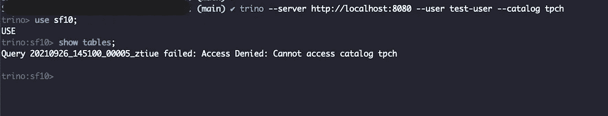

# 集成 Trino 和 Apache Ranger

> 原文：<https://towardsdatascience.com/integrating-trino-and-apache-ranger-b808f6b96ad8?source=collection_archive---------6----------------------->

## 了解如何为数据安全配置 Apache Ranger 和 Trino。


照片由[飞:D](https://unsplash.com/@flyd2069?utm_source=medium&utm_medium=referral) 上[的 Unsplash](https://unsplash.com?utm_source=medium&utm_medium=referral)


图片由作者创作，灵感来自分别为 Trino 和 Apache Software Foundation 商标的徽标

# 第一部分:概念和想法

## 背景

随着对数据需求的日益增长，企业对数据安全性的要求也在不断提高。在 Hadoop 生态系统中，Apache Ranger 是一个很有前途的数据安全框架，拥有大量插件，如 HDFS、Solr、Yarn、Kafka、Hive 等。 [Apache Ranger 在版本 2.1.0](https://cwiki.apache.org/confluence/display/RANGER/Apache+Ranger+2.1.0+-+Release+Notes) 中为 prestosql 添加了一个插件，但最近 [PrestoSQL 被更名为 Trino](https://trino.io/blog/2020/12/27/announcing-trino.html) ，这破坏了 Apache Ranger 的 PrestoSQL 插件。

我已经提交了这个问题的补丁，这里已经有一个公开的 JIRA 问题[了](https://issues.apache.org/jira/browse/RANGER-3182)但是这不会阻止我们将 Trino 与 Apache Ranger 集成。对于本教程，我已经用 Trino 插件构建了 Apache Ranger 2.1.0。如果你想从包括 trino 插件的源代码中构建 Apache Ranger，你可以参考分支`ranger-2.1.0-trino`上的[这个](https://github.com/aakashnand/ranger/tree/ranger-2.1.0-trino) GitHub 库，出于本教程的目的，我们将[这个](https://github.com/aakashnand/trino-ranger-demo) Github 库。

> 更新时间:2022 年 5 月 20 日
> 
> Trino 插件现已在 ranger 资源库中正式发布，发布于 Apache Ranger-2.3[https://github.com/apache/ranger/tree/ranger-2.3](https://github.com/apache/ranger/tree/ranger-2.3)

## 组件和关键思想介绍

阿帕奇游侠有三个关键部件`ranger-admin`、`ranger-usersync`和`ranger-audit`。让我们了解一下这些组件。

*注意:* *配置* `*ranger-usersync*` *超出了本教程的范围，我们不会在本教程中使用任何* `*usersync*` *组件。*

## 管理员管理

Ranger 管理组件是一个 UI 组件，使用它我们可以为不同的访问级别创建策略。Ranger Admin 需要一个后端数据库，在我们的例子中，我们使用 Postgres 作为 Ranger Admin UI 的后端数据库。

## 管理员审计

Ranger 审计组件收集并显示资源的每个访问事件的日志。Ranger 支持两种审计方式，`solr`和`elasticsearch`。我们将使用`elasticsearch`来存储 ranger 审计日志，这些日志也将显示在 Ranger 审计 UI 中。

## 特里诺

Trino 是一个快速分布式查询引擎。可以连接多个数据源，如`hive`、`postgres`、`oracle`等。你可以在官方文档[这里](https://trino.io/docs/current/)阅读更多关于 Trino 和 Trino 连接器的信息。对于本教程，我们将使用默认目录`tpch`，它带有虚拟数据。

## trino-Ranger-插件

阿帕奇游侠支持许多插件，如 HDFS，蜂巢，纱线，特里诺等。每个插件都需要在运行该进程的主机上进行配置。Trino-Ranger-Plugin 是一个组件，它将与 Ranger Admin 通信，以检查和下载访问策略，然后这些策略将与 Trino 服务器同步。下载的策略作为 JSON 文件存储在 Trino 服务器上，可以在路径`/etc/ranger/<service-name>/policycache`下找到，因此在这种情况下，策略路径是`/etc/ranger/trino/policycache`

下图解释了上述组件之间的通信。


作者图片

docker-compose 文件连接了上述所有组件。

关于`docker-compose.yml`的要点

1.  我们已经使用`named-docker-volumes` ex: `ranger-es-data`，`ranger-pg-data`来持久化诸如 elasticsearch 和 postgres 等服务的数据，即使在容器重启之后
2.  Ranger-Admin 和 Ranger-Trino 插件的预构建 tar 文件可作为发布资产在这个演示存储库[这里](https://github.com/aakashnand/trino-ranger-demo/releases/tag/trino-ranger-demo-v1.0)获得。
3.  ranger-Admin [进程需要至少 1.5 GB 的内存](https://cwiki.apache.org/confluence/display/RANGER/Ranger+Installation+Guide#RangerInstallationGuide-Prerequisites)。Ranger-Admin tar 文件包含`install.properties`和`setup.sh`。`setup.sh`脚本从`install.properties`读取配置。以下补丁文件描述了与 Ranger-Admin 组件的默认版本`install.properties`相比，对`install.properties`所做的配置更改。

4.Ranger-Trino-Plugin tar 文件也包含了`install.properties`和`enable-trino-plugin.sh`脚本。关于 trino docker 环境需要注意的重要一点是，配置文件和插件目录被配置到不同的目录位置。配置是从`/etc/trino`读取的，而插件是从`/usr/lib/trino/plugins`加载的。这两个目录在为 Trino-Ranger-Plugin 配置`install.properties`时非常重要，因此需要对 Trino-Ranger-Plugin tar 文件附带的默认脚本`enable-trino-plugin.sh`进行一些额外的定制，以使其能够与 dockerized Trino 一起工作。这些更改在下面的修补程序文件中突出显示。基本上，这些变化引入了两个新的自定义变量`INSTALL_ENV`和`COMPONENT_PLUGIN_DIR_NAME`，它们可以在`install.properties`中进行配置

5.`install.properties`Trino Ranger 插件的文件需要按照以下补丁文件所示进行配置。请注意，我们使用两个新引入的自定义变量来通知`enable-plugin-script`Trino 已经部署在 docker 环境中。

6.最后，如下图所示，将它们放在`docker-compose.yml`中。这个文件也可以在 Github 库[这里](https://github.com/aakashnand/trino-ranger-demo/blob/main/docker-compose.yml)获得。

# 第二部分:设置和初始化

在这一部分中，我们将部署 docker-compose 服务并确认每个组件的状态。

## 步骤 1:克隆存储库

```
git clone [https://github.com/aakashnand/trino-ranger-demo.git](https://github.com/aakashnand/trino-ranger-demo.git)
```

## 步骤 2:部署 docker-compose

```
$ cd trino-ranger-demo
$ docker-compose up -d
```

一旦我们使用 docker-compose 部署服务，我们应该能够看到四个正在运行的服务。我们可以通过`docker-compose ps`来证实这一点


## 步骤 3:确认服务

让我们确认 Trino 和 Ranger-Admin 服务在以下 URL 上是可访问的

游侠管理员: [http://localhost:6080](http://localhost:6080)

崔诺: [http://localhost:8080](http://localhost:8080)

elastic search:[http://localhost:9200](http://localhost:9200)

## 步骤 4:从 Ranger-Admin 创建 Trino 服务

让我们访问 Ranger-Admin 用户界面，并作为`admin`用户登录。我们在上面的`ranger-admin-install.properties`文件中配置了我们的管理员用户密码`rangeradmin1`。正如我们在下面的截图中看到的，默认情况下，没有`trino`服务。因此，让我们创建一个名为`trino`的服务。**服务名应该与在** `**install.properties**` **中为 Ranger-Admin** 定义的名称相匹配


请注意 JDBC 字符串中的主机名。从 `**ranger-admin**` **容器 trino 可到达** `**my-localhost-trino**` **，因此主机名被配置为** `**my-localhost-trino**`


如果我们点击测试连接，我们将得到如下所示的*连接失败*错误。这是因为 Ranger-Admin 进程已经在运行，并且仍在寻找我们尚未创建的名为`trino`的服务。一旦我们点击`Add`，它将被创建。


因此，让我们添加`trino`服务，然后再次单击`Test Connection`


现在 Ranger-Admin 成功连接到 Trino🎉

## 步骤 5:确认 Ranger 审计日志

要检查审计日志，从顶部导航栏导航至审计，并点击`Audit`。我们可以看到显示了审计日志🎉。Ranger-Admin 和 Elasticsearch 工作正常。


# 第三部分看到它在行动

现在我们已经完成了设置，是时候创建实际的访问策略并查看它的运行情况了

*   当创建`trino`服务时，我们在连接信息中使用`ranger-admin`作为用户名。这会使用该用户名创建默认策略，因此`ranger-admin`用户将拥有超级权限


为了理解访问场景并创建访问策略，我们需要创建一个测试用户。Ranger usersync 服务将各种来源(如 Unix、文件或 AD/LDAP)的用户、组和组成员身份同步到 Ranger 中。Ranger usersync 提供了一组丰富而灵活的配置属性，用于同步来自 AD/LDAP 的用户、组和组成员，支持多种使用情形。在本教程中，我们将从 Ranger-Admin UI 手动创建一个测试用户。

## 步骤 1:从 Ranger-Admin 创建`test-user`

要创建用户，我们导航至设置→用户/组/角色→添加新用户

创建用户时，我们可以选择不同的角色。

*   `user`角色是普通用户
*   `Admin`角色可以从 Ranger Admin UI 创建和管理策略。
*   `Auditor`角色是`read-only`用户角色。

现在，让我们创建一个角色为`Admin`的用户。


## 步骤 2:确认进入`test-user`和 r `anger-admin`

让我们确认用户的访问权限`ranger-admin`


正如我们看到的`ranger-admin`用户可以访问模式`tpch.sf10`下的所有表

由于我们没有为`test-user`配置任何策略，如果我们试图访问任何目录或执行任何查询，我们应该会看到一条*访问被拒绝*消息。让我们通过从 [Trino CLI](https://trino.io/docs/current/installation/cli.html) 执行查询来确认这一点



## 步骤 3:允许访问模式`tpch.sf10`下的所有表`test-user`

让我们创建一个允许`test-user`访问`tpch.sf10`到**所有**表的策略。


我们还可以为每个策略分配特定的权限，但是现在让我们创建一个具有所有权限的策略。创建此策略后，我们有以下活动策略。


现在让我们再次确认访问。


我们仍然收到*拒绝访问*的消息。这是因为需要为每个对象级别配置 Trino ranger 策略。例如，`catalog`级策略，`catalog+schema`级策略，`catalog+schema+table` 级策略， `information_schema`级策略。让我们为`catalog`级别添加策略。


让我们用 Trino CLI 再次确认


我们仍然得到错误，但错误信息不同。让我们转到 Ranger 审计部分，了解更多相关信息。


我们可以看到一个拒绝对名为`tpch.information_schema.tables.table_schema`的资源进行访问的条目。在 Trino 中，`information_schema`是包含关于表和表列的元数据的模式。因此也有必要为`information_schema`添加策略。任何用户都需要访问`information_schema`才能在 Trino 中执行查询，因此，我们可以在 Ranger 策略中使用`{USER}`变量，将访问权限授予所有用户。


让我们再次从 Trino CLI 确认访问。


如果我们试图执行任何 SQL 函数，我们仍然会得到拒绝访问的消息。在默认策略部分，`all-functions`策略(ID:3)是允许 access 执行任何 SQL 函数的策略。因为执行 SQL 函数是所有用户的要求，所以让我们编辑`all-functions`策略(ID:3)并使用`{USER}`变量添加所有用户来访问函数


总而言之，为了访问`sf10`下的`test-user`到**所有**表，我们添加了三个新策略，并编辑了默认的`all-function`策略。


现在我们可以访问和执行针对`sf10`模式的所有表的查询。


在下一步中，让我们了解如何为模式`sf10`下的特定表提供对`test-user`的访问

## 步骤 4:授予对`sf10`模式下特定表的访问权

在上一步中，我们配置了策略来访问`sf10`模式下的**所有**表，因此，`schema-level`策略是不必要的。为了访问特定的模式，我们需要添加`schema-level`策略，然后我们可以配置`table-level`策略。所以让我们为`tpch.sf10`增加`schema-level`一项政策


现在让我们将`sf10-all-tables-policy`从所有表格编辑到特定表格。我们将配置一个策略，只允许访问`nation`表


最后，我们有以下积极的政策


现在让我们再次从 Trino CLI 对`test-user`执行查询。


`test-user`现在可以根据需要从`tpch.sf10`模式中访问唯一的`nation`表。

如果你已经完成了所有的步骤，那么恭喜你，㊗️，现在你已经了解了如何配置 Trino 和 Apache Ranger。

## 第三部分:关键要点和结论

*   从 PrestoSQL 更名为 Trino 后，Apache Ranger 的 GitHub 库中的默认插件将无法与新的 Trino 一起工作，因为它仍然引用旧的`io.prestosql`包。你可以在 JIRA [这里](https://issues.apache.org/jira/browse/RANGER-3182)追踪这个问题
*   更名的 Trino 插件将不会在新的 Ranger 版本 2.2.0 中提供。因此，与此同时，请随意使用[这个](https://github.com/aakashnand/ranger/tree/ranger-2.1.0-trino) GitHub 库从源代码构建 Apache Ranger，使用[这个](https://github.com/aakashnand/trino-ranger-demo) GitHub 库开始 Trino-Ranger 集成。
*   为 Trino 配置 Ranger 策略并不那么直观，因为我们需要为每个级别配置访问策略。在 Trino 的知识库[这里](https://github.com/trinodb/trino/issues/1076)有一个关于这个的公开问题。
*   尽管如此，建议配置一些基本策略，如带有`{USER}`变量的`information_schema`和`all-functions`，因为这些策略对于任何用户执行查询都是必需的。

由于缺乏好的文档和集成过程不太直观，集成 Apache Ranger 和 Trino 可能会很痛苦，但我希望这篇文章能让它变得简单一点。如果你正在使用 Trino，我强烈推荐你加入 [Trino 社区 Slack](https://trino.io/slack.html) 进行更详细的讨论。感谢您的阅读。