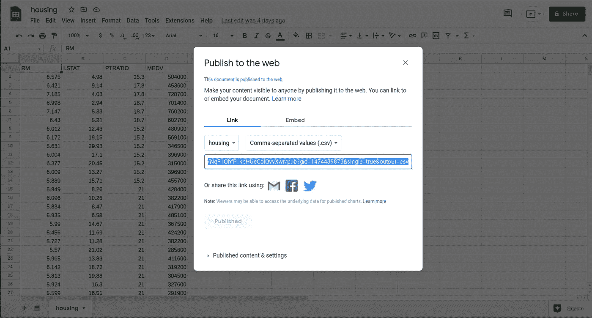
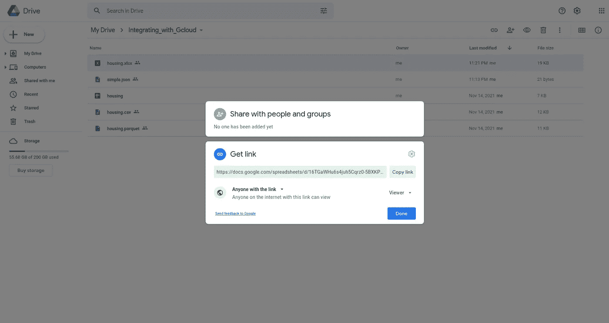

# 将您的数据分析与 Google Workspace 和 Google 云存储相集成

> 原文：<https://towardsdatascience.com/integrating-your-data-analysis-with-google-workspace-and-google-cloud-storage-f80649404bb0?source=collection_archive---------27----------------------->

## 如何使用 Python 从云中加载文件


马文·迈耶在 [Unsplash](https://unsplash.com?utm_source=medium&utm_medium=referral) 上的照片

# 1.介绍

协作是当今成功的数据团队的关键因素之一。您的团队交流和共享信息的方式会对您公司的生产力产生重大影响。

> 不幸的是，大多数公司仍然依赖于通过电子邮件和其他通信平台共享 CSV 和 Excel 文件，这种做法损害了数据的一致性和安全性。

因此，使用正确的工具共享数据文件可以提高您的分析重现性，并帮助您的团队提高生产率。

**本文的目标是介绍几种使用**[**Google Workspace**](https://workspace.google.com/)**和** [**Google 云存储**](https://cloud.google.com/storage) **的数据共享替代方案。**

下面介绍的每个函数的教程和代码可以在我的 [GitHub 库](https://github.com/GabrielSGoncalves/integrating_data_analysis_with_gcloud)中找到。

# 2.谷歌云环境

谷歌是云资源和存储的主要提供商之一，也是面向各种终端用户的可访问解决方案。 **Google Drive 和 Sheets 是 Google Workspace(前身为 GSuite)** 的热门服务部分，也是处理表格数据和存储文件的主要工具之一。谷歌还通过其谷歌云平台(GCP)为企业提供云服务。**云存储是一种用于存储文件的 GCP 服务**(类似于 AWS S3)。

这些服务允许用户在涉及数据产品、分析和数据科学的项目中进行协作。因此，学习如何使用每个工具的正确特性可以帮助您的团队开发涉及数据共享的最佳实践。

# 3.加载公共文件

一些涉及数据的项目可能要求您公开您的数据集，以便其他人可以访问它。科学期刊、政府、非政府组织和许多其他机构可能需要提供对数据的开放访问，因此下面描述的工具是访问存储在 Google Sheets 或 Drive 中的开放数据的替代方法。

## 3.1.谷歌工作表

Google Sheets 是一个在线电子表格编辑器(类似于 Microsoft Excel ),允许用户处理表格数据。由于我们处理的大部分数据都是以表格的形式组织的，所以使用表格来组织和存储基本分析会非常方便。

要公开您的工作表文档，您需要点击**共享>发布到 web** 。


接下来，**选择一个工作表**和文档类型为**逗号分隔值(。csv)，**并复制创建的链接。



函数`read_public_sheets`接收您刚刚创建的链接，并返回一个 Pandas 数据帧，这是将表格直接加载到 Jupyter 笔记本的一个很好的选择。

```
# Loading a Public Google Sheets as a Pandas Dataframe
sheet_url = '<url to a Google Sheets>'df_sheet_public = read_public_sheets(sheet_url)
```

## 3.2.Google Drive

Google Drive 是存储任何文件格式的绝佳存储解决方案。公开可用的数据集可以以不同的格式找到，如 csv、xlsx、json 或 parquet。要访问文件，请打开 Google Drive 文件夹，右键单击所需文件，单击**获取链接**，选择选项**任何有链接的人**，然后复制创建的链接。



函数`read_public_file_from_gdrive`接收存储在 Google Drive 中的文件的复制 URL，并返回一个 Pandas Daframe(对于 csv 或 xlsx 文件)或一个字典(对于 json 文件)。

```
# Example on how to load a CSV file from Google Drive
link_to_csv = '<url to a Google Drive file>'df_public_csv = read_public_file_from_gdrive(
    link_to_csv,
    "csv"
)
```

# 4.加载私有文件

由于公司内部共享的大多数数据文件都是私有的，为了防止数据泄露，您还需要使用某种身份验证来访问这些文件。

在本节课中，我们将了解如何访问谷歌云服务来获取不公开的文件。

## 4.1.谷歌工作表

我们将使用[**gspread**](https://github.com/burnash/gspread)Python 模块与 Google Sheets 进行交互。为了访问私人文件，首先，你需要定义你的凭证。[请遵循官方文件上的说明](https://docs.gspread.org/en/latest/oauth2.html#)。使用您的服务凭证下载 JSON 文件后，您还需要将**服务帐户电子邮件添加到 Sheets 权限电子邮件列表** ( **共享>添加人员和组**)。

要运行函数`read_private_sheets`，您需要将路径传递给您的`credentials_json`、您的`sheet_url`和目标`worksheet`(名称或索引)。

```
# Loading a private Google Sheets
gcloud_credentials = '<path to service credentials JSON>'
sheet_url = '<url to a Google Sheets>'df_private_sheet = read_private_sheets(gcloud_credentials, sheet_url, 0)
```

## 4.2.Google Drive

要从 Google Drive 访问私有文件，我们可以使用 [**PyDrive2**](https://github.com/iterative/PyDrive2) ，这是一个 Python 库，它简化了与 Google Drive API V2 的交互。函数`read_private_file_from_gdrive`能够读取 5 种不同的文件格式(csv、xlsx、parquet、json 或 txt)，您只需提供到它的链接(`file_url`，与会话 3.2 中描述的链接相同。)、`file_format`和`google_auth`(凭证)。要生成访问 Google Drive 上私人文件所需的凭证，请遵循 [Pydrive2 文档](https://docs.iterative.ai/PyDrive2/quickstart/)中描述的步骤。

```
from pydrive2.auth import GoogleAuth
from gcloud_data_analysis_functions import read_private_file_from_gdrive# 1\. Authenticate using OAuth2.0
gauth = GoogleAuth()
gauth.LocalWebserverAuth()# 2\. Access a private parquet from a Google Drive
file_url_parquet = '<url to a Google Drive Parquet>'
df_parquet_gdrive = read_private_file_from_gdrive(file_url_parquet, "parquet", gauth)
```

当你在`#1`上运行代码时，如果成功生成了凭证，就会显示一个指向谷歌账户认证的链接。选择您的帐户并允许其访问服务。

在`#2`上，你只需要通过`gauth` (Google Auth Object)，带着文件链接和格式，就可以加载想要的内容了。

## 4.3.谷歌云存储

云存储是在企业环境中存储/共享数据的一个很好的解决方案，因为它提供了一种安全的方式来定义用户对文件的访问。因此，尽管您可能将文件夹定义为公共文件夹，但下面的示例将描述如何使用 GCP 凭证加载私有文件。[要创建一个](https://developers.google.com/identity/protocols/oauth2?hl=en) `[gcp_credentials](https://developers.google.com/identity/protocols/oauth2?hl=en)` [json，请跟随官方页面。](https://developers.google.com/identity/protocols/oauth2?hl=en)

函数`read_file_from_gcloud_storage`能够读取 5 种类型的`file_format` : csv、xlsx、parquet、json 或 txt。要定义要加载的特定文件，您需要提供`file_name`、`gcp_bucket`和`gcp_project`作为参数。

```
df_from_storage = read_file_from_gcloud_storage(
    "<file name>",
    "<file format>",
    "<bucket name>",
    "<GCP project name>",
    "<path to GCP credentials json>",
)
```

# 5.一锤定音

我希望您和您的团队都能从本文介绍的功能中受益，避免通过电子邮件或视频聊天软件共享数据文件。通过使用 Google 云服务共享您的文件，您可以提高跨团队的数据一致性，并帮助在您的公司内部创建数据安全性和意识。

如简介中所述，你可以在我的 [**GitHub 资源库中找到**代码**和一本 Jupyter 笔记本**教程**。**](https://github.com/GabrielSGoncalves/integrating_data_analysis_with_gcloud)

如果您对所展示的主题有任何建议，请随时写信给我😉！

# 非常感谢你阅读我的文章！

*   你可以在我的[个人资料页面](https://medium.com/@gabrielsgoncalves) **找到我的其他文章🔬**
*   如果你喜欢它并且**想成为中级会员**，你可以通过我的 [**推荐链接**](https://medium.com/@gabrielsgoncalves/membership) 来支持我👍