# 不连续函数的积分与欧拉常数

> 原文：<https://towardsdatascience.com/integration-of-discontinuous-functions-and-eulers-constant-44b4c61380d7?source=collection_archive---------19----------------------->

## 地板函数有反导数吗？

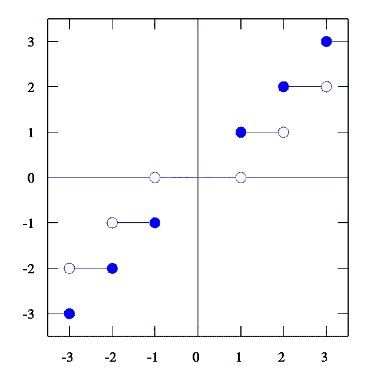

图片来自[维基共享资源](https://commons.wikimedia.org/wiki/File:Floor_function.svg)

# 介绍

最近我一直在研究更多的实验数学。

提出一些不标准的东西总是令人兴奋和有点伤脑筋的，从某种意义上说，严谨性可能不存在，或者数学界还没有接受它作为一个一致的数学理论，但尽管如此，我认为数学在某种程度上既是科学，也是艺术和创造力。

**欧拉**在真正理解复数之前欣然接受了负数的平方根**拉马努金**研究了对当时的数学家没有任何数学意义的发散级数，但这些结果后来被用于一百多年后的*量子力学*和*弦理论*。

我的观点是，有时候以一种非正式的方式来玩和实验数学是可以的。当然，归根结底，我们需要一个有效且一致的理论，并对定理进行严格证明。

在这篇文章中，我会给你一些有趣的想法，但最后，这个理论实际上是一致的，伟大的事情是我们可以将它应用到实际问题中，正如你将看到的。

我们将在文章的最后使用 **Python** 对结果进行数值验证。

# 基底函数和分数部分函数

在解析数论中，我们经常会遇到涉及**底函数**的级数和积分，因此定义如下:

表示为[x]的 x 的底等于小于或等于 x 的最大整数。因此它将*向下舍入到最接近的整数。一些例子是[3.2] = 3 和[2/3] = 0。*

在文献中，你有时会看到用略有不同的括号表示的底函数，但幸运的是，数学不依赖于符号，所以我们可以自由选择自己的。如果你正在用“纸和笔”阅读这篇文章，请随意使用你想要的任何东西。

另一个非常常用的函数是一个密切相关的函数，叫做**小数部分函数**。x 的小数部分表示为{x}，定义为{x} = x - [x]。一些例子是{3.2} = 0.2 和{2/3} = 2/3。

请注意，这些函数不是连续的。地板函数的图形如下所示:

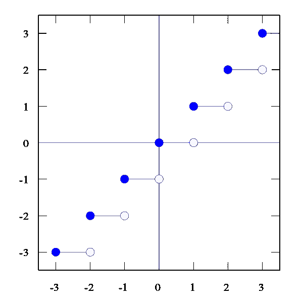

图片来自[维基共享资源](https://commons.wikimedia.org/wiki/File:Floor_function.svg)

如你所见，地板函数的图形在整数值处有“跳跃”,使得它在这些值处不连续。

小数部分函数的图形如下所示:

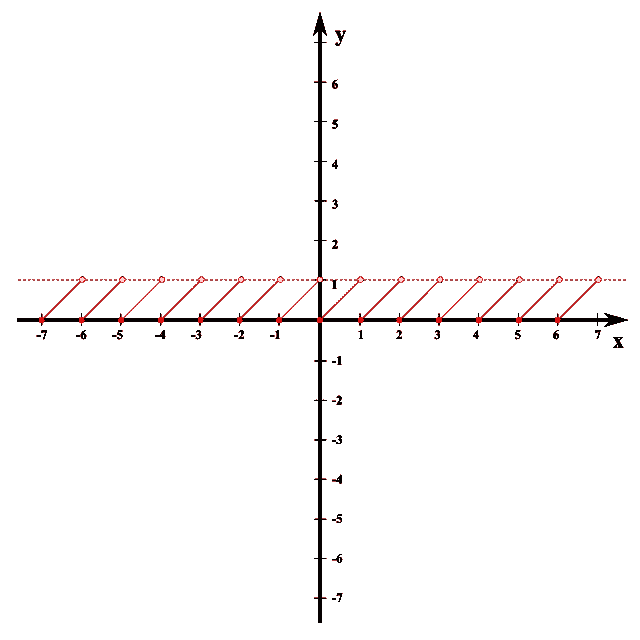

图片来自[维基共享资源](https://commons.wikimedia.org/wiki/File:Mentysa.svg)

同样，这个图在整数处有“跳跃”，但是如果你(在心理上)将这两个图加在一起，你几乎可以看到底函数的跳跃是如何用小数部分填充的，以创建恒等函数 *f(x) = x* 。

# 数论的应用

早先我说过这些函数在数论领域被大量使用，但是在哪里，为什么？

其中一个原因就是著名的阿贝尔求和。我给你公式，让你自己试着证明。

设 x > 1 为实数，且实函数 *f* 可微，则以下成立:

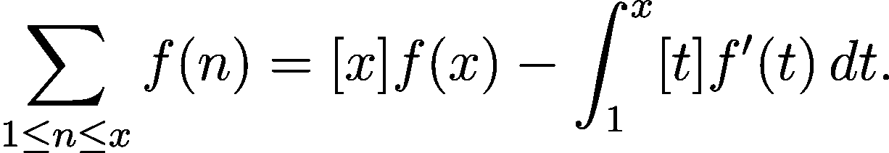

总和是 1 到 x 之间的所有自然数，包括 1 和 x。

> 一个小小的证据提示:
> 
> 如果你想证明，试着把积分写成从[x]到 x 的整数区间上带小余积分的积分和，那么[t]因子在整个区间上是常数，可以从积分中抽出来。然后你使用微积分的基本定理，你会得到一个伸缩的和，有很多抵消。

你可以用很多方法证明这个结果，实际上这是一个更一般的定理的特例，但我们只需要这篇文章中的结果。

这个公式将和转化为积分，反之亦然，所以让我们尝试将其应用于一个非常有趣的和，即调和和。换句话说，让 *f(t) = 1/t，*让我们将阿贝尔求和公式应用于该函数。

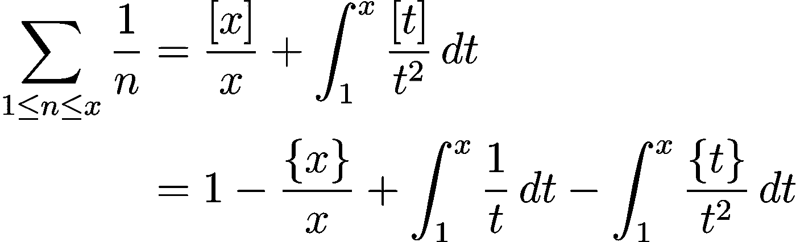

我们用分数部分扩展了基底函数。现在我们注意到，有一个 *ln(x)* 在附近，我们可以把它拉到等式的另一边。

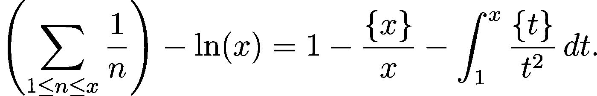

当极限值为 *x* 时，两边都趋于无穷大，我们得到了有趣的结果:

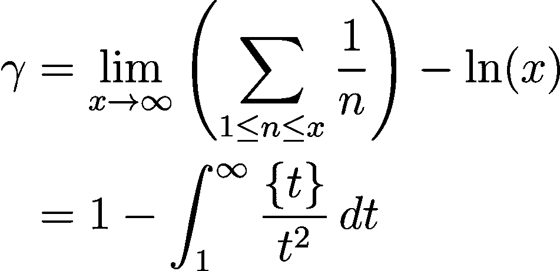

其中γ ≈ *0.5772…* 是*欧拉-马斯切罗尼*常数。

欧拉-马斯切罗尼常数被神秘所包围，我们对它一无所知，尽管它在数论和分析中随处可见。

人们怀疑这个数字是先验的，但令人尴尬的是，我们甚至不知道它是否是无理数！

我知道你在想什么。至少我在想:如果我们能用两个被积因子 *{t}* 和 *1/t* 做偏积分岂不是很棒？

# 不连续函数的“反导数”

现在，函数 *f* 的反导数是一个可微函数 *F* ，它的导数等于原函数 *f* 。因此，不连续函数的反导数是不存在的，因为它是不可微的。

然而，让我们想一想反导数的特征是什么，它们在部分积分技术中起什么作用。

实际上，我们不需要假设积分因子是连续的——只需要知道它是*勒贝格可积的*,所以如果我们能找到一个函数 *f* ,它将在*几乎所有的*点起反导数的作用(因此将给出图 *f* 下的面积),我们将能够在分部积分时以通常的方式使用它。

让我们更仔细地看看如何找到函数 *f(t) =* *{t}* 的图下面积公式，比如从 *0* 到 *x，*其中 *x* 是某个实数。

作为练习，你现在可以自己尝试一下。

对此有两种主要的思考方式。在这种情况下，最简单的方法是从几何角度推导公式，因为当我们查看 *{t}* 的图表时，很明显，面积将是每个面积为 *1/2* 的三角形的面积之和。

剩余面积显然是 1/2 {x}，因此我们的公式变成:([x] + {x} ) / 2 = ( x - {x} + {x} ) / 2。

然而，我们将采用另一种方法，因为我想向你们展示一种更通用的推导方法，因为在未来我们可能必须找到{t}的积分，这在几何上并不容易…

我们将利用这样的事实:在区间*【n-1，n】*上我们有{t} = t - (n - 1)。因此，我们可以把积分分解成具有整数端点的单位区间。具体来说，我们有

一般来说，我们可以使用这种技术，通过在积分中使用智能替换来计算小数部分的 n 次方:

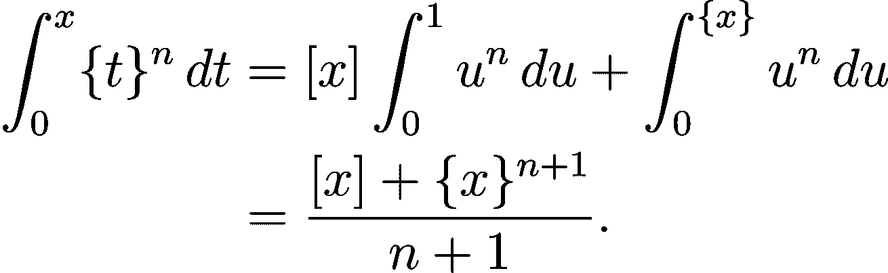

用这种技术，我们可以对底函数做同样的计算，当尘埃落定，一些方程会从灰烬中升起。

这里我将陈述两个结果，即*将*需要一些解释。但首先，让我陈述它们:

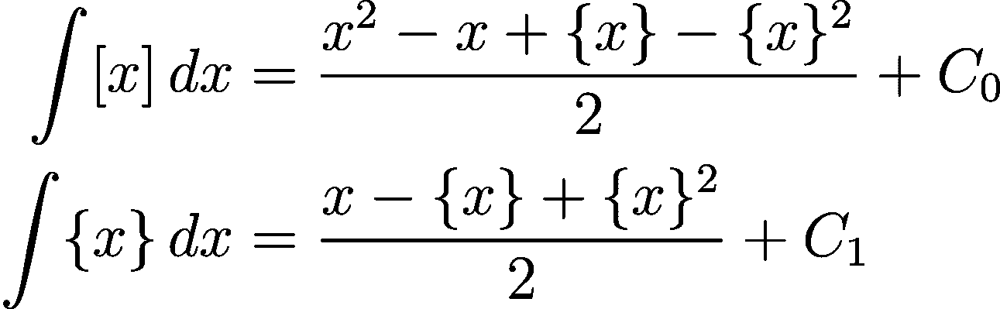

对于一些实数 *C0* 和 *C1* 。

我这么说是什么意思？显然，这些函数是不可微的，所以它们不可能是经典意义上的反导数，因此我们可以认为这是对符号的一点滥用，但是这个符号在一段时间内会有意义。

以下是一些观察结果:

1.  这些是实际的面积函数，也就是说，如果对积分进行定积分(从 *a* 到 *b* 进行积分)，并以通常的方式将这些函数用作反导数，那么我们可以得到两个图形下的面积，x 轴上方和下方的面积之间通常存在差异。
2.  分数部分和底函数仅在一组离散的点，即整数上是不可微的。因此，它们实际上几乎在任何地方都是可微的(在 T2 测度论的意义上)，因为微分是局部的(逐点的)运算，我们可以陈述如下:

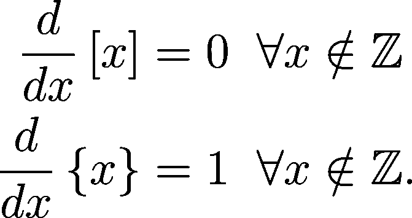

我们只需要小心一点，因为微积分的*基本定理*不成立。如果我们想要这样的东西，我们将不得不使用狄拉克δ函数的无穷级数(分布理论)，我们不需要这样。

但以上仍然是正确的，我们只是砍掉了一些点。因此，我们可以利用这一点来做部分集成。

请注意，这一切都完美地融合在以下内容中:

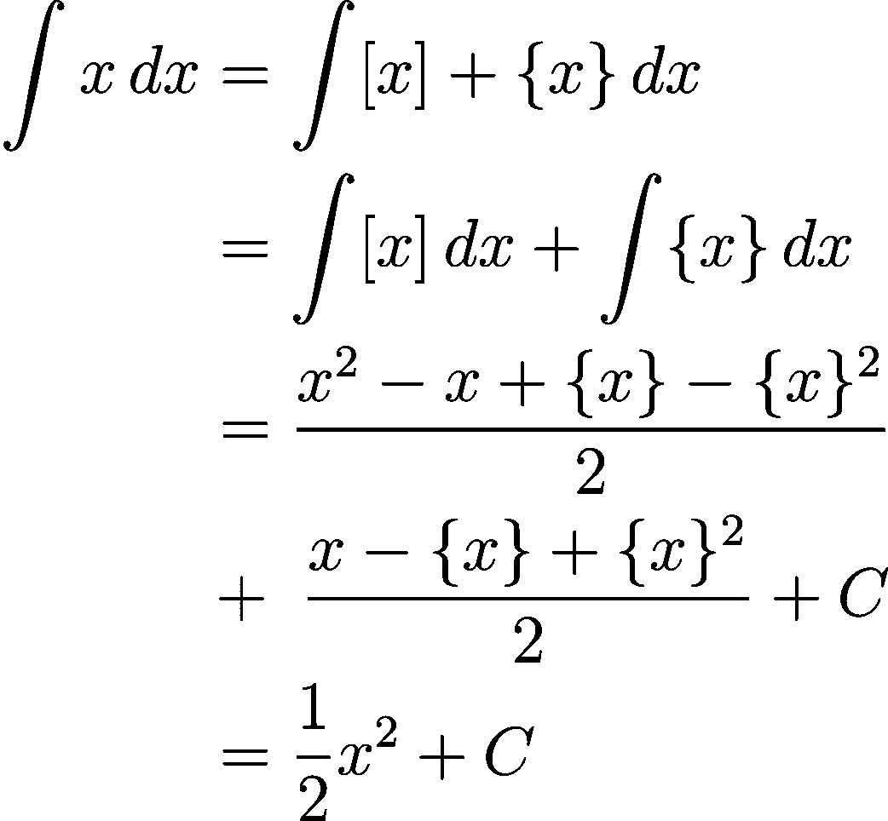

对于一些常数 *C* ，就像它应该的那样。

# 重温欧拉常数

那么现在我们有了一些工具，如何应用呢？

我们推导出了一个关于*欧拉-马斯切拉诺尼* *常数*的公式，现在我们有了足够强大的武器来进一步进行计算:

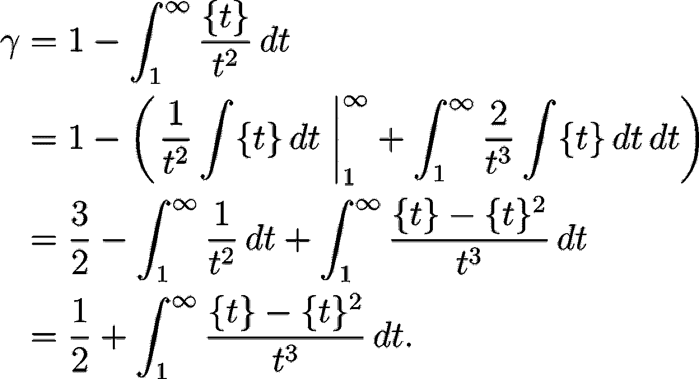

这里我们使用了分部积分和 *{x}* 的积分公式。我们可以通过再次使用部分积分来进一步接近γ。如果你觉得无聊或者只是好奇，可以试一试。请告诉我你发现了什么。

## 数值分析

只是为了满足自己的好奇心，我在 *Python* 中做了一些数值积分。对于那些不知道如何用 *Python* 编码的人来说，这对于本文来说并不重要，但是对于那些知道的人来说，如果你愿意，你可以试一试。

让我们创建一个数字积分模块:

在一个单独的文件中，我们进行实际的计算。我们从上面的模块中导入 Integrate 类，并定义分数部分函数和被积函数。然后，我们将结果打印到控制台。

我们得到大约 *0.5772154…* 考虑到真实值从 0.572156649 开始，这一点都不差…

如果增加精度或上限，您将获得更好的近似值，但是，运行时间也会增加。

这在数值方法中总是一个折衷。当然，没有什么能打败纯数学。然而，数字验证可能是一个很好的指导。

这是这个故事的结尾，但是更多的故事还在后面。

如果你想了解我的研究和写作过程，想“先睹为快”未来的故事，想了解我更私人的一面，请在 Instagram 上关注我:

点击下面的**图片**找到我的简介。

作者图片

如果您有任何问题、意见或顾虑，也欢迎通过 LinkedIn 联系我:

 [## Kasper Müller -高级顾问，数据和分析，金融服务，技术咨询- EY | LinkedIn

### 编程、数学和教学是我最大的兴趣。数据科学、机器学习、编程…

www.linkedin.com](https://www.linkedin.com/in/kasper-m%C3%BCller-96ba95169/) 

> 数学家是把咖啡变成定理的机器。
> 
> 阿尔弗雷·德·雷尼