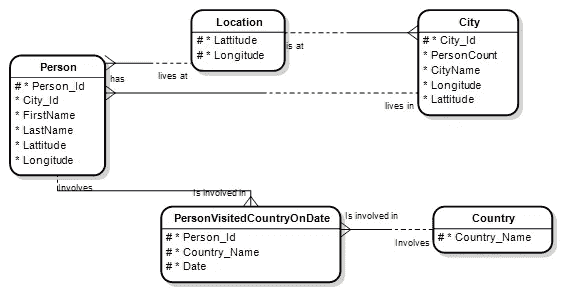
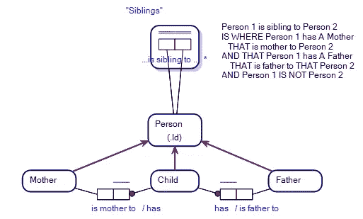

# 情报服务和自然语言处理

> 原文：<https://towardsdatascience.com/intelligence-services-and-natural-language-processing-926b18736796?source=collection_archive---------36----------------------->

## 对象角色建模中的派生事实类型

很容易想象一个情报机构问一个收集情报的知识图表这样的问题:

自然语言智能查询。图片作者。

这种类型的查询的问题是，根据下面的实体关系图，数据库可能只存储某人在某个日期访问某个国家的事实，而不是在哪个时间段内:

实体关系图。图片作者。

要回答这个问题，需要做一些数学计算。我们需要说明以下几点:

> 过去几个月内访问过的国家/地区月份
> 是指人员在日期
> 和今天——日期<期间月份* 30 访问过的国家/地区

## 输入对象角色建模和派生事实类型

[对象-角色建模](/why-learn-object-role-modelling-4eebd93dcda2#:~:text=When%20you%20learn%20ORM%2C%20you,to%20learn%20Object%2DRole%20Modelling.) (ORM)是一种概念建模，它有一种*事实类型*，称为*派生事实类型*。派生的事实类型允许您定义涵盖这些事实类型的*事实*的算法/公式。

例如，在我们的例子中，我们将如下定义一个派生的事实类型:(即在读数'…visited…with the last…* '中用星号表示的事实类型):

具有派生事实类型的对象-角色模型。图片作者。

星号让您知道有一个公式与派生的事实类型相关联(如右侧所示)。不需要为派生的事实类型创建数据库中的表…它们的事实是存储在其他表中的事实的派生。

现在当我们问“哪个人…在过去(PeriodMonths:10)内访问过(Country:'Adjikistan ')”使用 ORM 的知识图上的查询引擎知道使用派生的事实类型及其公式来查找在特定日期和“今天—(那)日期< PeriodMonths * 30”访问过 Adjikistan 的那些人。

## 人工智能的含义

即使只看最初的查询，也很容易认识到，如果我们不得不查阅自己的内部记忆，我们需要做一些心理体操，看看我们知道哪些人住在悉尼，在某个特定日期去过阿吉基斯坦，然后计算该日期是否在过去 10 个月内。

也就是说，人类很自然地使用我们自己内部衍生的事实类型的等价物来做这种类型的数学。对我来说，任何未来合适的处理自然语言查询的人工智能都必须有能力将人工智能形成的查询的某些部分传递给适当的数学函数，其方式类似于派生事实类型的使用。

在早期的一篇文章中，我描述了主人工智能之外的小程序，作为应用专业智能(ASI)服务，人工智能利用它们来解决更广泛的人工通用智能范围内相对简单的问题。绑定到查询中的派生事实类型类似于那些 ASIs。

## 自然语言数据库查询的体系结构

早先[我描述了一个基于 TDS](/the-factengine-architecture-6d90ac09b8b8) 的架构，用于在标准数据库管理系统上应用[自然语言查询](/natural-language-queries-for-real-this-time-5383bf42ad2a)。表面上，人们在现有的数据库技术上应用知识图的模型，而不必有专门的知识图数据库，使用对象-角色建模作为数据库上的语义/知识模型层。

如果我们考虑替代方案，这种技术的好处就显而易见了。例如，如果我们使用 SQL，我们简单的一行查询就变成了相当复杂的 SQL(结构化查询语言)查询，如下所示:

> 选择[人员]。名字，[人]。LastName
> FROM [Person]，
> 【Country】，
> (SELECT Person_Id，Country_Name，Date
> FROM personvisiteddcountryondate
> WHERE julianday(' now ')—julianday(Date)<10 * 30)AS personvisiteddcountrywithinthelastpiolmonthsmonths months
> WHERE[personvisiteddcountrywithelastpiolmonthsmonths months]。Person_Id=[Person]。Person_Id
> 和[personvisiteddcountrywithinthelastperiodemonthsmonths]。国家名称=[国家]。国家名称
> 和【国家】。Country_Name = 'Adjikistan '

我知道，为了我的钱，我更愿意将查询写在这篇文章的顶部。

## 难题…用一种语言代替另一种语言

在知识图数据库架构中，派生事实类型允许以简单的受控自然语言在数据库上执行非常简单的查询，但是有一个难题。

我们有效地做的是用一套函数/公式编程(例如软件代码或 SQL)代替另一套编程。也就是说，在派生事实类型语言中为派生事实类型定义公式是一项必须完成的工作，就像在 SQL 中需要完成的一样。

这个难题在信息技术和数据科学中一直存在，不同的语言适合不同技能的人。然而，使用具有派生事实类型的对象-角色模型知识图的好处是，如果它在现有数据库技术(如 ORACLE)上运行，那么最终用户可以选择…他们可以使用自然语言(使用正确的工具) ***或*** 查询数据库，使用类似 SQL 的语言。因此，开发人员需要权衡的是，他们的客户是需要在 SQL 中快速生成一个肮脏的查询，还是创建一个派生的事实类型来回答最终用户在许多不同情况下可能会多次询问的自然语言查询类型。

可以说，创建派生的事实类型比编写 SQL 更容易，情报服务专业人员可能更喜欢用易于使用的受控自然语言来查询他们的情报数据库。

## 情报服务愿景

在科幻电影的领域中，询问智能代理计算机系统并让它理解你所说的话的能力在现实中并不遥远。原因是因为投入到问题空间的努力量。

就在几年前，与智能手机交谈似乎还不合时宜，但俗话说，人工智能技术一好就很快变得无聊。语音识别现在是如此普遍，以至于它看起来是一项无聊的技术。以同样的方式，有大量的研究进入自然语言查询处理，我认为用不了多久，它就会显得过时了。至少这个愿景激励着我的研究…

## 最新研究

派生的事实类型在我开发的工具中相对较新，但对于对象-角色模型数据库的概念化来说却是旧闻。上面提到的难题对于开发人员来说也是一个难题…虽然遵从数据库管理系统的查询引擎(例如 SQL 查询引擎)的公式处理能力可能很容易，但是必须首先为派生的事实类型语法开发一个合适的解析器。所以这是鸡和蛋类型的工作。

没有为派生事实类型的语法发布 ORM 标准，语法需要从头开始开发。

幸运的是，除了数学公式之外，派生事实类型语法很大程度上可以用同样的受控自然语言编写，这种语言可以首先使用对象-角色建模谓词来形成，因此这是一个应用 ASI 愿景的问题……将派生事实类型视为 ASI，并将它们作为查询中的查询进行投影。

例如，在下面的模型中，考虑兄弟的派生规则:

具有派生事实类型的对象-角色模型。图片作者。

构成兄弟的定义在语法上与我们查询知识图的方式没有什么不同，如下所示:

点击放大。自然语言查询。图片作者。

哪个人 1 是居住在(城市:“悉尼”)的人 2 的兄弟姐妹，并且那个人 1 在过去(周期月数:10)内访问过(国家:“阿吉基斯坦”)

所以派生的事实类型公式语法与更广泛的查询语言本身没有太大的不同。

我发现这项工作很有意思，并期待更多关于派生事实类型和使自然语言查询更容易的工作。

感谢您的阅读，如果时间允许，我会写更多关于对象角色建模、派生事实类型、自然语言查询和知识图的内容。

— — — — End — — — — —