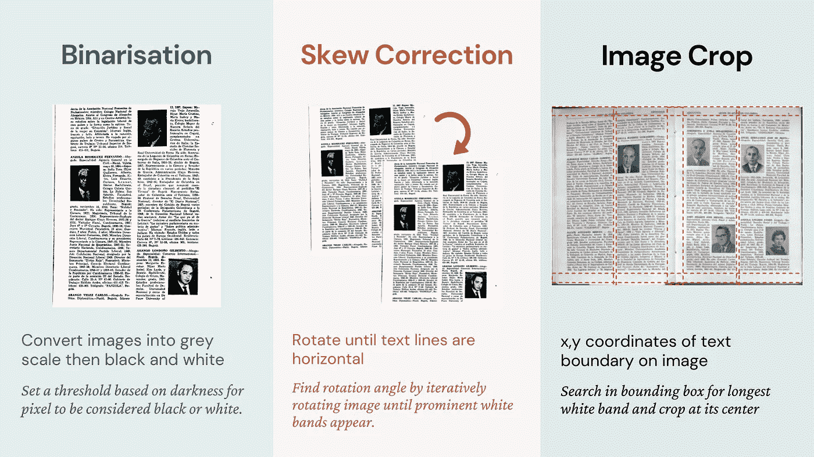
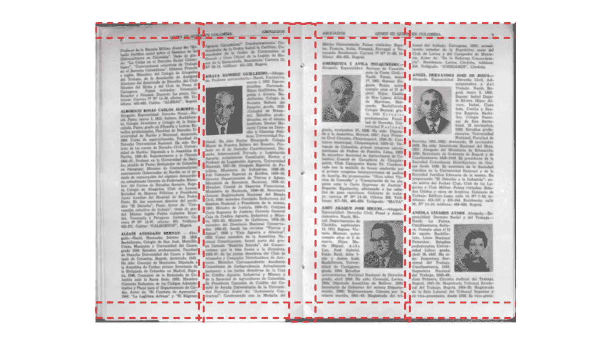

# 智能裁剪页面旁注

> 原文：<https://towardsdatascience.com/intelligently-cropping-page-marginalia-ab04744a1111?source=collection_archive---------21----------------------->

在本文中，我将向您展示如何编写代码来自动裁剪文档的页面旁注，以处理用于光学字符识别(OCR)的图像。

*更新:帖子的第二部分是* [*这里是*](/a-better-way-to-process-images-for-ocr-aa634b94d573) ！

编辑:我错误地将这个过程称为“预处理”,而它应该被称为“后处理”或者仅仅是“处理”。

OCR 前的图像处理方法。【图文由作者提供；第三版。(波哥大:奥利韦里奥·佩里&中央情报局。, 1961)]

有几种方法可以在将图像输入到 AWS Textract 或 Tesseract 等 OCR 软件之前对其进行处理，使页面上的文字成为计算机可读的文本。你使用的方法很大程度上取决于你所拥有的图像质量。下面是一个不完整的列表:

*   二值化—将图像转换为黑白像素，以增加文本和背景之间的对比度
*   倾斜校正—旋转图像，使文本以整齐的水平行显示
*   透视扭曲—修复实际图像和捕获图像之间的扭曲
*   裁剪—删除图像中我们不想阅读的部分，并简化图像，以便 OCR 软件“阅读”

对于这些问题，已经有几种解决方案，但是裁剪页面旁注(页眉和页脚)是很困难的。并非所有页面都以相同的方式扫描，从而导致不同的页面方向和清晰度。页面旁注也不总是在同一个位置或具有一致的文本，这使得在 OCR 后很难删除。

一个例子，我们希望如何理想地裁剪一页。【图文由作者提供；第三版。(波哥大:奥利韦里奥·佩里&中央情报局。, 1961)]

上面的照片是你理想的裁剪扫描图像的方式。本质上，我们定位页眉或页脚和正文之间的空间，以及每列文本之间的空间，并说“我要在这里裁剪它”。但是我们不希望手动处理成百上千或上百万的文档。这需要很长时间，如果有自动化的流程，为什么还要自己做呢？

用于 OCR 的图像处理方法。【图文由作者提供；第三版。(波哥大:奥利韦里奥·佩里&中央情报局。, 1961)]

我的方法是教计算机“看”图像，就像我在上图中所做的那样。将图像二值化后，图像的每个像素变成黑色或白色，分别用数字 255 和 0 表示。当我们看图片时，我们在寻找一条水平的白色像素带，它代表了页眉和文本之间的空间。

下面的代码片段从图像顶部开始查看 30%的水平像素行。它计算每行像素之间的百分比差异，并允许来自低质量图像或随机斑点的少量噪声。然后，它识别最长的连续白带，并在中心裁剪它。这个过程依赖于已经被倾斜校正和二进制化的图像，所以请查看链接的解决方案。

# 故障排除——啊哦，这种作物偏离太远了

一旦您有机会在一些图像上测试该代码(我强烈建议在浏览所有图像之前)，如果图像裁剪不如您想象的那样好，请确保:

*   所有图像中的文本都是水平的
*   你已经选择了正确的像素窗口来查看

我希望这个解决方案已经节省了你的时间，并教你如何处理图像！