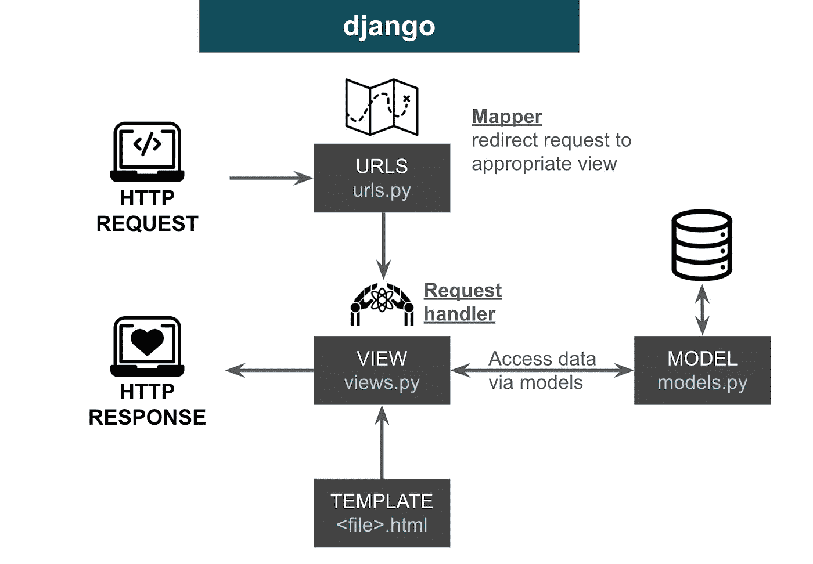

# 为数据科学家在 Django 3 中交互数据

> 原文：<https://towardsdatascience.com/interact-data-in-django-3-for-data-scientists-952b308fb0a8?source=collection_archive---------25----------------------->


斯蒂芬·斯坦鲍尔在 [Unsplash](https://unsplash.com?utm_source=medium&utm_medium=referral) 上拍摄的照片

**文章一览:**

*   Django 3 简介
*   作为数据科学家，您可能会遇到哪些情况？
*   如何使用分步指南和示例代码运行迁移
*   如果您知道 SQL，如何运行 Django 查询

**谁是代表**:数据科学家，他们希望将您的代码插入到您的组织代码库中，该代码库是基于 Django 的。

在我开始分享我对 Django 3 的了解之前，我想提一下为什么我需要快速学习 Django。我在之外的一家名为[的公司工作，我的主要工作是建立推荐系统来个性化用户的内容消费。两个月前，我们决定将 web 开发框架从 FastAPI 改为 Django。在我们开始这个项目之前，我对 FastAPI 的了解非常有限，我学到的知识足以成功实现数据科学算法部分。但是随着新的变化，我需要快速进化，将我的代码移植到 Django 框架中。](https://www.outsideinc.com/)

**旁注**:作为一名数据科学家，你可能已经看过著名的数据科学维恩图[并为之苦恼，在该图中，你需要精通数学统计、计算机科学和领域专业知识，尤其是如果你想成为独角兽的话🦄。在我的个人职业发展中，我注意到，除了深化数据科学和机器学习知识之外，我的工作要求我主要在两个领域拓展技能:](http://drewconway.com/zia/2013/3/26/the-data-science-venn-diagram)

1.  **Web 开发**:如果你在一家开发面向消费者的应用程序(Web 和/或移动)的初创公司工作，你很可能会遇到这样的问题——我们如何将数据科学模型部署到应用程序中？如何在 API 中包装模型？等等，REST API 和 GraphQL 有什么区别？什么是阿波罗和联邦数据？事实上，为了将我的代码集成到更大组织的代码库中，这些都是我需要解决的问题。
2.  **数据工程:**您的组织很可能会有专门的数据工程师来处理生产数据库，但您绝不会后悔扩展您的技能组合，包括设计表格、数据库迁移、非常熟悉如何将雪花、Postgres 和 Redshift 连接到 PyCharm 和 Jupyter Notebook。

好了，足够的背景故事，让我们开始姜戈。

# Django 3 简介

一行解释:Django 3 是一个 python web 开发框架。

什么是 web 框架？我制作了这个图表来说明 Django 模型视图模板(MTV)范例。



图片由杨文拍摄

基本上，客户端发送一个 HTTP 请求，它被传递给`urls.py`，这有助于将请求映射到适当的视图。`views.py`就像一个请求句柄，它可以使用模板以正确的方式访问数据和组织数据，然后将其作为 HTTP 响应发送回来。

这就是我们所需要知道的，我告诉过你它会很“简短”。🍃

让我们转到更有趣的问题→

# 作为数据科学家，您可能会遇到哪些情况？

从我个人的经验来看，您很可能需要知道如何正确地将您的代码插入到`models.py`中，它允许您指定数据的模式并在数据模型类中编写定制的函数。

例如，下面是一个名为`ContentItem`的数据类，就像我们从 SQL 中的表创建开始模式设计一样，我们为每个列或数据字段定义了一个具有预期数据类型的类。

有几件事值得注意:

1.  如果您没有创建一个`id`列，Django 会自动将它添加到实际的表中
2.  如果你想为列`tags`创建一个列表，例如，在一个单元格中存储像【新闻，自行车，冬天】这样的东西，你可以使用`ArrayField`，`models.CharField`意味着在列表内部，每个元素都是一个字符串。
3.  Django 中的数据字段遵循非常类似 SQL 的列约束。

> 列约束是应用于单个列的值的规则:
> 
> `PRIMARY KEY`约束可用于唯一标识行。
> 
> `UNIQUE`每一列都有不同的值。
> 
> `NOT NULL`列必须有值。
> 
> `DEFAULT`未指定值时，为列指定默认值。

每个表只能有一个`PRIMARY KEY`列和多个`UNIQUE`列。例如，当我们在 Django 中创建`ContentItem`类时，自动生成的`id`将成为`PRIMARY KEY`列，并且我们将`item_url`和`item_uuid`都指定为`UNIQUE`列。

一旦有了数据模型类，就需要运行数据迁移来将模式应用到新表中。

# 如何在 Django 中运行迁移？

步骤 1:假设您在同一个项目环境中，打开 Pycharm 终端，运行

```
$ python manage.py makemigrations
```

然后，一个新的迁移文件将被自动填充，类似于`0018_auto_...py`，因为已经存在 17 个迁移，我的被表示为`0018`。通常，您不必编辑该文件中的任何内容。

步骤 2:通过运行以下命令将迁移文件应用到您的数据库

```
$ python manage.py migrate
```

更多细节可以在 Django 的官方文档中找到。

# 如果您知道 SQL，如何运行 Django 查询

对于大多数数据科学家来说，幸运的是我们知道 SQL。并且 **Amit Chaudhary** 写了一篇[精彩的帖子](https://amitness.com/2018/10/django-orm-for-sql-users/)关于如何在 Django 中执行我们典型的 SQL 任务。

既然他抢先我写了这个，我就补充一个需要注意的事情:小心[什么时候对 QuerySets 求值](https://learning.oreilly.com/library/view/django-3-by/9781838981952/Text/Chapter_1.xhtml#_idParaDest-38)(摘自本书< Django 3 By Example >第 1 章):

> " QuerySets 仅在下列情况下进行评估:
> 
> -第一次迭代时
> 
> ——当你把它们切片的时候，比如说，`objects.all()[:3]`
> 
> -当你腌制或储藏它们时
> 
> -当你在上面呼叫`repr()`或`len()`时
> 
> -当你在它们上显式调用`list()`时"

如果您希望在函数中使用 QuerySet 的输出，这将变得非常重要。

如果你想了解更多关于 Django ORM 的信息，还有一个很棒的媒体帖子。

# 结束语

1.  Django 是一个强大的 web 开发工具。而作为数据科学家，我们可以向两个方向拓展:前端←数据科学→后端。学习 Django 可以增强我们的前端和后端知识。本文中的例子更多地与后端相关，但是在现实生活中，在添加了表和迁移之后，我还需要创建定制的函数并更新前端 API——graph QL 中的解析器。
2.  我发现自己使用的一个典型的重构工作流程是:更新`models.py` →运行迁移→运行数据摄取任务→更新`schema.graphql` →更新`graphql.py`中的解析器函数
3.  我对 Django 的理解仍然非常有限，在一般的 DS 工作中，用例可能太窄了。但是如果你碰巧在相似的环境下处理相似的问题，我希望这能有所帮助，哪怕只是一点点。

# 参考

1.  SQL 上的 codecademy cheat sheets:[https://www . codecademy . com/learn/becp-SQL-for-back-end-development/modules/fscp-SQL-creating-updating-and-deleting-data/cheat sheet](https://www.codecademy.com/learn/becp-sql-for-back-end-development/modules/fscp-sql-creating-updating-and-deleting-data/cheatsheet)
2.  书籍:《Django 3 举例》——第三版，作者安东尼奥·梅尔