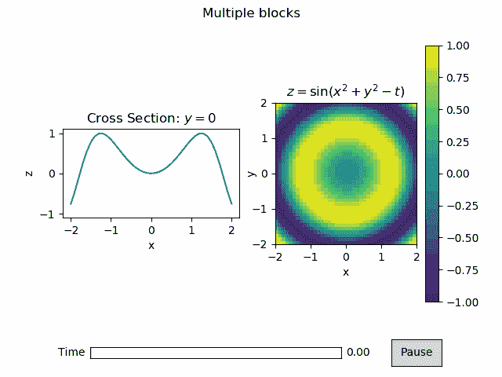
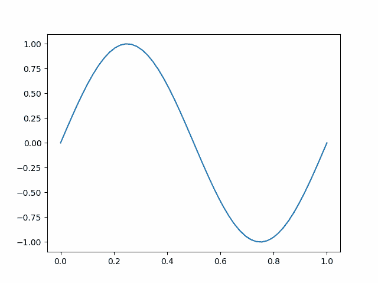
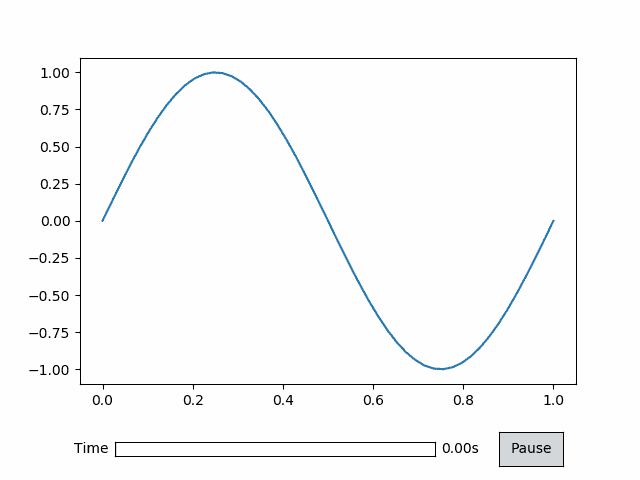

# 交互式动画可视化

> 原文：<https://towardsdatascience.com/interactive-animated-visualization-db91d1c858ad?source=collection_archive---------18----------------------->

## 使用 AnimatPlot 制作图形和绘图动画



来源:作者

数据可视化有助于理解不同的模式、关联、来自数据的视觉洞察等。它很重要，因为它以图表、图形和绘图的形式揭示了数据表背后的奥秘。有 N 个 python 库可以帮助可视化数据，如 Matplotlib、Seaborn 等。

如果我告诉你，你可以动画化你的视觉效果呢？挺有意思的吧！如果你能做到这一点，那该多好啊。让我们揭开这背后的秘密，并了解我们如何才能动画我们的常规情节。

AnimatPlot 是一个基于 Matplotlib 构建的开源 python 库，用于创建高度交互式的动画情节。在本文中，我们将探索 AnimatPlot 提供的一些功能。

让我们开始吧…

# 安装所需的库

我们将从使用 pip 安装 AnimatPlot 开始。下面给出的命令可以做到这一点。

```
!pip install animatplot
```

# 导入所需的库

在这一步中，我们将导入创建动画图所需的库。

```
%**matplotlib** notebook
**import** **numpy** **as** **np**
**import** **matplotlib.pyplot** **as** **plt**
**import** **animatplot** **as** **amp**
```

# 创建数据集

这里创建的数据集将创建一个正弦波，然后我们将制作这个正弦波的动画。类似地，我们也将另一个数据集用于在单个图形中显示多个图。

```
x = np.linspace(0, 1, 50)
t = np.linspace(0, 1, 20)

X, T = np.meshgrid(x, t)
Y = np.sin(2*np.pi*(X+T))
```

# 创建动画情节

这是最后一步，我们将创建情节和动画。

```
block = amp.blocks.Line(X, Y)
anim = amp.Animation([block])
plt.show()
```



来源:作者

现在，我们将向绘图添加控件。

```
timeline = amp.Timeline(t, units='s', fps=20)
block = amp.blocks.Line(X, Y)
anim = amp.Animation([block], timeline) 
anim.controls()
plt.show()
```



来源:作者

同样，现在我们将添加更多数据，并在单个图表中创建多个图。

```
x = np.linspace(-2, 2, 41)
y = np.linspace(-2, 2, 41)
t = np.linspace(0, 2*np.pi, 30)
X, Y, T = np.meshgrid(x, y, t)
data = np.sin(X*X+Y*Y-T)
line_data = data[20,:,:] fig, (ax1, ax2) = plt.subplots(1, 2)
for ax in [ax1, ax2]:
    ax.set_aspect('equal')
    ax.set_xlabel('x')ax2.set_ylabel('y', labelpad=-5)
ax1.set_ylabel('z')
ax1.set_ylim([-1.1,1.1])fig.suptitle('Multiple blocks')
ax1.set_title('Cross Section: $y=0$')
ax2.set_title(r'$z=\sin(x^2+y^2-t)$')line_block = amp.blocks.Line(X[0,:,:], line_data,
                                   ax=ax1, t_axis=1)
block = amp.blocks.Pcolormesh(X[:,:,0], Y[:,:,0], data, ax=ax2, t_axis=2, vmin=-1, vmax=1)
plt.colorbar(block.quad)
timeline = amp.Timeline(t, fps=10)
anim = amp.Animation([block, line_block], timeline)
anim.controls()
plt.show()
```


来源:作者

在这里你可以看到我们是如何创建动画情节并为其添加互动的。

继续尝试不同的数据，并创建一个动画可视化。如果您发现任何困难，请在回复部分告诉我。

本文是与 [Piyush Ingale](https://medium.com/u/40808d551f5a?source=post_page-----db91d1c858ad--------------------------------) 合作完成的。

# 在你走之前

***感谢*** *的阅读！如果你想与我取得联系，请随时联系我在 hmix13@gmail.com 或我的* [***LinkedIn 简介***](http://www.linkedin.com/in/himanshusharmads) *。可以查看我的*[***Github***](https://github.com/hmix13)**简介针对不同的数据科学项目和包教程。还有，随意探索* [***我的简介***](https://medium.com/@hmix13) *，阅读我写过的与数据科学相关的不同文章。**