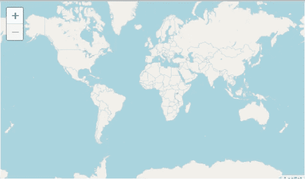
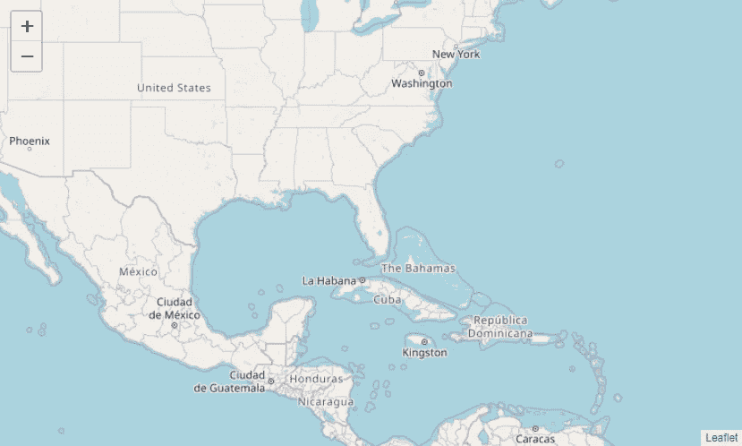
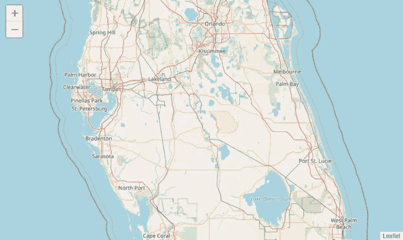
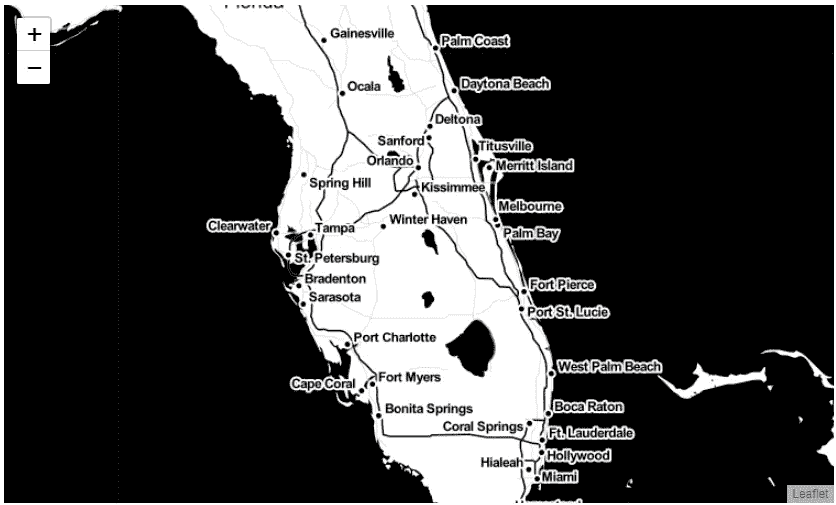
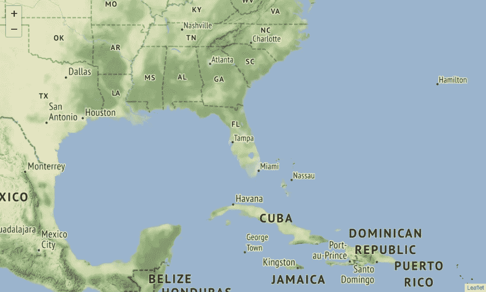
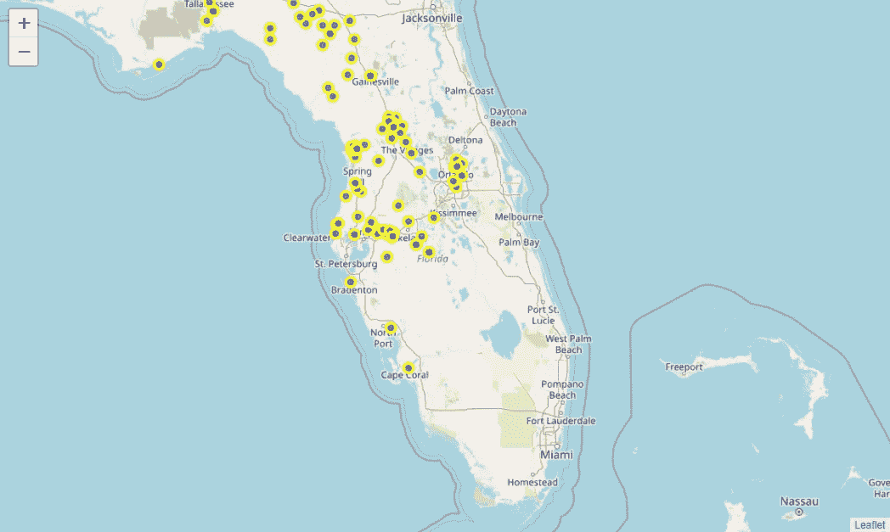
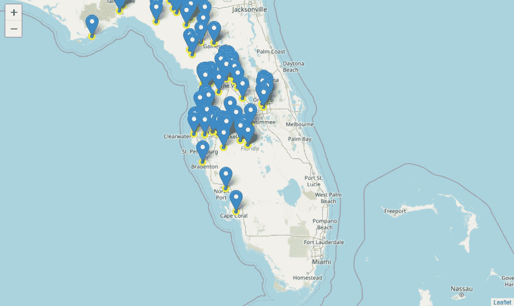

# 用于地理空间数据可视化的交互式地形图

> 原文：<https://towardsdatascience.com/interactive-choropleth-map-for-geospatial-data-visualization-a53688c8ef21?source=collection_archive---------31----------------------->


斯特凡诺·瓦尔托塔在 [Unsplash](https://unsplash.com?utm_source=medium&utm_medium=referral) 上拍摄的照片

## 详细教程

地理空间数据可能很有趣。一个交互式地理空间可视化提供了关于数据和区域等的大量信息。Python 有这么多库。很难知道用哪一个。对于地理空间可视化，我将使用[叶子](https://python-visualization.github.io/folium/)。这是非常容易使用，它有几种风格，以及符合您的选择和要求。我们开始吧。

为此，我使用了 Jupyter 笔记本环境。如果您使用的是 Jupyter 笔记本，那么您需要使用 anaconda 提示符，使用以下命令来安装 lyum:

```
conda install -c conda-forge folium=0.5.0 — yes
```

或者请查看文档。我用的是 windows。

现在我们可以在笔记本中导入叶子了。叶子内置了世界地图。

```
import folium
folium.Map()
```



这是世界地图。如您所见，您可以放大、缩小和导航。你可能想要某个国家、州或城市的地图。[该特定地点的纬度和经度](https://www.latlong.net/)可以作为参数提供，以获得该特定地点的地图。我想打印佛罗里达地图。

```
folium.Map(location = [27.664827, -81.516], zoom_start = 4)
```



在这里你可以看到佛罗里达州。我把 zoom_start 设为 4。在您的笔记本中，您可以放大或缩小并导航到某个部分。但是你也可以从放大开始。

```
florida = folium.Map(location = [27.664827, -81.516], zoom_start = 7)
```



让我们看看不同的风格。制作高对比度的黑白地图。可以通过使用参数瓦片来实现。对于高对比度的黑白地图，拼贴将是“雄蕊调色剂”。

```
folium.Map(location= [27.665, -81.516], zoom_start = 8, tiles = 'Stamen Toner')
```



是不是很好看！这种类型的地图非常适合沿海地区。对数据混搭也有好处。

在我的下一个例子中，我将使用雄蕊地形图。这将显示自然植被和山丘阴影。

```
folium.Map(location= [27.665, -81.516], zoom_start = 4, tiles = 'Stamen Terrain')
```



我相信你有兴趣看看我们能否在地图上标出事件或事故。我们当然可以。为了演示，我将使用一个数据集来显示佛罗里达州的事件。请随意从这里下载数据集:

[](https://github.com/rashida048/Datasets/blob/master/Florida_Subsidence_Incident_Reports.csv) [## rashida 048/数据集

### 在 GitHub 上创建一个帐户，为 rashida048/Datasets 开发做出贡献。

github.com](https://github.com/rashida048/Datasets/blob/master/Florida_Subsidence_Incident_Reports.csv) 

将数据集导入笔记本。

```
import pandas as pd
florida_incidents = pd.read_csv('Florida_Subsidence_Incident_Reports.csv')
```

数据集太大。所以我没有在这里显示截图。但是数据集有一个 X 和 Y 列，它们是佛罗里达不同位置的纬度和经度。我们可以将这些位置放在地图上，创建一个要素组。我们将包括点的位置和样式。为了图像的清晰，我将只放 100 个数据点。

```
florida_incidents = florida_incidents.iloc[0:100, :]
florida = folium.Map(location= [27.665, -81.516], zoom_start = 7)
incidents = folium.map.FeatureGroup()
for lat, lng, in zip(florida_incidents.Y, florida_incidents.X):
    incidents.add_child(
    folium.features.CircleMarker(
    [lat, lng],
    radius=5,
    color='yellow',
    fill=True,
    fill_color='blue',
    fill_opacity=0.6))florida.add_child(incidents)
```



我们可以更进一步，在这些点上添加标记。

```
latitudes = list(florida_incidents.Y)
longitudes = list(florida_incidents.X)for lat, lng in zip(latitudes, longitudes):
    folium.Marker([lat, lng]).add_to(florida)
florida.add_child(incidents)
```



随意放大并导航以查看特定县或城市的事件。

# 结论

我试图展示如何生成一个交互式地图，用标记在上面呈现一些事件或事件，并对其进行样式化。这种类型的交互式地图在仪表板、演示文稿或任何其他呈现的信息中总是很有帮助。我希望这有所帮助。

请随时在 Twitter 上关注我。

## 更多阅读

[](/four-popular-feature-selection-methods-for-efficient-machine-learning-in-python-fdd34762efdb) [## Python 中高效机器学习的四种流行特征选择方法

### 使用真实数据集执行特征选择方法，并在每个方法后检索所选特征

towardsdatascience.com](/four-popular-feature-selection-methods-for-efficient-machine-learning-in-python-fdd34762efdb) [](/an-ultimate-cheatsheet-of-data-visualization-in-seaborn-be8ed13a3697) [## 用 Python 的 Seaborn 库实现数据可视化的终极备忘单

### 对学习者来说也是一个很好的资源

towardsdatascience.com](/an-ultimate-cheatsheet-of-data-visualization-in-seaborn-be8ed13a3697) [](/three-very-useful-functions-of-pandas-to-summarize-the-data-491b64db9370) [## 熊猫总结数据的三个非常有用的功能

towardsdatascience.com](/three-very-useful-functions-of-pandas-to-summarize-the-data-491b64db9370) [](/exploratory-data-analysis-visualization-and-prediction-model-in-python-241b954e1731) [## Python 中的探索性数据分析、可视化和预测模型

### 在 Python 中使用 Pandas、Matplotlib、Seaborn 和 Scikit_learn 库

towardsdatascience.com](/exploratory-data-analysis-visualization-and-prediction-model-in-python-241b954e1731) [](/stochastic-gradient-descent-explanation-and-complete-implementation-from-scratch-a2c6a02f28bd) [## 随机梯度下降:从头开始的解释和完整实现

### 使用单个感知器

towardsdatascience.com](/stochastic-gradient-descent-explanation-and-complete-implementation-from-scratch-a2c6a02f28bd)