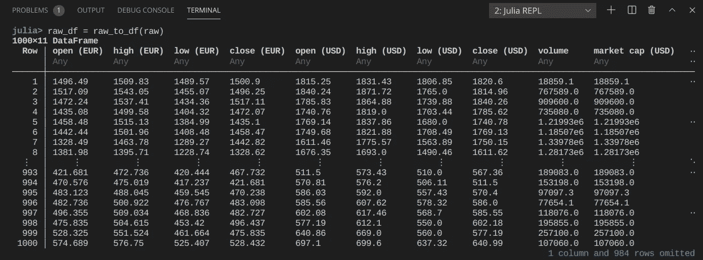
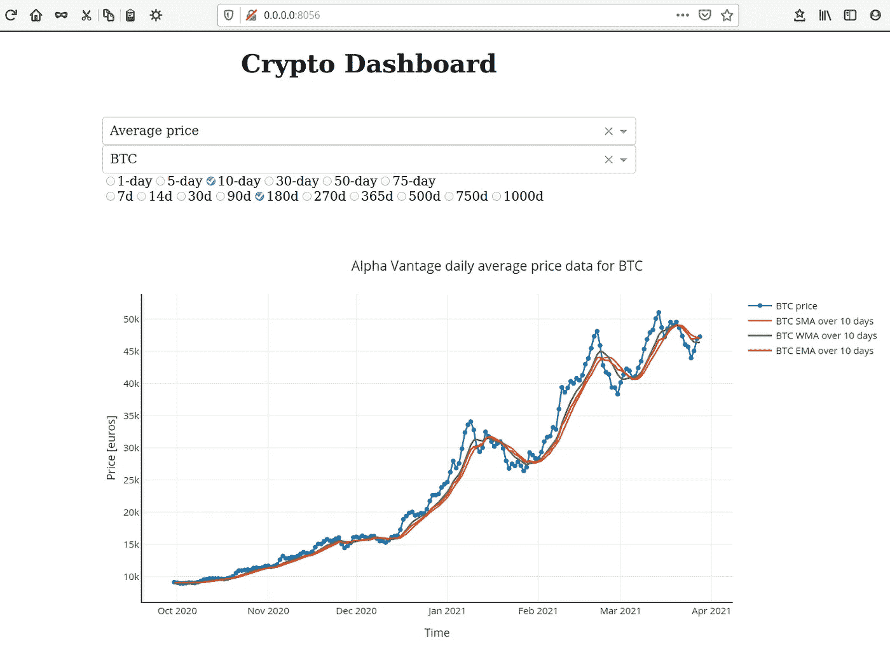
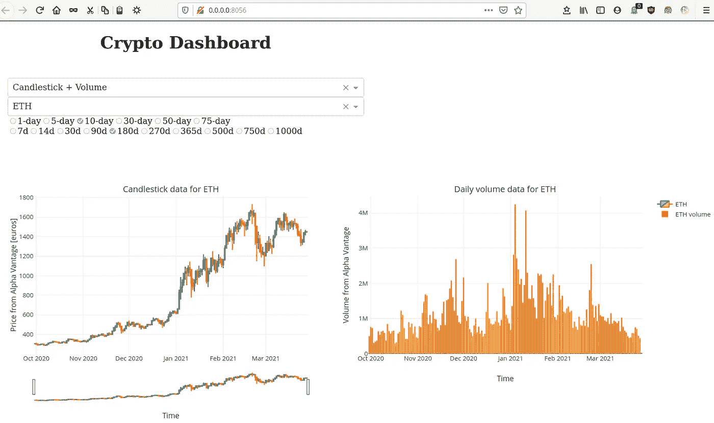
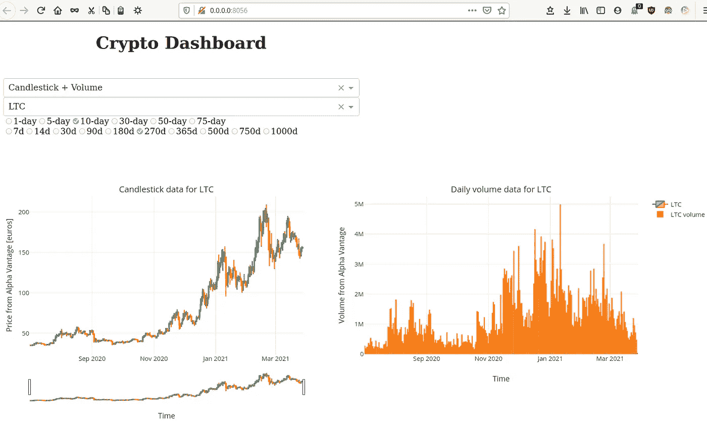
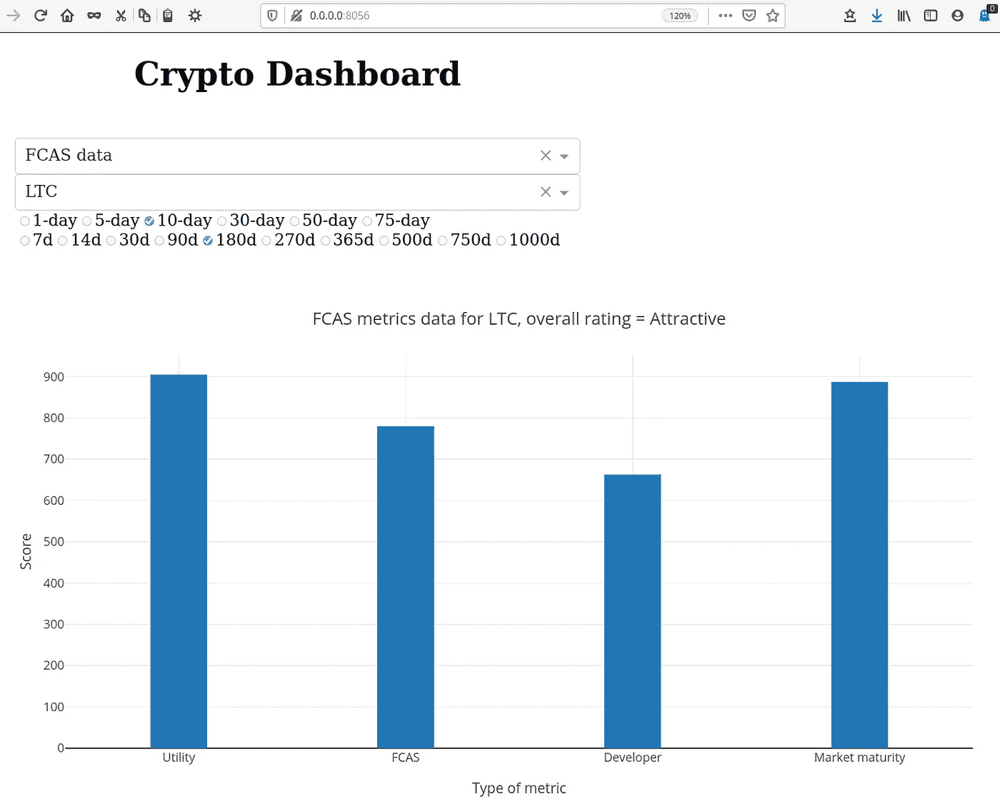
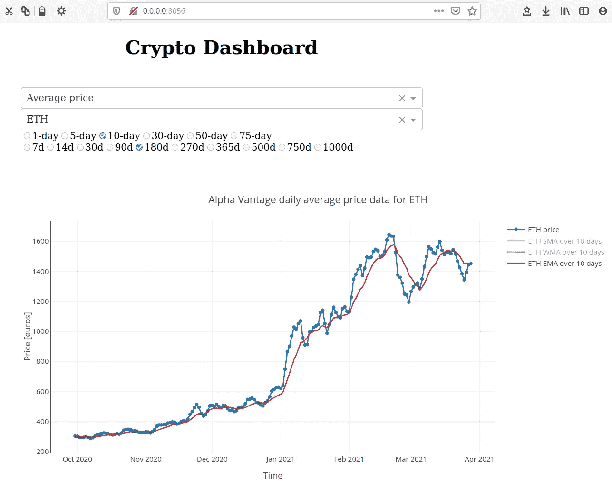

# 由 Julia 支持的交互式加密仪表板

> 原文：<https://towardsdatascience.com/interactive-crypto-dashboard-powered-by-julia-fd6f60f23063?source=collection_archive---------27----------------------->

## 可视化历史市场数据的有趣方式

[Bermix 工作室](https://unsplash.com/@bermixstudio?utm_source=medium&utm_medium=referral)在 [Unsplash](https://unsplash.com?utm_source=medium&utm_medium=referral) 拍摄的照片

***首先，非常重要的一条免责声明:本教程仅用于教育目的，不应被视为交易建议。加密货币市场非常不稳定，你很可能会失去你的投资。在决定交易本文中讨论的任何加密货币之前，请了解风险并做好自己的研究。***

在此之前，我已经探索了 Julia 在新冠肺炎数据可视化中的应用。我们在该教程中制作的情节很有见地，尽管交互性有限。我最近得知 Dash 宣布支持 Julia，因此决定尝试一下。Dash 使用基于 react 的框架，允许我们构建可扩展的 web 应用程序。Python 和 R 用户必须已经熟悉 Dash 生态系统。现在，有了 Dash.jl，我们终于可以利用 Julia 作为 web 应用程序的强大后端了。

简单来说，本教程的重点是构建一个应用程序，允许用户监控历史价格数据，并计算各种加密货币的一些关键技术指标。我选择这个用例，部分原因是我对区块链技术公司的兴趣，以及过去几个月发生的所有令人兴奋的价格行为。这种分析当然也可以用于股票市场数据。

# 我们开始吧

我使用 VS 代码，为此你需要安装和配置 Julia 扩展。这相当简单，详细说明可以在[这里](https://www.julia-vscode.org/docs/dev/gettingstarted/#Installation-and-Configuration-1)找到。你也可以直接从朱莉娅·REPL 那里运行这个应用程序。克隆这个[存储库](https://github.com/vnegi10/CryptoDashApp.git)并遵循其中给出的说明。所有相关的软件包都将自动安装。如果您确实使用 VS 代码，您可以通过单击窗口的左下角(Julia env 按钮)来选择 Julia 环境，然后从顶部面板中选择位置(CryptoDashApp 目录)。我使用的是 Julia 1.6.0，该应用程序也可以在旧版本上运行(在 1.5 和 1.4 上测试)。但是，我强烈建议升级。

# 获取市场数据

我们需要一种方法来访问许多加密货币的历史市场数据。币安和比特币基地等热门交易所通常为此提供 API。然而，用它们创建一个帐户是很繁琐的，更不用说这些 API 大多数都是基于 Python 的。令人欣慰的是，有许多其他市场数据提供商也提供免费访问，但有一些限制。Alpha Vantage 就是这样一个选择。向 [Dean Markwick](https://dm13450.github.io/about/) 大声欢呼，他创造了 [AlphaVantage.jl](http://dm13450.github.io/2020/07/05/AlphaVantage.html) 包，我们将在我们的应用中使用它。点击这里，获取免费的 API 访问密钥[。请注意，API 调用的数量被限制为每分钟 5 次，每天 500 次请求(对于我们的应用程序来说已经足够了)。我们将尝试用一些变通方法来规避前一个限制。](https://www.alphavantage.co/support/#api-key)

# 项目目录

所有相关代码都可以在[这里](https://github.com/vnegi10/CryptoDashApp.git)找到。的。toml 文件位于主目录中，该目录与模块同名。应用程序配置选项位于模块文件“CryptoDashApp.jl”中，其余的 Julia 函数也位于“src”目录中。我们将下载当前日期的市场数据并保存到“数据”文件夹中。为了避免混乱，我们的应用程序还将通过删除以前日期的数据文件来执行清理操作。参见下面的代码要点:

删除除当天之外的数据文件

# 使用 Alpha Vantage API

我们将创建各种助手函数来检索市场数据并将其转储到 Julia 数据框架中。如果你不熟悉数据框架或者需要一个快速介绍，这里有一个方便的[指南](https://syl1.gitbook.io/julia-language-a-concise-tutorial/useful-packages/dataframes)。由于 API 调用的数量有限，我们只想在给定的一天为给定的加密货币检索一次数据。因此，第一步是检查数据文件是否已经存在，如果不存在，我们下载并保存到磁盘。这在函数 **get_price_data_single** 中实现，如下所示:

将当前日期的数据下载并保存到磁盘

如果您仔细观察上面的代码片段，我们还对通过 API 调用直接获得的“原始”数据进行了一些后处理。为此，我们使用了函数 **raw_to_df** ，它创建了一个漂亮的数据帧，每行表示一天，列名表示相应的数据类型。

将原始数据转换成可读性更强的数据框架

在 REPL 中，生成的数据帧应如下所示:

数据框架中可用的 ETH 市场数据

为了获得给定一天的平均数据，我们简单地取前四列(开盘、盘高、盘低、收盘)的平均值。这四列也为生成[烛台图](https://www.investopedia.com/trading/candlestick-charting-what-is-it/)提供输入。体积数据通过体积列获得。这些操作被归入函数 **average_price_df** 和 **vol_df** :

将平均价格、蜡烛图和成交量数据分组到单独的数据框架中

以上都组合到前面展示的函数 **get_price_data_single** 中，可以针对任何给定的加密货币调用，并返回单独的数据帧。可以对另一组指标执行类似的操作，这些指标告诉我们资产的市场健康状况。在加密货币的情况下，它们是用户活动、开发者行为和市场成熟度，由 [Flipside Crypto](https://flipsidecrypto.com/products/ratings) 提供。函数 **get_ratings_data** 返回这些指标。

# 计算移动平均值

移动平均线是一个重要的技术指标，交易者经常使用它来做出买入/卖出的决定。三个最重要的是简单移动平均线(SMA)，加权移动平均线(WMA)和指数移动平均线(EMA)。我就不赘述了，你可以查看这个[链接](https://www.investopedia.com/ask/answers/071414/whats-difference-between-moving-average-and-weighted-moving-average.asp)获得额外解释。我们计算所有三个(检查函数**移动平均线**)，并将它们与日平均价格数据一起绘制。可以从网络界面选择所需的平均窗口。

# 绘图数据

我们使用 PlotlyJS.jl，它是 plotly.js 库的 Julia 接口。为了将数据传递给绘图函数，我们需要从我们的数据帧创建 PlotlyJS 跟踪对象。参见函数 **plot_price_vol_data** 的示例:

为价格和交易量数据创建 PlotlyJS 跟踪对象

这些跟踪将在回调中使用(稍后显示)! **run_app** 函数内的部分。

# 构建 Dash 应用程序

该应用程序的 UI 包括:(1)下拉列表(选择给定的加密货币或选择绘图模式)(2)复选框(选择平均窗口或时间框架以显示历史数据)。这些元素可以很容易地添加，如下面的代码要点所示:

设置 UI 元素的标签和范围

每次用户与应用程序 UI 交互时，都会触发一个回调，该回调将更新输入(考虑数据持续时间、平均窗口等。)到我们的绘图功能。

**run_app** 函数中的回调部分

生成的新图随后显示在浏览器窗口中。查看 CryptoDashApp.jl 中的 **run_app** 函数，看看所有这些是如何组合在一起的。

# 使用应用程序

在 [CryptoDashApp](https://github.com/vnegi10/CryptoDashApp.git) GitHub 页面上给出了如何使用该网络应用的说明。总结一下，你需要:(1)在这里获取一个免费的 API key(2)克隆 [repo](https://github.com/vnegi10/CryptoDashApp.git) (3)激活并实例化环境下载所有必要的包(只在第一次需要！)(4)向‘run _ app’函数提供端口号和 API 密钥。(5)转向[连杆-1](http://0.0.0.0:8056/) 或[连杆-2](http://127.0.0.1:8056/)

如果一切顺利，您应该会看到如下内容:

过去 180 天 BTC 价格数据的日平均+ SMA、WMA 和 EMA (10 天窗口)

复选框的第一行控制用于计算各种移动平均值的平均窗口，而第二行控制应选择显示的历史数据的持续时间(以天为单位)。更改模式(第一个下拉列表)将允许您查看一组不同的数据。参见下面以太坊(ETH)的示例:

ETH 过去 180 天的烛台和成交量数据

随着 ETH 价格的上涨，交易所开始出现更多的交易活动。这可能是为什么 ETH 的日均交易量在 2021 年 1 月至 2 月期间出现增长的原因。然而，在 2021 年 3 月的大部分时间里，交易量相对较低。这可能意味着更多的投资者持有(保持冷静和 HODL！)放在他们的钱包里，而不是把它转移到/转移出交易所。莱特币(LTC)数据显示了类似的行为，交易量的增加与价格行为相关，见下文:

过去 270 天 LTC 的烛台和成交量数据

您还可以通过从第一个下拉列表中选择模式来检查 LTC 的 FCAS 数据。它显示了“有吸引力”的总体评分，因为平均分数在 750-899 之间([更多信息](https://flipsidecrypto.com/products/ratings))。这一点也不奇怪，因为 LTC 是一个相当成熟的项目，已经存在了很多年。

FCAS 长期资本评级

这些图是交互式的，这意味着您可以将光标悬停在数据点上以查看它们的值，还可以放大到特定区域。还有一个选项可以将绘图下载为 png 文件。通过单击图例，您可以关闭该数据的显示，这在您希望仅查看特定类型的数据时非常有用，如下所示:

过去 180 天 ETH 的日平均+ EMA 数据

# 结论

Dash.jl 提供了一个易于使用的框架来开发基于 Julia 的可伸缩的 web 应用程序。官方的 Plotly [教程](https://dash-julia.plotly.com/)也是一个很好的起点。我喜欢做这个练习，并将继续探索更多有趣的用例。与此同时，如果你有自己的想法，可以在这个应用上自由开发。完整的代码可以在[这里](https://github.com/vnegi10/CryptoDashApp.git)找到。感谢你花时间阅读这篇文章！如果你想联系，这是我的 [LinkedIn](https://www.linkedin.com/in/negivikas/) 。

## 参考

1.  [https://github.com/vnegi10/CryptoDashApp.git](https://github.com/vnegi10/CryptoDashApp.git)
2.  [https://dash-julia.plotly.com/](https://dash-julia.plotly.com/)
3.  另一个 web 应用可视化新冠肺炎数据的好例子:[https://github.com/mbauman/CovidCountyDash.jl.git](https://github.com/mbauman/CovidCountyDash.jl.git)
4.  [https://www.alphavantage.co/documentation/](https://www.alphavantage.co/documentation/)
5.  [https://DM 13450 . github . io/2021/03/27/cryptoalphavantage . html](https://dm13450.github.io/2021/03/27/CryptoAlphaVantage.html)