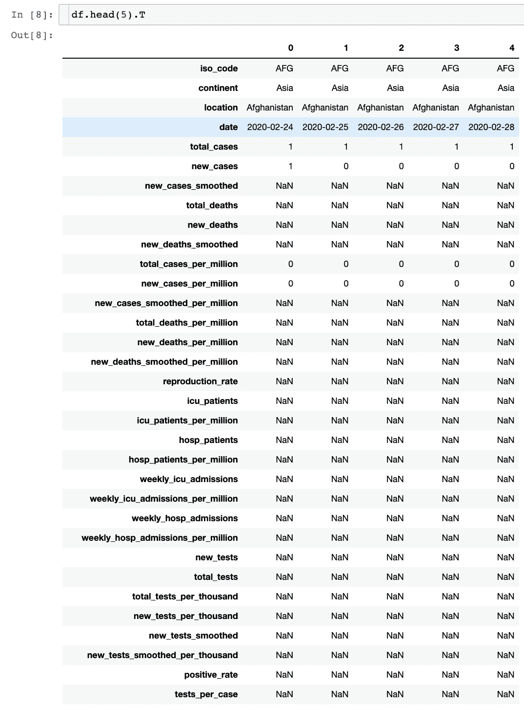
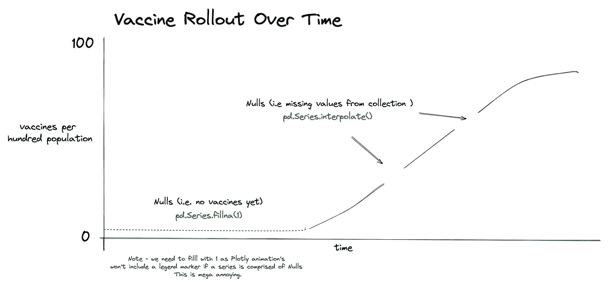
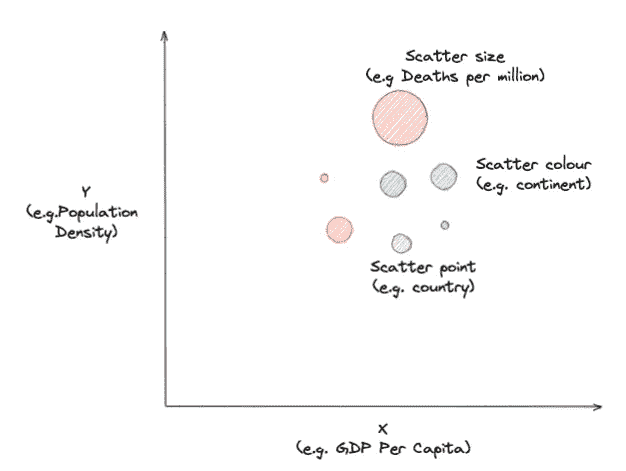
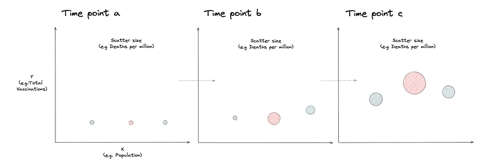
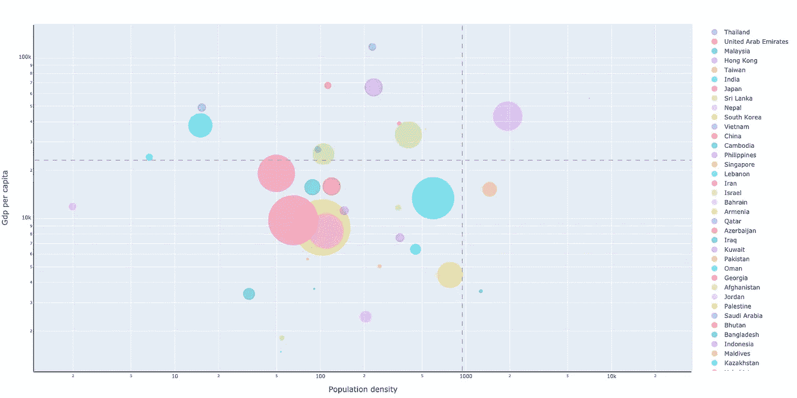
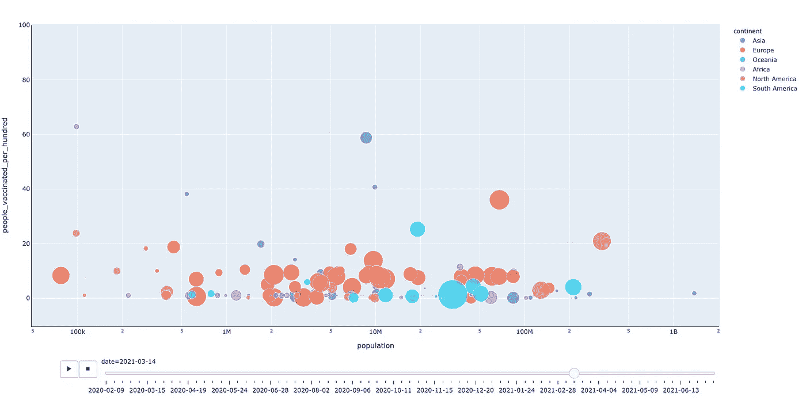

# 构建一个可视化新冠肺炎数据的 Streamlit 应用

> 原文：<https://towardsdatascience.com/interactive-dashboard-in-streamlit-to-analyse-owid-covid-19-data-180b1c3372e4?source=collection_archive---------32----------------------->


埃德温·胡珀在 [Unsplash](https://unsplash.com?utm_source=medium&utm_medium=referral) 上的照片

# 语境

[我们的数据世界](https://ourworldindata.org/) (OWID)是一个开源的在线研究出版物。他们拥有广泛的公共数据集，涵盖疾病、气候变化、社会不公和贫困等主题。

> 我们工作的目标是让大问题上的知识变得容易理解。我们的数据世界是关于研究和数据的，以针对世界上最大的问题取得进展。

因此，当您发现 OWID 在他们的 [GitHub](https://github.com/owid/covid-19-data) 存储库中托管了大量新冠肺炎数据集时，您不会感到惊讶。

我采用了他们的一些新冠肺炎数据，着手开发一款能够让用户可视化和分析新冠肺炎数据的 Streamlit 应用。特别重要的是，用户能够**与数据**进行交互，从而进行定制分析并回答以下问题:

*   *人口密度和总病例数有关系吗？*
*   *哪些国家在疫苗接种方面领先，哪些国家落后了？*
*   *什么特征与死亡最密切相关？*

我希望它看起来很容易，所以[是我完成这项任务的首选图表库。我特别想制作一些可视化的动画，Plotly 是少数几个能以代码高效的方式做到这一点的库之一。](https://plotly.com/)

最终的 Streamlit 已经部署，您可以在下面的链接中找到它，但我想介绍一下我构建它的一些关键步骤，并谈谈在整个开发过程中的一些想法。

[https://share . streamlit . io/kitsa mho/新冠肺炎数据/covid_streamlit_app.py](https://share.streamlit.io/kitsamho/covid-19-data/covid_streamlit_app.py)

# 我们可以访问哪些数据？


照片由[米卡·鲍梅斯特](https://unsplash.com/@mbaumi?utm_source=medium&utm_medium=referral)在 [Unsplash](https://unsplash.com?utm_source=medium&utm_medium=referral) 上拍摄

OWID GitHub 存储库中有许多数据集，但是它们已经将许多关键数据点聚合到一个组合结构中。这使得生活变得相当容易，因为转换不那么密集。

让我们看看 CSV。

```
import pandas as pddf = pd.read_csv('owid-covid-data.csv')
print(df.shape)(101752, 60)print('Total unique continents:',len(df.continent.unique()))
print('Total unique countries:',len(df.location.unique()))
print('Date span:',df.date.min(),df.date.max())Total unique continents: 7
Total unique countries: 231
Date span: 2020-01-01 2021-07-11
```

让我们检查数据帧的头部..



按作者分类的图像-示例数据框架

## 观察

*   我们有 60 列，101，000 多行(截至 2021 年 7 月正确)，每行代表**年中的一天**
*   我们有横跨六大洲的 231 个国家
*   几乎所有的变量都是**连续的**，而国家和大陆是**分类的**。
*   有许多空值**(稍后会详细介绍)。**
*   **鉴于我们分析的性质，这些变量中有些是**相关**的，有些最好描述为**独立**的，尤其是如果我们透过风险因素及其对新冠肺炎疫情的影响来看。**

***注意——我选择了 24 个我认为对演示仪表盘最有用的变量，概述如下。如果你想你可以发展这个应用程序，并包括更多。***

## **因变量**

```
dependent_var = [‘total_deaths’,’total_deaths_per_million’,’total_cases_per_million’,’icu_patients_per_million’,‘people_vaccinated_per_hundred’,
’total_vaccinations’,'hosp_patients_per_million]
```

## **自变量**

```
independent_var = [‘gdp_per_capita’,’population’,’stringency_index’,’population’, 
‘population_density’, ‘median_age’, ‘aged_65_older’,
‘aged_70_older’, ‘gdp_per_capita’, ‘extreme_poverty’,
‘cardiovasc_death_rate’, ‘diabetes_prevalence’, 
‘female_smokers’,’male_smokers’, ‘handwashing_facilities’, 
‘hospital_beds_per_thousand’,’life_expectancy’,'continent', 'location']
```

**这些指标中的大多数都是不言自明的。关于它们代表什么以及如何测量的详细分类，这里有一个广泛的数据字典。**

# **数据准备**

****

**照片由[凯蒂·史密斯](https://unsplash.com/@kate5oh3?utm_source=medium&utm_medium=referral)在 [Unsplash](https://unsplash.com?utm_source=medium&utm_medium=referral) 上拍摄**

## **缺失值和插值**

**当我们准备数据时，经常会遇到缺失值。这可能是因为收集管道中的错误，也可能是因为开始时没有任何数据。当我们处理符合高斯分布的数据时，一个有效的策略是用平均值代替零值，在其他情况下可能用中位数。对于随时间累积的数据，更合适的方法是使用插值法，根据其周围的值来估计和估算值。Pandas 有一个方法`pd.interpolate()`，默认替换是线性的。**

****

**按作者分类的影像-我是如何在 OWID 新冠肺炎数据集中发现缺失值的**

**对原始 OWID 数据集的检查显示，丢失值是常见的。下面是一些解决这个问题的函数。**

**下面是生成可在应用程序中使用的干净/格式化数据的主要函数。**

**让我们来看看最终的数据框架，看看英国是什么样子的。**

****

**按作者分类的图像—示例数据框架**

## **观察**

*   **我们的新冠肺炎**因变量**按周分组(例如，总病例数、死亡人数、住院人数、疫苗接种数),但是随着时间的推移，您可以看到数据存在差异**
*   **每个**独立**特征(如人均 GDP、人口密度、吸烟率)也按周分组，尽管数据不会改变，因为这些东西不会像新冠肺炎那样移动得那么快。**

**太好了，现在我们有了符合我们需要的正确格式的数据。接下来，我们需要开始思考如何在我们的应用程序上以有意义和有用的方式呈现这些数据！**

# **简化应用程序设计**

****

**由[凯利·西克玛](https://unsplash.com/@kellysikkema?utm_source=medium&utm_medium=referral)在 [Unsplash](https://unsplash.com?utm_source=medium&utm_medium=referral) 上拍摄**

**这篇文章假设你对 Streamlit 的工作原理有所了解。如果你不知道，那么请看看下面的这篇文章**

**</streamlit-101-an-in-depth-introduction-fc8aad9492f2>  

## 分析方法

查看这些数据有两种有用的方法:

*   **横截面**——探索在*给定时间点*多个自变量和因变量之间的关系
*   **时间序列** —探究多个自变量和因变量之间的关系，以及*如何随时间变化*

我想让应用程序一直亮着，不想让多个图显示不同的数据点，所以我决定只使用一个**散点图**可视化，但允许用户进行高级定制。这将鼓励互动，并希望有一定程度的发现。

## 多页

我在应用程序中建立了两个页面，一个用于横截面可视化，一个用于时间序列可视化。


作者提供的图片——应用程序截图

*注意——使用 pages 导航 Streamlit 应用并不是 Streamlit 平台的固有功能，但* [Praneel Nihar](https://medium.com/u/ffa230f1042d?source=post_page-----180b1c3372e4--------------------------------) 在此概述了一个解决方案:

<https://medium.com/@u.praneel.nihar/building-multi-page-web-app-using-streamlit-7a40d55fa5b4>  

## 散点图

我喜欢散点图。如果散点图是静态的并且是二维的，我们有能力在一张图中显示多达五个变量。

*   横坐标
*   y 轴
*   分散点
*   散布大小
*   分散颜色



按作者分类的图像-横截面分析示例

如果我们把这些图做成动画，我们也可以在可视化中增加第六维度的时间



按作者分类的图像-时间序列分析示例

最后，如果我们能给用户机会来改变这些变量中的每一个，那么分析的范围可以进一步扩大。Streamlit 中的小部件允许我们提供这个特性。


作者图片 Streamlit 下拉小工具的屏幕截图

## 其他功能

除了 X、Y 和分散数据点，我还包括了一些其他可视化选项:

*   选择**按洲屏蔽**，即只显示特定洲的国家
*   对于 X 和 Y 图，用一条垂直/水平线表示某一特征的集中趋势。这允许您查看哪些标记高于或低于任何绘制的指标的平均值

# 应用程序示例输出—横截面散点图



按作者分类的图像-横截面散点图示例

下面的代码块概述了创建上述横截面散点图所需的步骤。

# 示例输出-时间序列散点图



按作者分类的图像-带动画的横截面散点图示例

下面的代码块概述了创建动画横截面散点图所需的步骤。

# 摘要

希望这个简短的介绍已经为您提供了一些我们如何以一种令人信服的方式可视化数据的例子。通过选择正确的工具与数据进行交互，并通过使用适当的可视化，探索性分析比单独使用条形图更有效、更有趣、信息量更大。

无论如何，请使用我的 Streamlit 代码并在此基础上进行构建——这里有大量的数据，尽管我已经编写了一些全面的代码来可视化这些数据，但我确信还有许多其他途径可以探索和构建。

下次见！

萨姆（男子名）

# 链接和资源

要在本地启动此应用程序，您应该克隆我的分叉 OWID repo，并在命令行中运行:

```
$ streamlit run covid_streamlit_app.py
```

1.  [Streamlit App](https://share.streamlit.io/kitsamho/covid-19-data/covid_streamlit_app.py)
2.  [用我的应用程序分叉 OWID 存储库](https://github.com/kitsamho/covid-19-data)
3.  简化应用程序[要求](https://github.com/kitsamho/covid-19-data/blob/master/requirements.txt)
4.  [原始数据回购中的我们的世界](https://github.com/owid/covid-19-data)**