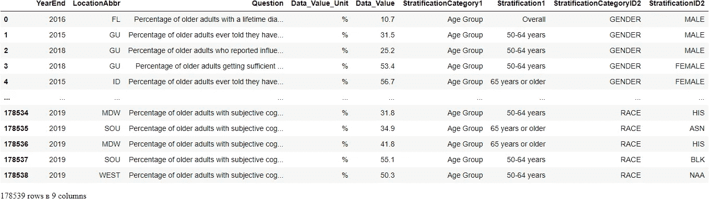
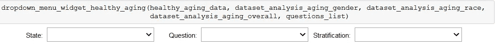
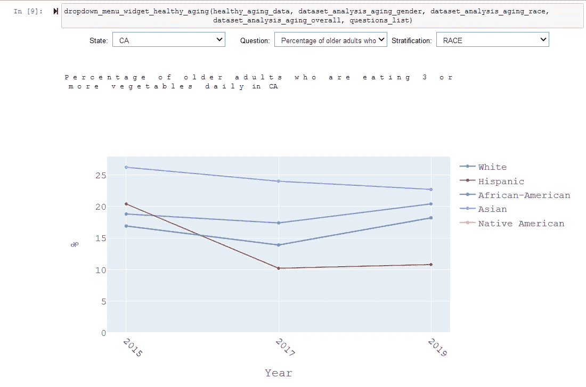

# 在 Jupyter 笔记本中使用下拉菜单 Ipywidgets 和 Plotly 进行交互式数据分析。

> 原文：<https://towardsdatascience.com/interactive-data-analysis-with-dropdown-menu-ipywidgets-and-plotly-in-jupyter-notebook-591a84a81b22?source=collection_archive---------3----------------------->

## 这是一个例子，展示了如何设置一个交互式下拉菜单小部件，以及如何使用 IPython 和 Pandas 在 Jupyter Notebook 中显示数据库分析的结果。

作者图片:拉森火山国家公园。

## 挑战

最近，在为我的一个研究生班做项目时，我面临着这样一个问题:对我在 Jupyter 笔记本上处理的多个数据集进行数据库分析的最佳方式是什么。这些数据库中的每一个都包含了多年来收集的信息，并且对于该特定数据库中询问的每个不同问题都有多个分层级别，例如性别和种族。此外，每个数据库都有国家汇编的信息。例如，每次您想要查看不同州的数据或按种族或性别查看数据时，都必须修改代码并重新运行每个单元格，这既麻烦又低效。这个问题的解决方案在于 [ipywidgets。](https://ipywidgets.readthedocs.io/en/latest/) Ipywidgets 是用于 Jupyter 笔记本和 IPython 内核的交互式 HTML 小部件。它们使用户能够以快速、简单和有效的方式与数据交互并可视化数据中的变化。

在本文中，我将展示如何设置交互式下拉菜单小部件，以“阿尔茨海默氏病和健康老化数据”CDC 数据库为例进行简单的数据分析。3 下拉菜单部件将建立一个用户友好的菜单，在这里可以选择一个国家，一个分层水平(性别，种族或整体)和一个问题，用户希望看到的信息。我将使用 Plotly 这个交互式图形库来显示存储在数据库中的信息的图形表示。

本文使用的 csv 文件可在 [CDC 网站](https://chronicdata.cdc.gov/Healthy-Aging/Alzheimer-s-Disease-and-Healthy-Aging-Data/hfr9-rurv)上公开下载。

## 首先，让我们导入所有需要的库和扩展:

## 其次，让我们准备好要处理的 cvs 文件:

*   为了简化输出，我们将只查看数据集中评估的以下 5 个问题:

1.  身体质量指数(身体质量指数)为 30 或以上的肥胖老年人的百分比。
2.  在过去的一个月中没有任何闲暇时间体育活动的老年人的百分比。
3.  终生被诊断患有抑郁症的老年人的百分比。
4.  被告知患有高血压的老年人中目前正在服药治疗高血压的比例。
5.  每天吃 3 种或 3 种以上蔬菜的老年人百分比。

*   不需要的列将被删除。

## 现在，让我们设置存储在“阿尔茨海默氏病和健康老化数据”数据库中的信息的图形表示所需的所有函数:

*   为了简化输出，我们将只关注所有年龄组的数据点。
*   将只分析 2015 年至 2019 年的可用数据。

函数 plot_healthy_aging_data_gender 采用 2 个字母的状态缩写，3 个数据帧，其中包含制作 Plotly 图形和一个问题所需的信息。如果用户在 dropdown 小部件中指定他们希望看到按性别绘制的数据，将选择该功能。

函数 plot_healthy_aging_data_race 采用 2 个字母的状态缩写，3 个数据帧，其中包含制作 Plotly 图形和一个问题所需的信息。如果用户在 dropdown 小部件中指定他们希望看到按种族绘制的数据，将选择此功能。

函数 plot _ healthy _ aging _ data _ overall 采用 2 个字母的状态缩写，3 个数据帧，其中包含制作 Plotly 图形和一个问题所需的信息。如果用户在 dropdown 小部件中指定他们希望查看按总体分层类别绘制的数据，将选择此功能。

函数 dataset _ analysis _ aging 查询原始数据集，根据种族、性别或整体(所有种族、性别和年龄)分层类别将结果划分为 3 个不同的数据框架。该功能旨在用户选择输入后，提取制作曲线图所需的信息。

如前所述，为了简化输出，我们将只关注所有年龄组的数据点，这些数据点在数据集的“分层 1”列中标记为整体。

函数 dataset_analysis_aging_gender、dataset_analysis_aging_race 和 dataset_analysis_aging _ race 是帮助函数，用于将州、问题和分层类别(性别、种族或总体)的数据集信息传递给 dataset _ analysis _ aging 函数。然后将返回的数据帧传递给相应的分层类别绘图函数。

现在，我们准备设置 3 个下拉菜单小部件，用于“阿尔茨海默氏病和健康老化数据”数据库的数据分析。这将通过编写一个函数来完成，该函数创建一个下拉菜单来选择特定的状态、问题和分层类别，并将这些信息传递到数据集分析函数中以获得特定的输出。

函数 drop down _ menu _ widget _ healthy _ ageing 接受一个与健康老龄化相关的数据集，以及 3 个帮助函数和一个要查询的问题列表。每个助手功能用于控制 UI 界面，以选择特定的状态、问题和分层，即性别、种族或总体数据。

该功能首先返回下拉菜单以选择要分析的状态、问题和分层类别，并且在用户选择输入之后，该功能基于所做的下拉菜单选择返回数据分析。

最后，我们准备调用交互式 drop down _ menu _ widget _ healthy _ age 函数。在初始输入选择后，用户可以继续改变菜单中的输入，以查看不同输入的图形输出，而无需重新运行任何单元。

在 Jupyter 笔记本中运行上面的单元格后，会出现下面显示的下拉菜单。现在可以选择下拉菜单来显示相应的曲线图。下拉菜单演示可以在文章末尾找到。

本文使用的 Jupyter 笔记本和数据集可以在 GitHub 找到:[https://github.com/drozenshteyn/Jupyter_widgets_dropdown](https://github.com/drozenshteyn/Jupyter_widgets_dropdown)

感谢您的阅读，

月形蝴蝶

注:我使用了 [jupyter_to_medium](https://www.dexplo.org/jupyter_to_medium) 和 GitHub embeds 的组合来发布这篇文章。