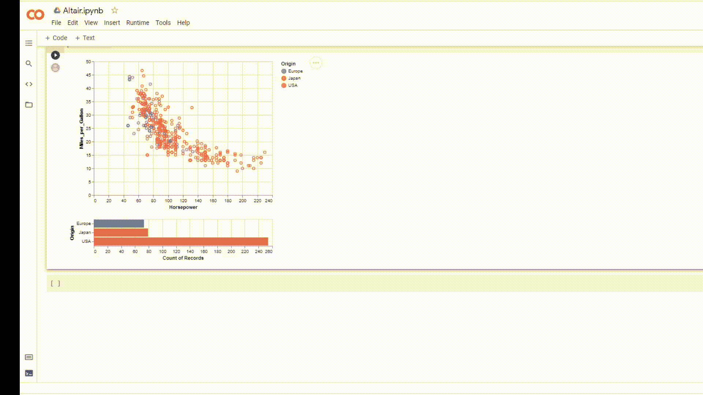
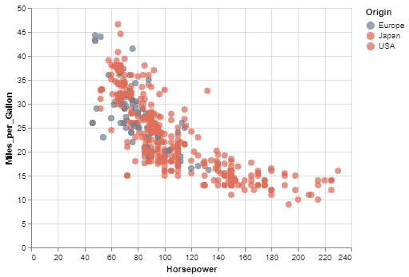
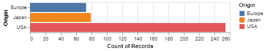

# 交互式数据可视化

> 原文：<https://towardsdatascience.com/interactive-data-visualization-2c7d62fb3b16?source=collection_archive---------32----------------------->

## 使用 Altair 创建数据可视化



来源:作者

数据可视化有助于揭示肉眼无法在表格格式中看到的隐藏数据模式。它有助于理解不同数据点之间的相关性和关联性。不同类型的可视化有助于理解数据集的不同属性。

Python 提供了许多可用于数据可视化的库。每个包都有自己的优点和缺点。这里我们将讨论交互式数据可视化，这只有在极少数 pythons 库中才有可能。

Altair 是一个开源 Python 库，用于创建高度交互和有用的数据可视化。它提供了我们可以创建的各种各样的图表和绘图。

在本文中，我们将探索 Altair 并使用它创建一些可视化。

让我们开始吧…

# 安装所需的库

我们将从使用 pip 安装来安装 Altair 开始。下面给出的命令将使用 pip 安装 Altair。

```
pip install altair vega_datasets
```

# 导入所需的库

在这一步中，我们将导入创建模型和可视化这些模型所需的所有库。

```
import altair as alt
from vega_datasets import data
```

# 正在加载数据集

在这篇文章中，我们将从织女星数据集著名的数据集'汽车'。在下面给出的代码中，您可以看到我们如何导入数据集。

```
source = data.cars()
```

# 创建图表

现在，我们将从创建一些图表开始，并探索如何创建这些图表。

1.  **散点图**

```
alt.Chart(source).mark_circle(size=60).encode(
    x='Horsepower',
    y='Miles_per_Gallon',
    color='Origin',
    tooltip=['Name', 'Origin', 'Horsepower', 'Miles_per_Gallon']
).interactive()
```



散点图(来源:作者)

在这里，您可以清楚地看到，我们在代码中添加了一个工具提示，使该图更具交互性。

2.**条形地块**

```
alt.Chart(source).mark_bar().encode(
    y='Origin:N',
    color='Origin:N',
    x='count(Origin):Q'
)
```



条形图(来源:作者)

3.**组合图表**

```
points = alt.Chart(source).mark_point().encode(
    x='Horsepower:Q',
    y='Miles_per_Gallon:Q',
    color=alt.condition(brush, 'Origin:N', alt.value('lightgray'))
).add_selection(
    brush
)bars = alt.Chart(source).mark_bar().encode(
    y='Origin:N',
    color='Origin:N',
    x='count(Origin):Q'
).transform_filter(
    brush
)
points & bars
```


Combo(来源:作者)

正如你在上面的视频中看到的，使用上面的代码创建的图表是高度交互式的。该图同时具有散点图和条形图。

在这里，您可以清楚地看到我们使用 Altair 创建的不同图表和图形。尝试使用不同的数据集，创建不同的可视化效果，并在回复部分告诉我您的意见。

本文是与 [Piyush Ingale](https://medium.com/u/40808d551f5a?source=post_page-----2c7d62fb3b16--------------------------------) 合作的。

# 在你走之前

***感谢*** *的阅读！如果你想与我取得联系，请随时通过 hmix13@gmail.com 联系我或我的* [***LinkedIn 个人资料***](http://www.linkedin.com/in/himanshusharmads) *。可以查看我的*[***Github***](https://github.com/hmix13)**简介针对不同的数据科学项目和包教程。还有，随意探索* [***我的简介***](https://medium.com/@hmix13) *，阅读我写过的与数据科学相关的不同文章。**