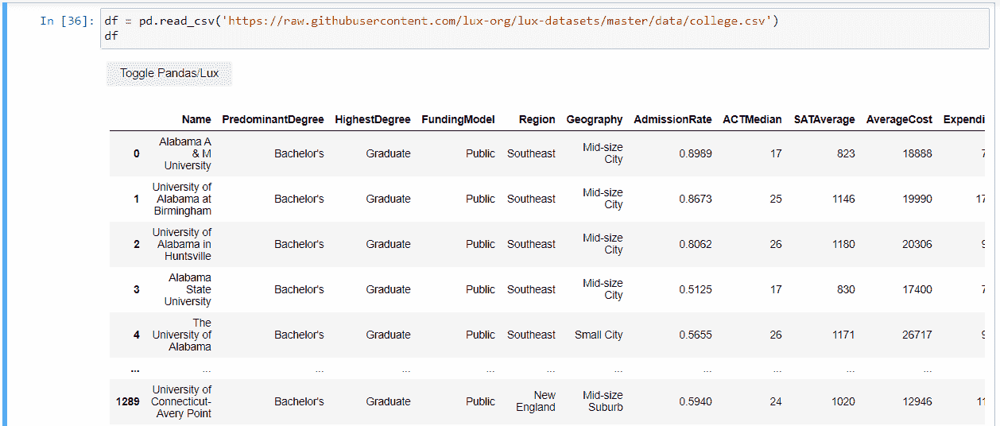

# Python 中 Lux 的交互式数据可视化

> 原文：<https://towardsdatascience.com/interactive-data-visualization-with-lux-in-python-94bfcf84d15?source=collection_archive---------28----------------------->

## 只需点击一下，就可以看到几乎所有的图表


照片由 [JJ 英](https://unsplash.com/@jjying?utm_source=unsplash&utm_medium=referral&utm_content=creditCopyText)在 [Unsplash](https://unsplash.com/s/photos/perfect-pattern?utm_source=unsplash&utm_medium=referral&utm_content=creditCopyText)

# 介绍

数据可视化是数据科学的基本步骤之一。通过可视化数据，我们可以获得洞察力，这可以帮助我们获得新的洞察力。

有时创建一个很好的可视化效果，甚至选择一个适合数据的可视化类型，都需要很长时间。因此，我们需要一个能够自动化这个过程的库。

Lux 是一个 python 库，只需点击一下鼠标，就可以实现数据可视化工作流程的自动化。此外，lux 可以为您的数据选择完美的可视化方式。

在这篇文章中，我将向你介绍力士图书馆。此外，我将向您展示如何使用 python 来实现它。

没有进一步，让我们开始吧！

# 履行

## 安装库

你需要做的第一件事就是安装 lux 库。您可以使用 pip 或 conda 来完成此操作。在这种情况下，我将使用 pip 来安装 lux。另外，我启用了 jupyter 笔记本的插件。下面是这样做的代码。

```
! pip install lux-api 
! jupyter nbextension install --py luxwidget 
! jupyter nbextension enable --py luxwidget
```

## 加载数据

安装完库之后，现在可以加载它了。接下来，您需要加载数据。您可以使用任何您喜欢的数据，但现在我将使用来自 lux 库的数据。这些数据基本上描述了美国的大学，包括 SAT 平均分、地区、费用等。这是完成这项工作的代码，

```
import lux 
import pandas as pd df = pd.read_csv('https://raw.githubusercontent.com/lux-org/lux-datasets/master/data/college.csv') df
```

当您运行代码时，您不仅会看到数据帧。您还会看到将您从 lux 重定向到可视化的按钮。这是它的预览图，



因为您使用所有列进行可视化，所以它会提供几个选项卡供您查看。每个选项卡由不同列的图表组成。这些选项卡是

*   “相关性”选项卡为您提供了散点图之类的图表，直观显示了两个变量之间的关系。
*   distribution 选项卡为您提供了类似直方图的图表，显示了一列的值分布。
*   “发生”选项卡为您提供了类似于分类条形图的图表。

## 选择列

与任何其他库一样，您可以选择想要可视化的特定列。在这种情况下，我们希望看到 AverageCost 列和 SATAverage 列之间的关系。这是可视化它的代码，

```
df.intent = ["AverageCost", "SATAverage"]
df
```

这是代码的预览，


除了可视化数据之外，它还为您提供了一些增强可视化的建议。您可以看到三个选项卡。

*   “增强”选项卡为您提供增强可视化样式的建议。
*   过滤器选项卡将过滤显示基于特定条件减少的图表。
*   概化选项卡将通过移除给定的属性来显示图表。

## 过滤数据

正如我上面提到的，您可以使用某些条件来过滤数据。我们来看看东南地区有多少大学基于他们的资助模式。下面是实现它的代码，

```
df.intent = ["Region=Southeast", "FundingModel"] 
df
```

这是结果，


## 导出可视化效果

在您选择列并给出一些条件后，现在您可以从您喜欢的图表范围中进行选择。在可视化块上，您可以点击您喜欢的图表。之后，您可以单击箭头导出它们。这是它的样子，


选择图表后，您可以使用如下导出的属性来访问它，

```
df.exported
```


如果您想从列表中选择一个图表，可以使用索引来访问它。下面是这样做的命令，

```
df.exported[0]
```

这是它的样子，


## 转换为 Matplotlib

现在您想导出图表，但又想将它们转换成另一种类型。幸运的是，lux 可以将您的图表转换为另一种格式，例如 matplotlib。

要将图表转换为 matplotlib 格式，可以使用 to_matplotlib 函数来完成。这是实现这一点的代码，让我们回忆一下我们导出的第一个图表，

如您所见，它显示了 matplotlib 代码。我们可以在我们的环境中运行代码。所以我们试试。

哦不，有一个错误。它说“Set1”对象未定义。要解决这个问题，您可以在对象名称中添加记号。修复后，我们可以看到 matplotlib 格式的图表。这是代码和预览。

干得好！该图表已经在 matplotlib 版本中。

# 结束语

恭喜你！现在，您已经了解了如何使用 lux 来自动化您的数据可视化工作流。希望对你有用。

如果你对我的文章感兴趣，可以关注我的媒介。还有，如果你有什么问题，可以在 [LinkedIn](https://www.linkedin.com/in/alghaniirfan/) 上联系我。

谢谢你看我的文章！