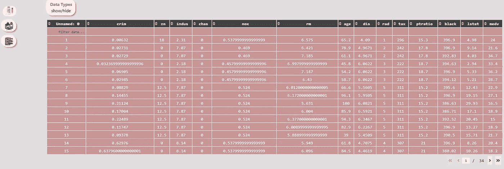

# 交互式探索性数据分析

> 原文：<https://towardsdatascience.com/interactive-exploratory-data-analysis-259e62fed295?source=collection_archive---------21----------------------->

## 使用 Python 实现基于 GUI 的 EDA 应用


米利安·耶西耶在 [Unsplash](https://unsplash.com?utm_source=medium&utm_medium=referral) 上拍摄的照片

探索性数据分析是我们为了理解数据而对数据进行的初始分析。这一点很重要，因为在我们创建模型或对数据执行操作之前，我们应该了解数据是什么，它包含哪些特征，这些特征如何相互关联以及目标值等。

如果数据集具有较少的要素，我们可以使用不同的图和图表来执行初始分析，但如果数据集具有大量要素，这将非常耗时，因为我们需要编写大量代码来分析所有要素及其关联。有各种方法可以减少这一时间，但仍然需要大量的工作，这些工作可以节省下来用于进一步的过程，如模型创建、操作等。

如果我告诉你，现在你可以节省一般在 EDA 中消耗的时间和精力，会怎么样？是的，你没看错，在本文中，我将向你展示一个 python 库，它不仅能减少你的工作量，还能帮助你从数据中获得洞察力，甚至不用编写 1000 行代码。

Autoplotter 是一个构建在 Dash 之上的开源 python 库，它创建了一个 GUI 应用程序，您可以在其中分析您的数据并创建不同的可视化效果，这些效果在视觉上非常吸引人，并且具有高度的交互性。我们还可以分析数据的属性，如分布、关联等。只用了一行代码。

在本文中，我们将使用 Autoplotter 分析数据集，看看如何减少我们的时间和精力。

让我们开始吧…

# 安装所需的库

我们将从使用 pip 安装来安装自动绘图仪开始。下面给出的命令将安装它。

```
pip install autoplotter
```

# 导入所需的库

接下来，我们将导入所需的库，它们是用于加载数据集的 Pandas 和用于探索性数据分析的 Autoplotter。

```
from autoplotter import run_app 
import pandas as pd
```

# 正在加载数据集

现在，我们将加载将在其上执行 EDA 的数据集。您可以使用任何数据集以及不同大小的数据集和大量要素。我在这篇文章中使用了著名的波士顿数据集。

```
df = pd.read_csv("/content/boston.csv")
```

# 执行 EDA

这是我们启动基于 GUI 的 Dash 应用程序的最后一步，该应用程序将用于 EDA。Autoplotter 为您提供了两种方式，即您可以在线运行应用程序，即在您要去的同一台笔记本电脑中运行，或者您可以在本地 URL 从外部启动它。我将向您展示这两种方法。

```
run_app(df,mode = "inline", host="127.0.0.1", port=5000)
```


内嵌(来源:作者)

```
run_app(df,mode = "external", host="127.0.0.1", port=5000)
```

这将在提到的 URL 和端口号上运行应用程序。现在让我们分析一下这个应用程序的不同部分。

1.  **数据预览**

应用程序的第一部分和登录页面是数据预览页面，在这里您可以预览您正在处理的数据。



数据预览(来源:作者)

2.**图**

这是最有用的部分。在本节中，我们可以使用大量的功能创建大量的图。我们可以使用 Plotly，ggplot，seaborn 等创建绘图。使用不同的参数和值，只需一次单击即可创建不同类型的图。


情节(来源:作者)

3.**分析**

这是我们可以分析数据集属性的第三部分，也是最后一部分。它包含三个选项卡，即数据分布、统计分析和分布。这里我们可以分析数据集的属性。


分析(来源:作者)

这就是我们如何使用基于 GUI 的应用程序进行探索性数据分析，并节省我们的时间和精力。继续尝试不同的数据集，并让我知道您在回复部分的评论。

本文是与[皮尤什·英格尔](https://medium.com/u/40808d551f5a?source=post_page-----259e62fed295--------------------------------)合作完成的。

# 在你走之前

***感谢*** *的阅读！如果你想与我取得联系，请随时通过 hmix13@gmail.com 联系我或我的* [***LinkedIn 个人资料***](http://www.linkedin.com/in/himanshusharmads) *。可以查看我的*[***Github***](https://github.com/hmix13)**简介针对不同的数据科学项目和包教程。还有，随意探索* [***我的简介***](https://medium.com/@hmix13) *，阅读我写过的与数据科学相关的不同文章。**