# 生成 Python 的交互式探索性数据分析

> 原文：<https://towardsdatascience.com/interactive-exploratory-data-analysis-that-generates-python-790715e920e4?source=collection_archive---------22----------------------->

## 鳄梨数据集交互式探索性数据分析实用指南


德克·里布勒在 [Unsplash](https://unsplash.com/s/photos/avocado?utm_source=unsplash&utm_medium=referral&utm_content=creditCopyText) 上的照片

E 探索性数据分析(EDA)是数据科学过程中的第一步，通常在数据提取之后。EDA 帮助我们在继续建模或决定重复提取步骤之前熟悉数据。

**EDA 帮助数据科学家:**

*   熟悉数据
*   发现数据提取过程中的错误
*   决定数据是否需要清理
*   如果有丢失的值，决定如何处理
*   可视化数据分布等。

> 通过探索性数据分析，我们获得了数据的“感觉”

通过阅读这篇文章，你会得到

*   基于 Avocado 数据集的 JupyterLab EDA 实例
*   每个交互式操作的代码片段
*   与同事分享分析结果的有效方式

如果你错过了我之前关于这个主题的文章，请参见[米托——一个生成 Python](https://romanorac.medium.com/list/mito-a-spreadsheet-that-generates-python-1df29fc67dff) 的电子表格。

# 鳄梨数据集交互式探索性数据分析实用指南


由[estudio Bloom](https://unsplash.com/@estudiobloom?utm_source=medium&utm_medium=referral)在 [Unsplash](https://unsplash.com?utm_source=medium&utm_medium=referral) 上拍摄的照片

在本文中，我们将分析 avocado 数据集 Kaggle 上比较流行的数据集之一——并展示探索性数据分析中的一些基本操作。

[鳄梨数据集](https://www.kaggle.com/neuromusic/avocado-prices/metadata)包含多个美国市场上鳄梨价格和销量的历史数据。可以从 [Kaggle](https://www.kaggle.com/neuromusic/avocado-prices/home) 下载。原始数据来自 [HASS 鳄梨董事会](http://www.hassavocadoboard.com/retail/volume-and-price-data)。Kaggle 数据集在[开放数据库许可](https://opendatacommons.org/licenses/odbl/1.0/) (ODbL)下获得许可。

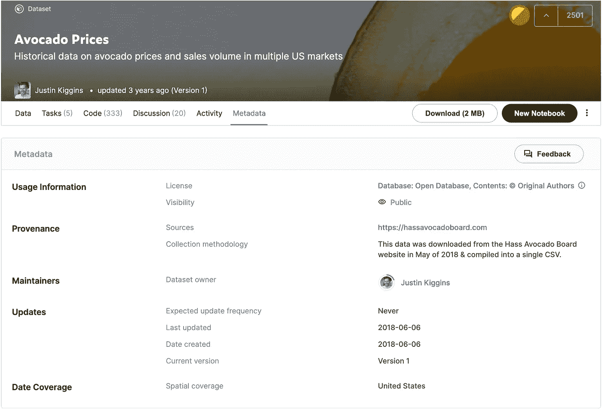

[Kaggle 上的牛油果数据集](https://www.kaggle.com/neuromusic/avocado-prices/metadata)(作者 2021 年 10 月 18 日截图)

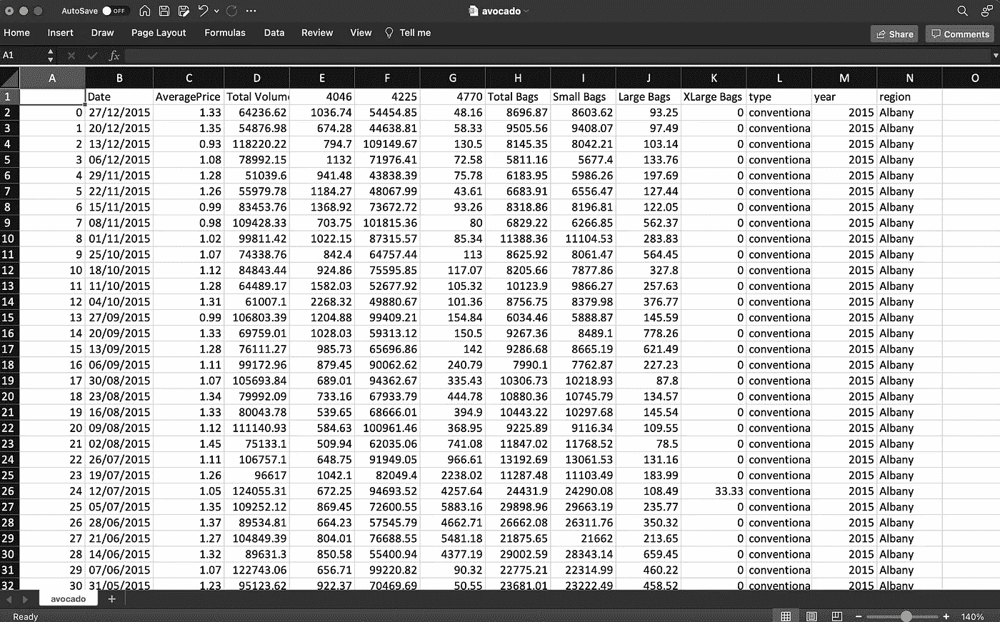

在 Excel 中打开的鳄梨数据集(图片由作者提供)

我们将使用 JupyterLab 的[米托](https://docs.trymito.io/getting-started/installing-mito)扩展来分析这个数据集，该扩展使用户能够在 JupyterLab 中交互式地完成他们的 EDA，并让每个编辑在下面的代码单元中生成等效的 Python。


使用 Python 进行探索性数据分析(作者可视化)

首先，我们需要用这个函数加载 Jupyter 实验室中的 Mitosheet 交互环境:

```
# make sure you have [Mito installed](https://docs.trymito.io/getting-started/installing-mito) before running this functionimport mitosheet
mitosheet.sheet()
```

这些函数将一个空的 Mitosheet 调用到 Jupyter 环境中

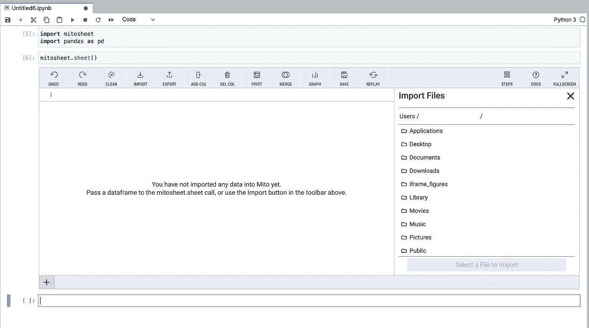

米托用 JupyterLab 中的空白表初始化(图片由作者提供)

# 导入数据

要将数据加载到工作表中，我们可以将现有的 Dataframe 作为参数传递给 Mitosheet 调用:

```
mitosheet.sheet(df)
```

或者，我们可以单击工具栏中的导入按钮，从本地文件系统中选择一个文件。

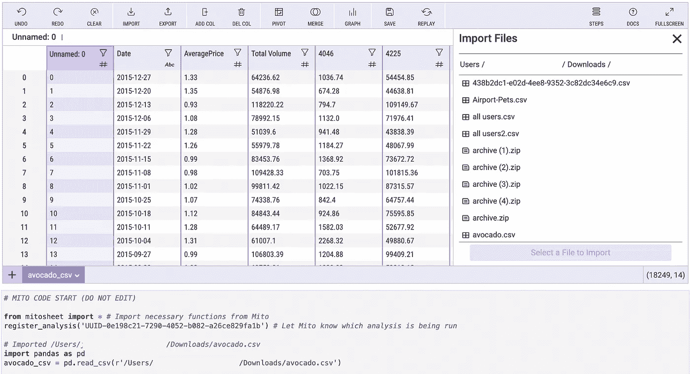

使用“导入”按钮导入米托表中的数据

当我们在导入菜单中选择“avocado.csv”时，米托会自动将 csv 文件转换为数据帧，并在下面的代码单元格中生成等效的 Python:

```
# Imported /Users/Downloads/avocado.csvavocado_csv = pd.read_csv(r’/Users/Downloads/avocado.csv’)
```

# 删除列

CSV 文件已经有一个索引列，在 Mitosheet 中显示为“未命名:0”，所以我们要做的第一件事就是删除这个列，我们可以通过单击工具栏中的删除列按钮来完成。

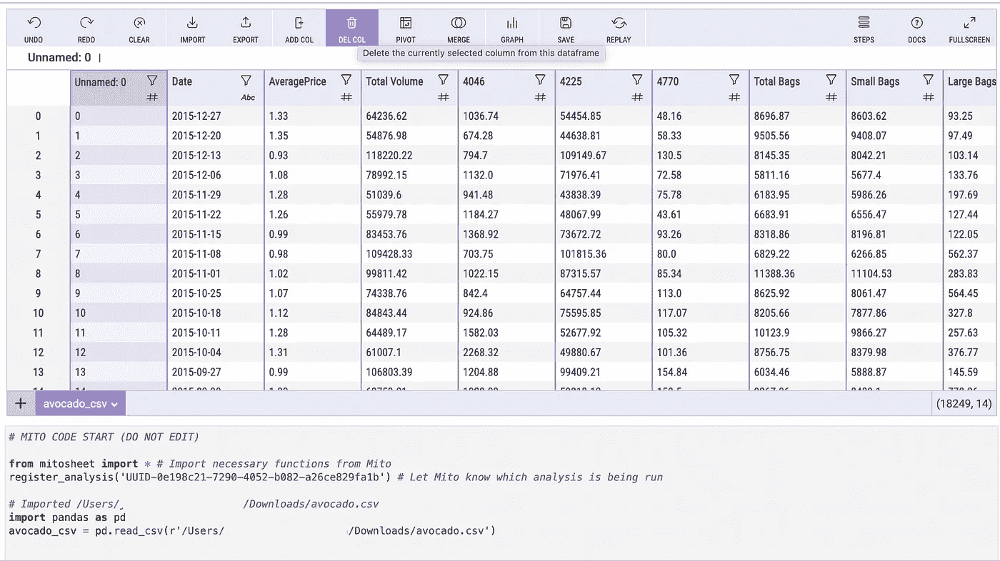

删除 avocado 数据集中的一列(图片由作者提供)

这将在下面的代码单元格中生成等效的 Python。代码也是自动记录的:

```
# Deleted column Unnamed: 0 from avocado_csv
avocado_csv.drop('Unnamed: 0', axis=1, inplace=True)
```

# 数据集中的唯一值

假设我们对数据集中鳄梨的不同区域感兴趣。

我们可以选择“区域”列的列菜单，然后转到值选项卡。

在“值”选项卡中，我们可以看到:

*   列中的所有唯一值，
*   这些值中的每一个的频率，
*   以及每个值占总条目的百分比。

从这种分布来看，鳄梨似乎是按地区平均分布的。

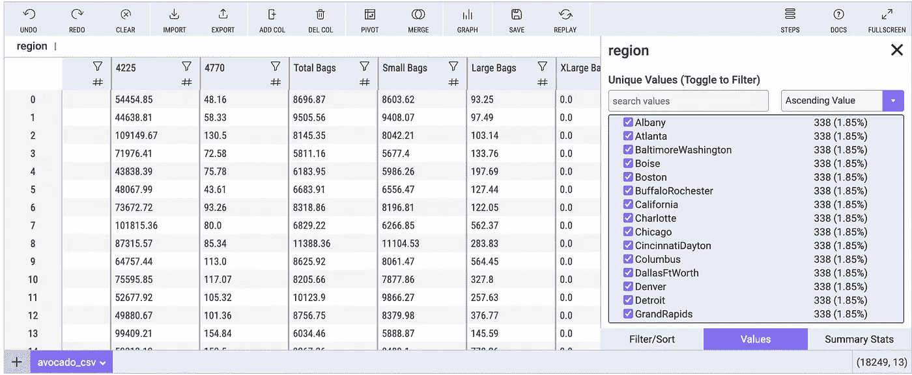

显示鳄梨数据集中的唯一值(图片由作者提供)

# 过滤数据集

我们决定只查看鳄梨的地区是“奥尔巴尼”的行

我们可以选择 column 菜单中的 Filter/Sort 选项卡，并设置一个过滤器，其中“region”列正好是“Albany”

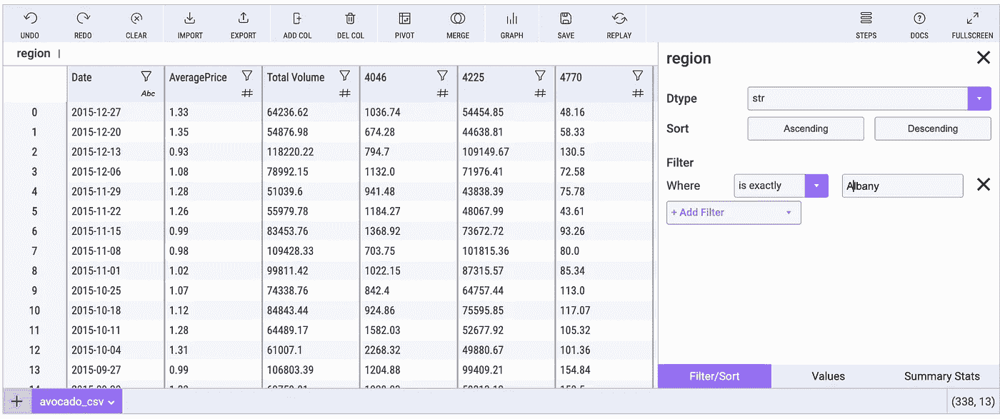

行的交互式过滤(图片由作者提供)

为该过滤器生成的代码如下所示:

```
# Filtered region in avocado_csv
avocado_csv = avocado_csv[avocado_csv['region'] == 'Albany']
```

# 解析日期值

现在我们已经过滤了数据集，我们想要探索“日期”列中剩下的值。

首先，让我们使用工具栏中的“添加列”按钮。

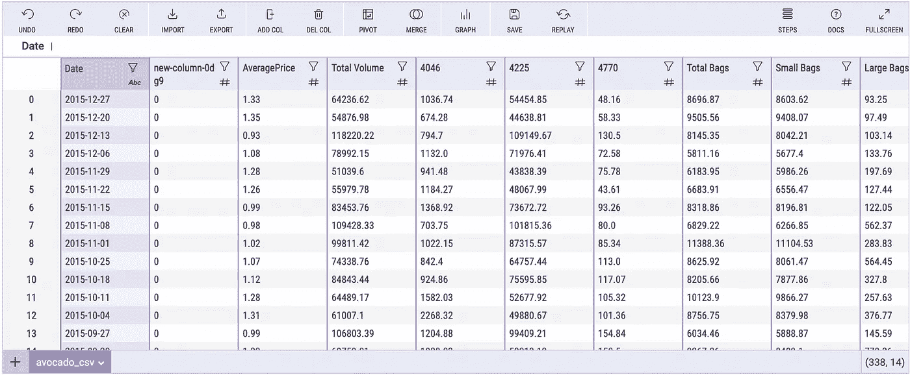

在表单中添加新列(作者图片)

接下来，让我们向该列添加一个公式，该公式从“date”列中的每个日期值解析出月份值。

```
=MONTH(Date)
```

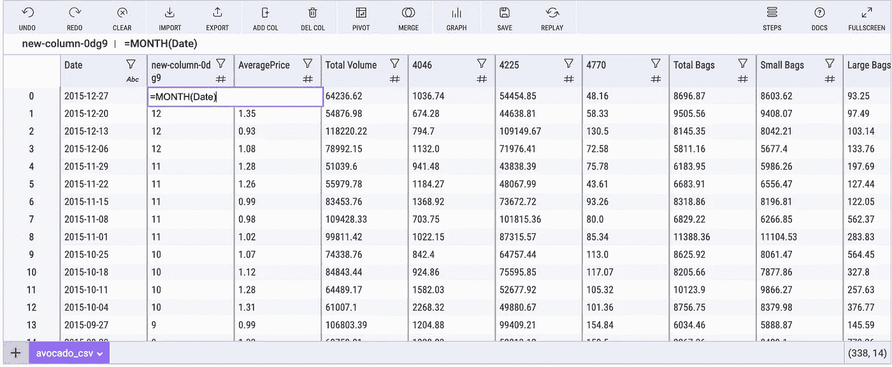

将公式添加到表单中的新列(作者图片)

# 数据透视表

一旦我们在新列中检索到月份值，我们就可以使用数据透视表来计算每个月有多少个条目，并比较合计的计数。

我们需要做的就是点击工具栏中的“Pivot”按钮，并从出现的侧菜单中配置表格。

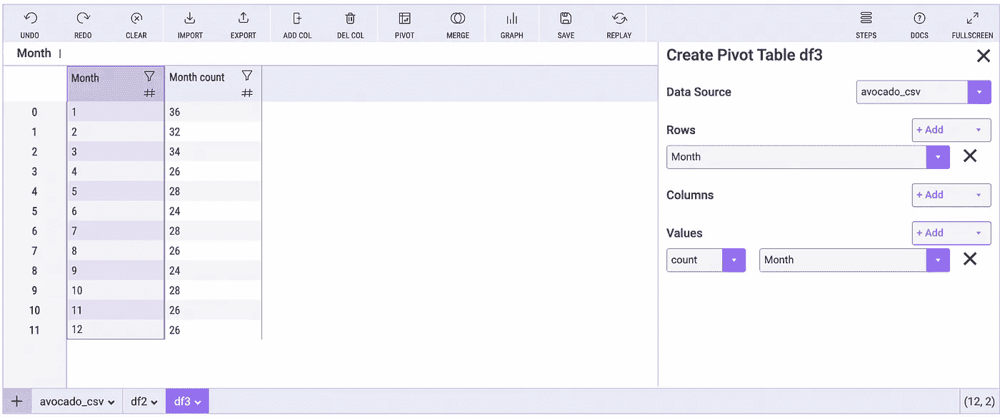

计算工作表中的数据透视表(图片由作者提供)

该数据透视表操作将生成以下 Python 代码片段:

```
# Pivoted avocado_csv into df3
unused_columns = avocado_csv.columns.difference(set(['Month']).union(set([])).union(set({'Month'})))
tmp_df = avocado_csv.drop(unused_columns, axis=1)
pivot_table = tmp_df.pivot_table(
    index=['Month'],
    values=['Month'],
    aggfunc={'Month': ['count']}
)
```

# 排序值

在 column 菜单中，我们还可以通过“Month count”列进行排序，以降序查看每个月的计数列表。

这里我们可以看到，对于过滤后的奥尔巴尼条目，一月的条目最多，六月和九月的条目最少。

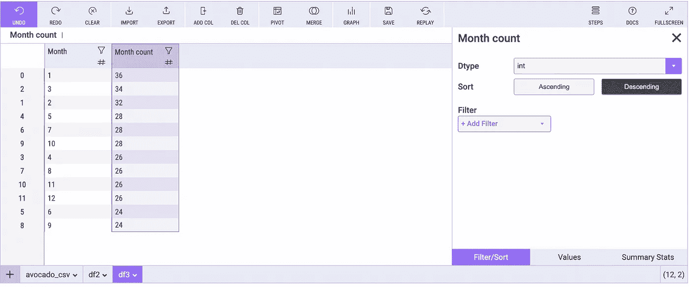

对表单中的值进行排序(按作者排序的图像)

# 形象化

最后，我们可以通过单击工具栏中的“Graph”按钮来可视化分析。我们可以在侧边菜单中进行配置。

您可以将此可视化文件下载为 PNG 格式，以便与您的同事分享。

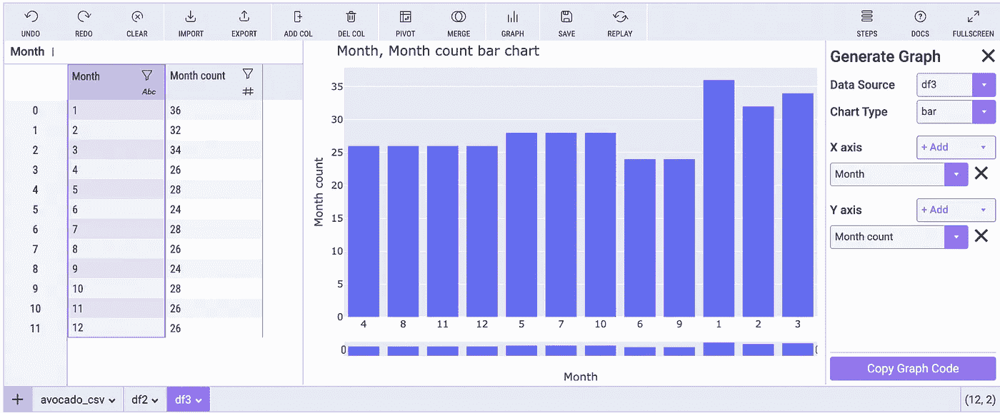

使用米托可视化数据分布(图片由作者提供)

# 分享你的分析

我们也可以通过点击“复制图形代码”按钮来复制任何可视化的等价代码。

此图的输出代码是:

```
# Import plotly and create a figure
import plotly.graph_objects as go
fig = go.Figure()# Add the bar chart traces to the graph
for column_header in ['Month']:
    fig.add_trace(
        go.Bar( 
            x=df3[column_header],
            y=df3['Month count'],
            name=column_header
        )
    )# Update the title and stacking mode of the graph
# See Plotly documentation for customizations: [https://plotly.com/python/reference/bar/](https://plotly.com/python/reference/bar/)
fig.update_layout(
    xaxis_title='Month',
    yaxis_title='Month count',
    title='Month, Month count bar chart',
    barmode='group',
)
fig.show(renderer="iframe")
```

如果我们运行上面的代码，出现在 Mitosheet 中的相同图表将作为输出出现在代码单元格的下面。

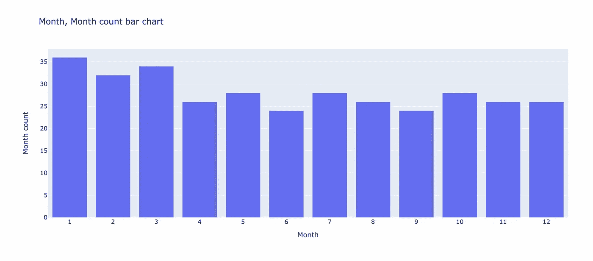

可视化(作者制作的图像)

# 结论


由 [Lenstravelier](https://unsplash.com/@lenstravelier?utm_source=medium&utm_medium=referral) 在 [Unsplash](https://unsplash.com?utm_source=medium&utm_medium=referral) 上拍摄的照片

我们在 EDA 过程中经历了一些简单的操作。虽然这不是一个全面的 EDA 指南，但它显示了我们如何避免在初始 EDA 中为简单的数据操作键入代码。

生成的代码有助于与同事分享，也有助于没有经验的数据科学家学习“熊猫方式”进行分析。

米托允许强大的 EDA 过程在 JupyterLab 生态系统中交互发生。

以下是了解更多关于[米托](https://docs.trymito.io/getting-started/installing-mito)的链接和[鳄梨数据集](https://www.kaggle.com/neuromusic/avocado-prices)的链接。

# 在你走之前

*如果你喜欢看这些故事，为什么不成为* [***中等付费会员***](https://romanorac.medium.com/membership) *？每月 5 美元，你可以无限制地阅读 10000 个故事和作家。**[***如果你用我的链接***](https://romanorac.medium.com/membership)**注册，我会赚一小笔佣金。***

****

**照片由 [Alexas_Fotos](https://unsplash.com/@alexas_fotos?utm_source=medium&utm_medium=referral) 在 [Unsplash](https://unsplash.com?utm_source=medium&utm_medium=referral) 上拍摄**