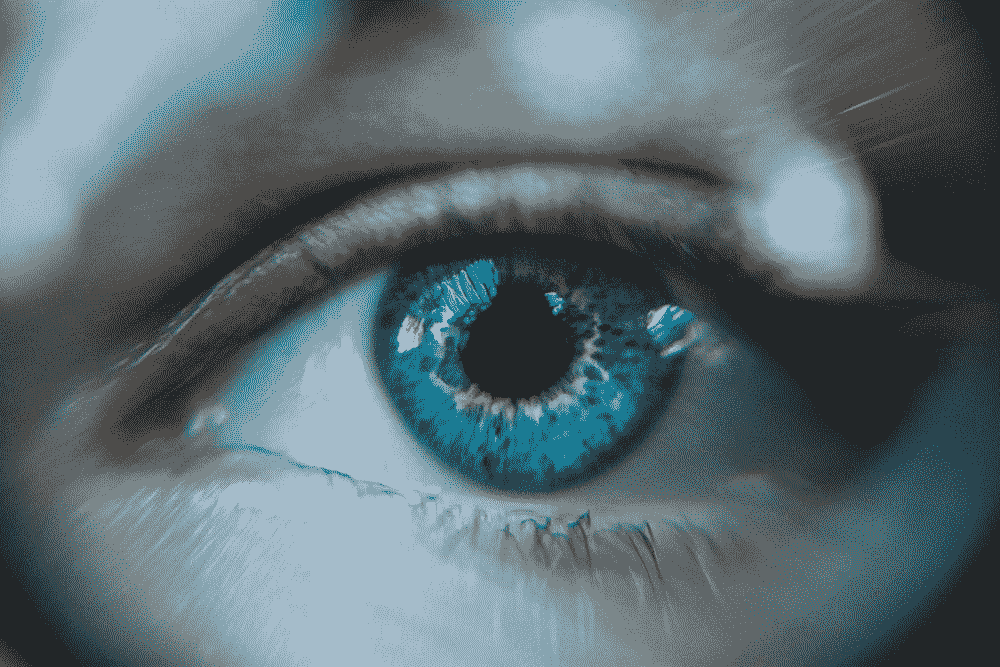
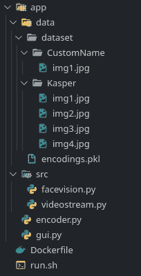
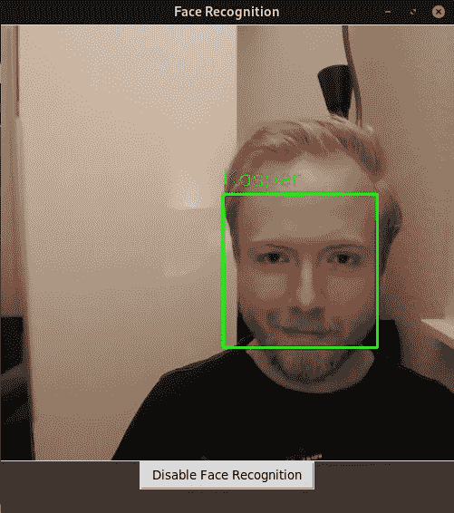

# 通过 Docker 的交互式人脸识别应用

> 原文：<https://towardsdatascience.com/interactive-face-recognition-application-through-docker-85e86ad0ffa6?source=collection_archive---------16----------------------->

## 一种同时利用相机设备、交互式 GUI、Docker、GPU 和深度学习的方法。

丹尼尔·库切列夫在 [Unsplash](https://unsplash.com) 上拍摄的照片。

T 这篇文章将介绍如何开发一个交互式应用程序，利用 Adam Geitgey 的框架[人脸识别](https://github.com/ageitgey/face_recognition)，从一个人的相机或网络摄像头设备中识别人脸。为了创建一个交互式应用程序，我们将使用 Tkinter，并使用 Docker 来确保一个包含所有必要依赖项的隔离环境。这篇文章可以作为您自己项目的起点，因为使用哪个框架和库并不重要。了解如何通过 Docker 创建一个利用相机设备、GPU 加速和深度学习框架的交互式应用程序有许多可能性。

如果只是想通过 Docker 运行 GUI，我写了这篇文章，你可以参考:

</empowering-docker-using-tkinter-gui-bf076d9e4974>  

如果您想立即运行应用程序，可以下载我的 [Github 资源库](https://github.com/KasperSHenriksen/face_recognition_gui)，并遵循本文末尾的“运行应用程序”一节。

# 阅读指南

在整篇文章中，我们将介绍应用程序中的脚本，之后将介绍运行应用程序的指南。本文将遵循以下顺序。

## 目录

1.  先决条件
2.  应用概述
3.  码头工人
4.  Tkinter
5.  摄像设备
6.  计算机视觉
7.  命令过程
8.  运行应用程序
9.  结论

# 先决条件

这个应用程序只在 Linux 上测试过，但是，它应该和其他一些参数可能不同的操作系统一样工作，例如当运行 Docker 时。

对于先决条件，你应该有一个摄像头或网络摄像头，Docker，CUDA 和 CuDNN 安装。我已经使用以下工具测试了该应用程序:

*   20.10.8
*   CUDA 11.4
*   CuDNN 8.2.2
*   操作系统:Manjaro 21.1.2 Phavo
*   GPU:英伟达 GeForce GTX 1080 Ti
*   摄像设备:罗技网络摄像头 C930e

## 目录结构

该项目的目录结构如下所示。你可以预先创建这些文件或者直接从我的 [Github 库](https://github.com/KasperSHenriksen/face_recognition_gui)下载所有文件。此外，您需要在数据集目录中创建自己的目录，并插入所需的图像。在我的例子中，如下所示，我在 Kasper 目录中添加了四个图像。你添加的同一个人在不同场景下的图像越多，你的预测就越准确。关于脚本，它们的内容将贯穿整篇文章。

***注:****`*encodings.pkl*`*会在后面自动生成。**

**

*应用程序的目录结构。*

# *应用概述*

*该应用程序包含一个 GUI，它有一个用于显示相机设备输出的面板。此外，还有一个启动/关闭面部识别的按钮。*

**

*当前打开人脸识别的应用程序。*

# *码头工人*

*为了创建一个安装人脸识别、OpenCV、Dlib、Python 等的隔离环境，使用了 Docker 的以下代码。*

*docker 文件来创建我们的隔离环境。*

# *Tkinter*

*为了创建可由用户控制的交互式 GUI 来启用和禁用人脸识别，使用了 Tkinter 库。下面的代码创建了之前显示的 GUI。*

*主脚本，它创建一个 GUI 并允许人脸识别。*

# *摄像设备*

*为了从相机设备获取图像并更新 Tkinter GUI，可以使用以下脚本。在第 7 行，它使用了 OpenCV 的 VideoCapture 函数，其中的参数应该与您的设备相对应。默认的相机 id 通常是 0，但是，如果它不起作用，您可以尝试使用 1 或-1。如果您希望使用视频，您应该能够将设备 id 替换为视频路径，但是可能需要进行一些其他调整。在第 26 行，它在一毫秒后再次调用函数本身。*

# *计算机视觉*

*与大多数计算机视觉应用相反，在大多数计算机视觉应用中，你可以通过提供数百个类别的示例来训练模型对所需的类别进行分类，而在人脸识别中，你可以使用深度度量学习。通过深度度量学习，你可以训练一个模型来描述所需的对象，而不是预测它是哪个类。在我们的例子中，我们用它来提供一个特征向量，一个 128 维的编码，用实数描述每张脸。教导模型来描述面部而不是预测特定的人是一个优点，因为如果想要识别一个新人，就不必重新训练模型。相反，我们应该简单地保存这个新的人的编码，这个编码对于这个模型来说是可以达到的。我们将在本文后面获得这些编码。有了人脸识别框架，我们不必从头开始训练模型，而是使用通过人脸识别提供的已经训练好的模型。如果希望进一步探索人脸识别领域,《人脸识别框架》的作者 Adam Geitgey 详细阐述了这个主题:*

*<https://medium.com/@ageitgey/machine-learning-is-fun-part-4-modern-face-recognition-with-deep-learning-c3cffc121d78>  

## 数据集和编码器

为了使模型能够识别人脸，需要一个包含人脸编码的 pickle 文件。为了实现这一点，正如前面在“目录结构”一节中提到的，您必须在目录数据集中创建一个具有所需人员姓名的目录。然后，编码器应该包含以下代码。在这段代码中，我们递归地获取数据集目录中每个人的所有图像。通过使用人脸识别框架，我们定位人脸并提取每个图像的编码。

构建一个 pickle 文件，其中包含来自数据集的编码。

## 人脸识别

为了识别人脸，将使用以下代码。总结一下代码，它使用来自我们相机设备的图像，检测人脸，为每个人脸提取 128 维编码，然后将新编码与我们的编码数据集进行比较。为了进行比较，它会检查新编码的要素与我们的编码数据集之间的距离，如果某个要素的距离低于容差参数，则该要素会获得投票。为了找到最佳匹配，我们只需选择票数最高的人。如果简单的解决方案不够，您可以实现一个更强的分类器。

更具体地说，VideoStream 为每一帧调用函数`process_image`，这个函数完成实现人脸识别的所有必要工作。在第 43–45 行，您可以调整用于比较的公差参数。公差越低，比较越严格。此外，在第 48–51 行中，也可以调整`highest_vote`来增加或减少严格性。

要获得关于面部识别功能的更多详细信息，请参考[文档](https://face-recognition.readthedocs.io/en/latest/face_recognition.html)。

计算机视觉部分，基于人脸识别框架。* 

# *外壳脚本(警告)*

*为了使工作更简单，创建一个 shell 脚本，使用以下参数运行 xhost 和 Docker。对于 xhost，启用对每个人的访问，然后在分离 Docker 容器后禁用它。在这个 Docker 命令中，我们共享 GPU、用于查看 GUI 的显示器、用于持续开发的卷和网络摄像头设备。*

***警告:**如果在本地运行，使用 xhost 和这些 Docker 参数应该不成问题。但是，如果用于生产，安全性应该得到加强，这是建议[在这里](http://wiki.ros.org/docker/Tutorials/GUI#The_simple_way)。*

*自动启用/禁用 xhost 并运行 Docker 容器。*

# *运行应用程序*

1.  *建立码头工人形象:`docker build -t facerecognition_gui .`*
2.  *使 shell 脚本可执行:`chmod +x ./run.sh`*
3.  *运行 shell 脚本:`./run.sh`*
4.  *在 Docker 容器中，创建编码数据集(确保您的图像位于数据集目录下的某个目录中):`python3 encoder.py`*
5.  *运行应用程序:`python3 gui.py`*
6.  *您现在可以启用面部识别了。*

****注意:*** *要分离/退出 Docker 容器，请按 ctrl-D**

# *结论*

*在本文中，您已经了解了 GUI、摄像设备、GPU 如何与 Docker 一起使用。知道如何将这些结合起来，提供了许多可以用于学术和商业目的的可能性。而且，与 etc 的策略相同。通过 Docker 共享设备，您应该能够利用其他库和框架，而不会遇到问题。*

## *感谢阅读*

*一如既往，我们非常欢迎反馈。我故意排除了类型提示以减少代码。但是，如果你觉得类型提示有用，请告诉我。*