# 爱沙尼亚塔尔图市常规运动 OD 矩阵互动流程图

> 原文：<https://towardsdatascience.com/interactive-flow-map-with-an-od-matrix-of-regular-movements-in-tartu-estonia-3ac6b7738397?source=collection_archive---------23----------------------->

从呼叫详细记录(CDR)获得传单中的家庭-工作通勤的交互式可视化

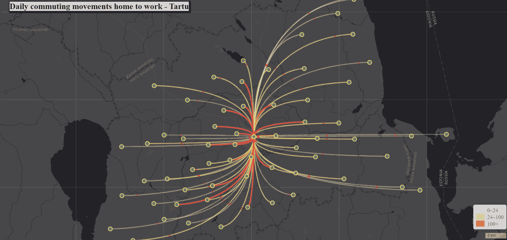

图片由作者提供。塔尔图县通勤地图动画

城市发展与人口流动有着紧密的联系。城市规划者根据人口动态的功能做出决策。比方说，交通拥堵是一个明显的事实，即需要特定的道路来到达人们的重要位置(工作场所)，然后城市规划者可以决定释放道路压力的选项，如改善公共交通。正如我们所理解的，人口是塑造城市的关键因素，空间维度的指标，如*人口密度、年龄组的空间分布或老年人集中程度*，有助于做出塑造宜居城市的决策。

由于信息和通信技术(ICT)，追踪个人(匿名)成为可能。在世界范围内，手机在通信领域占据着强大的优势，根据[统计数据](https://www.statista.com/statistics/330695/number-of-smartphone-users-worldwide/)，2021 年手机用户将超过 6 0 亿。移动电话呼叫会在天线网络中创建一个名为呼叫详细记录(CDR)的注册表，该注册表允许创建一个在空间覆盖和时间(纵向)上巨大的数据集。这些移动定位数据有助于研究人员、城市推广者、地方政府、私营公司或区域组织(EU)对城市进行建模。

> 最终地图动画[在此！](https://bryanvallejo16.github.io/movements-odmatrix-tartu/)
> 储存库[在这里！](https://github.com/bryanvallejo16/movements-odmatrix-tartu)

> **简介**

作为流动性研究的领先国家，**爱沙尼亚**已经连续收集了 12 年时间序列的 CDR 数据。塔尔图大学**的 [**移动实验室**](https://mobilitylab.ut.ee/publications/research-articles/) 从多个角度对数据集进行了分析，例如*旅游统计、种族隔离、社交网络、跨境移动(跨国主义)或空间移动*等等。这些研究让人们理解了人的流动、有意义的地点和空间。移动定位数据揭示了人们的有意义的位置，例如**家或工作**(定位点/活动位置)[1]，然后可以汇总位置之间的移动，并用于构建日常人流。这些研究在诸如*长期活动空间、社会中的居住等级或交通*等应用中非常广泛，但对于这种可视化实践，我们将基于 OD 矩阵，该矩阵代表每天从家到工作单位的通勤。您可以在爱沙尼亚地理学家 [Anto Aasa](https://www.etis.ee/CV/Anto_Aasa/est) 撰写的 [**移动实验室(OD 矩阵)页面**](https://mobilitylab.ut.ee/OD/) 上扩展阅读关于 CDR 应用和数据集生成的内容。**

> **数据**

数据集[2]由电话运营商 Telia、 [**塔尔图大学地理系移动实验室**](https://mobilitylab.ut.ee/en/about/) 和一家分拆公司 [**Positium LBS**](https://positium.com/) 收集和分析。每月约有 420，000 名受访者注意到 ***锚点模型*** 应用于确定每月有意义的位置。数据集揭示了用户在社区之间的日常通勤(聚合的空间单位)。

这个数据集的创建是非常特别和令人着迷的，在非常高水平的分析和移动实验室多年的研究中，现在有可能理解城市中人们的通勤，并提供可行的数据来根据人口动态做出决策。

我很高兴我得到了 Anto Aasa 的许可，可以使用这个数据集来制作这个教材。该数据集可以在适当参考的情况下免费使用，不得用于商业目的。

> **在这里找到数据集** [**！**](https://mobilitylab.ut.ee/OD/#data_download)

由于产生的线条(运动)的数量，OD 矩阵的可视化可能是压倒性的。在这里，您可以在流程图中直观地看到塔尔图县社区之间的日常通勤活动。正如我们所见，当地图越靠近市中心(塔尔图市)时，它可以显示更多的通勤者。但是，这个练习的主要目的是使这个流动贴图是交互的(动画的),所以有一个更好的观察运动的颗粒。如果您想查看更多关于 OD 矩阵可视化的信息，您可以查看文章[***“赫尔辛基的自行车共享系统运动:具有交互式流程图的聚合和可视化”***](/visualization-of-bike-sharing-system-movements-in-helsinki-with-an-interactive-flow-map-451d897104fe)

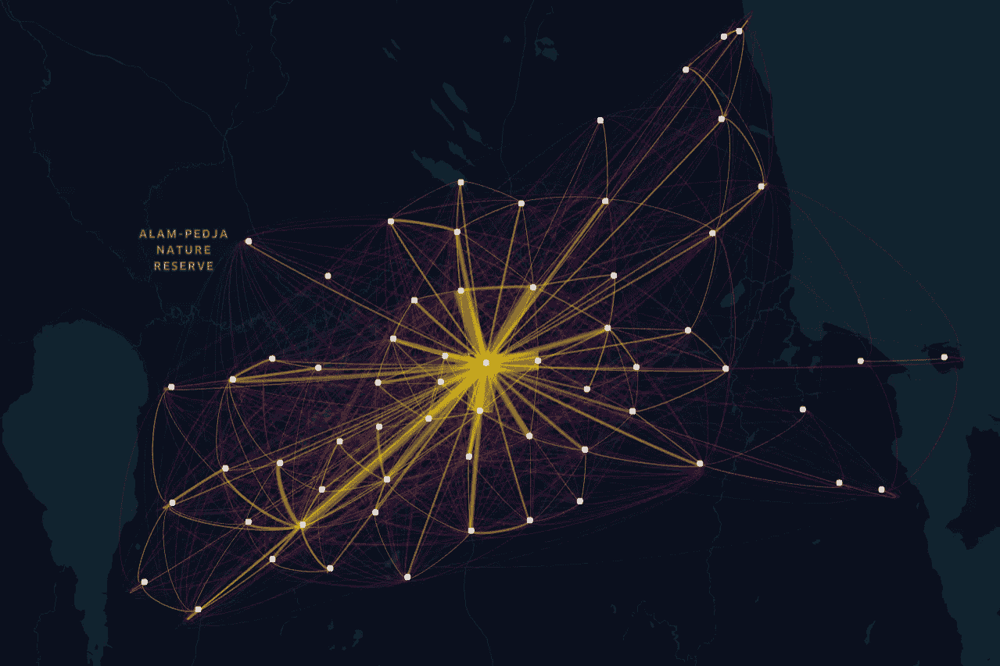

图片由作者提供。塔尔蒂县日常通勤家庭工作流程图

> 目标
> 
> 这一可视化实践旨在创建一个互动的地图动画(网络地图),以传单的形式展示爱沙尼亚塔尔图的个人(OD-Matrix)在家和工作之间的移动。

> **练习**

可视化练习分为两个部分: *1)基于* ***塔尔图县起点-终点的动作子集，Python*** *和* [***传单***](https://leafletjs.com/)***JavaScript****中 OD-Matrix 的交互地图动画。*

存储库仅包含常规数据的子集。但是您可以在自己的分析中重用这些代码。为了明确起见，一般数据集包含作为起点的所有邻域和作为目的地的所有邻域。总共有 847 个社区/街区，它们可以在下一张地图上看到:

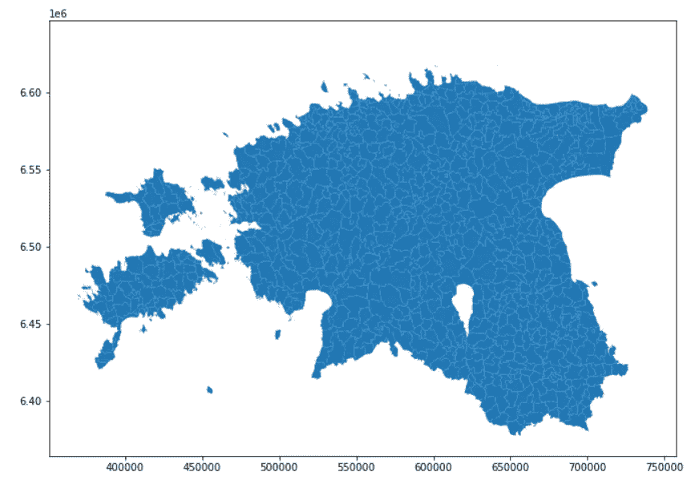

图片由作者提供。爱沙尼亚的社区/街区

> ***1)定义塔尔图县起点-终点数据集***

我们希望在国家级可视化所有以**塔尔图县为出发地**的旅行和所有以**塔尔图为目的地**的旅行。

*1.1 创建塔尔图县社区列表*

我们将读取包含塔尔图县社区的图层，并获取包含所有社区的列表:

```
import geopandas as gpd
import pandas as pd
from pyproj import CRS
from shapely.geometry import Point# tartu communities
fp = r'data/Communities_Tartu.shp'
geodata_tartu = gpd.read_file(fp)# list with tartu communities for subset 
tartu_communities = geodata_tartu['KANT_nk'].to_list()
```

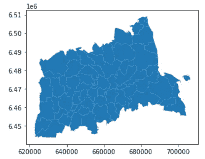

图片作者。塔尔图县的街区/社区

*1.2 塔尔图县运动子集*

这里，我们将使用列表`tartu_communities`只对 Tartu 县的出发地和目的地进行子集划分。请记住，整个数据集包含国家一级的运动。

```
# reading movement OD data
fp = r'data/OD_matrix_201708.csv'
movements = gpd.read_file(fp, encoding='Latin')# selecting all origins from Tartu County
origins = movements[movements['KANT_start'].isin(tartu_communities)]# selecting all destination from Tartu County origins
movements_tartu =  origins[origins['KANT_end'].isin(tartu_communities)]
```

我们在 *geopandas* 中读取它，因为我们需要在下一步中对列进行几何处理。

1.3 小叶向 WGS84 的坐标转换

在活页中，数据集必须以 WGS84 坐标显示。在这里，我使用了一个技巧。我将投影数据集两次。第一次是获取始发地 WGS84 中的经纬度，第二次是获取目的地的坐标。我投影两次，因为通过创建一个几何图形，它在爱沙尼亚投影中释放，然后我在 WGS84 中投影，然后我得到纬度和经度。像这样:

```
# create a geometry column of ORIGIN
movements_tartu = movements_tartu.copy()xorigins = movements_tartu['X_start'].to_list()
yorigins = movements_tartu['Y_start'].to_list()movements_tartu['geometry'] = [Point(float(xcoor), float(ycoor)) for xcoor, ycoor in zip(xorigins, yorigins)]# defining data in Estonian coordinate system
movements_tartu.crs = CRS.from_epsg(3301)# reprojecting to wgs84
movements_tartu = movements_tartu.to_crs(4326)# add coordinates in wgs82 for ORIGIN
movements_tartu['x_origin'] = [coordinate.x for coordinate in movements_tartu['geometry'].to_list()]
movements_tartu['y_origin'] = [coordinate.y for coordinate in movements_tartu['geometry'].to_list()]# update geometry for DESTINATION# adding geometry with ending point just to obtain coordinates
xdest = movements_tartu['X_end'].to_list()
ydest = movements_tartu['Y_end'].to_list()movements_tartu['geometry'] = [Point(float(xcoor), float(ycoor)) for xcoor, ycoor in zip(xdest, ydest)]# defining data in Estonian coordinate system
movements_tartu.crs = CRS.from_epsg(3301)# reprojecting to wgs84
movements_tartu = movements_tartu.to_crs(4326)# add coordinates in wgs82 DESTINATION
movements_tartu['x_dest'] = [coordinate.x for coordinate in movements_tartu['geometry'].to_list()]
movements_tartu['y_dest'] = [coordinate.y for coordinate in movements_tartu['geometry'].to_list()]# update geometry for origin
movements_tartu['geometry'] = [Point(float(xcoor), float(ycoor)) for xcoor, ycoor in zip(xorigins, yorigins)]# defining data in Estonian coordinate system
movements_tartu.crs = CRS.from_epsg(3301)# reprojecting to wgs84
movements_tartu = movements_tartu.to_crs(4326)
```

现在，我为 **OD 可视化**更新代码，并用 WGS84 坐标子集化所需的列。

```
# updating code of destinations
movements_tartu['end_kant_id'] = list(range(len(movements_tartu)))movements_tartu['start_kant_id'] = movements_tartu['start_kant_id'].astype(int)
movements_tartu['end_kant_id'] = movements_tartu['end_kant_id'].astype(int)# getting the needed columns
movements_tartu = movements_tartu[['KANT_start', 'KANT_end', 'start_kant_id', 'end_kant_id', 'route_id', 
                                   'Population', 'RegularMovers', 'x_origin', 'y_origin', 'x_dest', 'y_dest', 'geometry' ]]movements_tartu.to_file(r'data/movements_tartu.geojson', driver='GeoJSON')
movements_tartu.head()
```

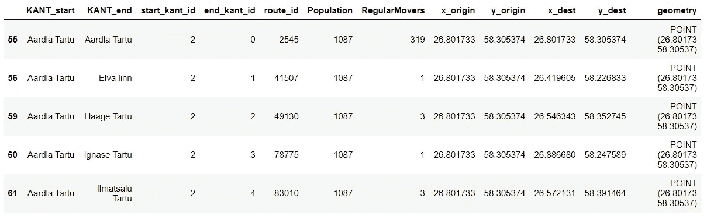

图片由作者提供。塔尔图县运动数据集的最终结构

> ***2)宣传单*** 中的日常通勤互动地图动画

现在，我们必须创建一个包含必要文件的存储库，以使地图动画工作。我们添加了一个名为`css` 的文件夹和另一个名为`js.`的文件夹，我们还添加了一个名为`index.html`的 HTML 文件，您可以通过在本地磁盘上克隆存储库来获得这些文件。因此，您的本地文件夹可能如下所示:


图片由作者提供。知识库结构。

注意在*数据文件夹*中已经有一个`movements_tartu.geojson`文件，它是步骤 1)的结果

要使用文件进行 web 映射，我推荐使用[**Atom**](https://atom.io/)**或者简单地使用 [**记事本++**](https://notepad-plus-plus.org/downloads/) **。****

**首先，我们将下载并复制文件夹`js.`中用于 web 映射的 [**传单 API**](https://leafletjs.com/) 另外，我们添加一个空的 JS 文件，在本例中命名为`main-movements-tartu.js`最后，我们包含了`**CanvasFlowmapLayer.js**`文件，该文件包含在资源库中，但也可以在[**jwalsilgeo Github**](https://github.com/jwasilgeo/Leaflet.Canvas-Flowmap-Layer)中找到。该文件夹必须如下所示:**

**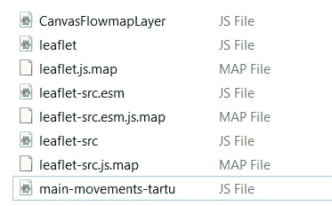**

**图片由作者提供。js 文件夹的结构**

**然后，在文件夹中，`css` 我们添加了来自传单的 CSS 文件和一个空文件，在本例中我们称之为`map-style.css` CSS 文件夹，如下所示:**

**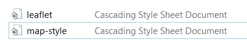**

**图片由作者提供。CSS 文件夹的结构**

***2.1)将文件加载到 index.html***

**我们将使用 Atom 或 Notepad++打开*index.html*文件，并开始加载文件。它将包含一个**头部**和一个**主体**。在主体部分，我们包含了运行地图动画的主要文件，还有传单文件和数据文件。它包括 ESRI 的基本地图。**

```
<!DOCTYPE HTML><html>
 <head>
  <meta charset="utf-8">
  <title>Daily commuting movements home to work - Tartu</title><!--link to stylesheet-->
  <link rel="stylesheet" href="css/map-style.css"><!-- link to leaflet stylesheet-->
  <link rel="stylesheet" href="css/leaflet.css">
 </head><body>
  <!--the sequence of elements called matters!-->
  <!-- title of your map-->
  <h1> Daily commuting movements home to work - Tartu </h1><!-- division div for the map -->
  <div id="map"></div><!-- link to leaflet javascript library-->
  <script src="js/leaflet-src.js"></script><!-- load Esri Leaflet because we want to use an Esri basemap -->
  <script src="[https://unpkg.com/esri-leaflet@2.3/dist/esri-leaflet.js](https://unpkg.com/esri-leaflet@2.3/dist/esri-leaflet.js)"></script><!-- Load animation tweening lib requirement for CanvasFlowMapLayer -->
  <script src="[https://unpkg.com/@tweenjs/tween.js@18.5.0/dist/tween.umd.js](https://unpkg.com/@tweenjs/tween.js@18.5.0/dist/tween.umd.js)"></script><!-- then load CanvasFlowMapLayer -->
  <script src="js/CanvasFlowmapLayer.js"></script><!--link to the files that contains geoJson data-->
  <script src="data/movements_tartu.geojson" > </script><!-- link to main javascript file -->
  <script src="js/main-movements-tartu.js"></script></body>
<html>
```

***2.2)map-style . CSS 中的参数***

**我们必须样式化 HTML 文件，并简单地样式化对象:*标题、正文、图例和地图*。打开`map-style.css`，包含下一段代码:**

```
h1{
 position: fixed;
 font-family: "Times New Roman", Times, serif;
 font-size: 24px;
  box-shadow: 2px 2px 3px 3px black;
 background: lightgray;
    color: black;
    margin-left:5%;
    margin-top: 0.6%;
    z-index: 2;
}
body{
 width: 100%;
 height: 100%;
 margin: 0px;
 font-family: "Times New Roman";
}
.info {
    padding: 6px 8px;
    font-family: "Times New Roman", Times, sans-serif;
    font-size: 16px;
    background: white;
    background: rgba(255,255,255,0.8);
    box-shadow: 0 0 15px rgba(0,0,0,0.2);
    border-radius: 5px;
}
.info h3 {
  font-size: 18px;
  font-family:  "Times New Roman", Times, serif;
  text-decoration: underline;
  text-shadow: 2px 2px 5px gray;
    margin: 0 0 5px;
    color: #282825   ;
}
.legend {
    line-height: 20px;
    color: #555;
}
.legend i {
    width: 25px;
    height: 18px;
    float: left;
    margin-right: 8px;
    opacity: 0.7;
}
#map {
 height:100%;
 width:100%;
 left:0%;
 overflow:hidden;
 position:fixed;
 border:1px #444 solid;
}
```

**如果您在浏览器中打开 index.html，您可能会看到如下所示的空白画布:**

****

**图片由作者提供。空画布**

***2.3)定义数据移动中的变量-tartu.js***

**要在传单中包含运动数据集，您可能需要将其定义为一个变量。您需要打开数据文件，并包含`var geoJsonFeatureCollection =`因此，数据文件必须如下所示:**

**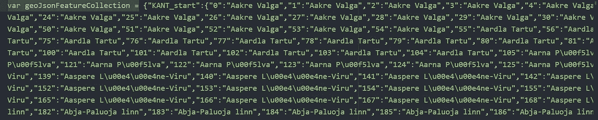**

**图片由作者提供。数据的变量定义**

*****2.4)在 main-movement-Tartu . js***中创建地图动画**

**在这里，我们将开始创建带有传单的地图，并制作塔尔图县附近的运动动画。我们一步一步来。你可以看一下 [***传单互动 Choropleth Map***](https://leafletjs.com/examples/choropleth/) 的例子，我在建立 Map 变量和定义图例颜色时得到了一些帮助。**

**首先，我们为地图添加一个变量，定义缩放级别和中心。然后，我们添加一个 ESRI 底图。**

```
//--- PART 1: ADDING BASE MAPS AND SCALE BAR ---// variable for the map
var map = L.map('map', {
 center: [58.57, 25.5],
 zoom: 8
});var esri = L.esri.basemapLayer('DarkGray');
 esri.addTo(map);L.control.scale({imperial:false, position:'bottomright'}).addTo(map);
```

**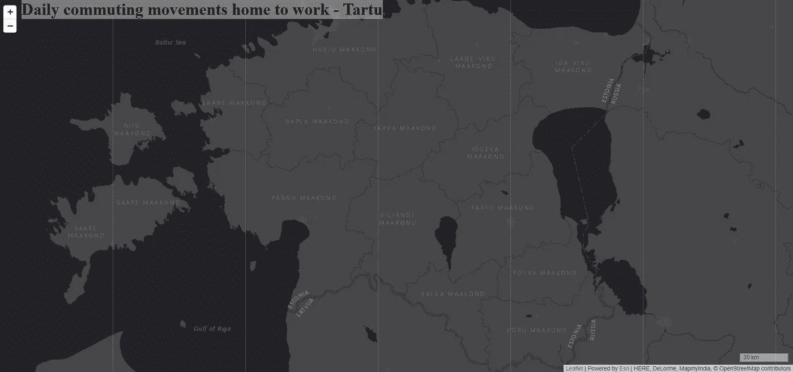**

**图片作者。从传单和 ESRI 底图添加的地图对象**

**现在，我们用动画功能添加运动数据。**

```
// — — PART 2: ADDING ANIMATION OF OD MATRIX WITH VARIABLE geoJsonFeatureCollection — -var oneToManyFlowmapLayer = L.canvasFlowmapLayer(geoJsonFeatureCollection, {
 originAndDestinationFieldIds: {
 originUniqueIdField: ‘start_kant_id’,
 originGeometry: {
 x: ‘x_origin’,
 y: ‘y_origin’
 },
 destinationUniqueIdField: ‘end_kant_id’,
 destinationGeometry: {
 x: ‘x_dest’,
 y: ‘y_dest’
 }
 },
 canvasBezierStyle: {
 type: ‘classBreaks’,
 field: ‘RegularMovers’,
 classBreakInfos: [{
 classMinValue: 0,
 classMaxValue: 24,
 symbol: {
 strokeStyle: ‘#fee8c8’,
 lineWidth: 0.5,
 lineCap: ‘round’,
 shadowColor: ‘#fee8c8’,
 shadowBlur: 2.0
 }
 }, {
 classMinValue: 25,
 classMaxValue: 100,
 symbol: {
 strokeStyle: ‘#fdbb84’,
 lineWidth: 1.5,
 lineCap: ‘round’,
 shadowColor: ‘#fdbb84’,
 shadowBlur: 2.0
 }
 }, {
 classMinValue: 101,
 classMaxValue: 10000000,
 symbol: {
 strokeStyle: ‘#e34a33’,
 lineWidth: 3,
 lineCap: ‘round’,
 shadowColor: ‘#e34a33’,
 shadowBlur: 2.0
 }
 }],
 defaultSymbol: {
 strokeStyle: ‘#e7e1ef’,
 lineWidth: 0.5,
 lineCap: ‘round’,
 shadowColor: ‘#e7e1ef’,
 shadowBlur: 1.5
 },
 },
 pathDisplayMode: ‘selection’,
 animationStarted: true
}).addTo(map);// Selection for dispaly
oneToManyFlowmapLayer.on('mouseover', function(e) {
 if (e.sharedOriginFeatures.length) {
 oneToManyFlowmapLayer.selectFeaturesForPathDisplay(e.sharedOriginFeatures, 'SELECTION_NEW');
 }
 if (e.sharedDestinationFeatures.length) {
 oneToManyFlowmapLayer.selectFeaturesForPathDisplay(e.sharedDestinationFeatures, 'SELECTION_NEW');
 }
});oneToManyFlowmapLayer.selectFeaturesForPathDisplayById('start_kant_id', 673, true, 'SELECTION_NEW');
```

**如果你更新`index.html`，你已经可以看到动画了。**

**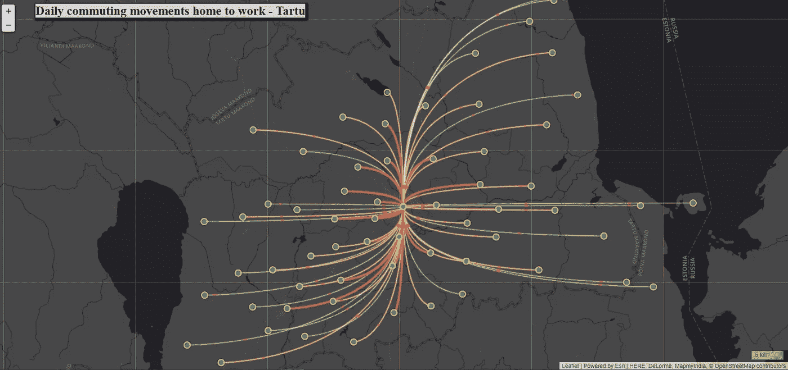**

**图片由作者提供。塔尔蒂县每日通勤回家工作的交互式流程图**

**我们已经定义了运动将通过`mouseover` 动作可视化。因此，与地图动画的交互只需要将鼠标悬停在元素周围。此外，我们定义了 3 个类以及起点和终点的坐标。最后，我们添加带有颜色的图例，如果你需要支持选择颜色，你可以使用 [**ColorBrewer 来绘制**](https://colorbrewer2.org/#type=sequential&scheme=BuGn&n=3) :**

```
//PART 3\. ADDING A LEGEND WITH COLORSfunction getColor(d) {
return d > 100  ? '#e34a33' :
       d > 24   ? '#fdbb84' :
                '#fee8c8' ;
}var legendcolor = L.control({position: 'bottomright'});legendcolor.onAdd = function (map) {
  var div = L.DomUtil.create('div', 'info legend'),
    grades = [0, 24, 100],
    labels = [];
    // loop through our density intervals and generate a label with a colored square for each interval
        for (var i = 0; i < grades.length; i++) {
            div.innerHTML +=
            '<i class ="line" style="background:' + getColor(grades[i] + 1) + '"></i> ' +
            grades[i] + (grades[i + 1] ? '&ndash;' + grades[i + 1] + '<br>' : '+');}    return div;
       };
legendcolor.addTo(map);
```

**与传说看起来是这样的。**

**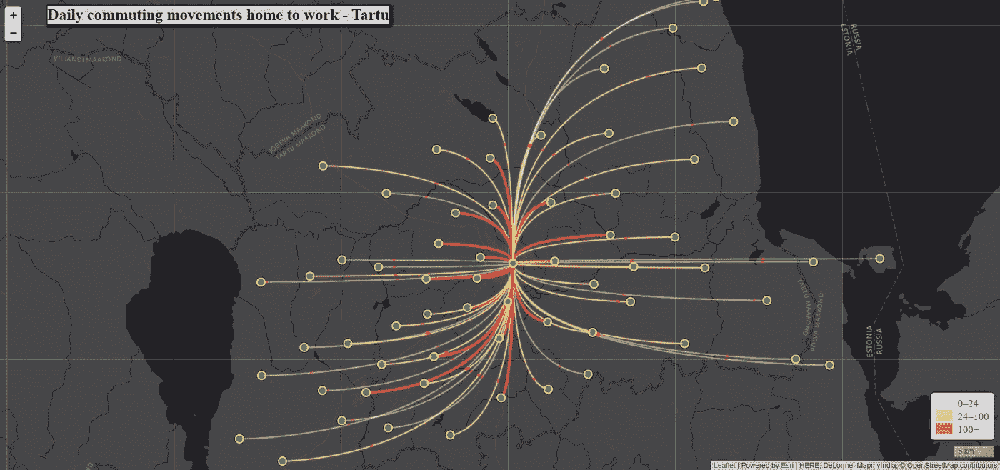**

**图片由作者提供。带图例的最终地图**

> ****推荐****

**如果你对网页地图的活页 JavaScript 有经验。您可以添加社区作为背景，或者添加一个带有社区名称的信息框。我把这个自由留给用户。但是现在，你有了塔尔图县的起点-终点矩阵的基础。**

> ****结论****

**塔尔图县在家工作运动的地图动画有助于城市规划者了解人口动态(空间流动性)。有了这个，运输就可以改善，尤其是旅行时间。当然，人们更喜欢开快车去上班。此外，本地投资可以是一个长期的选择，投资于房地产的办公室。如果人们是为了工作而迁移，这肯定是一个潜在的经济增长的地方。**

**如果您需要 OD 矩阵可视化或 Python 编码地图方面的支持，您可以在我的 [LinkedIn 个人资料](https://www.linkedin.com/in/bryanrvallejo/)中找到我，或者在本文中发表评论。**

> ****参考文献****

**[1]阿哈斯，r .，西尔姆，s .，约尔夫，o .，萨卢维尔，e .，蒂鲁，M. (2010 年)。****利用移动定位数据对手机用户有意义的位置进行建模。*** 卷十七。https://doi.org/10.1080/10630731003597306***

***[2] Aasa，A. (2019)。 ***【数据集】*** 爱沙尼亚日常规律运动 OD 矩阵。塔尔图大学移动实验室。[https://doi.org/10.23659/UTMOBLAB-1](https://doi.org/10.23659/UTMOBLAB-1)***