# 带有 GeoPandas 的交互式地理地图

> 原文：<https://towardsdatascience.com/interactive-geographical-maps-with-geopandas-4586a9d7cc10?source=collection_archive---------5----------------------->

## 通过交互式可视化浏览地理空间数据

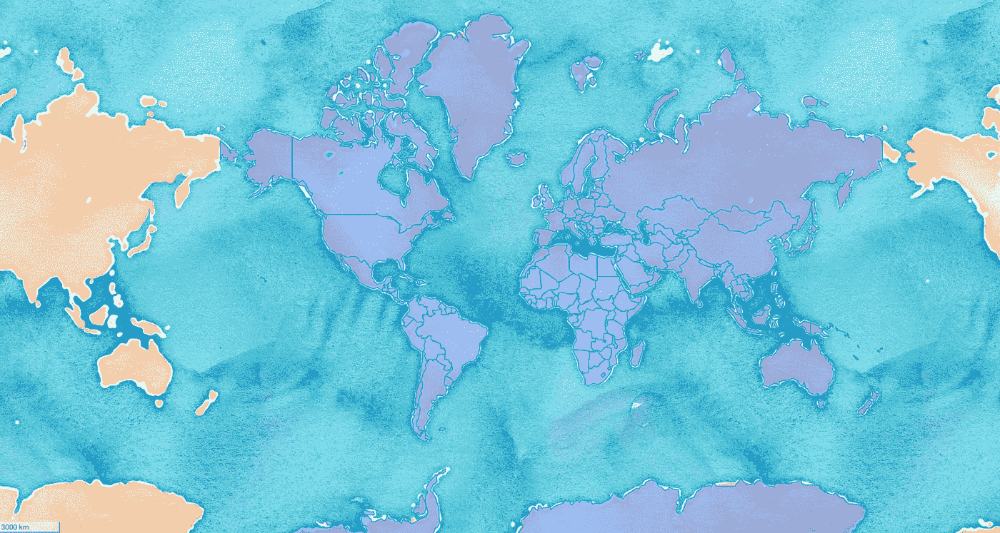

作者使用 GeoPandas 库创建的世界地图

> 如果地理是散文，地图就是图像学

地理空间一词由两个不同的术语组成。 **Geo** 的意思是地球， **Spatial** 的意思是关于或者占据空间。它共同指代[与地球表面特定位置相关的基于时间的数据](/visualizing-indias-seismic-activity-4ed390de298c)。GeoPandas 是一个流行的库，用于分析和处理 Python 中的地理空间数据。在最近的一次更新中，该库增加了支持交互式可视化的方法和实用程序。这是对一个已经很有用的库的一个很好的补充。

[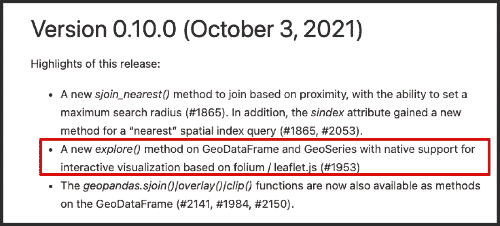](https://geopandas.readthedocs.io/en/latest/docs/changelog.html#version-0-10-0-october-3-2021)

GeoPandas 库最新版本亮点:来源:[https://geo pandas . readthe docs . io/en/latest/docs/changelog . html # version-0-10-0-10-3-2021](https://geopandas.readthedocs.io/en/latest/docs/changelog.html#version-0-10-0-october-3-2021)

在本文中，我们将详细探讨 GeoPandas 的交互性。我们将从简单介绍 GeoPandas 开始，然后继续介绍它的一些可视化功能。

# 地质公园

[GeoPandas](https://geopandas.org/en/stable/) 是一个广泛使用的开源库，用于在 Python 中操作地理空间数据。它扩展了 pandas data frame 的功能，从而使在 pandas 中处理空间数据成为可能，因此得名。在某种程度上，GeoPandas 结合了熊猫和 Shapley 的力量。 [Shapley](https://github.com/Toblerity/Shapely) 是一个 Python 包，用于处理和分析笛卡尔平面中的几何对象。

## 装置

Geopandas 可以用`conda`、`pip`安装，也可以直接从`source`安装。然而，首选方法是使用 conda，因为它为所有平台(Windows、Mac、Linux)提供了预构建的二进制文件。

```
conda install -c conda-forge geopandas
```

此外，还需要 folium、matplotlib 和 mapclassify 包来实现交互性。您可以使用以下方式安装它们:

```
conda install -c conda-forge folium matplotlib mapclassifyorpip install folium matplotlib mapclassify
```

参考[安装指南](https://geopandas.readthedocs.io/en/latest/getting_started/install.html)获取详细说明和疑难解答。

## 使用 GeoPandas 的第一步

如果这是你第一次听说 GeoPandas，我推荐你浏览一下这个[简短教程](https://geopandas.readthedocs.io/en/v0.10.2/getting_started/introduction.html)。本教程将帮助您快速熟悉该库。简而言之，GeoPandas 建立在 Pandas 库的基础上，使其与地理空间数据兼容。

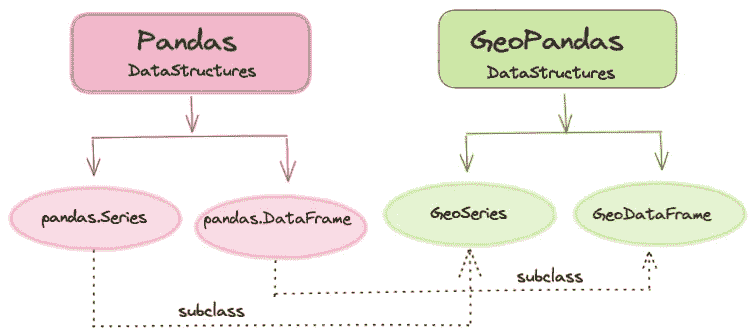

GeoPandas 建立在熊猫图书馆上|图片由作者提供

GeoPandas 使用`GeoSeries`和`GeoDataFrame`类型，它们分别是`pandas.Series`和`pandas.DataFrame`的子类。上图显示了两者之间的关系。

# 用 GeoPandas 绘制静态地图

在本节中，我们将了解 GeoPandas 的基本功能，即绘制静态地图。这一节为下一节打下了必要的基础，下一节涉及到创建交互式可视化。

🔗您可以从以下位置访问代码笔记本👇

<https://github.com/parulnith/Data-Science-Articles/tree/main/Interactive%20Geographical%20maps%20with%20Geopandas>  

## 导入库

GeoPandas 成功安装后，我们可以导入它并验证我们的系统上是否安装了最新版本。

```
import geopandas
import matplotlib.pyplot as plt
print(geopandas.__version__)
------------------------------------------
0.10.2
```

## 读入数据

让我们使用内置的 GeoPandas 数据集进行演示。在本文的后面，我们还将学习如何处理我们自己的数据。GeoPandas 附带三个预制地图，可通过以下方式轻松访问:

```
geopandas.datasets.available
----------------------------------------
['naturalearth_cities', 'naturalearth_lowres', 'nybb']
```

在哪里

*   **naturalearth_lowres →** 国家轮廓
*   **naturalearth_cities →** 城市位置
*   **nybb →** 纽约行政区

让我们使用`**naturalearth_lowres**` 选项并显示数据集。

```
world_filepath = geopandas.datasets.get_path('naturalearth_lowres')
world = geopandas.read_file(world_filepath)
world.head()
```

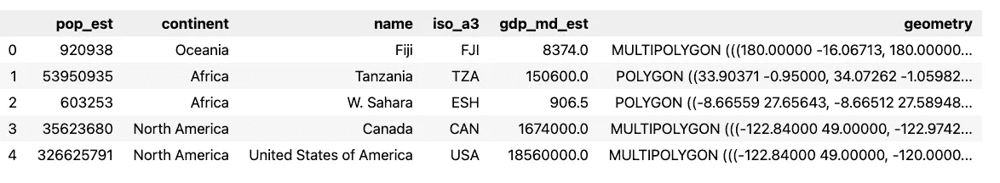

作者的 GeoPandas 数据帧|图像

如上所述，我们得到一个 GeoPandas 数据帧，其中有一个独特的几何列。除此之外，还可以获得各个国家的 GDP 和人口等信息。

## 可视化数据

为了绘制活动几何图形，我们将调用`[GeoDataFrame.plot()](https://geopandas.readthedocs.io/en/latest/docs/reference/api/geopandas.GeoSeries.plot.html#geopandas.GeoSeries.plot).`。该方法使用 matplotlib 生成几何图形列的图形。

```
world.plot()
```

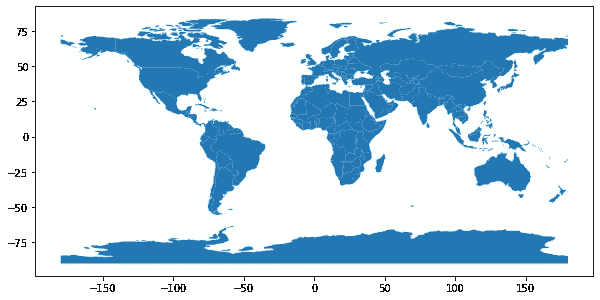

作者图片

输出是使用一行代码创建的世界地图。我们还可以利用可用的参数在获得的图中创建多种变化。

*   **特定列的颜色编码**

假设我们想要以国家为单位来可视化世界人口。为此，我们将传递列`*pop_est*`，即数据帧中指定人口作为第一个参数的列。从技术上讲，几何列仍然被绘制，但是该图由`*pop_est*`列进行颜色编码。

```
world.plot('pop_est', legend=True,figsize=(12,8))
plt.title('World Population')
```

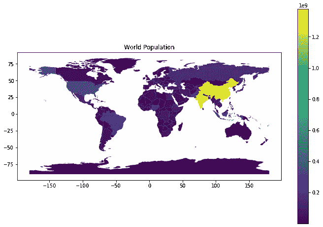

作者图片

人口最多的国家用黄色和浅绿色表示，而人口最少的国家用紫色表示。

*   **彩色地图**

如果你不喜欢默认的地图颜色，你可以使用`cmap`属性轻松修改它。有关兼容选项的列表，请访问官方 [matplotlib 网站](https://matplotlib.org/stable/tutorials/colors/colormaps.html)。默认颜色图是`viridis`。让我们来看看更多的色彩映射表以及它们是如何渲染地图的:

🎨**设置 2**

```
cmap='Set2'
world.plot('pop_est', cmap=cmap, legend=True,figsize=(12,8))
plt.title(f'World Population with colormap: {cmap}')
```

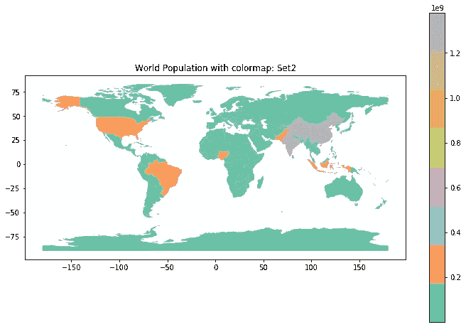

作者图片

**🎨** **岩浆**

```
cmap='magma'
world.plot('pop_est', cmap=cmap, legend=True,figsize=(12,8))
plt.title(f'World Population with colormap: {cmap}')
```

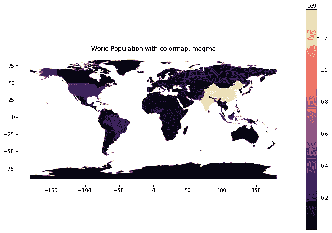

作者图片

*   **边界**

也可以只显示地图边界。

```
world.boundary.plot(figsize=(12,8))
```

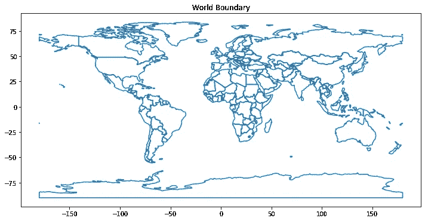

作者图片

# 绘制交互式地图

上一节所有的情节本质上都是静态的。这意味着我们无法通过缩放、平移、悬停或弹出窗口等功能与他们互动。然而，`explore`方法提供了将静态地图转换成交互式地图的能力。

## 句法

```
*GeoDataFrame.explore()*
```

用法上没有太大区别。`explore()`方法返回一个呈现交互式地图的`folium.Map`对象。让我们将上面创建的静态人口世界地图转换为交互式地图。

```
world.explore(column='pop_est',cmap='Set2')
```

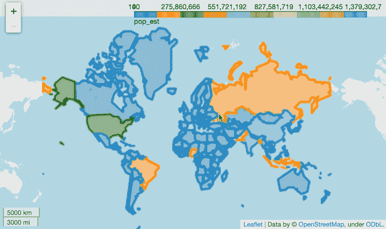

作者图片

稍加修改，我们就有了一个完全交互式的图表。让我们创建一个只显示亚洲地区 GDP 的新图表。由于 GeoPandas 是 Pandas 的扩展，我们可以很容易地根据条件过滤列。

**计算亚洲的 GDP**

```
asia = world[world['continent'] =='Asia']
asia.explore(column='gdp_md_est',cmap='Set2')
```

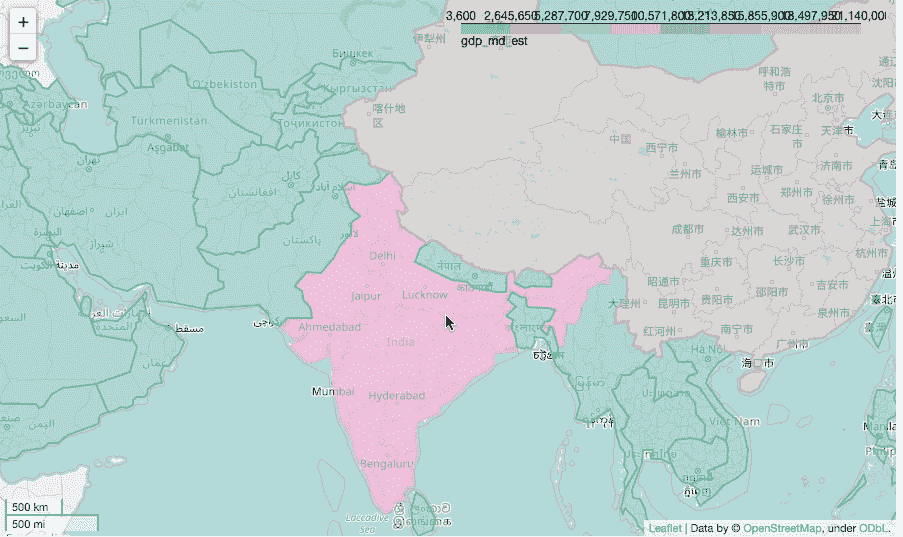

作者图片

## **参数**

在上面的例子中。我们只使用了两个参数，即`column`和`cmap`。然而，`explore()`方法附带了许多有用的参数。一些有趣的例子如下:

1.  **工具提示**

默认为`True`的`tooltip`参数显示悬停在对象上时的地理数据场属性。可以通过将其设置为 False 来禁用它。

```
asia = world[world['continent'] =='Asia']
asia.explore(column='gdp_md_est',cmap='Set2',tooltip=False)
```

我们还可以传递一个字符串或一个字符串列表来指定那些需要包含的列。在下面的地图中，我们只需要国家的名称及其对应的 GDP 值。因此，我们将在工具提示参数中指定相同的内容。

```
asia = world[world['continent'] =='Asia']
asia.explore(column='gdp_md_est',
             cmap='Set2',
             legend=False,
             **tooltip=['name','gdp_md_est']**)
```

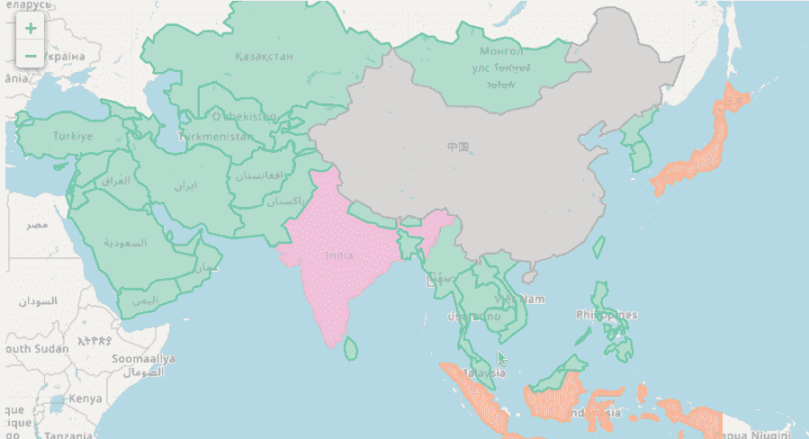

作者图片

2.**弹出**

如果工具提示参数已启用，属性会在简单悬停时可见。另一个选项是使用弹出选项有选择地启用它们。使用弹出窗口的好处是属性信息只有在被点击时才会显示。在这里，我们也可以传递字符串或字符串列表来指定要包含的列。

```
asia = world[world['continent'] =='Asia']
asia.explore(column='gdp_md_est',
             cmap='Set2',
             legend=False,
             tooltip=False
             **popup=['name','gdp_md_est']**)
```

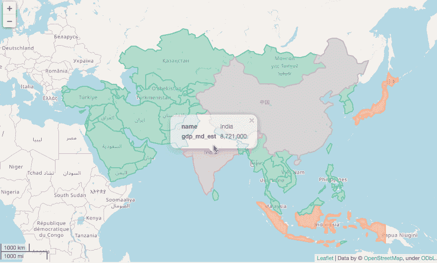

作者图片

3.**瓷砖**

此参数指定要使用的图块。内置选项包括:

> OpenStreetMap，雄蕊地形，雄蕊调色剂，雄蕊水彩，CartoDB 正电子，CartoDB 暗物质 _ deafult 使用 OpenStreetMap 的地方。

```
asia = world[world['continent'] =='Asia']asia.explore(column='gdp_md_est',
             legend=False,
              **tiles**=<enter the name of the tile to be used>)
```

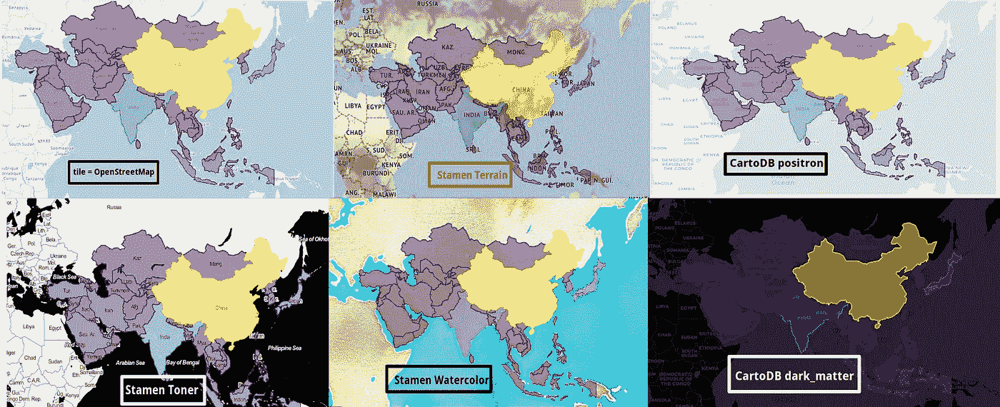

作者图片

4.**图例**

此参数决定是否在地图上显示图例。

5. **style_kwds**

如果需要传递一些额外的样式，那么`style_kwds`就是要传递的参数。例如，是否在地图上绘制边界、边界的颜色、不透明度、填充选项可以由该参数控制。例如，假设我们想要显示亚洲 GDP 地图，其中边界是红色的，宽度= 0.2，不透明度为 0.1。

```
asia = world[world['continent'] =='Asia']
asia.explore(column='gdp_md_est',
             cmap='Set2',
             legend=False,
             style_kwds=dict(color="black",weight=3, opacity=0.4))
```

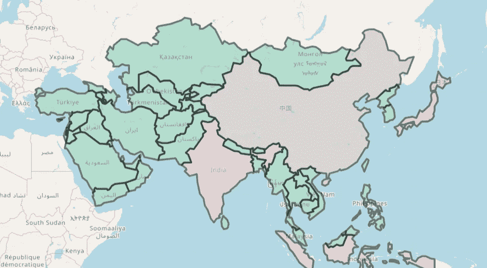

作者图片

# 使用你自己的数据

到目前为止，我们一直使用库预加载的自定义数据集。实际上，我们希望使用自己的数据集。包含一个`latitude`和一个`longitude`列的数据集可以很容易地转换成 GeoPandas 数据帧。为了演示这种技术，我借用了下面这篇文章中的数据集:

</visualizing-indias-seismic-activity-4ed390de298c>  

该数据集包括自 2018 年以来印度每次地震的日期、时间、位置、深度、震级和震源的记录。让我们导入数据并查看各种属性。

[](https://github.com/parulnith/Data-Science-Articles/tree/main/Interactive%20Geographical%20maps%20with%20Geopandas)

```
df = pd.read_csv('Indian_earthquake_data.csv')
df.head(10)
```

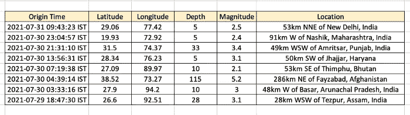

由于 dataframe 有一个纬度和经度列，因此可以很容易地将其转换为 GeoPandas Dataframe。

```
from geopandas import GeoDataFrame
from geopandas import points_from_xygeometry = points_from_xy(df['Latitude'],df['Longitude'])
df2 = GeoDataFrame(df, geometry=geometry)
df2.head()
```

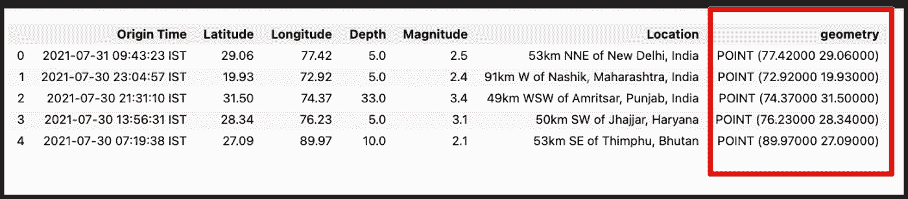

作者图片

# 结论

本文介绍了通用的 GeoPandas 库，以及它在使用 Python 处理地理空间数据时的表现。我们首先学习了它的基本用法，然后转向更新的交互功能。我相信您会喜欢进一步探索这个库，并将其用于您自己的数据集来执行分析。地理空间分析是一个迷人的领域，GeoPandas 完成了主要的繁重工作，因此用户可以将注意力更多地放在手头的问题上，而不是工具上。

*👉* ***对自己阅读其他文章感兴趣。这个*** [***回购***](https://github.com/parulnith/Data-Science-Articles/blob/main/README.md) ***包含了我写的所有文章，分类排序。***

<https://github.com/parulnith/Data-Science-Articles/blob/main/README.md> 