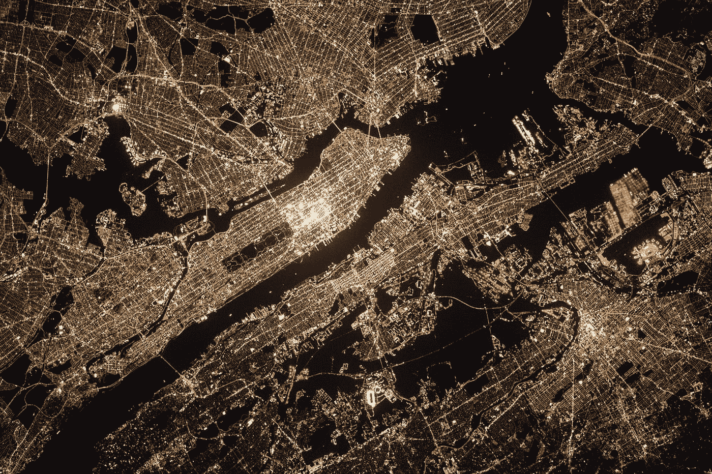

# Jupyter 笔记本中的交互式地理空间人工智能可视化

> 原文：<https://towardsdatascience.com/interactive-geospatial-ai-visualization-in-jupyter-notebook-f3223f534327?source=collection_archive---------25----------------------->

## 简化地理空间数据探索，构建强大的人工智能应用

了解您的数据是在生产中构建和部署健壮的 AI/ML 系统的关键。因此，在制定 AI/ML 解决方案之前，必须事先进行良好的探索性数据分析(EDA)。然而，在地理空间数据集上执行 EDA 可能会令人望而生畏，而且往往具有挑战性，尤其是当您必须在广阔的区域和许多数据层中导航以进行分析时。不要担心，通过充分的练习，你会掌握它的窍门，这篇文章有望帮助你开始学习！



美国宇航局在 [Unsplash](https://unsplash.com?utm_source=medium&utm_medium=referral) 拍摄的照片

**目录:**

1.  装置
2.  小部件简介
3.  创建简单的地图
4.  自定义您的地图
5.  图层、栅格和矢量简介
6.  添加层

# 装置

对于这个关于 Jupyter 笔记本中交互式地理空间数据可视化的教程，我们将安装 *ipyleaflet* 库。

```
conda install -c conda-forge ipyleaflet
```

## **什么是 ipyleaflet？**

传单是最流行的可视化地理空间数据的 JavaScript 库之一。它被 OpenStreetMap 和 MapBox 等大型机构广泛采用。

如果您正在寻找 ipyleaflet 的替代方案，您可以考虑使用<https://python-visualization.github.io/folium/>*python 包来帮助您可视化交互式传单地图。*

# *小部件简介*

*现在我们已经讨论了设置阶段，让我们深入探讨这篇文章的主题。*

> *Jupyter 中的交互可视化是什么意思？小部件如何实现这一点？最重要的是，什么是 widget？*

*这些问题在你开始看这个帖子的时候必然会蹦出来。对于熟悉的人，请快速复习下一部分。*

****交互可视化？*** 它仅仅意味着与你的视觉实时互动的能力。以下面这张 GIF 为例。你可以通过*视觉*方式*与滑块*互动。*

**

*交互式可视化(作者提供的 GIF)*

****Jupyter Widget？*** 它们被称为“特殊对象”，可以被初始化并显示在笔记本上。它们也是**双向**，这意味着一个小部件不只是显示，还可以接收用户输入，随后触发新的计算。最重要的是，它们是**可扩展的**。Jupyter 小部件允许其他库在其功能的基础上构建额外的特性，比如我们的 *ipyleaflet。**

# *创建简单的地图*

*现在，我们准备好处理 *ipyleaflet* 。首先，让我们展示一张基本的世界地图。*

*首先，我们需要导入 *ipyleaflet* 库及其 Map 对象。*

```
*from ipyleaflet import Map*
```

*然后，给定中心点的坐标和缩放级别，我们构建并可视化地图对象。*

```
*Map(center = (60, -2.2), zoom = 2, min_zoom = 1, max_zoom = 20)*
```

**

*简单互动图(作者 GIF)*

*在上面的 GIF 中，您可以通过滚动和平移输出图像来与新创建的地图进行交互。做得好！*

# *自定义您的地图*

*例如，我们还可以通过**对底图**进行样式化来定制我们的地图。*

*首先，我们导入另一个名为底图的对象。*

```
*from ipyleaflet import Map, basemaps*
```

*然后，我们添加可视化到我们的地图对象，如下所示。*

```
*map = Map(center=(60,-2.2), zoom=2, basemap=basemaps.Stamen.Terrain)*
```

**

*自定义地图(作者提供的 GIF)*

*使用自定义地形底图后，地图变得更加漂亮。*

*有大量的定制可用。查看他们的 [API 参考](https://ipyleaflet.readthedocs.io/en/latest/)以获得更详细的解释。*

# *图层、栅格和矢量简介*

*现在，这将是你大部分 EDA 发生的地方。我将展示如何添加层以及如何操作它们。*

*但是首先。*

****什么是层？*** 图层用于显示地理数据集。它们的目的是分离不同的地理信息，这些信息可能相互关联，也可能不相互关联。例如，为了展示一个城市的地图，您可能想要显示一个底图图层(之前高亮显示)、城市中的道路网络、住宅区、海拔高度以及水体娱乐区的存在。*

****现在，什么是光栅或者矢量？****

*下图为了解什么是图层以及栅格/矢量数据之间的区别提供了一个方便的图示。*

**

*解释图层、栅格和矢量数据(来源:[SBCounty.gov](http://cms.sbcounty.gov/portals/30/Images/Web%20Banner23.jpg))*

*如果你想对这个话题有更详细的解释，请看看我下面的另一篇博文。*

*</geopandas-hands-on-introduction-to-geospatial-machine-learning-6e7e4a539daf>  

# **添加图层**

最后但同样重要的是，如果不能添加自己的图层，交互式地理空间地图是不完整的。

让我们首先**通过调用 *add_layer()* 方法添加**一个光栅图层。

```
from ipyleaflet import basemap_to_tiles as btt, basemaps, Map

raster = btt(basemaps.NASAGIBS.ModisTerraTrueColorCR, "2019-06-24")
map.add_layer(raster)map
```


添加图层(作者 GIF)

如果您选择**移除**这一层，那么您可以简单地调用 remove_layer()方法。

```
map.remove_layer(raster)map
```


移除图层(作者 GIF)

但是，如果您不想通过编写代码来不断添加或删除层，该怎么办呢？你可以在地图上添加一个**图层控件**来实现。

```
from ipyleaflet import LayersControlmap.add_control(LayersControl())
```


图层控件(GIF by Author)

你现在可以在地图上对你的图层有更多的控制了！

# 结论

这就是 Jupyter 笔记本上交互式地理空间可视化的介绍。我将很快创建第二部分来讨论更高级的技术，如地图分割，从 GeoJSON 和其他文件格式添加数据等。敬请期待！* 

****做订阅我的邮件简讯:***[*https://tinyurl.com/2npw2fnz*](https://tinyurl.com/2npw2fnz)****在那里我定期用通俗易懂的语言和漂亮的可视化方式总结 AI 研究论文。*****