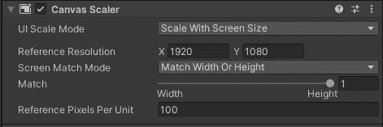
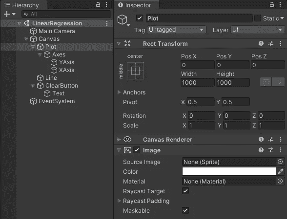
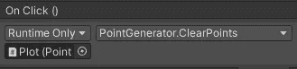
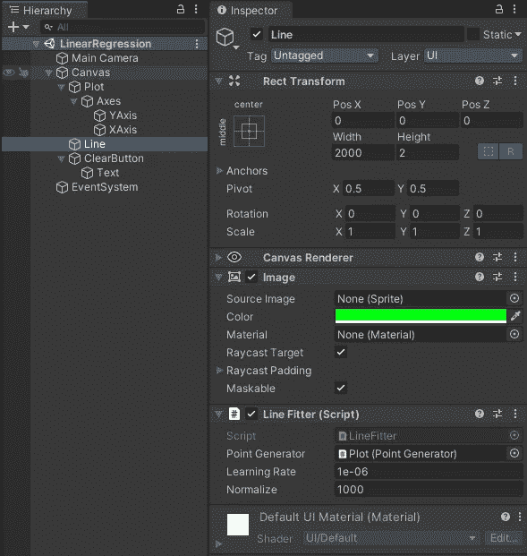

# Unity 中的交互式线性回归

> 原文：<https://towardsdatascience.com/interactive-linear-regression-in-unity-fc4db4a143d9?source=collection_archive---------29----------------------->

## 从实时模拟和游戏的机器学习开始

*现代视频游戏引擎，如 Unity，已经成为各种模拟和建模的伟大工具。相反，大量的机器学习研究是在视频游戏上进行的。最后，机器学习将改变我们制作视频游戏的方式。本文探讨了如何使用 Unity 进行机器学习的基础知识。*

*在这篇文章中，我将解释如何使用交互式数据集在 Unity 中实现实时线性回归。生成的程序可以在下面的 gif 中看到。代码在* [*GitHub*](https://github.com/xstreck1/Linear-Regression-Unity) *上有。本教程需要 Unity 的基本知识——如果您没有 Unity 的经验，您可以通过本* [*入门教程*](https://www.raywenderlich.com/unity/paths/learn) *快速了解最新情况。*


绿线不断地插入红点之间。随着点数的增加，它会自动调整。

# 场景设置

*如果你不清楚如何使用下面的说明来设置场景，只需从*[*GitHub*](https://github.com/xstreck1/Linear-Regression-Unity)*中克隆项目。*

该程序使用 2D 统一图形系统，所以我们从 2D 模板开始，并添加一个 UICanvas。

为了这个项目的目的，我决定绘制 1000*1000 像素的图形，设置界面分辨率为 1920*1080 像素。



然后，我们从图像组件创建绘图。绘图的背景是一个 1000*1000 px 的白色图像，两个黑色图像代表位于中心的 1000*1 px 和 1*1000 px 的线。插值线是 2000*3 px 的绿色图像。最后，我们添加一个按钮锚定到左上角，以清除我们已经添加的点。



完整的场景。所有的对象(图、轴、轴、线)都是具有特定颜色的清晰图像。

# 生成点

首先，我们创建代码来生成`PointGenerator.cs`组件中的点。对于给定的初始化，我们使用以下字段。

```
[SerializeField] private GameObject **pointPrefab**;

public List<GameObject> Points { get; private set; }

private void **Start**()
{
    Points = new List<GameObject>();
}
```

`pointPrefab`必须引用代表图上一点的对象。然后创建的点存储在点列表中。使用以下函数创建点:

```
private void AddPoint(Vector2 position)
{
    var point = Instantiate(pointPrefab, transform);
    point.transform.localPosition = position;
    Points.Add(point);
}
```

我们还创建了一个函数来清除这些点:

```
public void **ClearPoints**()
{
    Points.ForEach(Destroy);
    Points.Clear();
}
```

然而，最重要的是确定鼠标点击时在哪里创建新点的代码。我们根据鼠标点击时的鼠标位置来放置点，因此我们需要通过计算图的偏移来计算点在图中的位置。我们获得绘图和屏幕的大小(第 1-2 行)，计算差异(第 3-4 行)，然后定义从绘图中心的位置(第 5 行)并创建一个新点。

```
public void OnPointerDown(PointerEventData eventData)
{
    var plotSize = GetComponent<RectTransform>().sizeDelta;
    var screenSize = new Vector2(Screen.width, Screen.height);
    var offset = (screenSize - plotSize) / 2f;
    var imagePosition = eventData.position - offset;
    var plotPosition = imagePosition - plotSize / 2f;
    AddPoint(plotPosition);
}
```

最后，为了让`OnPointeDown`回调对鼠标点击做出反应，我们需要组件使用适当的接口:

```
public class **PointGenerator** : MonoBehaviour, IPointerDownHandler
```

现在把上面的代码组合起来，放在`Plot`对象上，并附加一个对`Point`预设的引用。您应该能够通过单击鼠标在绘图中创建点。

现在，您也可以将`Clear`按钮连接到图上，以便清除印刷机上的点:



# 插值函数

在正常的机器学习中，我们在执行过程中训练一次模型，运行一个优化步骤的循环(所谓的*时期*)。然而，Unity 作为一个游戏引擎，是建立在以连续的方式每秒多次执行小步骤的原则上的。然后，我们可以保持优化过程以固定的速率运行，就像我们在物理模拟中所做的那样。

我们创建一个名为`LineFitter`的新组件，并将其添加到`Line`游戏对象中。我们还需要引用`PointGenerator`来获得坐标。

```
public class **LineFitter** : MonoBehaviour
{
    [SerializeField] private PointGenerator **pointGenerator**;
}
```

我们优化器的目标(我们将使用线性回归常用的梯度下降)是尽可能地拟合曲线`y = w * x + b`。为此，我们将拟合参数`w`(权重)和`b`(偏差)。然后，我们使用以下函数进行拟合，将`w`转换为围绕`z`轴的相应旋转:

```
private void SetLine(double w, double b)
{
    double rad = Math.Atan(w);
    double deg = rad * 180 / Math.**PI**;
    transform.localPosition = new Vector3(0, (float) b, 0);
    transform.localRotation = Quaternion.Euler(0, 0, (float) deg);
}
```

我们将在每次`FixedUpdate`回调时优化并更新该行，这意味着每秒将发生 60 次。如果集合中没有点，我们只需将线重置到原始位置:

```
private double w, b;

private void **FixedUpdate**()
{
    if (!pointGenerator.Points.Any())
    {
        w = b = 0;
    }
    else
    {
        GradientDescent();
    }
    SetLine(w, b);
}
```

最后，我们定义了优化函数。我不会在这篇文章中推导优化过程，如果你有兴趣进一步，见例如[这里](/linear-regression-simplified-ordinary-least-square-vs-gradient-descent-48145de2cf76)。对于我们的实现来说，有趣的是第 1–4 行，其中 Unity 位置被转换成两个带有 X 和 Y 坐标的列表。一旦我们有了这些，我们就可以像往常一样计算参数`w`和`b`的导数。

```
[SerializeField] private double **learningRate** = 0.000001;
[SerializeField] private double **normalize** = 1000;private void GradientDescent()
{
    var points = pointGenerator.Points;
    var positions = points.Select(p => p.transform.localPosition);
    var X = positions.Select(pos => pos.x);
    var Y = positions.Select(pos => pos.y);
    double n = points.Count;
    var Y_pred = X.Select(x => x * w + b);
    double dW = -2.0 / n * Y
        .Zip(Y_pred, (y, yPred) => y - yPred)
        .Zip(X, (y_p, x) => y_p * x)
        .Sum();
    double dB = -2.0 / n * Y
        .Zip(Y_pred, (y, yPred) => y - yPred)
        .Sum();
    w -= learningRate * dW;
    b -= learningRate * dB * normalize;
}
```

请注意，有两个公共参数。`learningRate`是一个常见的，但是我们也增加了一个归一化项。这是因为 Y 轴是 1000 个单位高，因此在一个小的步骤中，需要很长的时间来收敛。因此，我们将 Y 轴移动到一个单位范围，步长增加 1000 倍。

现在你可以把上面的代码组合起来，附加到`Line` GameObject 上。



具有 LineFitter 组件的 Line 对象。请注意，它引用了点生成器。

## 全部完成！

恭喜你，你已经创建了一个简单的，交互式的，实时的机器学习系统！虽然这只是一个演示最简单的 ML 算法之一的例子，但是 ML 方法在现代游戏和模拟系统中越来越多地被实施，以创建决策系统、创建内容、控制 NPC、平衡匹配等等。

如果你对游戏中更复杂的 ML 方法感兴趣，请随意查看我在 Unity 中基于 ML-Agents 技术的[自动驾驶汽车](/reinforcement-learning-a-self-driving-car-ai-in-unity-60b0e7a10d9e)教程，或者[查看 Unity 在真实世界应用中的博文](https://blogs.unity3d.com/2020/05/12/announcing-ml-agents-unity-package-v1-0/)。