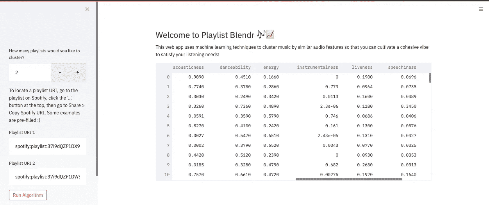
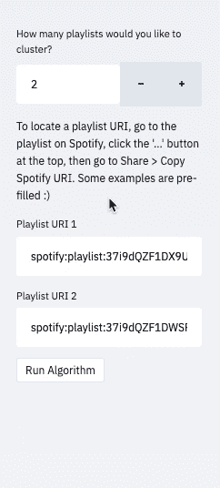

# 利用 Streamlit 实现交互式机器学习和数据可视化

> 原文：<https://towardsdatascience.com/interactive-machine-learning-and-data-visualization-with-streamlit-7108c5032144?source=collection_archive---------14----------------------->

## 我如何将我的 K-Means 聚类和 PCA 代码重新整合到一个时髦的 web 应用程序中，用于分析 Spotify 播放列表

在信息时代，漂亮的界面不仅仅是被推崇，更是被期待。 [Spotify Wrapped](https://2020.byspotify.com/) 是一项年度活动，旨在为所有 Spotify 用户带来个性化的生活配乐见解。它完全由大数据和分析驱动，但将它从一份有趣的用户报告提升为今天的文化现象的是用鲜艳的颜色和令人难忘的字体包装的大而粗的数字。正是视觉效果和设计选择在观看和分享我们的音乐收听趋势和统计数据时引发了多巴胺热潮。可悲的事实是:对普通人来说，数字本身并不性感。

> 正如故事不仅通过内容和交付来评估，菜肴也通过味道和呈现来评估一样，机器学习和数据科学交汇处的研发不仅应该通过发现的见解的质量来评估，还应该通过将这些见解带给非技术人员的可视化来评估。

当我在思考我的上一篇[文章](/k-means-clustering-and-pca-to-categorize-music-by-similar-audio-features-df09c93e8b64)时，我开始发现少了些什么。虽然我对我的工作很满意，对我的发现很满意，但我觉得工作的影响是有限的；这篇文章对技术数据科学的人来说有点太适合了，我真的只是解决了我自己的个人问题。我突然想到这个项目还没有完成。当 Jupyter 笔记本不再是一个游乐场，而是一个文档化的教程时，前进方向的下一步是构建一个时尚的 web 应用程序供所有人使用！

我希望人们能够与我的项目互动，并给我反馈，而不必阅读我的 11 分钟媒体文章。也就是说，本文旨在强调我用来构建 web 应用程序的框架 Streamlit 的一些功能。这不会是如何在 Streamlit 中构建应用程序的指南，但我会在最后为感兴趣的人提供一些技术细节。对于那些希望自己探索的人，滚动到底部找到应用程序和源代码的链接。

## 什么是 Streamlit？

[Streamlit](https://www.streamlit.io/) 是一个新工具，它允许工程师在几分钟内构建和分享高度互动的网络应用。它是免费和开源的，重点是 Python 脚本、交互式小部件和即时部署。

Streamlit 是否会导致 Flask 灭绝是一个激烈争论的话题。有些人认为这是苹果和橘子的比较，因为 Streamlit 是一个数据仪表板工具，而 Flask 是一个 web 框架。此外，这只是 web 应用和仪表板领域的两个竞争者。Plotly Dash、Shiny、Voila、Panel 和 Jupyter 都是这个领域的常用词。如果你对成熟度、流行度、简单性、适应性、专注度和语言支持方面的权衡感兴趣，我推荐你阅读[“Streamlit vs . Dash vs . Shiny vs . Voila vs . Flask vs . Jupyter”](https://www.datarevenue.com/en-blog/data-dashboarding-streamlit-vs-dash-vs-shiny-vs-voila#:~:text=Streamlit%20is%20a%20data%20dashboarding,Flask%20is%20a%20web%20framework.&text=Streamlit%20is%20an%20all%2Din,you'll%20need%20already%20included.)。如果您想要一个内置许多方便组件的结构化数据仪表板，Streamlit 是一个不错的选择。为什么要重新发明轮子，对吗？

souce:Markus Schmitt 在 [datarevenue](https://www.datarevenue.com/en-blog/data-dashboarding-streamlit-vs-dash-vs-shiny-vs-voila#:~:text=Streamlit%20is%20a%20data%20dashboarding,Flask%20is%20a%20web%20framework.&text=Streamlit%20is%20an%20all%2Din,you'll%20need%20already%20included.) 发表的“Streamlit vs . Dash vs . Shiny vs . Voila vs . Flask vs . Jupyter”

鉴于 Streamlit 最近的增长和牵引力，如上图所示，描绘了 Streamlit 在短时间内 GitHub 明星的暴涨——Streamlit 赢得了很多兴奋和期待。该平台的新扩展 Streamlit for Teams 即将推出，将提供企业级功能，如身份验证、日志记录、自动扩展和一键式部署。这是非常有前途的，可能会极大地有益于数据科学和机器学习领域。

# 播放列表混合

现在，请允许我带您参观一下我的新网络应用程序！Playlist Blendr 是一个 web 应用程序，它使用 k-means 聚类和主成分分析(PCA)按相似的音频特征对音乐进行聚类，以便用户可以培养一种有凝聚力的氛围来满足他们的音乐收听需求。作为一个使用案例，用户可以转到他们朋友最喜欢的播放列表，将相应的播放列表 URIs 复制并粘贴到 Playlist Blendr 中，然后识别所有高能量、高节奏的说唱歌曲，非常适合深夜驾车，也适合音乐发现目的。

web 应用程序，一目了然

目标是允许用户通过设置授权流，通过 Spotify API 向外部用户授予令牌，将同一集群中的曲目导出到用户 Spotify 库中的新播放列表，但这一授权功能在 Streamlit 中尚不可用。

在整个开发过程中，我不得不有意识地努力将所有本质上的 ML 细节隐藏在“引擎盖下”，这样应用程序的真正本质就像一个神奇的黑盒一样呈现在用户面前——一个只吐出交互式可视化内容的盒子。在接下来的几节中，我将介绍四个出色的 Streamlit 组件，它们已经融入了我的 web 应用程序。

## 补充报道

与任何 web 应用程序一样，为了将用户的注意力引向页面上的各个组件，布局非常重要。Streamlit 可以很容易地用 **st.sidebar** 在左面板侧边栏中组织你的小部件。此控制流适用于 Playlist Blendr，因为应用程序最初依赖于播放列表 URIs(统一资源指示符)形式的用户输入。虽然 Streamlit 应用程序非常兼容移动设备，但不幸的是，Spotify URIs 只能从 Spotify 桌面客户端找到。下面提供了如何检索播放列表 URI 的演示。

如何从 Spotify 桌面客户端检索播放列表 URI

在用户输入他们想要的播放列表 URIs 数并点击“运行算法”按钮之前，应用程序的主要部分什么都不会发生。

通过巴斯德的 Streamlit 数字输入小工具从用户处收集播放列表信息

Streamlit 侧栏配置的代码

在上面的代码中，调用了三个 Streamlit 方法: **st.sidebar.number_input** 、 **st.sidebar.text_input** 和 **st.sidebar.button** 。这些方法中的每一个对于构建简单的用户控制流都非常有用。

## 数据帧

Spotify 用户对我们所熟知和喜爱的播放列表、曲目和艺术家的数据类型几乎一无所知。因此，我知道必须以原始的表格格式显示数据，让用户自己探索。幸运的是，Streamlist 有一个 dataframe 方法，它输出一个交互式小部件，在顶部列出列名，在左侧显示索引。

数据框架探索小部件

上面的 GIF 还显示了一个很酷的特性，它使用户能够按照特定的列对所有数据进行排序，可以是升序，也可以是降序。在这种情况下，数据首先按照最高的“语音”值排序，说唱歌曲出现在表格的顶部，器乐歌曲出现在底部。然后数据帧按艺术家姓名的字母顺序排序。

## Matplotlib 图表

在使用 PCA 的 k-means 聚类的实现中，有两个基本的小型实验必须被执行。其中一个决定了在特征矩阵中使用的组件的数量，另一个识别了最佳分离数据的聚类的数量。

从 web 应用程序中排除的静态 Matplotlib 折线图

虽然上面的图表对于具有数据科学和机器学习背景的读者来说信息丰富且有趣，但出于两个原因，它们应该从 web 应用程序中排除。首先，它们不是交互式的，因此，如果它们能在大约 10 秒或更短的时间内将相关信息传达给用户，它们才值得在页面上占有一席之地。第二，也是最重要的一点，它们太专业了，对于用户获得洞察力来说不是必要的。

> “卓越的图形能够在最短的时间内，用最少的笔墨，在最小的空间里，向观众传达最多的思想。”—爱德华·塔夫特

另外，爱德华·塔夫特是数据可视化领域的知名先驱。他在信息设计和定量数据的可视化显示方面的著作对许多不太相关的领域产生了相当大的影响。在上面的引用中，Tufte 提到了他的一个关键原则，即“数据-墨水比率”。数据科学家被训练成相信越多越好——也就是说，更多的见解比更少的更强大、更有说服力。然而，当涉及到数据可视化时，这种直觉应该是相反的。Tufte 的许多原则植根于简单性，在为客户构建工具时，我们应该始终将这些原则放在首位。

## Plotly 雷达图

在接下来的两个部分中，我将展示一个案例研究，其中包含两个从 Spotify 浏览页面中获取的预填充播放列表:“Sunday Scaries”和“park hangs”。每个播放列表有 50 首歌曲，正如你可能想象的那样，Sunday Scaries 由低能量的歌曲组成，而 park hangs 由更乐观的歌曲组成。

Plotly 是一个交互式图形库，通常集成到以数据为中心的应用程序中。在这个项目中，在对用户完全隐藏的情况下实现 k-means 聚类之后，我们希望将注意力吸引到每个结果聚类的关键特征上。

交互式绘图雷达图

从上面演示的与雷达图的交互中，用户可以了解到群集 1 的特征是声学音乐的显著流行。第二组以高能量和高舞蹈性而闻名。有趣的是，除了高速率之外，簇 0 在形状上几乎与簇 2 相同。因此，可以假设群集 0 可能比群集 2 包含更多的说唱音乐、嘻哈音乐和/或 R&B 音乐。最后，集群 3 的特点是其工具性和低能量。

包提供了一种叫做**散点图**的图形。在不深入细节的情况下，这样一个图的实现需要一个数据列表和一个代表相应变量的角度或辐条列表。在这种情况下，每个聚类由未填充的雷达轨迹表示，平均音频特征作为数据，音频特征的名称作为角度。强烈建议将数据标准化，使所有变量都处于相同的范围内。

## 牛郎星图表

[Altair](https://altair-viz.github.io/getting_started/overview.html) 是一个用于 Python 的声明式统计可视化库，基于 Vega 和 Vega-lite。它提供了一个强大而简洁的可视化语法，非常值得学习。关键思想是，作为程序员，您必须声明数据列和可视编码通道之间的链接。换句话说，您必须对您想要绘制的变量、它们的数据类型以及您想要如何对数据进行可视化编码有很强的理解。

对于那些从未通过精确数据类型引用数据的人，这里有一个简单的介绍:

*   **quantitative (Q)** :连续的实数值(如天气、加速度、人口)
*   **序数(O)** :离散订购数量(例如，1-5 星用户评级，年份)
*   **nominal (N)** :离散无序类别(如品牌、颜色)
*   **temporal (T)** :时间或数据值
*   **geojson (G)** :地理形状

交互式牛郎星散点图

考虑到我们之前从 Plotly 雷达图中观察到的情况，有趣的是看到以高度器乐化歌曲而闻名的群集 3(粉红色)主要由“Sunday Scaries”(圆形标记)的歌曲组成，而具有高能量、高跳舞性和高语音的群集 0(蓝色)几乎完全由“park hangs”(菱形标记)的歌曲组成。集群 1 和集群 2 处于中间位置，因为它们在数据空间中无法清晰地分开。

由于上面的散点图实际上是在使用 PCA 执行 k-means 聚类之后分量 1 和分量 2 的表示，因此很难从变换后的数据值中推断出含义。我们可以求助于我们的朋友牛郎星来帮助我们进一步探索每个星团内的轨迹。

带有可选 y 轴的 Altair 条形图

就这样结束了！在未来，我希望有一个“导出到播放列表”按钮，这样人们就可以使用我的应用程序从朋友的播放列表中发现新的音乐，甚至只是更好地组织自己的音乐！

## 链接

下面提供了 web 应用程序和 GitHub 存储库的链接。请注意，所有 Streamlit 代码都位于一个文件中:app.py。要使用 Heroku 部署 Streamlit 应用程序，请查看[“如何在 Heroku 上部署 Streamlit”](/deploy-streamlit-on-heroku-9c87798d2088)

 [## 播放列表混合

这个网络应用程序使用机器学习技术来根据相似的音频特征对音乐进行聚类，以便您可以培养一种有凝聚力的氛围来满足您的聆听需求！](https://playlist-blendr.herokuapp.com) <https://github.com/sejaldua/music-clustering>  

要了解更多关于我的信息，请随时查看下面我的作品集网站。我正在为 2021 年寻找一些新鲜的灵感和新的项目。很想听听我的读者们在做些什么有趣的事情！

<https://sejaldua.com> 