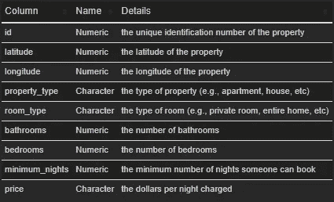
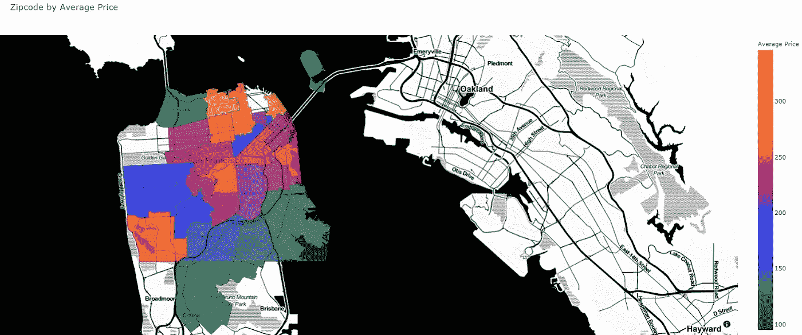
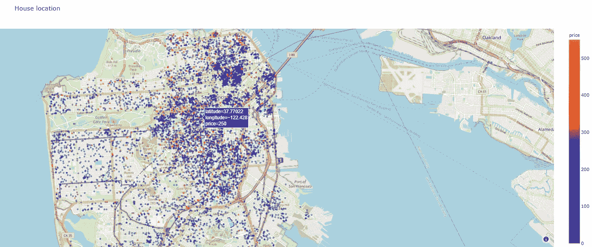

# 在 Plotly Express 中使用地理信息的交互式地图

> 原文：<https://towardsdatascience.com/interactive-map-using-geographical-information-in-plotly-express-362081457600?source=collection_archive---------22----------------------->

可视化对于任何数据科学项目来说都是非常强大的工具。它有助于读者理解正在发生的事情。对于某些数据集来说，能够在地图上查看数据非常有助于在进行分析时展示见解。

有很多软件包可以实现这个目标，它们都有各自的优点和缺点。即[叶子](https://github.com/python-visualization/folium)、[剧情](https://plotly.com/python/plotly-express/)、[地图框](https://pypi.org/project/mapbox/)、[散景](https://bokeh.org/)等等。

在这篇文章中，我将展示在使用 Plotly 分析带有地理信息的数据时，如何在地图上绘制数据。

在这个演示中，我使用加利福尼亚州旧金山的房屋租赁价格数据集。该数据集首先包含以下特征。



数据集中的要素。图片作者。

经过初步清理后，我想获得各个房屋的邮政编码信息。我用`uszipcode`包从经纬度数据中获取那些信息。此外，还使用了 pandas 和 Plotly express。这方面的代码如下:

```
# data manipulation
import pandas as pd# data cleaning
import re
import missingno# data visualization
import plotly.express as px
```

我用它按邮政编码对数据进行分组，以获得每个邮政编码的平均租赁价格，并在地图上可视化。这是最终的结果。



每个邮编的平均价格。图片作者。

代码:

这种方法利用包含美国邮政编码边界的 geojason 文件。这些都是由 [OpenDataDE](https://github.com/OpenDataDE/) 提供的，文件可以在[这里](https://github.com/OpenDataDE/State-zip-code-GeoJSON/blob/master/ca_california_zip_codes_geo.min.json)找到。为了获得那些在 plotly 中有用的信息，使用了下面这一行。

```
for feature in zipcode_data['features']:        
    feature['id'] = feature['properties']['ZCTA5CE10']
```

更多来自 plotly 文档的信息可以在[这里](https://plotly.com/python/choropleth-maps/)找到。

为了在交互式地图上获得每所房子的位置，我使用了以下代码:



房子位置。图片作者。

更多来自 plotly 文档的信息可以在这里找到[。](https://plotly.com/python/scattermapbox/)

对于静态输出，用这个代替使用`fig.show()`显示对象。您也可以通过修改输出类型将它保存为图像。

```
import plotly.io as plyIo
img_bytes = fig.to_image(format="png", width=1200, height=700, scale=1)
from IPython.display import Image
display(Image(img_bytes))
```

所有的工作和文件都可以在 GitHub 上的[这里](https://github.com/tamjid-ahsan/visuals-map)找到。可以在 Github 的[这里](https://github.com/tamjid-ahsan/House-rental-price-prediction)找到使用这些数据的房价预测项目的扩展。

今天到此为止。下次见！