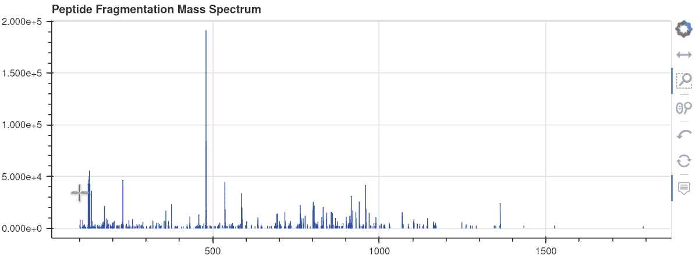
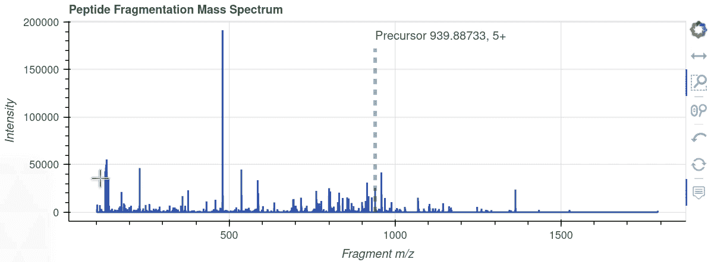
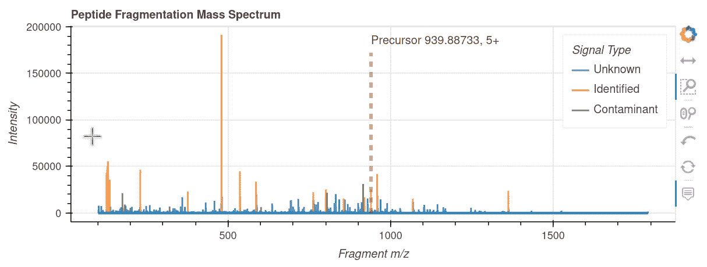

# 带有散景的交互式质谱

> 原文：<https://towardsdatascience.com/interactive-mass-spectra-with-bokeh-3b9163881b12?source=collection_archive---------21----------------------->

## 在 Python 中创建动态的信息可视化


非 pythonic 式散景。亚历克斯·伊比在 [Unsplash](https://unsplash.com?utm_source=medium&utm_medium=referral) 上的照片

质谱(MS)数据在概念上很简单。简而言之，就是一个有强制质荷值 *(m/z)* 和对应的非强制信号强度、电荷状态等的表格。但是一名质谱分析人员内心深处渴望**真正**查看她的数据，在该领域的背景下，这意味着目视检查 *m/z* 和强度值的分布。质谱传统上被表示为离散光谱的一系列垂直线或未处理数据的平滑连续线，x 轴上的***m/z***和 y 轴上的**强度**。两个轴上的值的范围通常非常宽，因此在检查光谱时，缩放功能会很方便。准确的 *m/z* 值对观察者来说通常很重要，这使得数字标签很方便。

研究人员经常使用专有的供应商软件来查看质谱，但是拥有简单的开源选项不是很好吗？在 Python 发布的内容中， [spectrum_utils](https://github.com/bittremieux/spectrum_utils) [1]包提供了基于 [Altair 可视化库](https://altair-viz.github.io/)显示交互式质谱的能力。在这篇文章中，我将分享使用[散景](https://bokeh.org/)绘制交互式 MS 可视化的方法，在我看来，它在创建交互式绘图和仪表板的简单性和灵活性之间提供了惊人的平衡。

散景可视化可以在 HTML 文档中嵌入所有必要的数据和交互功能(**独立**图)，或者它们可以连接到正在运行的 Python 实例，提供对几乎无限的自定义数据处理的访问。独立的散景图可以保存并在网络浏览器中查看，或者嵌入到 Jupyter 笔记本中。如果你有 Bokeh (2.3.1)和 [JupyterLab](https://jupyter.org/) (3.0.14)的新版本(截至 2021 年 5 月)，[通过 pip 或 conda 安装 jupyter_bokeh 扩展](https://docs.bokeh.org/en/latest/docs/user_guide/jupyter.html)应该足够了。有了扩展，只需调用 output_notebook()，一旦调用 show()命令，绘图就会出现在笔记本中。此外，如果要将绘图保存为 HTML 文件，请添加命令 output_file('file name.html ')。

让我们从加载库开始，打开带有与单个肽谱对应的 *m/z* 和强度值的表格。代码和数据示例可以在 GitHub repo 中找到。

```
(477, 2)
```

既然质谱传统上显示为一束垂直线，为什么我们不使用 **vbar** 绘图命令创建一个图呢？首先，我们将构造一个 ColumnDataSource，它是 Bokeh 中的一个强大结构，支持可视化之间的交互性和连接性。其次，我们应该指定工具提示，每当光标悬停在信号上时，该工具提示将显示强度和小数点后有 4 位数的 *m/z* 值。然后，我们使用定制的工具集创建所需尺寸的图形，包括限制在 x 轴上的平移和滚轮缩放，最后添加垂直条。下面我粘贴了动画 GIF 图像，展示了结果图的交互功能:



作者图片

看起来令人鼓舞，但有一些明显的不足之处。条形具有固定的宽度，我们希望用非常细的条形/线条来分隔一些非常接近但可区分的 *m/z* 值。这导致在现代超高分辨率屏幕上很难看到非常细的线条。我认为，不管缩放比例如何，光谱将受益于具有恒定厚度的更大线条。此外，悬停工具不能正常工作，因为条形非常细，即使我们已经正确指定了工具。

一个**线图**是另一个选项，但是我们需要稍微修改数据，以便得到垂直的条，而不是实验数据点之间的最短的线。让我们将强度为零的点添加到每个原始信号中，这将使它们看起来像一条垂直线:

我们现在可以把光谱表示成一条连续的线。让我们也介绍一下轴标签，并添加一条特殊的线来显示前体离子的 *m/z* 和电荷(参见[我之前的博客文章](https://egor-pro.medium.com/missing-with-out-a-trace-da186405e02b)关于前体和碎片)，这是质谱学家会喜欢的一条附加信息:



作者图片

这样好多了！请注意悬停工具在所有缩放级别的表现，每当我们将光标移过该行时，都会显示注释。

如果信号有标注，用颜色突出标注的类别会很酷。我们可以通过为每个类别创建一个单独的行来实现这一点。此外，可以用 figure.legend.click_policy 属性指定交互行为，这样，当单击相应的图例项时，信号将静音或隐藏。让我们加载带注释的表格，将其转换为“垂直”信号，然后创建复合线图:

```
array(['Unknown', 'Identified', 'Contaminant'], dtype=object)
```



作者图片

## 结论

我们已经使用散景创建了一个交互式注释质谱。可视化可以作为 HTML 文档保存和共享，或者嵌入到 Jupyter 笔记本中。代码和数据示例可在[GitHub repo](https://github.com/dev-ev/ms-interactive-viz)中找到。

## 参考

[1] Wout Bittremieux。 [spectrum_utils:用于质谱数据处理和可视化的 Python 包](https://pubs.acs.org/doi/10.1021/acs.analchem.9b04884)。分析化学(2020)，92(1)659–661。