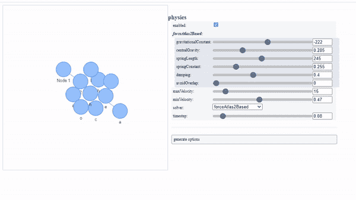
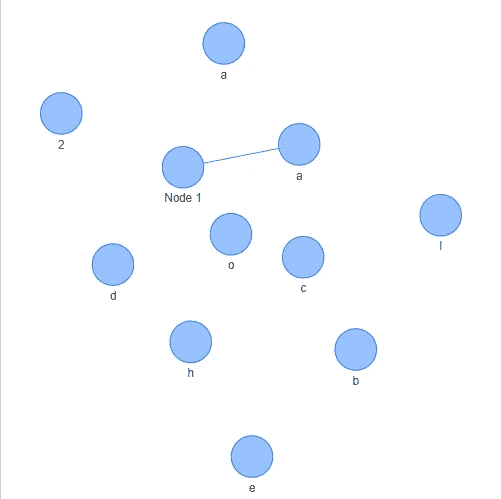

# 交互式网络可视化

> 原文：<https://towardsdatascience.com/interactive-network-visualization-757af376621?source=collection_archive---------29----------------------->

## 使用 Pyviz 创建定制网络



来源:作者

Pyviz 是一个 python 模块，用于创建可以基于每个节点或每个边进行定制的网络。它包含不同的定制，如节点的大小，边缘，用户定义的标签。使用 pyviz 创建的图形是高度交互式的，允许拖动、悬停和选择不同的节点和边。

使用 Pyviz 创建的每个图形都可以有一个定制的布局，可以根据用户定义的需求进行调整。

Pyviz 是围绕令人惊叹的 VisJS 库构建的包装器。在本文中，我们将探索使用 python 创建网络图的 Pyviz。

让我们开始吧…

# 安装所需的库

像任何其他 python 库一样，我们将使用 pip 安装 Pyviz 库。其命令在下面给出。

```
pip install pyvis
```

# 导入所需的库

为了创建一个图形网络，我们将使用 Pyviz 的网络类实例，它可以使用下面给出的代码导入。

```
from pyvis.network import Network
```

# 向网络添加节点

现在我们已经导入了网络类实例，我们将开始通过添加节点来构建我们的图形网络。我们可以逐个添加节点，也可以创建节点列表。

```
net = Network()
#Adding node one by one
net.add_node(1, label="Node 1")
net.add_node(2) 
#Adding node as a list
nodes = ["a", "b", "c", "d"]
net.add_nodes(nodes) 
net.add_nodes("hello")
```

# 向网络添加边

接下来，我们将创建连接这些节点的边，并为每条边赋予特定的权重。其代码在下面给出。

```
net.add_edge(0, 1, weight=.87)
```

# 形象化

最后一步是将我们创建的图表可视化为一个静态 HTML 文件，因为我们知道这个文件将是高度交互式的。

```
net.toggle_physics(True)
net.show('mygraph.html')
```



来源:作者

# 添加配置用户界面

我们可以使用配置用户界面动态地改变我们网络的设置。它将向用户界面添加按钮。这样我们就可以调整我们的图表，找出最佳的物理参数和布局。

```
net.show_buttons(filter_=['physics'])
```


来源:作者

这就是你如何创建自己的图形网络可视化。请继续尝试，如果您在回复部分遇到任何问题，请告诉我。

**本文与** [**皮尤什·英格尔**](https://medium.com/u/40808d551f5a?source=post_page-----757af376621--------------------------------) **合作。**

# 在你走之前

***感谢*** *的阅读！如果你想与我取得联系，请随时通过 hmix13@gmail.com 联系我或我的* [***LinkedIn 个人资料***](http://www.linkedin.com/in/himanshusharmads) *。可以查看我的*[***Github***](https://github.com/hmix13)**简介针对不同的数据科学项目和包教程。还有，随意探索* [***我的简介***](https://medium.com/@hmix13) *，阅读我写过的与数据科学相关的不同文章。**